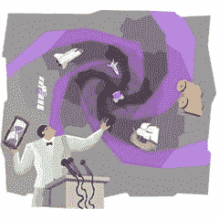

# 一百万美元才能成功

> 原文：<https://simpleprogrammer.com/1-million-dollars-to-succeed/>

让我问你一个问题。

如果我告诉你，如果你“成功”了，你会得到 100 万美元，但是如果你失败了，你将一无所获，你会如何开发你的下一个软件项目？

成功当然是一个非常模糊的术语，但是让我们假设成功意味着:

1.  你建立了一个**工作功能产品**
2.  你的**客户对它很满意，满意到可以称之为完成**
3.  你按时交付了
4.  **您在预算内交付了**
5.  ****按照目前的设计，它可以在未来 5 年内很容易地进行修改和维护。****

****这是一个要么全有要么全无的命题。一切都悬而未决。如果你成功了，你会得到丰厚的回报，但如果你失败了，你的努力就全白费了。****

****哦，还有，你不能一天工作超过 8 小时，一周工作 5 天——光靠英雄主义是赢不了的。****

## ****为什么问这个问题？****

****很简单，因为在思考了“如何构建软件”大约 10 年后，(在我开始的几年里，我没有真正思考这个问题)我已经决定这个问题的答案是软件应该被构建的方式。****

****我并不是说应该给开发者一个要么全有要么全无的命题。我的意思是，我们应该在构建和设计软件，就像我提出的上述情况一样。****

****这听起来可能有点疯狂，但是仔细想想。****

****如今，大多数开发人员都有薪水。一些薪水有绩效奖金，但我们很少会被置于这样一种情况，即犯错误或效率不高会导致可怕的后果。在大多数情况下，最糟糕的情况是，我们会从我们所做的工作中获得报酬，然后在项目结束时寻找新的工作。****

****失去我们在这个项目上投入的所有时间，失去一个赚一百万美元的机会将会是一些后果。****

## ****我们会以完全不同的方式思考软件开发****

********

********

****

我真的很难回答[像 TDD 这样的实践是否值得的问题](https://simpleprogrammer.com/2010/12/12/back-to-basics-why-unit-testing-is-hard/)。我的意思是，当然，我告诉我的经理。我强调质量胜于速度。我说我们需要做这个或那个，**但是老实说我真的不知道**。

我从未接受过考验。

从来没有人对我说:“不成功便成仁。”

从来没有人把我选择的后果直接放在我自己手里。

实际上，我从来没有权衡过花在重构代码、编写单元测试或使用 ORM 而不是直接在源代码中编写 SQL 上的额外时间。

我选择技术是因为它们对我来说很好，或者看起来能帮助我更快地完成工作，但是我从来没有在这个选择上押太多的赌注。

当然，我可能会赌上我的名誉，或者我可能会失去我的工作，但是我可能会把一些失败归咎于其他原因，或者更糟的是，我甚至不会意识到我的失败，因为它会被“足够好”所掩盖

> “伙计，约翰，你是个大骗子！我不能相信你到处兜售知识，把人们引入你自己都不知道是正确的道路。在你的软件开发测试实验室里烧掉别人的钱。”

也许是真的。也许我是一个无知自大的大混蛋，但不知何故，我觉得我并不孤单。

我不是说我们没有或者不应该有坚定的信念。

我并不是说我们没有充分的理由相信我们建议和遵循的开发方法和实践是正确的。

我想说的是…

## 我们对软件开发的信念大多是理论性的

8 年前我会告诉你，在你写任何代码之前，你需要创建 [UML](http://en.wikipedia.org/wiki/Unified_Modeling_Language) 图。

5 年前，我可能会强调拥有 XML 模式的重要性。我早就告诉过你没有模式的数据是没有意义的。

今天，我并不持有这两种观点。

也许在过去的几年里你也改变了自己的观点？

关键是，即使我们可能在做软件开发的战壕里，并且在某种程度上发现什么可行，什么不可行，**我们的结果是基于我们的动机**而不是我们的客户或我们的雇主的动机。

因此，我们可能最终会变得擅长于让事情变得更简单，但是除非你的脚被放在火上，否则你永远不会尽可能高效地优化构建最好的软件。

如果你认为你已经在尽可能高效地专注于构建最好的软件，而我只是在胡说八道，而你不是这样操作的，我强烈建议你做一个彻底的自我检查，并且请告诉我构建软件的最有效方法的秘密，因为我肯定想知道。

## 创业公司或者开源项目呢？

你可能会认为为自己工作或者不为钱工作会改变事情，但我真的不确定事实是否如此。

我从事过很多我自己的软件项目，我的命运直接掌握在我手中。

我已经开发了像 [PaceMaker](http://pacemakerapp.com/) 这样的应用程序，在这些应用程序中，我的财务成功直接与我自己的努力和我一个人的努力联系在一起。

但是，我认为我尽可能高效地构建了起搏器吗？

不，绝对不是！

PaceMaker 和其他有很大潜在上升空间的项目的问题是上升空间没有保证。

我可以向你保证，如果有人告诉我，我有 6 个月的时间来安装起搏器，如果我成功了(根据我上面所说的规则)，我将获得 100 万美元，但如果我失败了，我将一无所获，我可能会以一种完全不同的方式来完成整个过程。

我不是说我会以完美的效率构建它，但是我的动机会尽可能完美地与构建软件的足迹完全匹配。

我这样说的意思是，我会尽我所能去做我绝对相信最有可能让我受益的事情，通过这样做，我会尽我所能去完全优化构建软件的过程。

## 对此我们能做些什么？

现在，我无法告诉你，如果给我百万美元挑战，我会如何制造起搏器。

我不可能客观地把自己放在那种情况下给你一个答案。

我会为单元测试烦恼吗？我会创建积压工作并编写 UAT 来确保它们通过吗？我会使用 IoC 容器吗？

简单而诚实的回答是，我不知道。我所知道的是，我会以不同的方式做事，在你参与的任何软件项目中，你可能也会这样做。

通过思考这个假设命题，我们可以收集到一些东西。

*   不要认为你知道答案，但同时要对你目前所相信的有信念。[只是松散地坚持那些信念](https://simpleprogrammer.com/2012/09/16/have-strong-convictions-but-hold-on-to-them-loosely/)。
*   即使你不可能完全客观地构建软件，就好像有人会付给你 100 万美元一样(就像你不能挠自己的痒痒一样)，你仍然可以用这种心态尽可能多地思考。想象你所做的决定和你所坚持的信念是基于理想主义还是现实，这是一个很有价值的练习。我们也可以检查并至少理解我们自己的动机。
*   **认识到别人和你的处境完全一样**。不要相信专家说的一切，甚至不要相信有专家。经验和智慧是有价值的，但是没有人有接近所有答案的答案。

我很想看到这个实验真正完成。我真的很好奇会有什么结果，尤其是在团队的情况下。

也许有一天，会有人真的进行这个实验并分享结果。

你呢？你认为接受百万美元挑战会如何改变你开发软件的方式？****