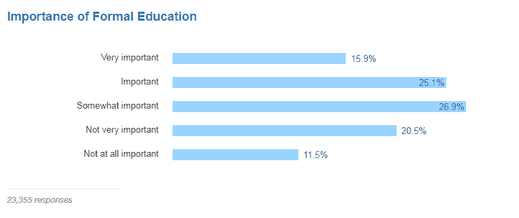

# 帮助你成为成功程序员的 10 个强有力的策略

> 原文:[https://simple programmer . com/10-powerful-strategies-for-success/](https://simpleprogrammer.com/10-powerful-strategies-for-success/)

说实话，编程很难学。而且获得计算机科学学位也不会让你轻松多少，因为学术计算机科学很大程度上就是数学。虽然数学很重要，但它不是你在现实世界编程工作中所需要的。

别忘了，你正在与全球超过[1820 万软件开发人员](http://www.computerworld.com/article/2483690/it-careers/india-to-overtake-u-s--on-number-of-developers-by-2017.html)竞争。你必须脱颖而出，让自己与众不同，尤其是如果你想成为最受欢迎的开发者。

为了帮助你学习如何在开发人员的世界中脱颖而出，我将带你了解在你的职业生涯中有所作为所需的策略，当然，也是成为一名财务上成功的软件开发人员。这些基本上是我这些年来一直在练习的策略，现在我仍然在做其中的大部分。在我的编程生涯中，他们给了我极大的帮助。我相信如果你尝试它们，它们也会为你工作。

## 1.课堂之外的学习

在教室里和朋友一起学习编程很有趣。然而，大学并没有真正给你空间去*实际上*编码。

大多数学校教你你不感兴趣的编程语言——我想从事网络开发。然而，我发现甚至 JavaScript 都不在我们的课程中。反而教我 C 语言，我对 C 语言不感兴趣。再说一次，大多数被教授的语言都已经过时了，并且没有在当今的实际编程工作中使用(例如，QBasic)。所以，在一天结束的时候，你可能只会学到计算机科学和数学的理论部分。

不要误解我的意思，大学确实教你如何以一种非常结构化的方式编程，这可能是有益的。但是我没有见过任何一个职业程序员因为在教室里学到的东西而变得成功。事实上，你基本上只知道编程、数据结构和算法的基础知识——当然，知道这些基础知识是有意义的，但要真正成功还需要更多。

想知道为什么 90%的软件开发人员都是自学的吗？

难怪超过 26.9%的开发人员认为正规教育只是有点重要。对我来说，我是那 11.5%认为“一点都不重要”的人之一

要成为一名成功的软件开发人员，你需要成为一名“学习者”然而，这并不一定意味着你需要成为一个书呆子——但你也不能成为一个大学辍学生。

你确实需要自己搜集信息，即使是在大学里。你可以通过 [codecademy](https://simpleprogrammer.com/codecademy-py) 开始免费学习，或者访问 [Pluralsight](https://www.pluralsight.com/authors/john-sonmez) 、 [Lynda](https://www.lynda.com/) 或 [Udemy](https://www.udemy.com/join/login-popup/) 上的优质课程。

你可以利用很多其他的在线资源，根据你感兴趣的技术，你可以先找一本关于它的书。我强烈推荐 Steve McConnell 写的“[Code Complete:A Practical Handbook of Software Construction](http://www.amazon.com/exec/obidos/ASIN/0735619670/makithecompsi-20)”来牢固地掌握编程。这是一本 900 页的书，包含了你需要的大量信息，无论你是初学者还是资深软件开发人员。

而对于编程语言的书籍，我推荐 Paul J. Deitel 的《 [Java 如何编程](http://www.amazon.com/exec/obidos/ASIN/0133807800/makithecompsi-20)》。这是最容易理解的一种，它带你了解从什么是计算机到精通 Java 和一般编程的一切。

我也喜欢听帕特里克·惠勒和杰森·高西在[编程对决](http://www.programmingthrowdown.com/)播客中的对话。它们不仅鼓舞人心；他们是了不起的人。他们在节目中采访伟大的程序员，并允许他们从专业的角度分享最佳实践，代码审查，工作流，他们讨论了许多关于不同编程语言的新内容。

没有提到 [FreeCodeCamp](https://www.freecodecamp.org/) ，这篇文章是不完整的。许多自学成才的学生已经看到了 FreeCodeCamp 的成功。虽然这需要时间，但它让你真正学会如何写好代码，并给你很多挑战，你必须在进入下一个阶段之前完成这些挑战。 [Quincy Larson](https://twitter.com/ossia) 和 FreeCodeCamp 团队成员在那里做得非常好——他们拥有在该平台上开始和掌握编程的最佳资源之一。

想通过专业人士提供的适当路线图来简化学习过程吗？查看[快速学习任何东西的 10 个步骤](https://simpleprogrammer.com/store/products/learn-anything-quickly/)；这是彻底的，教所有你需要知道的从一个想成为专家。

## 2.拼命练习

如果你真的想靠编程谋生，你肯定想拼命练习。学习和掌握编程，并有机会以此谋生的最好方法是坚持不懈地做小项目，然后用更大的项目提升你的水平。

假设你已经选择了想要掌握的编程语言。接下来要做的事情是开始学习它，并在这个过程中做许多迷你项目，如 Hangman 游戏，21 点，甚至是一个爱情计算器。从[这个子编辑](https://www.reddit.com/r/learnprogramming/comments/2a9ygh/1000_beginner_programming_projects_xpost/)你可以找到一千多个迷你项目来尝试。

在我初学的时候，编程对我来说很难；然而，我通过坚持不懈的练习克服了困难。

我不太擅长轻松理解某些概念。考虑到我有函数式编程的背景，让我理解面向对象的范例有点困难。通过不断的练习，我能够做得更好。

继续练习。不要等到有了动力才行动——强迫自己学习和练习。

知道如何在理论上解决一个问题是一回事；真正用编程解决是另一回事。进行大量的[编程练习](http://programmingzen.com/15-sites-for-programming-exercises/)——你可以利用黑客马拉松来帮助你。

## 3.对创造解决方案充满热情

编程真的是你的事情吗？如果你对编程没有热情，你很难成功。如果你的唯一动力是赚钱，你可能不会成功。

你会很快放弃，因为真正掌握编程技能需要时间，这将开始产生你正在寻找的金钱类型。

但是充满激情会让你深入学习，因为你想知道。充满激情意味着你做编程工作就像它是你的一部分，而不是某种惩罚或单调乏味的工作。

如果你真的对编程充满热情，你会很高兴地知道，你正在通过创建解决方案来帮助人们轻松解决日常问题，从而让世界变得更美好。

## 4.练习发现问题

有人可能会认为没有更多的问题需要解决，今天市场上的无数应用程序解决了各种各样的问题；然而，那是完全错误的。

有太多的问题可以通过编程来解决——你只需要四处看看。热衷于研究人和企业，你可能会发现他们面临的问题，而你实际上可以帮助他们解决。

使用类似[软件工程栈交流](https://softwareengineering.stackexchange.com/)的问答论坛，尝试回答棘手的问题。此外，你应该在像 [CodeChef](http://www.codechef.com/) 、 [Topcoder](https://www.topcoder.com/) 、 [Coderbyte](https://coderbyte.com/) 、 [Project Euler](https://projecteuler.net/) 、 [HackerRank](https://www.hackerrank.com/) 、 [CodeEval](https://www.codeeval.com/) 、 [Codewars](https://www.codewars.com/) 和 [LeetCode](https://leetcode.com/) 这样的平台上加入编程挑战。在这些平台上接受挑战可以让你锻炼自己，提高技能。这也让你可以和其他程序员竞争。有趣的是，你可以在一些比赛结束时赢得奖品，并得到认可。

## 5.首先在纸上或白板上解决问题

首先在纸上解决编程问题可以帮助你灵活地进行迭代，更加放松。揭开一个伟大想法的神秘面纱而又不会过早考虑实施的最简单的方法是用笔在纸上或者用白板。

在你的计算机上解决任何问题之前，把算法写在纸上，犯错误，把它们抵消掉，并允许你自己有创造力。

## 6.不要急着谷歌答案。努力解决问题，直到解决不了为止

大多数程序员在遇到编程问题时都会跑去谷歌。当你显然无法解决问题时，寻求解决方案是有意义的。

先尽力。也许抽出一点时间来思考事情可能正是你解决问题所需要的。自己解决问题能让它们留在你的记忆中，让你获得你能做到的信心，这非常重要。

更重要的是，如果你选择使用谷歌，你应该学会如何积极地使用谷歌来快速搜索你需要的解决方案。你需要知道如何表达搜索查询，回顾其他人对你正在研究的主题的讨论，并将你所学到的应用到手头的项目中。

## 7.一旦你掌握了解决简单问题的方法，就开始处理更复杂的问题

预计随着你持续不断地学习，你一定会成长。不要坚持只解决简单的问题——继续接受解决复杂问题的挑战。尝试制作至少一个战争游戏。

此外，承担一个[现实生活中的问题](https://www.reddit.com/r/SomebodyMakeThis/)并创建一个应用程序来解决问题。当你去参加工作面试时，两个重要的绝对不能错过的问题是，“你创造了什么？”以及“您的 Git 存储库是什么？”这意味着你应该知道如何使用像 [GitHub](https://github.com/) 这样的版本控制系统。

你可以从创建已经存在的应用程序开始——当你构建已经存在的制作精良的项目时，你已经获得了足够的经验来处理你将来可能想要构建的任何新项目。也许克隆它，并尝试自己添加所有功能。当你觉得自己足够好的时候，继续努力实现你最初的想法。别停下来。

## 8.在头脑中解决问题

想法出现在我们生活中令人惊讶的时刻，有时在兴奋时，有时在平静时。当你头脑中的问题出现时，总是努力先解决它们。

甚至在把它写在纸上或白板上之前，在你的头脑中想象解决过程；此后，您可以移动到您的计算机来实现该过程。

因此，即使你在健身房或床上，突然想到一个主意，也要在脑海中描绘出执行过程。每当我有一个新的想法想要实现时，我都会这样做。这个练习很重要，因为它可以帮助您测试解决问题的不同方法，并确定结果路径是否会导致可行的解决方案。

## 9.将难题(数学或现实生活中的)视为学习和成长的机会

如果你还在上大学，认真对待你所有的编程作业。使用 [Project Euler](https://projecteuler.net/) 解决数学问题——Project Euler 非常有用，因为它包含不同难度的挑战性问题，在解决这些问题的同时，你也提高了自己的技能。

老实说，那个网站上的项目很艰难，但也很有趣。请记住，你现在需要做困难的事情，让明天的生活变得轻松。想想困难的生活情况，这可以帮助你找到让事情变得更简单的应用程序。例如，人们很难跟踪他们一天、一周、一月或一年的所有活动。你可以创建一个应用程序来帮助人们设定每周、每天或每月的目标；组织他们的工作流程；并且有一个警报，提醒他们在某个点上的进展和未实现的目标。

尝试实现这个应用程序中的功能会让你学到很多东西。这不会是世界上最好的生产力应用——不要担心——但是项目完成后你会学到很多东西。

## 10.找个导师或者加入编码训练营

有一个导师会让你站在你钦佩的软件开发人员的肩膀上，尤其是那些经验丰富的人。他们可以让你的生活轻松很多。你可以使用像 [Codementor](https://www.codementor.io/) 这样的在线工具来寻找你可能想要合作的导师。

以下是找到导师的方法:找到一个比你更有经验的程序员，并主动帮助他们。例如，下面是我如何联系到克利夫兰创业公司 Scene 的创始人和喧闹营销公司的老板 Kathie Kinde Clark 的。我仔细阅读了她的网站，发现她的销售线索不足以产生合格的销售线索。

我很快在 LinkedIn 上给她发了一条信息，给她一些建议，告诉她如何改进。她感谢了我，从那时起，我们就有了一种奇妙的朋友-导师关系。

另一种找到你导师的方法是通过编程聚会来认识他们。如果你知道他们通常参加的聚会，加入这个团体，从那里和他们联系。

虽然编程训练营通常非常昂贵，但如果你需要快速学习，这是值得的。[霍尔伯顿学校](https://www.holbertonschool.com/)可以免费开始，根据他们的说法，当你成功时，他们也成功了。所以你只有在毕业找到工作的时候才需要交学费。

有了编码学校，像[大会](https://generalassemb.ly/)、[黑客反应堆](http://www.hackreactor.com/)和[应用学院](http://www.appacademy.io/)，你就获得了许多公司认可和尊重的声望，从而更容易找到工作。

奖励点:专注:不要成为一个普通的通才程序员——以这种态度，即使在接下来的五年里，你仍然会称自己是一个初学者。所以，不言而喻，一定要挑一个小众，专注，持之以恒。比如你可以选择做前端开发者，后端开发者，移动 app 开发者，甚至桌面 app 开发者。无论你选择什么，专注于它，并善于它。

你需要一个同伴来帮助你成为一名成功的软件开发人员。完整的软件开发人员职业指南是每个开发人员都应该拥有的成功指南。它抹去了你多年来学到的关于如何成为一名成功的软件开发人员的谎言。我个人很喜欢教没有经验如何找到工作的部分。想成为一名高薪的软件开发人员吗？这本书会非常有帮助。

## 永远不要停止学习

成为一名成功的软件开发人员的旅程似乎势不可挡，对吗？我同意你的观点。

然而，如果你想让你的生活变得容易，那就做难的事情——如果你想让它变得难，那就做容易的事情。这需要一段时间，如果有也没关系。成功不是放在黄金盘子里交给你的。你必须杀出一条血路。

勤奋，拼命练习，对工作充满热情。如果你把这些策略付诸实践，你很可能会看到成功。