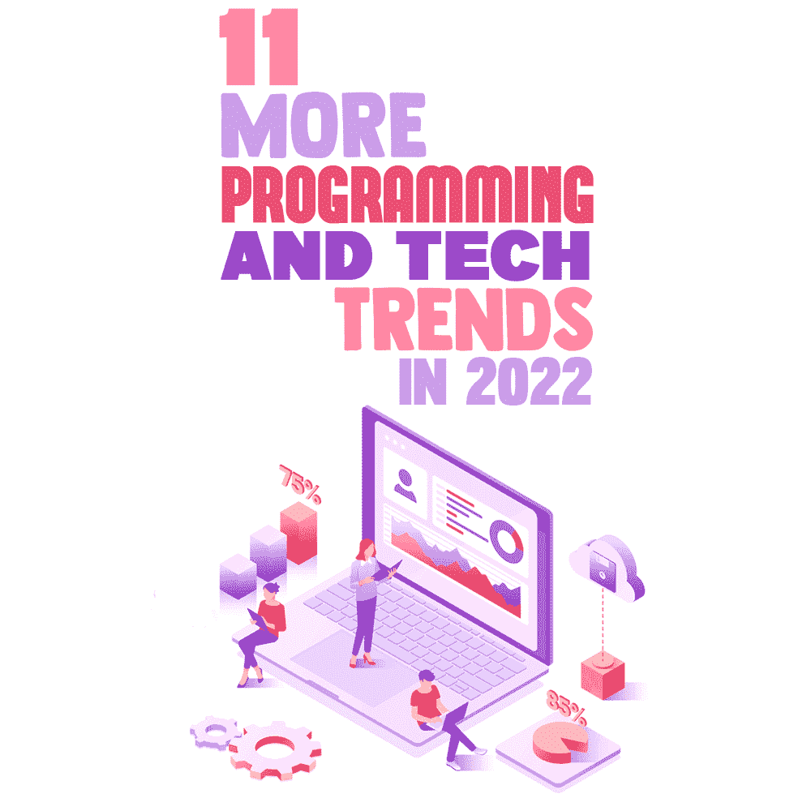
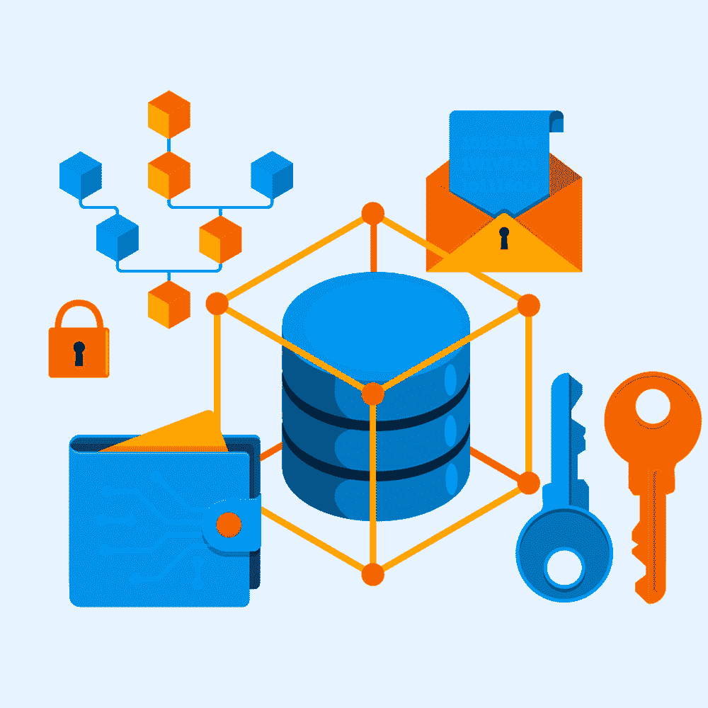

# 11 2022 年的更多编程和技术趋势

> 原文：<https://simpleprogrammer.com/11-more-tech-trends-in-2022/>

In recent years we’ve all seen many exciting things happen: new technological developments in almost every field involved. The year 2022 will not be an exception, as there are plenty of trends emerging that will keep us all engaged and excited.

在这篇文章中，我将把你的注意力集中在这些新兴的编程和技术趋势上，强调它们的各个方面。通过这种方式，您将对技术领域有更好的理解，并且了解最新的发展。

## 多云战略

多云战略是必须阅读的内容。借助多云战略，公司可以从其他云公司选择不同的[云服务](https://simpleprogrammer.com/visualizing-cloud-infrastructure/)来传输更重要的数据部分。这是一种移动大量数据的快速而可靠的方式，特别适合于大量数据传输和集成的机器学习功能。

出于以下原因，大多数公司都采用了云计算战略:

*   **灵活性:**如果一家公司可以选择多种云环境，这就提供了灵活性，并允许公司远离供应商的束缚。过渡到任何其他产品，甚至是竞争对手的产品，都很容易。
*   **数据保护:**如果您使用多云策略，您可以避免因技术或机械原因、计算机和人为错误而导致的问题。如果您有多个云环境，那么您总是可以避免不可避免的突发情况，因为您有资源和数据存储来避免停机。
*   **效率:**由于管理和存储数据的效率，多云环境可以帮助公司按计划实现目标。

当信息从一个云平台转移到另一个云平台时，多云计算涉及到多云管理。处理多个云提供商和复杂的云管理系统需要专业知识。

多云平台可以将每个平台提供的所有最佳服务整合在一起。它帮助公司定制适合其业务目标的基础设施。此外，这种多云概念提供了更低的风险:如果一个 web 服务不起作用，企业可以在多云系统中与其他平台一起运行，因为它将所有数据存储在一个地方。

到目前为止，一切顺利。但是缺点或者问题点呢？

真正的多云安全性面临着一个巨大的挑战，即以一致和安全的方式跨各种云平台保护数据。当一家公司使用多云概念时，押金由第三方合作伙伴处理。因此，云部署必须确定问题，并在其他各方之间分配安全责任，以确保安全。

## 快速应用开发和低代码/无代码

在一个一切都相互关联并依赖于交付速度的世界里，许多发明都希望加快流程。快速应用程序开发(RAD)作为一个我们很多人可能已经接触过的重要主题在这里发挥了作用。

比如[敏捷](http://www.amazon.com/gp/product/0135974445/ref=as_li_tl?ie=UTF8&camp=1789&creative=390957&creativeASIN=0135974445&linkCode=as2&tag=makithecompsi-20&linkId=4DHTIVWBRMB372SW)软件更关注当前的软件项目和用户反馈。你能相信它没有遵循严格的计划吗？该软件有助于快速原型制作，而不是昂贵的规划。

快速应用程序开发的过程非常简单，如下所示:

*   **要求:**快速 app 开发没有任何严格的要求，在周期的任何一点都有更改任何条件的权限。客户提供公司对产品的愿景，与开发人员达成一致，并最终确定实现目标的需求。

*   **原型:**这种快速的应用程序开发开发出一个原型来让客户理解结果。RAD 编程有一个最终阶段，在这个阶段，所有的错误都被纠正和删除，最终的产品就出来了。

*   **反馈和最终产品:**根据反馈，RAD 制作最终产品，但他们已经准备好执行可能的更改，如流程的第二步所述。然而，如果客户对结果和积极的反馈感到满意，那么所做的就是最终产品。

*   **最后阶段:**最后阶段是通过演示提交最终产品。

至于[低代码/无代码](https://simpleprogrammer.com/low-code-development-traditional-coding/)开发平台，是一种可视化的软件开发。这种程序允许工业开发者和市民开发者拖放应用组件，快速组合它们，并创建对不同功能有用的移动或网络应用。

低代码开发平台减少了花费的时间，从而能够更快地交付业务应用程序。

## 集装箱化

容器化是一种将软件代码与操作系统、运行代码所需的库和依赖项打包在一起的方式。它包含在一个轻量级的可执行文件中，称为容器，可以在任何基础设施上不受干扰地运行。

您的代码在一个可以在任何地方运行的容器中，而不是遵从整个操作系统或您的软件。因为这些容器非常小，所以你可以在一台电脑上装很多这样的小容器。

容器化的概念允许开发人员更快更安全地创建和部署应用程序。早期，代码是在特定的计算环境中开发的。但是当你把它转移到一个新的位置时，它经常会导致错误。

## 深度学习图书馆

Deep learning is simply a machine learning technique. It instructs a computer to filter inputs through layers to learn how to predict and classify information. It is operated through images, text, or sound, and is inspired by the way the human brain filters information.

例如，深度学习是无人驾驶汽车中使用的一项关键技术，使它们能够识别停车标志或从路灯柱上识别行人。

它是一种基于数据代表的更广泛的机器学习家族的持续增长的方法。作为一个相对较新的概念，大量的资源可能会吸引那些试图进入 it 领域或已经进入 IT 领域的人。

有一些图书馆以这种深度学习技术而闻名。下面是常用的深度学习库列表。

*   **tensor flow Keras**:tensor flow 是一个用于多种机器学习任务的库，也是一个开源的端到端平台。Keras 是一个运行在 TensorFlow 之上的网络库。
*   Caffe: Caffe 是一个深度学习程序，以表达、速度和模块化为理念。
*   **微软认知工具包:**(原 CNTK)。微软认知工具包是一个开源库，用于创建机器学习预测模型。一般来说，它会创建深度神经网络，这些网络位于 Cortana 和自动驾驶汽车等人工智能尝试的顶端。
*   py torch:py torch 框架帮助了大约 200 种不同的数学运算。它非常受欢迎，因为它简化了人工神经网络(ANN)模型的创建。
*   **Apache Mxnet:** MXNet 是一个开源的深度学习应用程序，允许您在从云基础设施到移动设备的各种设备上识别、训练和部署深度神经网络。
*   **deep learning 4j:**deep learning 4j 是深度学习算法的支持框架。
*   **Theano:** Theano 是一个 Python 库，为运行在 CPU 或 GPU 上的快速数值计算而构建。它被用作深度学习的关键基础库。
*   **TFLearn:** Tflearn 旨在支持 TensorFlow 的更高级 API。它在透明和兼容的同时促进和加速了实验。

## 多模型和多用途数据库

在数据库设计中，多模型数据库有助于针对单个集成后端管理多个数据模型。单一数据模型主要在数据库管理系统中组织和存储。

多模型数据库是将所有数据存储在多个模型中的数据库。最初，数据库主要只支持一种模型:关系型、面向文档的数据库、三重存储或图形数据库。将所有这些结合在一起的数据库称为多模型。

## 人工智能

人工智能是最新科技趋势中的佼佼者。这是一项独特的技术，可以让机器模拟和解释人类的行为。

机器学习是人工智能的一个子类，它允许设备从存储在存储器中的过去数据中自动学习，而无需进一步编程。人工智能的目标是制造一个类似于人脑的智能计算机系统，帮助解决复杂问题。

因此，现在世界正朝着这个概念前进，不久，它将接管所有复杂的处理器。

## 人工智能驱动的网络安全

人工智能驱动的网络安全是安全方面最重要的概念之一。人工智能可以立即确定风险的优先级，并发现网络上的病毒或恶意软件。它甚至可以在威胁激活之前就检测到它们。

人工智能是网络安全的一个重要方面。它将提高生活各个方面的效率，如网上购物、信息技术、电信等。，保护 it 免受网络威胁。

## 清洁技术

清洁技术是技术发展中最受关注的术语之一。你如何定义清洁技术？

清洁技术是通过提高能源效率、更好地利用资源或任何其他环境保护活动来减少负面环境影响的任何过程、产品或服务。

清洁技术在任何行业或领域的好处包括减少废物、回收副产品、改善环境性能、提高生产率、提高效率和减少能源消耗，从而降低总体成本。信息技术和应用程序也是如此。

## 协作技术

协作技术也被称为群件。协作技术，今天常用的术语，指的是旨在提高团队效率的工具和系统。它与办公室和远程工作都有关。

这些技术可以减少与促进团队工作相关的成本和时间。这种技术可以指定角色和职责，将现场文档传送到检查和批准项目部分。这个概念在整个工作流程中提供了更多内在的和协调的群体问题解决方案。

协作技术的一个好工具是 [Creately](https://creately.com/) ，尽管由于我在那里工作，我可能有点偏见！Creately 是一个基于网络的工作管理工具，运行在智能可视画布上，为头脑风暴、规划、项目管理和获取知识提供可视化解决方案。Creately 现在被用于项目管理、教育和许多其他领域。

## 区块链技术

Blockchain is a system of recording information. Because of its design, it is difficult or impossible to change, hack, or cheat the system. No outsider can get into the system and steal or damage data.

区块链是一种数字分类账，它复制了分布在区块链整个计算机系统网络中的交易。它还提高了信任度、安全性、透明度和跨业务网络共享的数据的可追溯性。

## 未来就在现在

在这篇文章中，我与你分享了信息技术中出现的最流行的编程技术趋势。

从多云战略和快速应用开发到人工智能，以及或许最关键的清洁技术，未来就在眼前！

这些对你的职业生涯以及通过信息技术完成的日常任务非常有帮助。我希望这些事实对那些寻求这方面知识的人有所帮助。