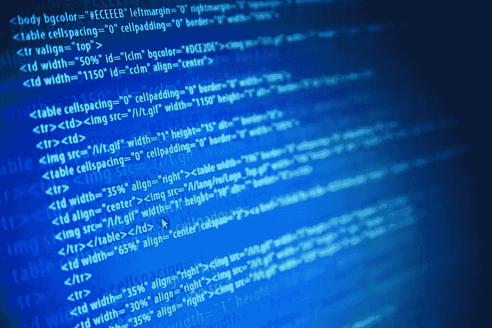

# 所有程序员都应该遵守的 11 条规则

> 原文:[https://simple programmer . com/11-rules-all-programmers-should-live-by/](https://simpleprogrammer.com/11-rules-all-programmers-should-live-by/)

我是一个倾向于按规则生活的人。

现在我承认，它们大部分是我为自己设定的规则——但它们仍然是规则。

我发现为自己制定规则有助于我更好地工作，因为我提前做好决定，而不是匆忙做出各种决定。

今天早上我应该去健身房吗？

嗯，我的规则是周三去健身房，今天是周三，所以我要去健身房——就这么定了。

本周，当我在思考我强加给自己的一些规则时，我认为提出一套我认为所有软件开发人员都应该遵守的规则可能是个好主意。

现在，我承认，这些规则中的大部分更多的是指导方针，但无论如何，他们在这里:

## 1:技术是你获得解决方案的方式，它不是解决方案

我们可能会被最新的 JavaScript 框架——咳咳，Angular——IoC 容器、编程语言甚至操作系统弄得晕头转向，但所有这些东西实际上都不是我们作为程序员试图解决的问题的解决方案，相反，它们只是帮助我们解决问题的工具。

我们必须[非常小心，不要对我们碰巧喜欢的或者碰巧现在非常流行的特定技术](https://simpleprogrammer.com/2013/07/08/how-religion-destroys-programmers/)过于着迷，以免我们冒把每个问题都想成钉子的风险，仅仅因为我们碰巧拿着一把我们刚刚学会的闪亮的锤子。

## 2:聪明是清晰的敌人

写代码的时候，要努力写出清晰易懂的代码。

清楚表达其目的的代码比晦涩难懂的代码更有价值——不管它有多聪明。

这并不总是正确的，但总的来说，聪明是清晰的敌人。

通常情况下，当我们编写“聪明”的代码时，代码并不是特别清晰。

每当我们认为自己在做特别聪明的事情时，记住这条规则是很重要的。

有时我们写的聪明的代码也很清晰，但通常情况并非如此。

如果你对编写干净的代码感兴趣，我强烈推荐你去看看[《干净的程序员:职业程序员的行为准则》(罗伯特·c·马丁)](http://www.amazon.com/exec/obidos/ASIN/0137081073/makithecompsi-20)

## 3:除非万不得已，否则不要写代码

这一条可能看起来有点矛盾，毕竟，我们程序员的工作不就是写代码吗？

嗯，是也不是。

我们的工作可能涉及编写代码，但我们仍然应该努力尽可能少地编写代码来解决我们试图解决的问题。

这并不意味着我们应该使代码尽可能紧凑，并使用字母表中的单个字母命名所有变量。它的意思是，我们应该尽量只编写实现所需功能所必需的代码。

通常，向我们的代码添加各种很酷的特性，或者使我们的代码“健壮”和“灵活”，这样它就可以处理各种不同的情况。但是，当我们试图猜测哪些功能会有用，或者我们试图为我们认为未来可能存在的问题铺平道路时，我们往往是错误的。

这些额外的代码可能不会增加任何价值，但仍然会带来很多危害。代码越多，出现 bug 的机会就越多，需要维护的代码也就越多。

优秀的软件工程师不会写代码，除非绝对必要。

伟大的软件工程师尽可能多地删除代码。

## 4:评论多为恶

我不太喜欢用代码写注释。我和鲍伯·马丁在一起时，他说:

*“每次写评论都要做鬼脸，感受自己表达能力的失败。”*

— [干净的代码:敏捷软件工艺手册](http://www.amazon.com/gp/product/0132350882/ref=as_li_tl?ie=UTF8&camp=1789&creative=390957&creativeASIN=0132350882&linkCode=as2&tag=makithecompsi-20&linkId=QFEKXNHPNQEASR5A)

这并不意味着你不应该写评论，但在大多数情况下，它们是可以避免的，相反，你可以专注于做好命名工作。

只有在无法通过使用名称清楚地表达变量或方法的意图时，才应该编写注释。然后注释服务于一个实际的目的，这个目的在代码中不容易表达。

例如，一条注释可以告诉您，代码中某些操作出现的奇怪顺序不是错误，而是由于底层操作系统中的一个错误而故意为之。

一般来说，评论是邪恶的，不仅因为在许多情况下它们是必要的，还因为它们是谎言。

注释往往不会随着代码的其余部分而更新，这导致注释实际上变得很危险，因为它们很可能把你引向一个完全错误的方向。

你是否对照代码检查每一个注释，以确保代码确实在做注释所说的事情？如果是这样的话，发表评论有什么意义呢？如果不是，你怎么能相信评论告诉你的是事实呢？

这是个泡菜，所以最好尽量避免。

好吧，讨厌的人，请在下面的评论区留下你的“评论”,但我不会改变我对此的立场。

## 5:在你开始写代码之前，一定要知道你的代码应该做什么

这似乎是显而易见的，但它不是。

有多少次你坐下来写代码却没有完全理解你写的代码实际上应该做什么？

我做的次数比我愿意承认的次数多，所以这是我需要经常阅读的一条规则。

实践测试驱动开发(TDD)在这里会有所帮助，因为在你写代码之前，你必须知道代码要做什么，但是它仍然不能阻止你创建错误的东西，所以在你构建它之前，确保你绝对地、100%地理解你正在构建的特性或功能的需求仍然是很重要的。

## 6:在发布之前测试您的 sh 代码

不要只是把你的代码扔在墙上，让 QA 在上面敲敲打打，然后把它送还给你，这样你就可以用不必要的错误报告和解决方案浪费每个人的时间。

相反，在您调用您的代码完成之前，花几分钟自己运行测试场景。

当然，在你把工作交给 QA 之前，你不会发现每一个 bug，但是你至少会发现一些我们不时会犯的愚蠢和尴尬的错误。

太多的软件开发人员认为测试他们的东西只是 QA 的工作。这根本不是真的。质量是每个人的责任。

## 7:每天学点新东西

如果你今天没有学到新的东西，你只是退步了，因为我可以保证你忘了一些东西。

每天学习新的东西并不需要花很多时间。

试着花 15 分钟左右读一本书——去年我读了很多书，平均每天只读 45 分钟。

你每天取得的一点点进步随着时间的推移积累起来，将会极大地塑造你的未来。但是，如果你想以后收获回报，你必须现在就开始投资。

此外，今天的技术变化如此之快，如果你不不断提高自己的技能和学习新的技能，你将很快被甩在后面。

## 8:写代码很有趣

没错。你可能不是因为报酬高才进入这个行业的。

我的意思是，选择一份收入高的工作没有错，但医生或律师可能是更好的选择。

很可能你成为了一名软件开发人员，因为[你喜欢写代码](http://www.amazon.com/gp/product/1934356344/ref=as_li_tl?ie=UTF8&camp=1789&creative=390957&creativeASIN=1934356344&linkCode=as2&tag=makithecompsi-20&linkId=I57JFSYJSY6QO3CS)。所以，不要忘记你正在做你热爱的事情。

写代码很有趣。我希望我能写更多的代码。

这些天来，我通常忙于维持这项业务，不会花太多时间写代码，这也是为什么我如此清楚地记得它有多有趣的原因之一。

也许你忘记了写代码是有趣的。也许是时候通过开始一个副业项目或者仅仅改变你的思维模式，并意识到你可以写代码，你甚至可以为此获得报酬，来再次记起它有多有趣了。(希望如此)

## 9:你不可能全知道

不管你学了多少，还是会有很多你不知道的。

认识到这一点很重要，因为试图了解一切会让你发疯。

没有所有的答案也没关系。

当你不明白的时候，寻求帮助或者大声说出来是可以的。

在很多情况下，你可以在你需要知道的时候学到你需要知道的东西——相信我，我一直都是这样做的。

我的观点是，当这是一个不可能的任务时，不要试图把它全部学会。相反，专注于学习你需要知道的东西，并建立让你快速学习的技能。

## 10:最佳实践取决于具体情况

测试驱动开发是编写代码的最佳方式吗？

我们应该总是结对编程吗？

如果你不使用 IoC 容器，你是擦洗者吗？

所有这些问题的答案都是“视情况而定”

这要看上下文。

人们会试图把最佳实践硬塞给你，他们会试图告诉你他们总是适用的——你应该总是这样或那样做——但是，这根本不是真的。

当我写代码时，我遵循许多最佳实践，但是我也有条件地不遵循它们。

[原则是永恒的，最佳实践总是视情况而定](https://simpleprogrammer.com/2013/02/17/principles-are-timeless-best-practices-are-fads/)。

## 11:永远努力简化

所有问题都可以分解。

最优雅的解决方案往往是最简单的。

但是，简单并不容易。把事情变得简单需要努力。

这个博客的目的是将软件开发和日常生活中的一些复杂问题简单化。

相信我，这不是一件容易的事。

任何傻瓜都能创造出一个复杂的问题解决方案。需要额外的努力和关注来提炼一个解决方案，使它简单，但仍然正确。

抓紧时间。付出努力。力求简单。

## 你的生活准则是什么？

这些是我的规则，但你的呢？

你个人的生活准则是什么？

你认为每天要记住的重要的事情是什么？

请在下面留下您的评论，并且花一点时间加入 10，000 多名其他软件开发人员，他们是简单程序员社区的一部分。

只需点击这里，你就可以免费加入了——你每周都会收到一些我最好的内容和其他免费的好东西。

如果我必须加上第 12 条规则，那就是:公平对待自己。伟大的程序员并不总是拥有最高的薪水。为什么？他们不推销自己。如果你擅长自己的工作，但觉得自己的技能被低估了，试试我的课程[“如何作为软件开发人员推销自己”](https://simpleprogrammer.com/store/products/how-to-market-yourself/)。