# 2018 程序员送礼指南

> 原文:[https://simple programmer . com/2018-gift-guide-for-programmers/](https://simpleprogrammer.com/2018-gift-guide-for-programmers/)

## **更新:[点击这里查看最新的 2020 年软件开发者礼物清单](https://simpleprogrammer.com/gifts-for-programmers/)**

今年我被要求写 2018 年程序员礼物指南。虽然在我的日常工作中，我不是一名程序员，但我确实认为自己是一名开发人员，我非常精通大多数技术，并且我每天都接触到尖端技术。此外，我的主要朋友圈子和同事经常讨论技术领域的新浪潮。所以我想，“为什么不是我”。

所以，我认为下面这些会让你生活中的程序员或开发人员/技术爱好者脸上露出笑容。

Quick Navigation[Stocking Stuffers ($5 - $25)](#tab-con-24)[Been on a Few Dates ($25 – $50)](#tab-con-25)[Things Are Getting Pretty Serious ($50 – $100)](#tab-con-5)[Wanna Move in Together? ($100 – $250)](#tab-con-7)[You're a Nerd and I Love it ($250 – $500)](#tab-con-11)[Let's Make Babies ($500+)](#tab-con-16)

## 填充料(5-25 美元)

* * *

### 程序员杯(低于 25 美元)

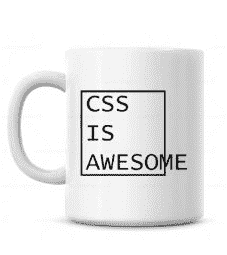

[<u>**CSS 牛逼**</u>](https://www.amazon.com/exec/obidos/ASIN/B00EZ3Y5RW/makithecompsi-20)

这是给前端和后端的爱好者的礼物，但是他们暗地里也喜欢 css。

我觉得这个杯子在人们身上引起了一种典型的反应。他们要么完全同意，要么被冒犯。这份礼物对于那些前端并以此为荣的人来说是完美的。你永远不知道，它可能会给那些不太喜欢 CSS 的人提供一些潜意识的信息，最终说服他们爱上它。

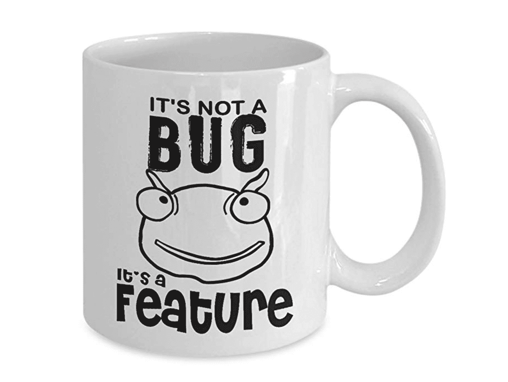

[**<u>没什么 Bug 这是特性</u>**](https://www.amazon.com/exec/obidos/ASIN/B07CNRFK1Z/makithecompsi-20)

啊，为什麽事情不像预期的那样工作的古老的“理由”。我们都从其他开发人员那里听说过这个笑话，或者当我们太累而无法修复另一个问题时。

每个开发人员都需要一个杯子来喝咖啡、茶或热巧克力(在我的例子中！)从。所以，为什么不从一个能在各个层面上与你的灵魂对话的杯子里来做呢？

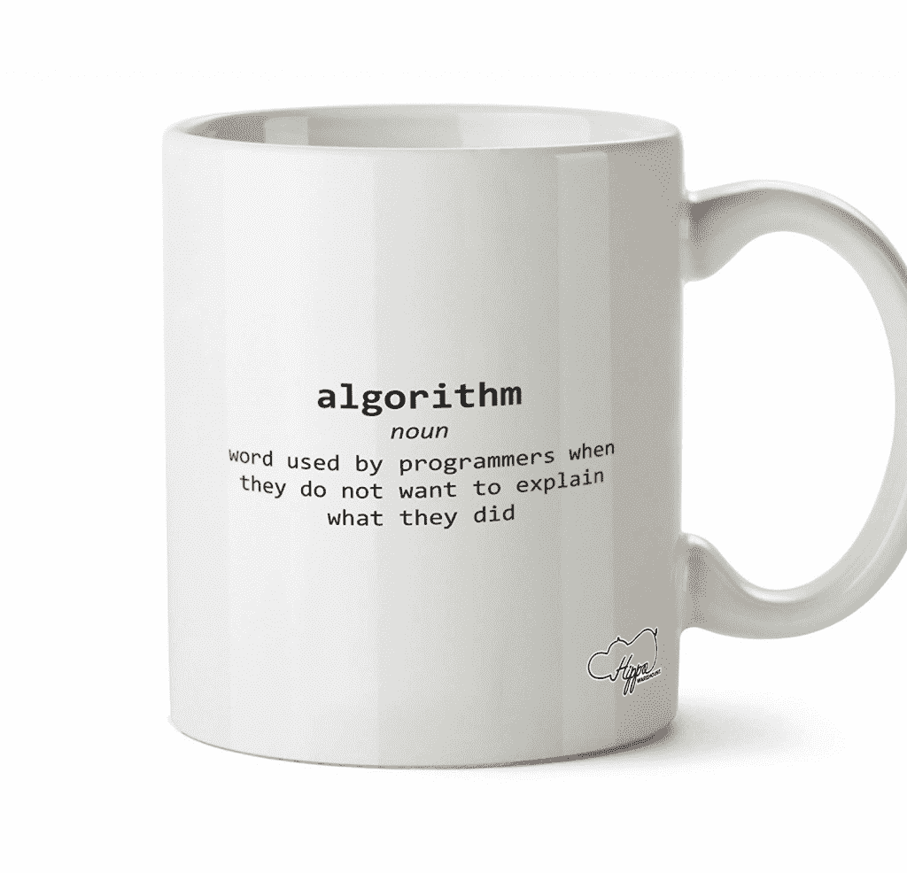

[<u>**算法定义**</u>](https://www.amazon.com/exec/obidos/ASIN/B07FLB1Y7N/makithecompsi-20)

简单朴素的设计和颜色，适合任何厨房配色方案。我喜欢程序员的笑话，因为它用简单的语句揭示了“谁是我们中的一员”。或者，它可能只是不好笑:P

然而，这个杯子和笑话，是一个很好的，如果你不喜欢它喝茶，为什么不把你的笔放在里面，在你很少用笔的时候。

### 编程技术(25 美元以下)

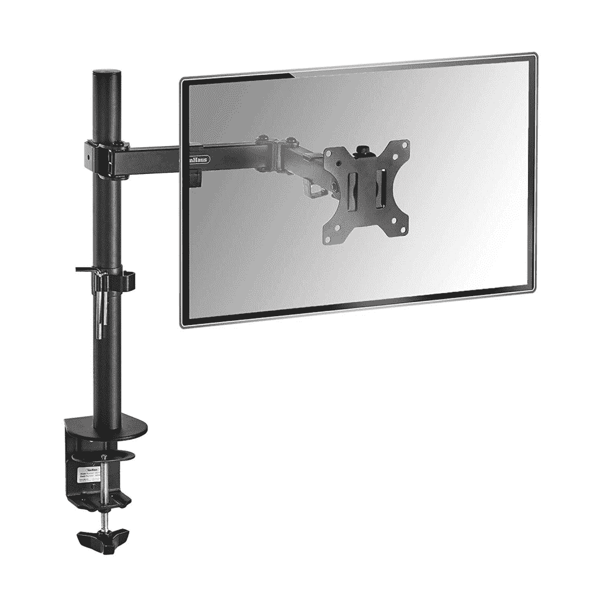

[<u>**VonHaus 显示器挂载为 13-32 寸屏幕**</u>](http://www.amazon.com/exec/obidos/ASIN/B01H3UL3NM/makithecompsi-20)

我最近决定使用单显示器臂，因为我的桌子很小，而我的显示器几乎和桌子一样长。所以如果我把它从桌子上拿下来，至少我可以利用显示器下的空间来放书和文具。另外，我认为它放在一起会看起来更好。

这款价格低廉的显示器臂非常坚固，易于操纵到桌面上您喜欢的位置，而且移动后也非常坚固。

显示器可以前后倾斜，从水平位置旋转到垂直位置。

我很喜欢我的新显示器支架，我想你或你的技术合作伙伴会对此非常满意。

### 编程书籍(低于 25 美元)

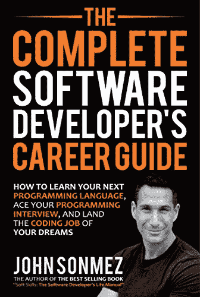

[<u>**约翰·桑梅兹**</u>](http://www.amazon.com/exec/obidos/ASIN/B073X6GNJ1/makithecompsi-20) 完整的软件开发人员职业指南

约翰写这本书的时候，我一周一周地通读，它确实包含了很多非常有用的信息，尤其是对于那些第一次开始职业发展的人。

我认为更有经验的开发人员也会发现这是一个有用的资源，当他们找到一个有用的章节时，可以随意翻阅。

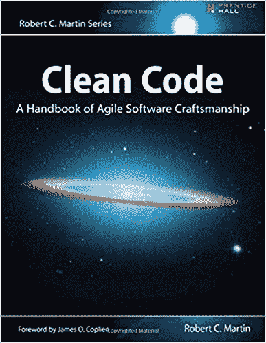

[<u>**鲍伯·马丁**</u>T5】](https://www.amazon.com/exec/obidos/ASIN/0132350882/makithecompsi-20)

虽然是不久前写的，但《干净的选择》提出了技术岗位上的每个人都应该尝试、坚持和利用的原则。目的是创建可维护、可读和易于扩展的代码。我发现这些原则不仅对那些认为自己是传统程序员的人有用，对那些在 QA 中担任技术角色的人也有用。将这些原则应用到你的代码中的好处也会积极地影响那些只阅读代码库的人，因为他们会发现代码更容易理解和遵循。对整个团队都有好处。

虽然干净的代码是用 Java 示例编写的，但我发现(如果你对编程语言的基础有很好的理解)这些示例很容易理解。

这是一本相当大的书，并且传授了许多技术知识，所以这不是一本短书，但是丰富的信息会让你受益终生。

### 编程服装(25 美元以下)

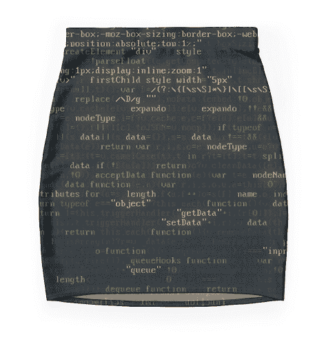

**编程铅笔裙由** [<u>**红色泡泡**</u>](https://www.redbubble.com/shop/programming+pencil-skirts)

我是通过 Instagram 从 [<u>艾德丽安·塔克</u>](https://www.instagram.com/adrienne.tacke/) 的反馈中得知这件衣服的。一开始我看不清裙子上的代码，只是看起来像一个简单的小图案。这就是这条裙子的伟大之处，它的图案很微妙，可以很容易地成为任何科技女性胶囊衣柜的主食。

去网站，你会注意到有很多不同的设计，所以如果你想要一个更大的图案，尖叫# ilooklikeadeveloper，我知道 tech 或者我喜欢 tech，那么我相信你会找到你喜欢的东西。

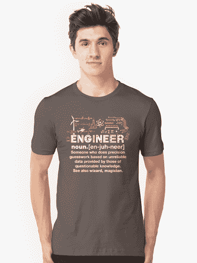

[<u>**红色泡泡上的工程师 t 恤**</u>](https://www.redbubble.com/people/lolotees/works/23665951-engineer-humor-definition?p=classic-tee&rbs=d52e0a39-920b-4c8d-af6c-95bb256262a0)

如果你想为你生活中的男性或女性工程师买一件简单的工程 t 恤，这件看起来不错，也很简单。有多种颜色和款式可供选择。

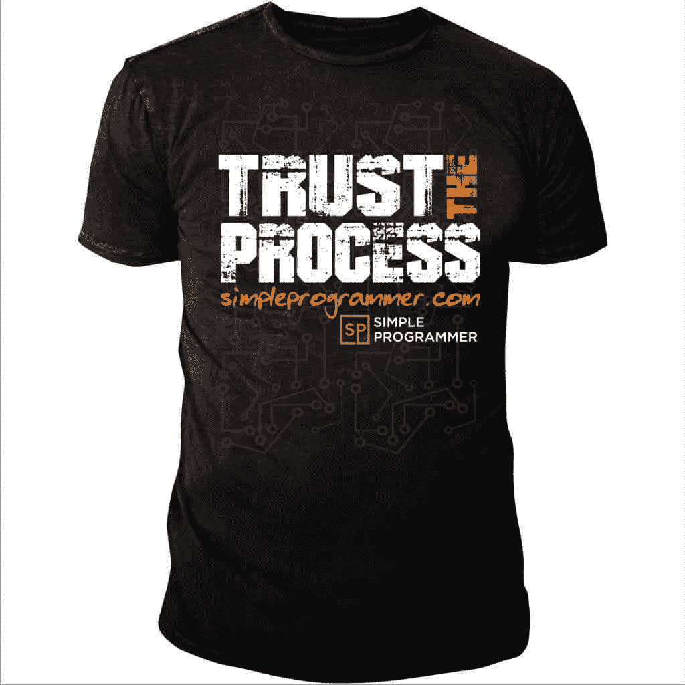

[**<u>【信任过程】t 恤</u>**](https://simpleprogrammer.com/store/products/trust-the-process-t-shirt/)

如果你是《简单程序员》的粉丝和狂热读者，那么这件官方衬衫不仅仅是广播你的程序员身份。穿上这件仅在 Simple Programmer 网站上出售的极其柔软、略微合身的衬衫，表达你的支持和*信任*。

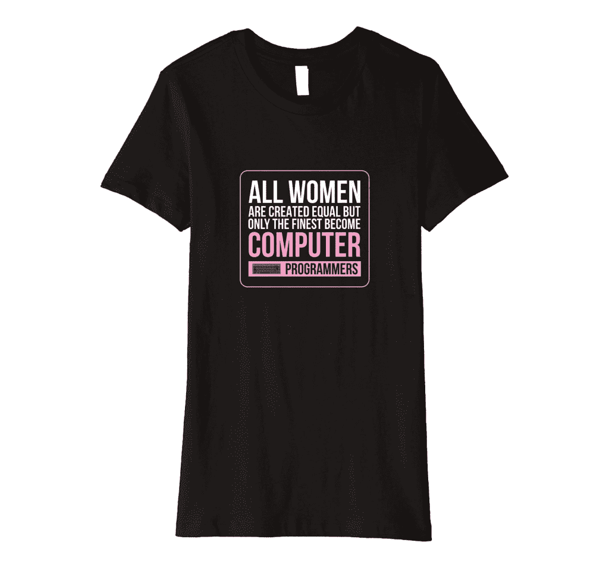

[<u>**女性最优秀的电脑程序员**</u>](http://www.amazon.com/exec/obidos/ASIN/B07H4GGZRV/makithecompsi-20)

我喜欢这件 t 恤！这是为数不多的将女性程序员描述为“女人”而不是“女孩”或“宝贝”的 t 恤之一。它有五种颜色，非常适合办公室里的“休闲星期五”。你甚至可以给你的女儿买一个，让她们尽早走上良好的发展道路。

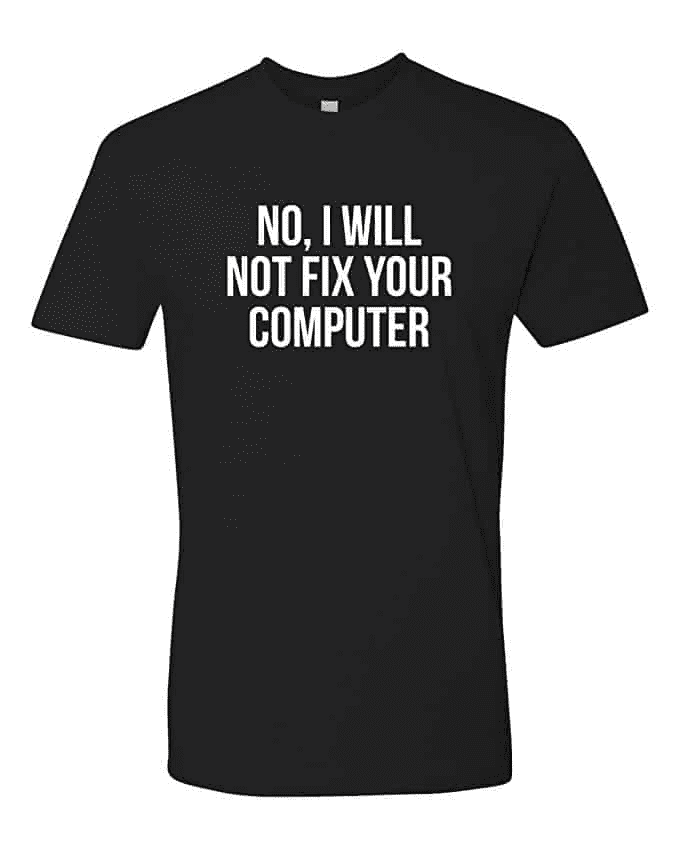

[<u>**我不会修你的电脑 t 恤**</u>](http://www.amazon.com/exec/obidos/ASIN/B00PI00KL6/makithecompsi-20)

在写这篇文章的时候，我无意中发现了另一个很棒的程序员 t 恤宝库。

到目前为止，有许多简单的设计，但标志和 t 恤有各种各样的颜色。

### 袜子的其他酷程序员的东西(低于 25 美元)

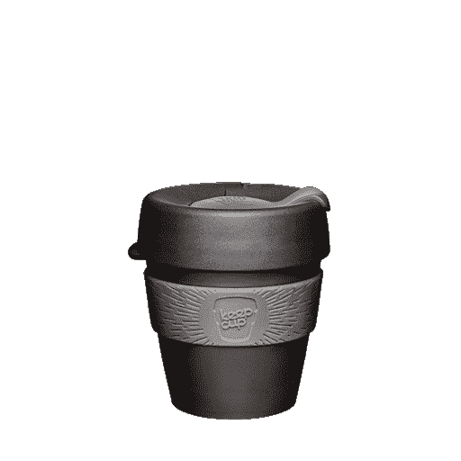

[<u>**keep cup**</u>T5】](http://www.amazon.com/exec/obidos/ASIN/B01D8IPEJM/makithecompsi-20)

这个小杯子有多种颜色、尺寸和材料可供选择。

许多品牌咖啡店(甚至是小咖啡店)在用这些杯子购买热饮时会给使用者打折。因此，如果你想保护环境，并在需要日常剂量时想要一杯打折的好喝的饮料，这就是你要的杯子。

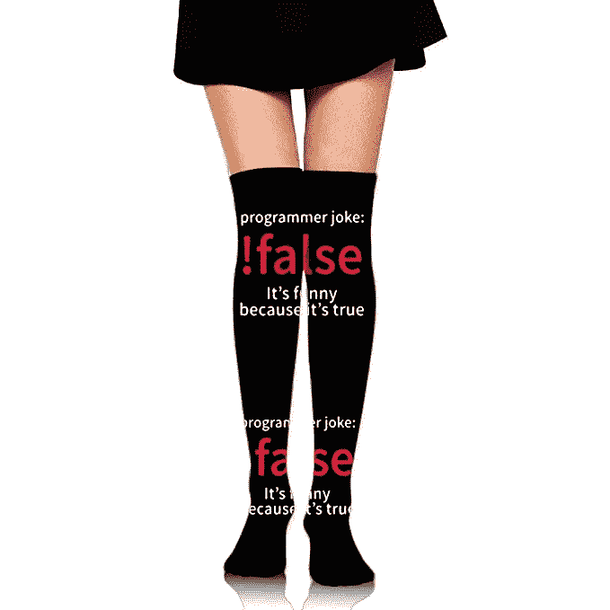

[<u>**假程序员笑话男女通用过膝高袜子号外**</u>](https://www.amazon.com/exec/obidos/ASIN/B078SHJBZX/makithecompsi-20)

正是您需要的保暖用品！有些过膝，棉袜。这些袜子男女通用，所以你可以自己穿，也可以作为礼物送给你的伴侣。

## 参加过几次约会(25-50 美元)

* * *

### 编程服装(50 美元以下)

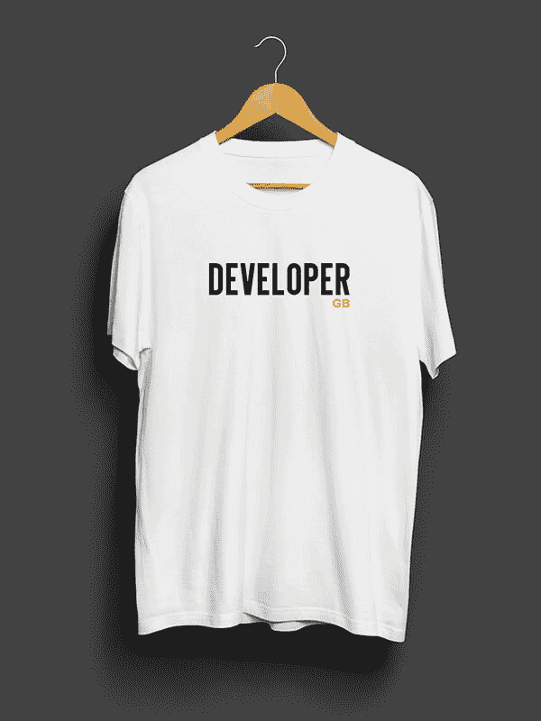

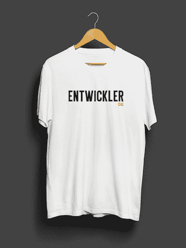

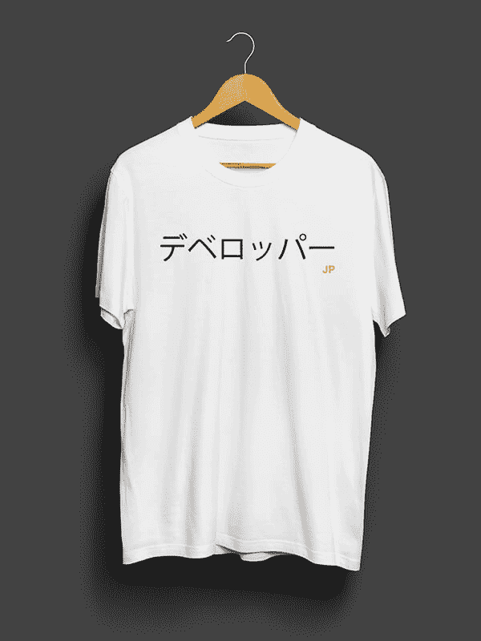

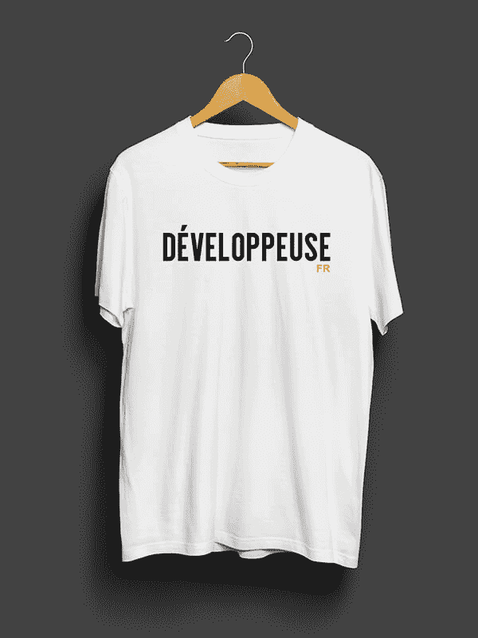

**开发商 t 恤由**[<u>**Maison Futari**</u>](https://maisonfutari.com/)

我第一次看到这个是在 [<u>博罗姆博</u>](https://www.instagram.com/_borombo/) 的 Instagram feed 上。我喜欢这件 t 恤，因为它设计简单，因为它提供了语言变体，所以它能够与不同的人“交谈”，并且它宣称“我是一名开发人员”。

它有三种基色，你可以选择你想要的语言。学日语？为什么不买日本版，向全世界炫耀你的开发者本性。

## 事情变得相当严重(50-100 美元)

* * *

### 游戏(100 美元以下)

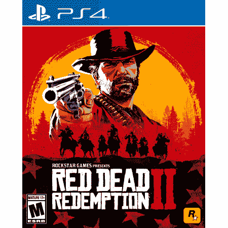

[**红色亡灵救赎 2**](http://www.amazon.com/exec/obidos/ASIN/B01M5DZ525/makithecompsi-20)

我从同事那里听说了很多关于这个游戏的事情，就好像我自己也玩过一样。红色死亡 2 有一点点大部分游戏的狂野西部，机器人，枪战，马(宠物)保养，好故事，装备退化我都听过。所以我认为这应该会吸引更多的观众。

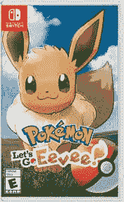

[**口袋妖怪走吧**](http://www.amazon.com/exec/obidos/ASIN/B01MT8AIBE/makithecompsi-20)

如果红色死亡 2 不是你(或者你生命中的程序员)的第一选择，为什么不试试最新的口袋妖怪呢？

这次在任天堂 Switch 发布的是关东地区的更新版本，你可以骑更多的口袋妖怪四处走动，类似于在太阳和月亮中使用的。像许多以前发布的口袋妖怪游戏一样，同一款游戏有两个版本，让你接触不同的口袋妖怪，以鼓励你交换口袋妖怪并与其他口袋妖怪玩家联系。这一最新的部分是皮卡丘和 Eevee 版本。

我自己也是口袋妖怪的粉丝，所以今年我可能会和 [<u>【塞尔达传说】</u>](https://www.amazon.com/exec/obidos/ASIN/B01MS6MO77/makithecompsi-20) 一起得到这个，哦，还有一个任天堂 Switch。对我来说是一个昂贵的任天堂圣诞节。你呢？

### 知识的礼物(100 美元以下)

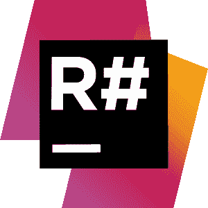

****订阅****

**既然有工具可以帮你做一些小事情，为什么还要写所有的代码呢？**

**Resharper 是微软 Visual Studio 的开发者扩展。它仅在 Windows 上可用，因此不能用于 Mac 版 Visual Studio。它可以自动化你的一些编码程序。它会在您键入时发现编译器错误、运行时错误、冗余和代码味道，并建议对它们进行智能纠正。**

**自从最近几次重大升级以来，Visual Studio 内置快捷方式已经有所改进，但是在您的工具包中加入 Resharper 肯定会提高您的工作效率。**

**Resharper 有不同的订阅模式，可以灵活地满足您的需求。**

****

**[**MFR actor**](https://www.mfractor.com/)**Subscription****

**如果你不使用 Windows 操作系统，而是使用 Visual Studio for Mac，你可能需要一个名为 Mfractor 的工具。这个工具由马修·罗宾斯制造，是 Mac 用户的利器。它有内置的快捷方式和短代码，并能够添加您自己的，使您的编码生活更有效率，甚至当使用 XAML。**

**Mfractor 有 Lite 和 Professional 两个版本，购买前可以先试用一下。**

### **编程配件(低于 100 美元)**

**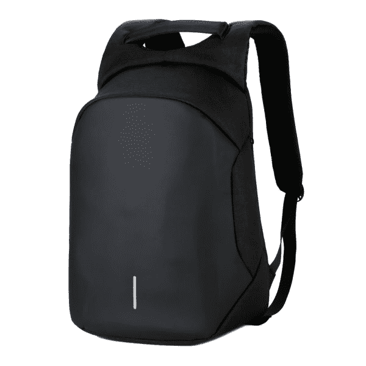**

**[<u>**现代派 look Max II 升级版**</u>](https://www.modernistlook.com/en/product/modernist-max-water-resistant-usb-charging-port-travel-backpack/?utm_campaign=Modernist_Look&utm_source=fbcomment&utm_medium=cpc&utm_term=&utm_content=23843081284360157)**

**我不知道你们中的任何人，但我努力寻找一个模仿专业外观的背包，但也可以容纳我的笔记本电脑和我在荒岛上可能需要的一切，我显然每天都带着它去工作。虽然这个包很接近。**

**它有两种尺寸和三种颜色。它是防水的，有一条带子可以固定在行李箱的顶部，当你在度假时可以随身携带。**

**有了 USB 充电和这么多口袋，它一定能满足你的所有需求。**

## **想一起住吗？($100 – $250)**

* * *

### **电子产品(低于 250 美元)**

**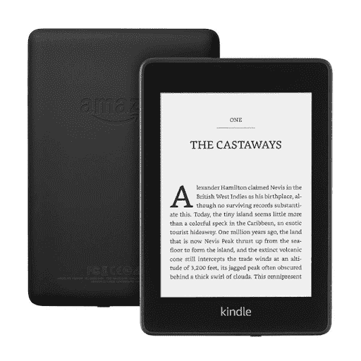**

**[<u>**Kindle paper white**</u>T5】](https://www.amazon.com/exec/obidos/ASIN/B075QRWPPJ/makithecompsi-20)**

**我真的很喜欢使用 Kindle，全新的 Paperwhite 是 Kindle 系列的一大亮点。它又轻又小，储物空间是原来的两倍，而且防水。非常适合那些在泳池边用设备放松时不小心被溅到的日子。**

**如果你聪明地使用 Wifi 连接和背光，它的电池寿命现在可以持续几周，但即使有这些警告，你仍然可以一次充电获得大量电池。**

**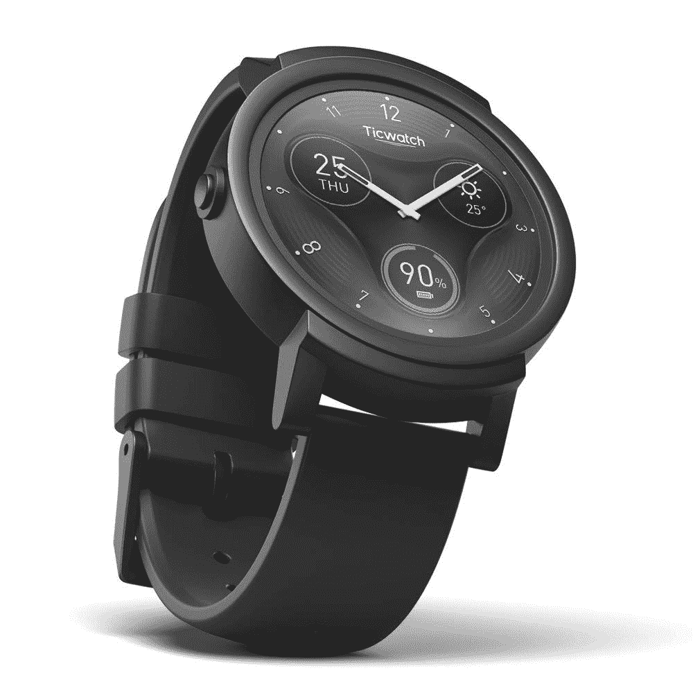**

**[<u>**TicWatch E 影智能手表**</u>](https://www.amazon.com/exec/obidos/ASIN/B076HQPDRF/makithecompsi-20)**

**我之前一直对一款智能手表不感兴趣(主要是担心自己不小心把现在的手表按月敲成很多东西)，但在亚马逊上看到这款手表的宣传片视频后，连我都动心了。**

**这款 sportwatch 有多种款式，表面可通过多种可下载的设计进行定制。它拥有 1.4 英寸的有机发光二极管显示屏，支持 Android Wear 2.0，并兼容 Android 和 iOS 设备。**

### **计算机电子产品(低于 250 美元)**

**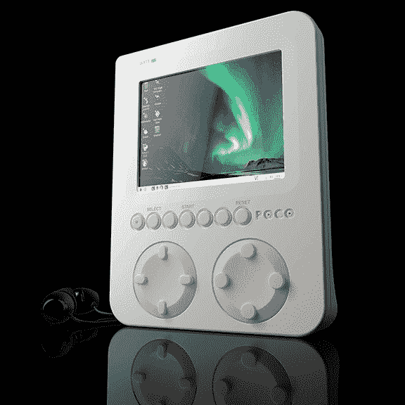**

**[<u>**Poco**</u>T5】](https://www.grantsinclair.com/en/kit-computers/poco-kit-white.html)**

**建立在树莓皮，Poco 是一个多功能，易于组装的袖珍电脑。**

**尺寸约为 8 厘米 x 11cm 厘米，加上免费的模拟器下载，您可以将 Poco 变成一个经典的游戏主机模拟器。然而，如果游戏不是你想做的，那么你也可以使用 Poco 来制作音乐或媒体播放器，紧凑型摄像机或用它来教别人编码。**

**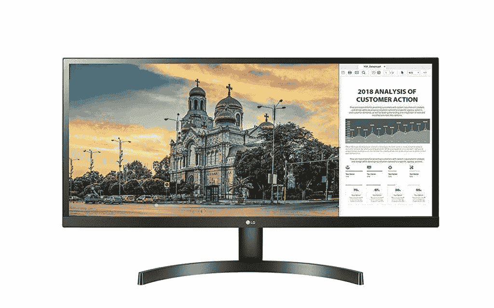**

**[<u>**LG 29WK500 超宽屏显示器**</u>](http://www.amazon.com/exec/obidos/ASIN/B07BBT5M8T/makithecompsi-20)**

**如何让你的开发者设置更牛逼，让自己更有生产力？两个字。超宽屏！你的生活需要这个。**

**我今年挑选的是 LG 29 英寸超宽 IPS 显示器，可悲的是，我目前的 MacBook Pro(2012 年年中)不支持这种显示器，但这应该不是新 MacBook Pro 的问题，所以请放心。**

**它看起来像一个高质量的产品，如果你不确定 29 英寸的显示器是否足够大，让我告诉你，它是足够大的。老实说，我认为，如果你把这种显示器的尺寸缩小，你会得到宽度，但我注意到高度明显低于正常或宽显示器。当你应该深入到下一个编码项目中时，你不希望被这种事情所阻碍。我肯定会推荐这种产品。**

### **技术配件(低于 250 美元)**

**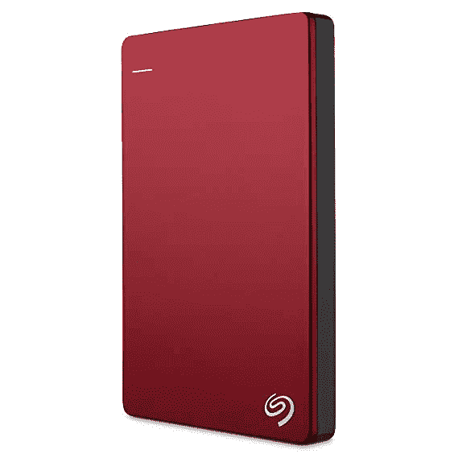**

**[<u>**希捷外置或内置固态硬盘**</u>](https://www.amazon.com/exec/obidos/ASIN/B0196J40BA/makithecompsi-20)**

**现在的存储有多便宜？我 2007 年才离开 uni，现在我还有一个 u 盘(那是我在那里用的！)也就是 128MB！我甚至不认为这个尺寸是为智能手机设计的。最近，当我把我的 Macbook Pro 从 500GB 硬盘升级到 120GB 固态硬盘时，我花了大约 110 英镑。**

**今年你可以花大约 20 英镑买到那个尺寸的！我是说这有多疯狂。存储很便宜，主要是因为我们拍摄的照片和视频以及我们使用的软件占用了太多空间，现在我们必须获得便宜的存储，否则没有人可以使用所有这些新的奇妙功能。那么我推荐哪个呢？我会继续使用希捷。是我给 Macbook 升级买的牌子，我也有外置 SSD 的牌子。**

****

**[<u>**索尼无线蓝牙耳挂降噪耳机**</u>](https://www.amazon.com/exec/obidos/ASIN/B07G4MNFS1/makithecompsi-20)**

**这些都是令人惊讶的轻量级，但制造精良的产品。他们有手势控制，让你只需轻轻一点就能收到通知。他们还有一个令人敬畏的噪音消除功能，甚至可以淹没伦敦地铁的噪音。它还拥有 30 小时的电池寿命，可以持续两周以上的正常每日两小时通勤时间。**

**这绝对是今年圣诞节送给你生命中那个非常特别的科技男孩或女孩的高端礼物。**

### **电子玩具(250 美元以下)**

**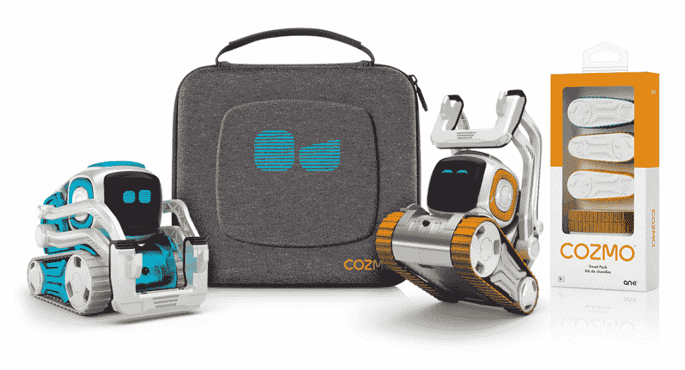**

**[<u>**科兹莫**</u>T5】](http://www.amazon.com/exec/obidos/ASIN/B074WC4NHW/makithecompsi-20)**

**这个可爱的机器人有多可爱多牛逼？！安奇是今天孩子们的电子鸡。**

**虽然不能进化(让我们把这留给口袋妖怪)，但它实际上从它的经验中学习，所以每个人都会有不同的 Anki。它足够小，可以带到任何地方，它还有一个应用程序，所以你可以通过不同的游戏和活动与 Anki 互动。这是每个小程序员和大程序员在拥有一只真正的宠物后想要的。**

## **你是一个书呆子，我喜欢它(250-500 美元)**

* * *

### **知识的礼物(500 美元以下)**

**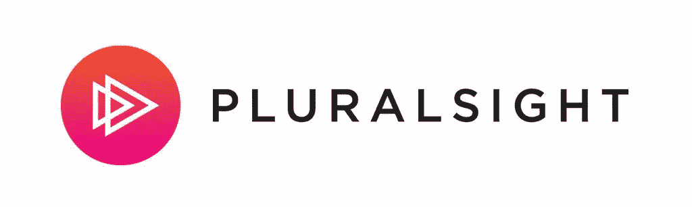**

****

****跟上技术的变化是非常重要的。如果你有很好的资源来帮助你持续学习，那么能够快速学习就是一个好处。****

****Pluralsight 是一个在线视频平台，提供丰富的技术相关信息。这些可以包括从更新到编码语言、在项目中创建功能的教程，甚至是程序员的软技能。该平台迎合了从初学者到高级用户的所有用户水平，因此肯定有适合每个人的东西。****

****该平台有不同的订阅级别，他们总是有免费试用，所以你可以看看你是否认为这个平台将有利于你的发展职业生涯。****

### ****游戏(低于 500 美元)****

****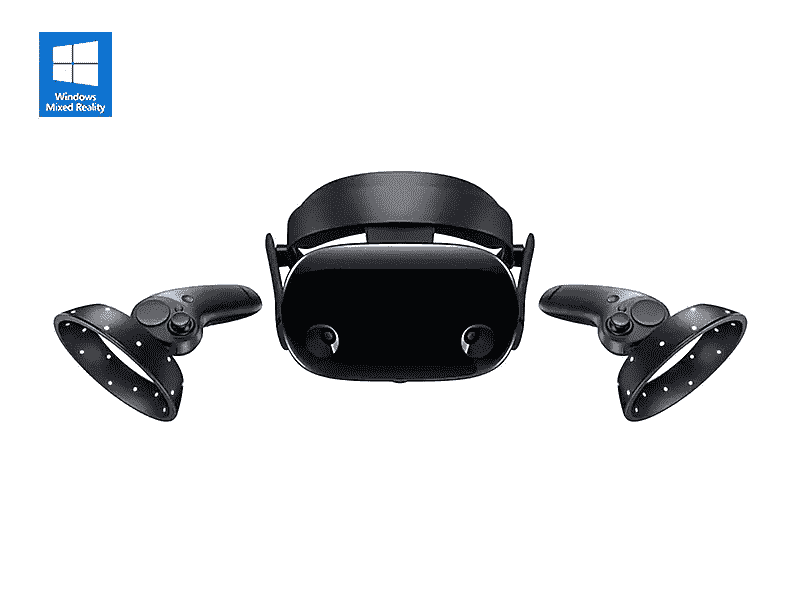****

****[<u>**【三星奥德赛+**</u>](http://www.amazon.com/exec/obidos/ASIN/B07HS7R1RT/makithecompsi-20)****

****当我在伦敦一家虚拟现实公司担任质量保证和发布经理时，大约从今年 7 月开始，我每天都在使用三星奥德赛(Samsung Odyssey)[<u>。虽然有一些古怪的功能，但它很容易成为我迄今为止最喜欢的有线虚拟现实耳机。我们还可以买到三星 Odyssey+,您可以获得原版 Odyssey 的所有好处，但分辨率更高，耳机更轻。只有两根电缆连接到你的电脑，没有灯塔或外部电源，如果你想从原来的 Vive 或 Oculus 升级，你会非常高兴。</u>](https://www.samsung.com/us/computing/hmd/windows-mixed-reality/hmd-odyssey-windows-mixed-reality-headset-xe800zba-hc1us/)****

****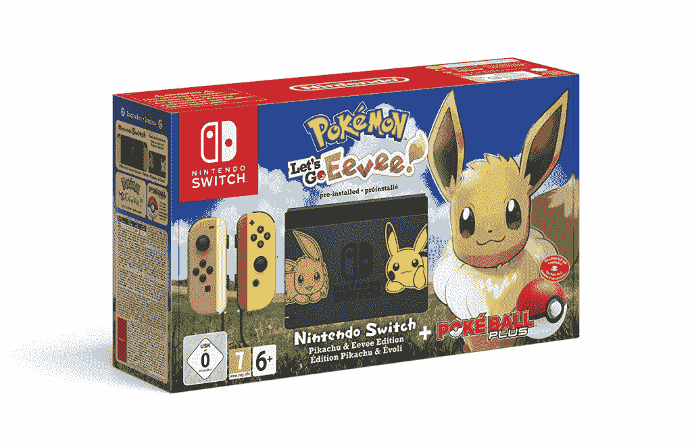****

********

******任天堂的这款最新游戏机对任何人来说都是一份重要的圣诞礼物。这款游戏机既是家用又是便携式的，适合那些总是在通勤途中无事可做的人，也适合那些喜欢在家里炸石头的人。******

******随着 Pokemon Let's Go 的发布，他们发布了一款限量版的主机，准备在圣诞节前抢购。还不确定我会选什么颜色，但是今年它肯定会在我的圣诞树下。******

### ******计算机技术(500 美元以下)******

******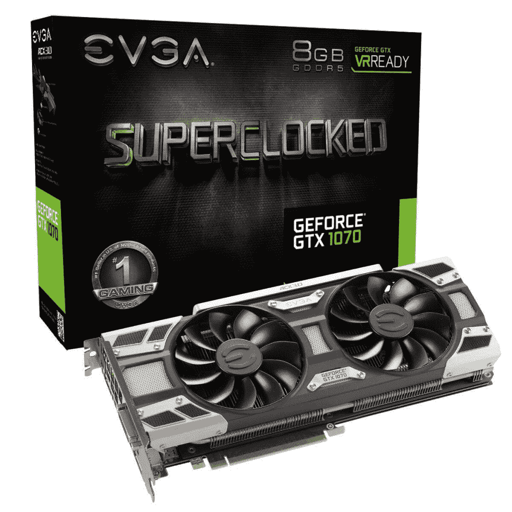******

******[<u>**EVGA GeForce GTX 1070 显卡**</u>](http://www.amazon.com/exec/obidos/ASIN/B076S4RH6K/makithecompsi-20)******

****为了运行最新的游戏和 VR 系留设备，你需要有一台高端 PC。Vive Pro 和 Oculus 需要一些非常强大的电脑来确保你有一个流畅、棒极了的虚拟现实体验。****

****将您的电脑升级到 1070 图形卡将使您获得最佳体验，并使您的硬件在几年内经得起未来考验。请记住，Vive Pro 和 Oculus 需要高端规格，但奥德赛可以很好地应对这一点。因此，如果高端设备超出了您的系统规格，您可以随时降级您的 VR 硬件。只是说说...****

## ****让我们制造婴儿(500 美元以上)****

* * *

### ****电子产品(500 美元以上)****

****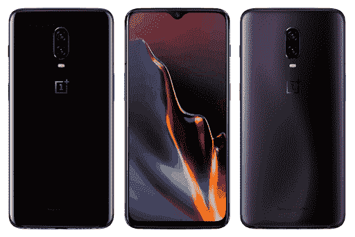****

****[<u>**一加 6T**</u>T5】](http://www.amazon.com/exec/obidos/ASIN/B07K76LBLZ/makithecompsi-20)****

****一加系列设备的最新版本是 6T。同样，与三星和苹果的旗舰设备相比，这对于那些在意价格但仍然想要 600 美元以下的体面手机规格的人来说是非常实惠的。这款手机还像它的前辈 OnePlus 6 一样，采用了新的全屏显示。****

****它有大量内存，可以在应用程序之间和内部流畅使用，还有一个双后置摄像头，可以让你的照片和视频与新 iPhone 不相上下。****

****有了自己的 Android 版本，它去掉了许多困扰其他手机制造商的臃肿软件，这样你就可以使用所有的存储空间来做你想做的事情。****

****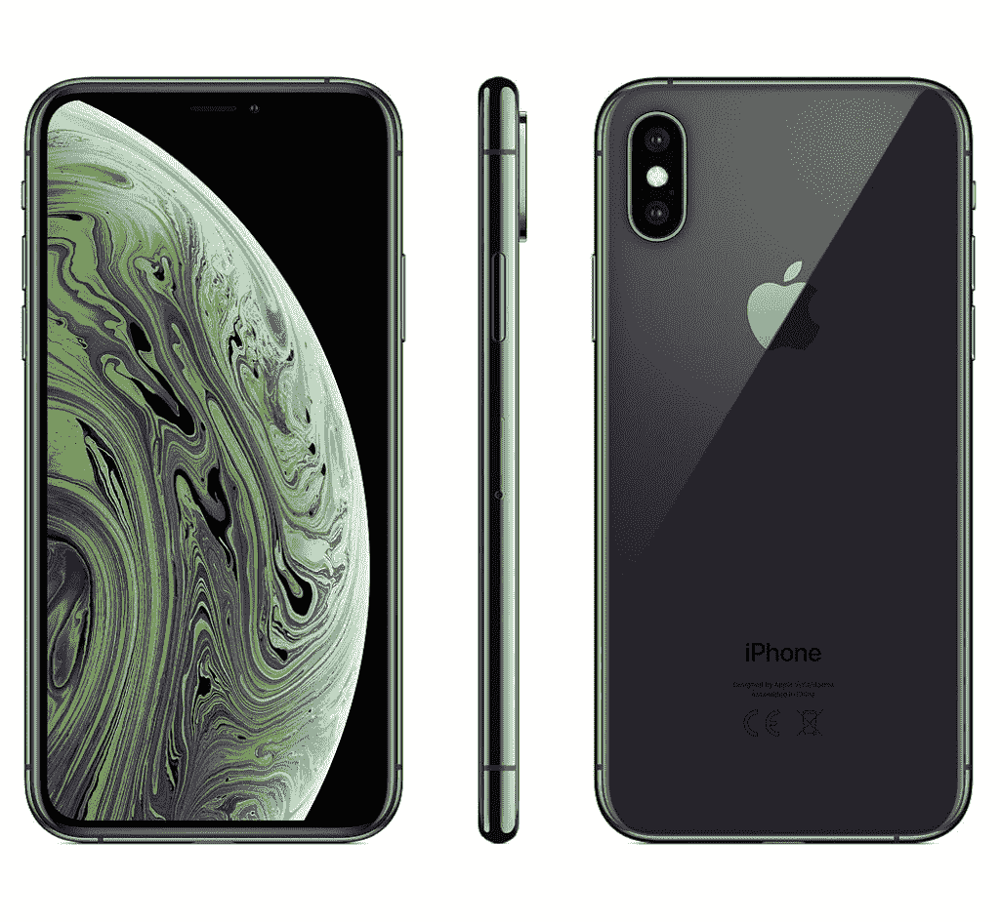****

****[<u>**iPhone XR**</u>](http://www.amazon.com/exec/obidos/ASIN/B07HCTCRDK/makithecompsi-20)****

****现在我不是 iPhone 粉丝，但我确实喜欢新 X 系列机型的显示屏。宽屏为应用程序提供了更多的内容，所以我很高兴能得到一台用于开发的屏幕。尽管只有一个后置摄像头和较低规格的摄像头(与 X 或 XS 型号相比)，但 iPhone XR 是 iPhone 产品线中较新的版本之一，这意味着它更有可能在大约五年内得到苹果的支持，所以就开发而言，你是在保护自己的未来。而 XR 最大的卖点就是价格！虽然在 XS 和 XS Max 发布之后，这款设备在 2018 年 10 月下旬才发布，但实际上比 XS 和 XS Max 更便宜。****

### ****计算机电子学(500 美元)****

****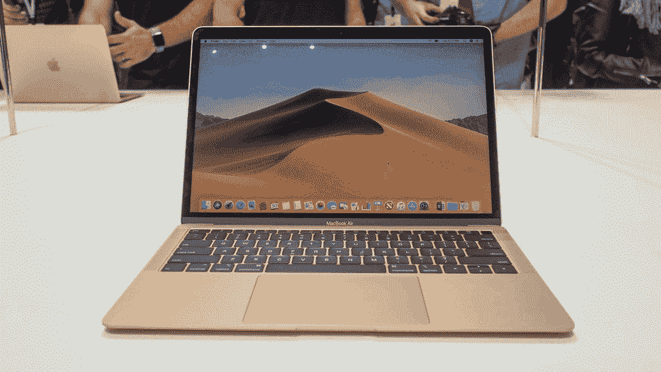****

********

******你见过新款 Macbook Air 吗？它更薄、更轻，拥有更新的处理器，并配有视网膜显示屏。有三种颜色可供选择，全铝外壳使得它比以前的版本更加环保。苹果还表示，它有一整天的电池寿命，如果这是真的，甚至可以让 Surface 笔记本电脑物有所值。******

******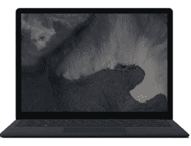******

******[<u>**Surface 笔记本电脑 2**</u>T5】](http://www.amazon.com/exec/obidos/ASIN/B07HZK3SLP/makithecompsi-20)******

****微软的 Surface 系列产品是该公司的一大成功。凭借灵活的定制规格，您可以打造真正符合您需求的产品。****

****Surface Laptop 2 拥有上一代机型的所有出色功能，但现在它也有了黑色。这款时尚的设计和极轻的产品配有 Alcantara 键盘，并提高了速度和性能。****

****我发现触摸屏在使用计算器等工具时非常有用，在屏幕上输入你的值非常简单快捷。****

****这款设备与 Surface pen 兼容，绝对是我在这个价格区间之外的最爱。****

****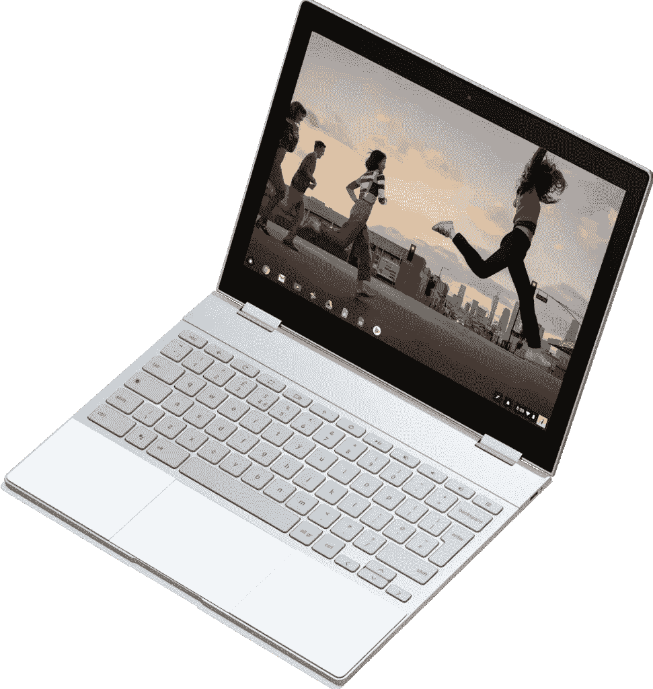****

****[<u>**谷歌 pixel book**</u>T5】](https://www.amazon.com/exec/obidos/ASIN/B07KP9QYRK/makithecompsi-20)****

****尽管被称为 Chromebook，但这款设备的标准和构造更高，因此价格也更高。但是，凭借 360 度触摸显示屏、快速充电、内置谷歌助手、超薄、轻薄、小到可以放进你的包里，以及四种使用方式，如果我要买一台新笔记本电脑，它肯定会进入我的候选名单。****

### ****技术配件(500 美元以上)****

****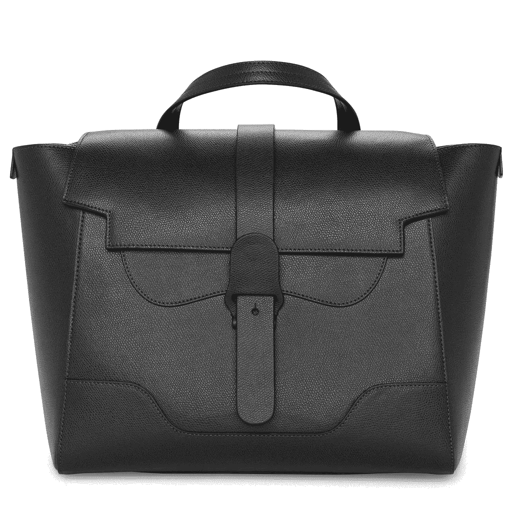****

****[<u>**梅斯特拉**</u>](https://www.senreve.com/products/maestra-bag)****

****这款包有多种颜色和表面，我看不出它会对任何精明的女性技术程序员没有吸引力。****

****这款包可以是手提袋、斜挎包、背包或挎包。****

****由意大利皮革制成，你一定会喜欢这款高品质的产品，它是你工作衣柜的一个标志和投资品。****

****如果大小是一个问题，它也有迷你和 midi 版本。****