# 2020 程序员礼物指南

> 原文：<https://simpleprogrammer.com/2020-gifts-for-programmers/>

欢迎来到我们的 2020 年程序员礼物指南！与我们的其他文章不同，这篇文章不仅仅是为我们简单的程序员准备的。

这是给他们的朋友、家人和爱人的，他们很难为生活中的科技爱好者选择完美的礼物。

有一个程序员，你必须为他找到完美的礼物？别担心，因为这是你的节日礼物指南！

我们已经搜索了科技列表，我们自己的年度最爱，以及 2020 年的必备节日礼物，并整理了一系列选项，以适应你的预算和礼物购买需求，无论这些可能是什么。这应该有助于将最后一刻的假日购物热潮的压力降至最低。

因为，面对现实吧。在这个混乱的 2020 年，我们可能会在网上购买很多礼物，这意味着库存和运输时间-所以在别人开始考虑之前，把你的编程礼物拿起来包装好！

Quick Navigation[Books for Programmers](#tab-con-24)[Getting Into It (Under $25)](#t-1606144958284)[A Little More … ($25-$50)](#t-1606144958285)[Getting Spendy ($50-$100)](#t-1606144958286)[In the Zone ($100-$350)](#t-1606144958287)[Luxury Gifts ($350+)](#t-1606144958288)

## 程序员用书

* * *

 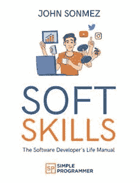 

[*《软技能:软件开发人员的生活手册》*](https://www.amazon.com/dp/B08N9KTYW6/makithecompsi-20) 是 John Sonmez 出版的第一本书，对于你生活中任何想学习如何与周围的世界更好地沟通、更体贴、更充实地生活的程序员来说，都是完美的选择。

 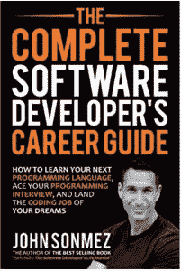 

[*完整的软件开发人员职业指南*](https://www.amazon.com/dp/B073X6GNJ1/makithecompsi-20) 是为那些希望在来年拓展职业生涯的程序员准备的。无论他们是在寻找一个大的改变，一份新的工作，还是只是试图改善他们目前的职位，这本书都有现实世界的建议来帮助他们做到这一点。

 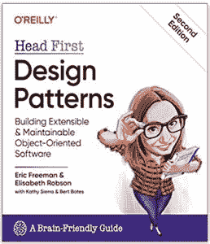 

Head First 书籍以其丰富的视觉格式而闻名，旨在以大脑工作的方式理解。在第二版的 [*头先设计模式*](https://www.amazon.com/dp/149207800X/makithecompsi-20) 更新中，你的程序员将会学到设计软件时重要的模式。

 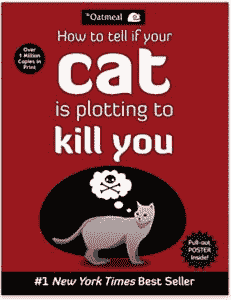 

随着越来越多的人在家工作，我们需要诚实地面对我们已经侵入的空间。如果你的程序员在家里和一只可爱但精于算计的小猫一起工作，这一点尤其重要。如果你生命中的某个人真的需要一本指南来维持生命，那么就从漫画作家《燕麦粥》中获取这篇幽默的文章吧。

 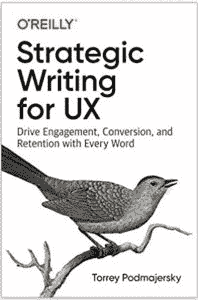 

编程通常不仅仅是项目中的代码。用户需要一种与代码交互的方式，虽然视觉很重要，但文字也很重要。在为 UX*撰写的 [***战略文章中，你的程序员将从一位 UX 内容战略家那里学习如何以一种推动参与、转化和保留的方式写作。***](https://www.amazon.com/dp/1492049395/makithecompsi-20)*

 *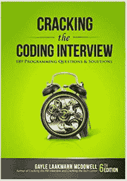* 

*你的程序员有换工作的计划吗(或者你的有抱负的程序员在 2021 年找工作吗？)在 [***破解编码面试***](https://www.amazon.com/dp/0984782850/makithecompsi-20) 中，他们将获得 150 个编程问题和解决方案，帮助他们实现梦想。*

 ** 

*你知道吗，经验法则是程序员应该每年学习一门新的语言，或者认真钻研他们熟悉的语言。如果你生活中的程序员是一个热爱学习，但难以选择学什么*的人，那么 [***七周七种语言***](https://www.amazon.com/dp/193435659X/makithecompsi-20) 可能会让他们在 Q1 尝到几种不同的语言，这样他们就可以将今年剩下的时间专注于深度学习。**

 **** 

**就在我们都开始远离社交，足不出户之前，我们出版了这本书， [*远程工作:在家工作*](https://www.amazon.com/dp/B086XG9747/makithecompsi-20) *找份工作或开创一番事业。*我们希望我们没有预见到这一点，但该指南对任何想要远程工作的人都是相关的*，不管疫情是否规定他们应该这样做。***

 ***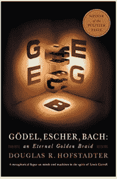*** 

***好吧，所以从技术上来说这不是一本编程书。但是你生活中的程序员会喜欢它，因为他们是一个有模式和联系的人(这就是代码，真的！) [*一条永恒的金色辫子*](https://www.amazon.com/dp/0465026567/makithecompsi-20) 着眼于巴赫的音乐、埃舍尔的艺术和哥德尔的数学之间令人惊讶的联系点。***

## **投入其中(不到 25 美元)**

* * *

 **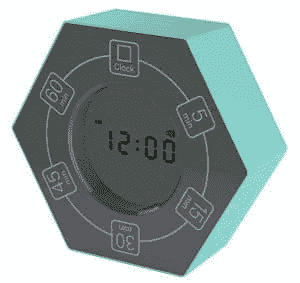** 

**[**家用&带时钟的办公室计时器**](https://www.amazon.com/dp/B07L2P9QFT/makithecompsi-20)(19.99 美元)——分成(大部分)15 分钟的间隔，这对于任何喜欢番茄的程序员来说都是一个很好的计时器，但有时需要*多一点时间*来完成他们的项目。**

 **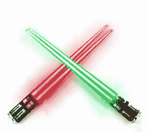** 

****【17.97 美元】——你没看错吧？是的，是的，你做到了。像光剑一样发光的木棍。它们实际上是为你最喜欢的爱吃寿司的程序员的书呆子需求而工作的。****

 ****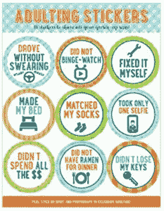**** 

****[**成人贴**](https://www.amazon.com/dp/1441322574/makithecompsi-20)($ 4.99)——你的程序员这一年过得不顺吗？(谁不是，真的？)给他们一个奖励自己的机会，希望每次他们打破一个新的“成就”时，可以笑一笑。****

 ******** 

****[**维京不锈钢头骨杯**](https://www.amazon.com/dp/B01GL9TMAW/makithecompsi-20)**(18.99 美元)——这可能只会吸引特定的程序员群体，他们喜欢用维京头骨喝咖啡、茶或烈酒。虽然我是一个整天喝玫瑰红葡萄酒的女孩，但我不介意从这个糟糕的饮料罐里喝一杯！******

 ******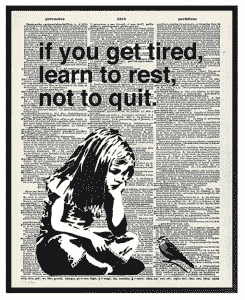****** 

******[当工作和家庭经常是一样的时候，这个可爱的印刷字体是一个很好的提醒。](https://www.amazon.com/dp/B07QGZJKSS/makithecompsi-20)******

 ******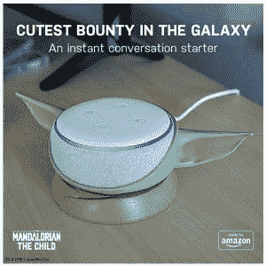****** 

******[**《曼达洛人:孩子，代表亚马逊 Echo Dot**](https://www.amazon.com/dp/B086W7PH7N/makithecompsi-20)($ 24.95)——你认识的人中有痴迷迪士尼+上的曼达洛人系列的吗？也许他们只是喜欢席卷全球的尤达宝宝浪潮。无论他们的理由是什么，这个小小的 Echo Dot 支架一定会让他们的房间变得更快乐。******

 ******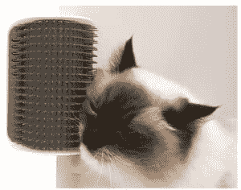****** 

******[**Catit Senses Self Groomer 猫玩具**](https://www.amazon.com/dp/B00D3NI2PG/makithecompsi-20)(3.99 美元)——还记得我警告过你的那只猫*可能正在策划你最喜欢的在家工作的灭亡吗？很有可能，他们生气的部分原因是他们不明白为什么他们不能从人类那里得到他们想要的东西。想想这种安慰剂。*******

 ************** 

*********【佩里通睡眠耳机】(19.99 美元)——专为睡眠而生，而不是*仅仅是*为睡眠而生，这些蓝牙无线耳机是任何人想要一种免提但安全的方式来听他们喜欢的音乐，而不伤害他们的耳朵的伟大解决方案。*********

 ********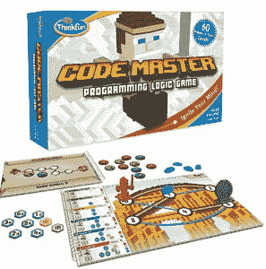******** 

********[**ThinkFun Code Master 编程逻辑游戏**](https://www.amazon.com/dp/B014993TCI/makithecompsi-20)($ 23.94)——很有可能任何人都会喜欢这个游戏，如果他们喜欢编程的话。但是如果你生活中的程序员有一些小伙伴想要分享他们的激情，这是一个特别有趣的礼物。********

 ******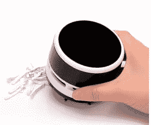****** 

******[**【fine inno】迷你真空吸尘器**](https://www.amazon.com/dp/B075XLGHC4/makithecompsi-20)(18.99 美元)——在如今的工作世界中，程序员可能没有能力起身去休息室吃饭和做其他私人时间。这意味着他们的工作空间可能会变得*凌乱*。使用这款迷你吸盘鞋面，帮助他们保持整洁。******

 ******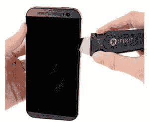****** 

********[iFixit Jimmy——电子开启工具](https://www.amazon.com/dp/B00NCFIVH4/makithecompsi-20)**($ 7.99)——你认识补锅匠吗？有些人喜欢拆开所有东西，看看它是如何工作的，然后尝试(有时甚至成功！)他们能够把它重新组装起来吗？那他们会需要这个。******

 ******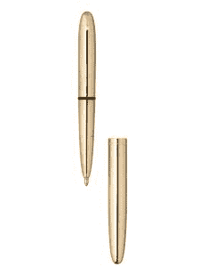****** 

********[费希尔太空笔](https://www.amazon.com/dp/B00KQSMAYU/makithecompsi-20)**($ 22.10)——这可能*看起来*像一只普通的老式花式黄铜笔，但它是一只*非常特别的*花式黄铜笔。它在任何角度都可以写字(甚至是零重力——说真的，已经测试过了！)，极端温度，以及其他许多不可能的条件。******

## ******多一点… ($25-$50)******

* * *

 ******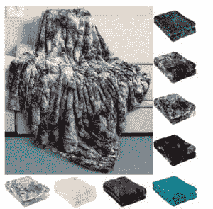****** 

********【永久舒适人造毛皮外套】(31.95 美元)——有人形容这是“用 100 个泰迪熊包裹自己”，老实说，我想不出在寒冷的冬夜蜷缩着看书或编程的更好方式了。请给我报名参加 4 个。********

 ********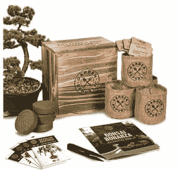******** 

**********【盆景树木种子入门套件】(39.97 美元)——你生活中的程序员是否怀念在美丽的大自然和绿色植物中行走...良好的...户外本身？用这个桌面盆景套件帮助他们找回一些禅的时刻。**********

 ********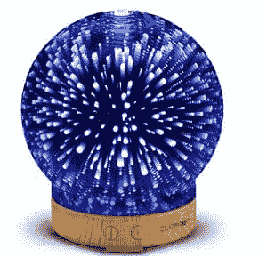******** 

**********[Clearon 3D 玻璃精油扩散器](https://www.amazon.com/dp/B0737D4FBP/makithecompsi-20)**(29.99 美元)——忘掉塑料和石头精油扩散器吧:这种变色 LED 球的臭味会给任何无聊的办公室布置增添一种奇特的灯光表演；杀戮者播放列表可选。********

 ******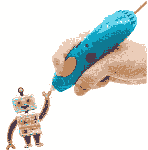****** 

******[**3 更好的开始必需品**](https://www.amazon.com/dp/B086JQQHPK/makithecompsi-20)**(49.99 美元)——列出了一些给孩子的礼物，但让我们现实点吧……成年人会和他们一样开心的！也许你的技术天才是一个有创造力的灵魂，他喜欢画画就像喜欢编码一样。这将勾画他们的痒。********

 ********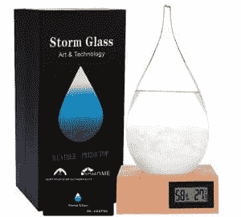******** 

**********[风暴玻璃气象站](https://www.amazon.com/dp/B08CW343HQ/makithecompsi-20)**(36.00 美元)——官方称之为“我收到的最酷的礼物之一”，这是我寄给一个有分析头脑的朋友的，风暴玻璃气象站使用一个古老的海事技巧来告诉地平线上的天气。********

 ******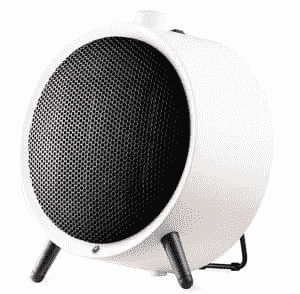****** 

******霍尼韦尔 UberHeat 陶瓷加热器(34.99 美元)——这款个人空间加热器的秘密在于:它很节能。这意味着不会有人在每次厚颜无耻地给办公室供暖*和*插上手机充电时烧坏电路。******

 ******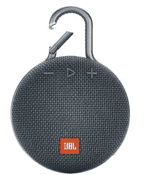****** 

******[**【JBL】——防水便携式蓝牙音箱**](https://www.amazon.com/dp/B07Q3SXPFY/makithecompsi-20)($ 39.95)——当你爱的一个程序员不再通勤于办公室时，他们失去了每天听播客的时间吗？这不一定会让他们一直回到*，但确实给了他们更多的时间在早上淋浴时赶上他们最喜欢的节目。*******

 ************** 

*******[**身体背部巴迪经典——触发点背部按摩器**](https://www.amazon.com/dp/B0006VJ6TO/makithecompsi-20)(29.95 美元)——我知道我的背部和肌肉这些天尖叫得更多了，在压力和无所作为以及弯腰驼背坐在键盘上之间。这个工具可以帮助你解决程序员自己无法解决的问题。*******

 *******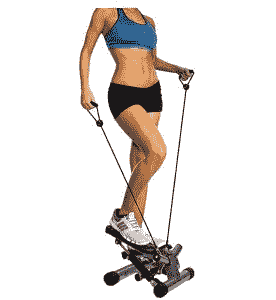******* 

*******[**【平衡】从带阻力带的可调节踏步机**](https://www.amazon.com/dp/B0871YGNDJ/makithecompsi-20)【49.99 美元】——说到无所事事，许多上班族正在寻找新的方式来摆脱家庭的束缚。这个小踏步机将帮助他们进行锻炼，而不会占用太多空间。*******

 *******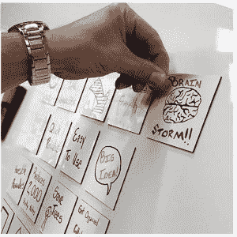******* 

*******[**【MC squares 3x 3】干擦便利贴**](https://www.amazon.com/dp/B07PB5PL82/makithecompsi-20)(24 张 34.99 美元)——听过你的程序员神秘地谈论看板或 SCRUM 流程吗？他们的工作流程(或许还有大脑)很有可能是一种便利贴排序系统，这些干擦贴纸可能只是帮助他们整理代码。*******

## *******挥霍无度(50-100 美元)*******

* * *

 *******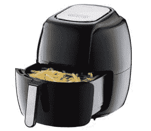******* 

*******[**GoWISE 美国 8 合 1 数字空气炸锅**](https://www.amazon.com/dp/B07V39R29T/makithecompsi-20)(87.99 美元)——这些天我们都在订购外卖。微波剩菜不太一样*，*但是我们并不总是有时间在烤箱里重新加热。进入空气油炸锅，你可以以后再感谢我。*******

 ******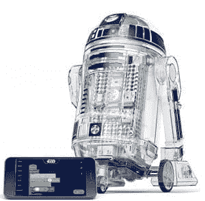****** 

******[**littleBits 星球大战机器人发明家套件**](https://www.amazon.com/dp/B06XYD1LRN/makithecompsi-20)(99.95 美元)——又一个给程序员的“儿童”礼物，*真的可以在成年发明家和机器人爱好者群体中找到一些粉丝*。谁不想要一个小机器人在家里跑来跑去呢？******

 ******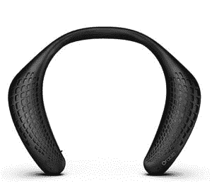****** 

******[**Oraolo Neckband 蓝牙扬声器**](https://www.amazon.com/dp/B07WGGBPGG/makithecompsi-20)(69.99 美元)——另一个免提蓝牙选项，这个可以放在某人的肩膀上，在他们完成一个特别具有挑战性的代码块时，用温柔悦耳的音调环绕他们。******

 ************ 

******[嗯，同样的视频游戏系统，让他们连续几个小时坐在他们的屁股上*可以*帮助他们在这个游戏和设备中得到一些锻炼。](https://www.amazon.com/dp/B07XV4NHHN/makithecompsi-20)******

## ******在该区域(100 美元至 350 美元)******

* * *

 ******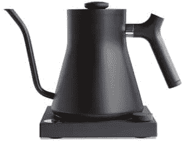****** 

******[**Stagg EKG+蓝牙连接电动倒水壶**](https://www.amazon.com/dp/B07DP911QL/makithecompsi-20)(199 美元)——对于总是试图让*完美倒水的咖啡爱好者*，或者像工作一样注射抹茶的茶爱好者，这款高功率水壶可以加热到任何认真对待热饮的人的准确温度*。*******

 ******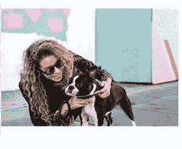****** 

******[**Bose 镜架——带开耳耳机的音频太阳镜**](https://www.amazon.com/dp/B07PC7JKSB/makithecompsi-20)($ 199)——这些就是酷。这是毫无疑问的。时尚的太阳镜，扬声器被设计成在你的耳朵上方安静地播放，所以你周围的人不会听你的音乐和谈话-但你可以清楚地听到他们。******

 ******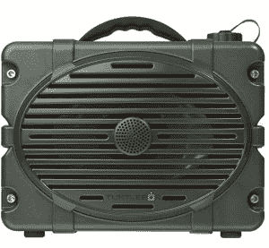****** 

******[**龟箱:响！户外坚固的蓝牙音箱**](https://www.amazon.com/dp/B07L6RH4SW/makithecompsi-20)(349 美元)——让我猜猜。这些天来，你和你的程序员花了更多的时间在户外。但是用智能手机播放音乐来为你的新鲜空气探险做背景音乐已经不再管用了。这款扬声器*专为户外环境*打造——无论天气和环境如何。******

 ************ 

******[**MoonRun 便携式有氧训练器**](https://www.amazon.com/dp/B07ZVNK86R/makithecompsi-20)(249 美元)——你生活中的程序员是铁杆健身迷吗？不要相信程序员都是不协调的极客的神话，有的是很运动的极客！他们想念跑步，尤其是健身房。这种设置可以帮助他们找回一些，没有一个完整的健身房空间。******

## ******豪华礼品(350 美元以上)******

* * *

 ******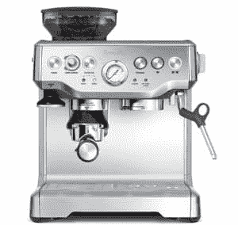****** 

******[**Breville bes 870 XL Barista Express Espresso Machine**](https://www.amazon.com/dp/B00CH9QWOU/makithecompsi-20)($ 699.95)——知道有人目前正在吮吸咖啡过滤器，以获得灵魂中那种甜美的深咖啡味道吗？(呃，我的意思是...我不知道谁会这么做...)这种顶级的浓缩咖啡机将填补他们心中咖啡馆大小的空洞，甚至可能为他们节省一些每天 4 美元的拿铁预算支出。******

 ************ 

******[**Meural Canvas II——智能艺术画框**](https://www.amazon.com/dp/B07S6ZFLSN/makithecompsi-20)(699.95 美元)——艺术的一个难题是，你只能买这么多来挂在你的墙上。尤其是如果你不想你的房子看起来像一个博物馆展览。但有了这个出色的数码相框，你可以下载 30，000 多幅高质量的艺术作品。在接下来的 80 年左右的时间里，每天都可能是你客厅里的一幅新画！******

## ******现在你知道了！******

******我们 2020 年送给程序员的最佳礼物。******

******(或者，如果你是一个想给出提示的程序员，你可以把这篇文章发给你生活中的人。嘘，我们不会告诉任何人你的诡计！)******

******如果这里没有你感兴趣的东西，请浏览一下我们近年来的一些旧礼物指南: [2019](https://simpleprogrammer.com/2019-programmer-holiday-gift-guide/) 、 [2018](https://simpleprogrammer.com/2018-gift-guide-for-programmers/) 、 [2016](https://simpleprogrammer.com/the-software-developer-and-other-tech-geeks-christmas-gift-list/) 、 [2015](https://simpleprogrammer.com/software-developer-gifts-and-other-tech-geek-gifts-2015/) 、 [2014](https://simpleprogrammer.com/top-developer-gifts-tech-geek-gifts/) 。******

******希望你能找到一份完美的礼物，向你生命中的程序员展示他们对你有多重要！******