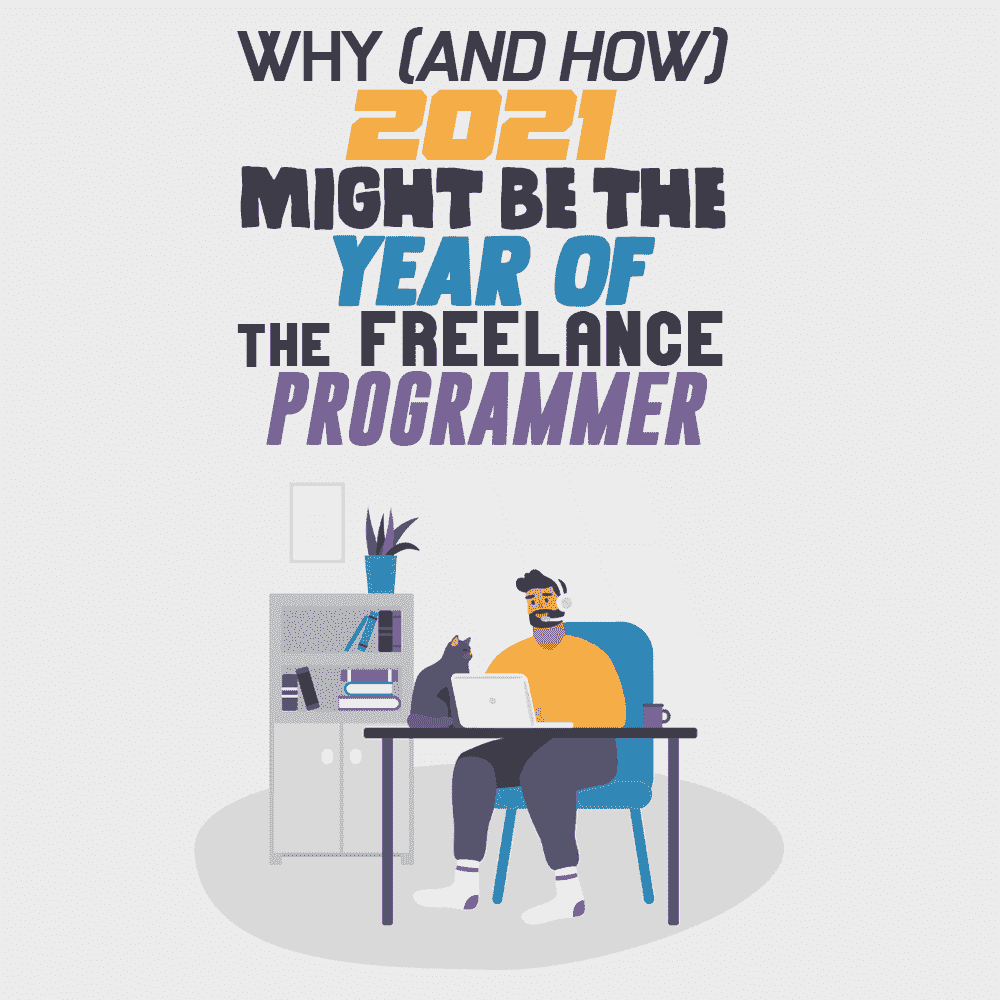
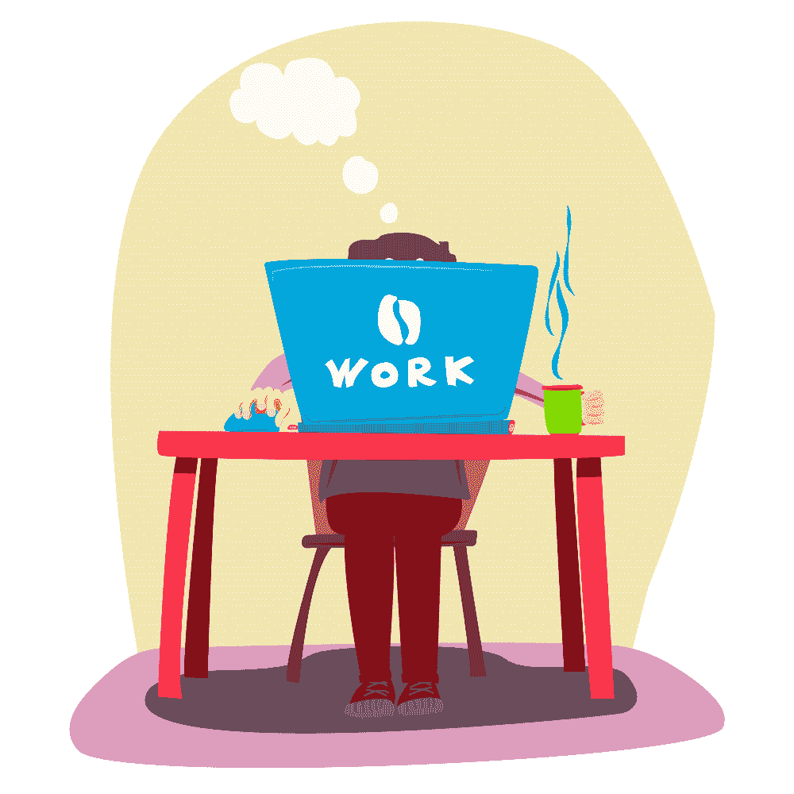

# 为什么(以及如何)2021 年可能是自由程序员之年

> 原文:[https://simple programmer . com/2021-freelance-programmer-business/](https://simpleprogrammer.com/2021-freelance-programmer-business/)

When personal computers first hit the market in the 1970s, a whole generation of technophiles got their first taste of computer programming. They’d wait for monthly deliveries of their favorite computing magazines with names like Byte, 80 Micro, and Compute!, anxious to try the latest type-in program or read about ongoing programming projects looking for inspiration.

那种环境最终催生了像微软这样的大型软件公司，它是在新墨西哥州阿尔伯克基的一个车库里诞生的。他们并不孤单。在接下来的几年里，苹果、谷歌和脸书等家喻户晓的公司都是以类似的方式起家的。

但是今天，许多崭露头角的程序员把他们的时间花在为那些大公司工作上。更多的人在没有人听说过的公司的普通办公室里辛苦工作，从事雇主交给他们的任何项目。

对许多人来说，工作生活就像 1999 年的经典电影《办公室空间》 中的场景——充斥着乏味的 TPS 报告，令人讨厌的乐观的同事，以及分不清操作数和运算符之间区别的老板。

对于这样的程序员来说，由疫情冠状病毒引起的在家工作的突然转变可能是他们在办公室工作周的一个受欢迎的喘息。令人惊讶的是，公司开始意识到让员工在家工作并没有太大的坏处。在大多数情况下，这甚至为他们节省了一些钱。

这一新的现实引出了一个问题:厌倦办公室的程序员是否应该回到疫情之前的状态？现在有如此多的企业接受在家工作的概念，对程序员来说还有更好的选择吗？

对于前者，答案无疑是否定的，而对于后者，答案是肯定的。

事实上，2021 年将成为自由程序员的一年。这是对那些热爱编程的人们可以按照自己的方式谋生的日子的回归，与早期的计算不同，他们不需要成立一个软件公司来做这件事。他们只需要做出一个决定，他们将尽一切努力来确保稳定的工作流。

让我们来看看为什么自由编程将会复兴，以及如何利用这一趋势脱离朝九晚五的人群。

## 态度的转变和机会的增加

多年来，企业一直拒绝让员工远程工作，即使他们有支持他们的基础设施。对一些人来说，这是经理们不愿意停止监视员工的问题。对于其他人来说，这是一种感知到的生产力损失，他们认为这是由于在家工作的人偷懒造成的。

疫情是弹性工作制的一次大规模实验。你猜怎么着？事实证明，企业做出的大多数假设都是错误的。

一个接一个，大公司开始报告他们没有失去生产力，并且在许多情况下，远程工作带来了生产力的提高。经理们很快开始意识到，他们所有的签到、站立和全体会议除了让员工沮丧和浪费他们的时间之外，没什么作用。

因此，越来越多的企业正计划将在家工作永久化。这还不是全部。甚至有证据表明，在家工作项目的成功打开了招聘经理对自由职业者的眼界。

特别是，令人震惊的是，73%的人现在计划在疫情成为历史后继续或增加对自由职业者的使用。换句话说，远程工作已经失去了它的名声，自由职业者将会大受欢迎。

显然，这对程序员来说是个好消息，但还有更多:Upwork 最近的一项调查显示，20 大最受欢迎的自由职业技能中有 12 项都与软件开发有关。如果你想知道那是什么声音，那是你的银行账户放松皮带的声音，期待着所有的付费演出。

## 如何成为自由职业者(不发疯)

Of course, it’s one thing to say that opportunities for freelance programmers are plentiful. But it’s quite another for you to turn that opportunity into steady work. And doing that will take a bit of effort. That’s because being a freelance worker is not all that different from [starting your own home-based business](https://www.tafecourses.com.au/resources/home-business-ideas/). And since you’re going to be the only employee, you’re going to have to wear a few hats.

你将不得不做现在其他朝九晚五的员工为你做的所有工作。比如寻找客户，和他们一起制定项目价格。或者管理你的工作时间表，这样你就不会落后并最终损害你的声誉。你将不得不在没有任何人在你身边的情况下完成所有的事情。这并不像一些自由职业者看起来那么简单。

但是在你一头扎进自由职业者的游泳池之前——只是意识到你还不知道如何游泳——这里有一个概述，告诉你如何过渡到自由职业者的工作中，而不会精疲力竭或发疯。

## 从建立你的个人品牌开始

如果你打算以自由程序员为生，你需要确保你的名声永远在你之前。这会让你更容易以值得你花时间的速度获得稳定的工作。这意味着你需要[建立你的个人品牌](https://simpleprogrammer.com/online-personal-branding/),然后你才会放弃你的有薪工作，去过自由职业的生活。然而，这样做需要大量的工作。

幸运的是，在 Medium 上的 Coder Academy 上有一个很好的纲要，列出了你可以用来建立自己品牌的所有事情[。很有可能你已经活跃在许多它推荐经常去的地方了。你所要做的就是把你的在线足迹整合成一个单一的连贯的表格，擦亮你的证书，并开始让人们知道你可以被雇佣。](https://medium.com/@coderacademy/how-to-build-your-personal-brand-as-a-developer-877d7bdf9bdd)

## 学习数字营销的基础知识

在很大程度上，程序员想要编码。他们每一分钟不花在做这件事上，都感觉是在浪费时间。但是如果你想成为一名成功的自由职业者，你必须花大量的时间向潜在客户推销你自己和你的作品。这意味着如果你想生存，你需要学习数字营销的基础知识。

最重要的是 SEO、内容营销和社交媒体管理等概念。这些是将你的个人品牌转化为成熟的营销努力的主要工具。但不要试图在其中任何一门课程上获得硕士学位；只要学习相关的概念，以及如何将它们应用到你的自由职业生涯中。

当你赢得客户时，你不必在营销上咄咄逼人，应该开始建立一个客户网络，为你创造稳定的工作流。一旦发生这种情况，你将能够留出一个真正的营销预算，并支付一些你自己的自由职业者来处理你正在进行的营销。

## 设定适合你的价格

新的自由职业者遇到的一个常见问题是学习如何为他们的工作确定费率。你将面临的问题是低估你的产出的自然趋势，担心用过高的价格吓跑客户。但事实是，如果你不重视自己的工作，别人也不会重视。

事实是，你的基本利率是你需要赚多少钱来取代你以前的工资和保持你的账单支付的函数。适当的时薪必须考虑到你在项目之间所做的所有无薪工作时间。换句话说，你需要一个每周工作不超过 20 小时的速度。

这可能会导致你觉得过高的利率。但你必须记住，雇佣你的公司通过雇佣自由职业者在基础设施、福利和责任等方面节省了一大笔钱。另外，你值这些钱，对吧？

## 了解如何与客户打交道

一旦你成为自由职业者，你会马上开始学习一件事。那就是潜在客户会试图让你尽可能快、尽可能便宜地工作。但是如果你知道如何处理客户，你会得到合理的工资和做好工作所需的时间。我建议你去看看丹尼·霍尔姆斯的《六位数自由职业者:获得第一个高薪客户的最佳商业指南 》。

它载有如何与客户谈判的技巧。它会教你如何在你同意为他们工作之前发现噩梦般的客户，如何写建议书来证明你的成本估计，甚至一些策略来协商聘用协议，以确保你自己的稳定收入。作为一名自由职业者，掌握这些技能是你要学习的最重要的事情之一，所以你最好一开始就把它说出来。

## 为长期做准备

You can earn a great living as a freelance programmer. But if it was easy, nobody would bother taking a staff position in the first place. And while the previous four steps will get you on the path to steady freelance work, that’s only half of the battle. You’re also going to have to learn how to plan for your future and do all of the little things you used to call HR to take care of.

对于这一点，你不会找到比《自由职业者的圣经》更好的资源了:萨拉·霍洛维茨的《根据你的条件从事你梦想的职业所需要知道的一切》 。她是自由职业者联盟的创始人(顺便说一句，你应该加入这个),这本书包含了标题所暗示的内容。

它会教你关于自由职业的一切，从如何让你的税收保持正常，到让拒不合作的顾客付钱给你，以及介于两者之间的一切。如果你最终成为自由职业者，你会发现自己每周至少查看一次，如果不是更多的话，以获得启发性的建议。

## 劳动力的未来

还有一个原因让你今年应该考虑做自由职业者。这条趋势线表明，到 2027 年，美国大多数劳动力将成为自由职业者。这意味着未来几年你将面临更多的竞争。在此之前，让自己站稳脚跟，建立一个可靠稳定的客户群是确保你未来的一个好方法。

尽管 2020 年的教训在企业及其招聘经理的脑海中仍然记忆犹新，但你已经获得了一个千载难逢的机会。熨斗是热的。如果你准备好离开你的小隔间，拿起你的红色订书机，规划你自由职业的成功之路，这是最好的时机。