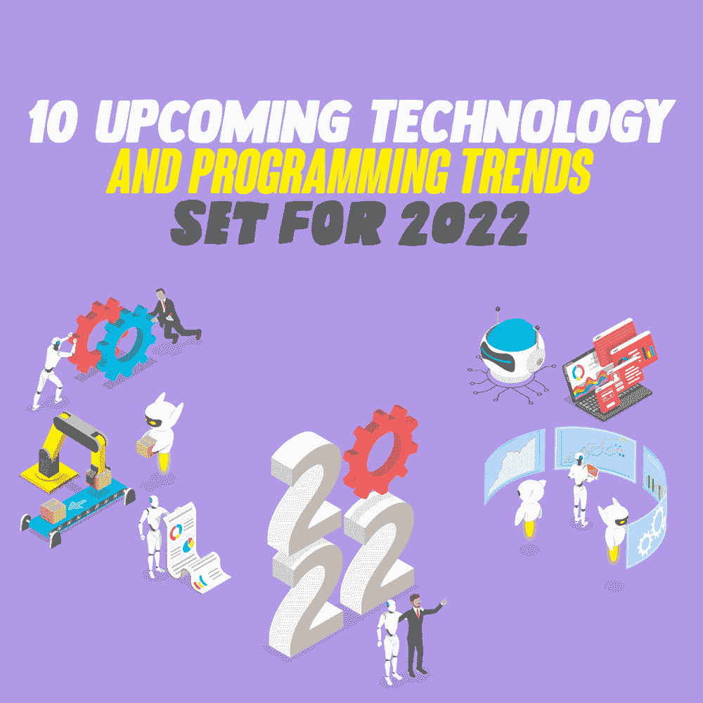

# 为 2022 年设定的 10 个即将到来的技术和编程趋势

> 原文:[https://simple programmer . com/2022-技术-编程-趋势/](https://simpleprogrammer.com/2022-technology-programming-trends/)

The world, undoubtedly, relates a lot to technology and there is likely no business or organization that is not striving hard to keep pace with the fast-moving technological trends. As the year 2022 approaches, it is interesting to observe the upcoming programming and technology trends that are set to drive innovation and modernization.

疫情为数字化火上浇油。长期以来，技术一直是任何组织不可或缺的组成部分。但是，在艰难时期，甚至在那之后，全球似乎已经意识到将技术进步嵌入日常业务运营的潜力和价值。由于对远程工作和移动操作的需求不断增加，各行各业，无论是小型、中型还是大型企业，都在大力实施不同的高科技趋势。

持续增长的数据量、对可持续性的需求和快速增长的计算速度是数字革命的重要驱动力。正在观察新的趋势，现有趋势继续向前发展。从盈利能力、性能加速和创收方面来看，所看到的趋势是最有利可图和最具竞争力的。

让我们来看看 2022 年将会出现的关键技术和编程趋势。

## 【2022 年编程和技术进步的主要趋势

### 1.人工智能辅助领域拓宽了他们的工作范围

人工智能(AI)是一个现代概念，它已经以各种方式在几乎所有的行业领域展开了翅膀。人工智能带来了流程的有效自动化、效率的提高和生产率的提高。除此之外，来年还将在以下不同领域有所发展:

*   **医疗保健和健康:*** *基于人工智能的可穿戴设备将有助于分析患者历史，并提供灵活的治疗模式
*   低代码开发:人工智能驱动的低代码平台将有助于节省编写大量代码片段的时间
*   **对车辆的支持:**由于基于人工智能的支持，无人驾驶车辆将会越来越多
*   **先进的软件开发:**人工智能辅助的软件开发和应用程序创建将提高开发速度，[将彻底改变开发者体验](https://simpleprogrammer.com/ai-and-ml-revolutionizing-developers/)
*   情感人工智能:情感人工智能计算将有助于通过深度学习将情感应用于软件程序

### 2.区块链技术将被更多地使用

区块链已经成为一种流行的技术，在防止数据泄露和网络攻击方面非常有效。它创建的链式设计和数据模式，因为它以块的形式存储数据，已经成为它在大型企业集团中成功的关键。随着新的一年的到来，这项技术的实施将扩展到更多的行业领域。医疗保健领域、银行和金融、教育和电子学习以及许多其他领域都将利用区块链的潜力。

将会有复杂的算法来保证数据访问的准确性和安全性。由于区块链，网络威胁几乎不可能发生。在区块链，权力下放指的是将控制权从一个集中的单位转移到一个分散的网络。这种去中心化逻辑的实现将变得至关重要，因为数据将存储在不同的地方，不允许通过恶意攻击轻易访问。对于 2022 年，区块链趋势像 ERC 代币、以太坊、NFTs、区块链即服务、Stablecoins、去中心化金融等正在新闻报道中出现。

### 3.5G 网络增加范围界限

5G 是下一代蜂窝技术，提供卓越的连接速度，未来还会有更多。到 2024 年，5G 网络将覆盖全球 40%的地区，处理 25%的移动流量数据。这意味着 5G 将通过加强大数据分析、催化人工智能浪潮、实施网络切片、提供更好的容量和覆盖范围来帮助组织。通过 5G 进行的数据传输快速、有效、可靠，这都归功于其高频传输无线电波。未来一年，5G 将对主要行业产生重大影响，因为它将直接影响速度、性能和数据传输活动。

自动驾驶汽车将与互联网有效连接，实现虚拟现实和物联网。通过 5G 的高速数据传输将通过毫米波、大规模 MIMO、全双工、微蜂窝等有效功能在相同波长上接收和传输数据。

### 4.低代码开发将成为新的编码偏好

Low code development or No code development is the new way to smart coding. This trending development approach has visual interfaces, simple logic, and drag and drop features as its key USP, making it one of the most sought-after programming techniques for the coming year. The process has been instrumental in lessening the need for specialized technical skills, thereby, fastening the software development technique.

2022 年将见证越来越多的用户使用[低代码开发](https://simpleprogrammer.com/low-code-development-traditional-coding/)，因为它创建应用程序的速度几乎是传统方式的两倍。将会有更多的企业级应用程序利用这种编程方式，通过成本优化来创建更大的应用程序。因此，组织会发现将这些工具与他们的业务技术集成起来很容易。随着编码世界走向一场几乎没有代码的革命，将会有越来越多的最新技术与商业活动的结合，而对熟练资源或编程逻辑的需求将会减少。

### 5.网络安全将变得更加智能和突出

网络安全对于保护应用和网络免受网络攻击和勒索软件攻击至关重要。迄今为止，一直有防火墙等传统方法试图提供安全性，但随着技术的进步，需要制定严格的网络安全政策。这就是新年带给我们所有人的。

有效的网络安全应用程序将在保护系统免受[重大网络安全威胁](https://simpleprogrammer.com/top-cybersecurity-threats-to-watch-in-2021/)方面发挥重要作用，例如网络钓鱼攻击、基于云的数据泄露、物联网设备的安全威胁、deepfakes、恶意广告等。更智能的技术、有效的算法、网络安全网、从一开始就实施安全测试是未来一年的几个关键亮点。

### 6.未来一年，云支出将会更多

当前的形势迫使云服务的使用越来越多。在家工作制度迫使组织让他们的系统从云中工作，以确保业务连续性、灵活性、增强的协作、性能和自动软件集成[到 2022 年，全球最终用户在公共云服务上的支出预计将超过 4800 亿美元](https://www.gartner.com/en/newsroom/press-releases/2021-08-02-gartner-says-four-trends-are-shaping-the-future-of-public-cloud)。未来一年，云系统和云计算方面的支出将会增加。

尽管在技术上的总支出可能不会增加太多，但组织开始将基于云的基础设施用于其数据的方式将会急剧增加。2022 年，随着 SaaS、IaaS 和 PaaS 解决方案的实施，公司将见证一次激增，以有效实施项目和管理团队。组织期望通过使用云驱动的开发和服务来提高灵活性和生产力。

### 7.微服务和容器管理正在扩张

容器管理——自动化容器和微服务的创建、部署和扩展的过程——将应用程序安排为松散耦合服务的集合，是软件开发的最新趋势，2022 年将会看到这种趋势的使用增加。通过实施这些技术，组织可以期待全天候的安全性、可伸缩性和可访问性。全球市场预计将大幅增长，亚马逊、优步、易贝、网飞、SoundCloud 等大型企业集团将从这些新趋势中获益。

预计几乎所有的应用都将拥有微服务来增强设计、调试、更新和利用代码。微服务将继续帮助组织减少停机时间，充分利用资源，降低基础设施相关成本。

作为用于部署的有效打包的一部分，容器也将有很大的需求，特别是对于企业，因为它具有灵活性、创新性和可移植性。大多数组织将在生产基础设施中使用最好的容器管理来执行容器化应用程序。

### 8.机器人过程自动化将越来越多地自动化日常任务等

顾名思义，机器人流程自动化(RPA)通过机器和算法自动化重复活动，一直在积累高端效率数据。 [Gartner 表示，2021 年全球机器人流程自动化软件收入将达到近 20 亿美元](https://www.gartner.com/en/newsroom/press-releases/2020-09-21-gartner-says-worldwide-robotic-process-automation-software-revenue-to-reach-nearly-2-billion-in-2021)。事实证明，它有利于加快人类的工作速度，将他们从许多平凡的过程中解脱出来。

随着世界了解 RPA 的价值，越来越多的组织开始采用这种技术。在未来的一年，技术世界将见证机器人、自动化流程、自主机器人、移动机器人等的使用。通过人工智能驱动的智能连接到软件程序。人工智能和机器学习技术将更多地用于与 RPA 联系起来。

### 9.渐进式网络应用是未来的趋势

渐进式网络应用(PWA)一直在提供两个世界的最佳选择——本地应用和网站可用性。PWA 非常适合离线操作，提供出色的用户体验，发送推送通知，以及利用 GPS、相机等。轻松地。由于 PWA 是轻量级的并且易于管理，越来越多的用户选择它作为他们的首选。

在接下来的一年里，组织应该选择 PWA，而不是选择原生应用程序开发。就成本而言，PWA 易于维护，这也是为什么越来越多的初创公司选择它的原因。像 Forbes、Wego、Treebo、Zee5、Twitter Lite 这样的组织正在成功地利用 PWA 并减少它们的页面加载时间。这只是列表的开始。今年将会有更多的组织实施 PWA。

### 10.拥有物联网和物联网的智能家居和行业正在流行

As technology gets smarter, so will our personal and professional spaces. Implementation of Internet of Things (IoT)/Industrial IoT (IIoT) has led to a revolution in the way physical objects connect digitally and offer us a technically elevated lifestyle. IoT talks about connecting physical objects over the network through sensors, software etc. and IIoT refers to connecting instruments, devices etc. with the industrial applications. It is almost impossible to believe the power of this technology, but it is true.

IIoT 将帮助公司促进制造过程中使用的设备、机器、传感器的有效集成，收集数据，并对其进行分析以作出进一步决策。像 Augury、Axzon、ThetaRay、Cartasite 和许多其他公司都享受着物联网和 IIoT 的好处，2022 年肯定会有更多公司加入。

## **观察 2022 年的技术趋势将会非常有趣**

技术是主宰，上述趋势证明了技术先进的一年即将到来。疫情充当了加速推动数字化车轮的催化剂。

2022 年的这些技术和编程趋势将成为几乎所有企业的游戏规则改变者——无论是初创公司、中型行业还是企业。它们将提升客户体验、生产力、盈利能力和收入最大化。肯定是没有回头路了！