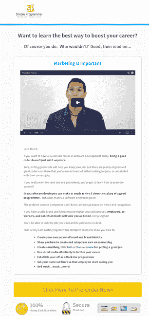
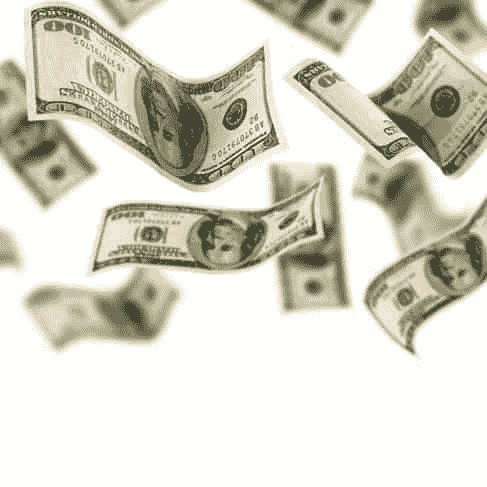
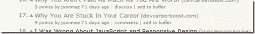
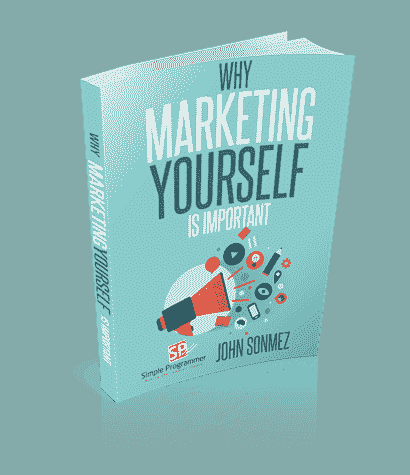
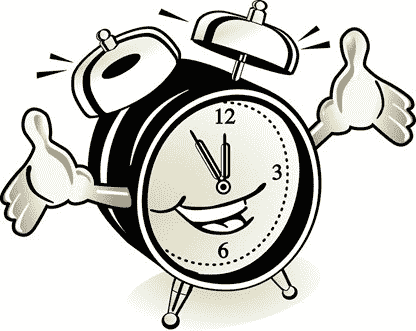
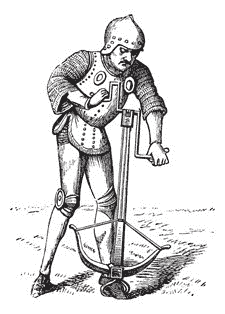
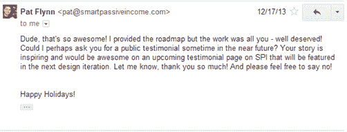
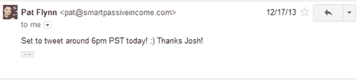

# 最疯狂的企业家挑战:3 个开发者能在 24 小时内每人赚 100 美元吗？(第 2 页，共 3 页)

> 原文：<https://simpleprogrammer.com/24-hour-100-challenge-part-2-begins/>

这是一系列三篇博文中的第二篇，这些博文将从我们各自的角度详细介绍我和我的策划小组的两位成员发起的 24 小时 100 美元挑战。

*   在第一篇帖子、[乔希·厄尔](http://joshuaearl.com/)、[吴镇男·贝利](http://lostechies.com/derickbailey/)和我谈论了我们在比赛前的想法、我们的感受和心理准备，以及我们计划要做的事情。
*   在这篇文章中，我们每个人都会谈论 2013 年 12 月 17 日午夜钟声敲响时到底发生了什么。以及我们如何熬过 24 小时的考验。
*   最后，在最后一篇文章的[中，你将听到比赛的最终结果，我们每个人都在讨论我们的结果，分析我们认为我们做对了什么，我们做错了什么，以及我们如何以不同的方式做事情。](http://wp.me/p3pzCs-2Nn)

## 我的故事

### 开始了！

比赛的前一天晚上，我 7 点整就上床睡觉了。我已经决定不晚于凌晨 4:00 醒来，但不会尝试在 12:00 准时醒来。我的想法是，如果我试图在凌晨 12 点起床，但仍然很累，我的效率会更低，完成的工作也会更少。我想要尽可能多的睡眠，但还是不能浪费时间。我真的只需要在其他开发者起床去工作之前建立我的登陆页面——至少在美国是这样。

我在凌晨 2:00 醒来，但是我立刻觉得我不想在这个项目上工作 24 小时。当我从卧室走向办公室时，我开始严重怀疑自己是否真的能完成这件事——这将是漫长的 24 小时。

我决定我应该做的第一件事就是详细计划我的一天。我打开了 Trello，创建了一个名为“一天 100 美元”的新板块。我开始在“待办事项”栏制作卡片。我想出的第一张卡片是“挑选并注册一个域名”我需要一些域名来启动我的新网站，因为我不能使用我现有的博客。之后我加了一张“在域名上设置登陆页面”的卡片。我想我可以[在数字海洋](https://www.digitalocean.com/?refcode=e701a0a76767)建立一个虚拟私人服务器，然后在上面安装一个 WordPress。然后，来了一张卡片，上面写着“计划好包裹里会放些什么”我需要决定我到底要卖什么。之后，是“计划定价策略”接下来是“为预订计划赠品”和“让购买套餐成为可能”最后是“拿出实际的广告计划”

### 设置登录页面

我开始寻找一个过期的谷歌页面排名高的域名，因为我认为这可能有助于我提高网站在搜索引擎中的流量，但我很快意识到我必须对域名进行投标，这个过程可能需要几天时间。然后，我想起来我已经有了一个名为 ["devcareerboost.com"](http://devcareerboost.com) 的域名，我打算用它作为我未来课程的注册页面，所以我也可以用它作为预订的登录页面。

我很快在数字海洋的虚拟私人服务器上安装了一个新的 WordPress，我已经准备好创建我的登陆页面了。唯一的问题是，我实际上不知道如何创建一个登录页面，我不能花一整天的时间来解决它。我需要的是一个已经存在的经过验证的登录页面格式，我可以只填写文本。我记得听说过 Leadpages，并决定尝试一下。我注册了一个帐户，几分钟后，我看到了提供给我的登录页面模板。我选择了一个允许我在页面顶部放一个视频的，看起来很适合销售预购。

我的下一个问题是我不是文字编辑。我真的不知道如何为登陆页面写好营销文案。我过去写过很多博客，但是写营销文案是完全不同的事情。我决定我的最佳行动方案是尝试修改登录页面模板上的现有副本，以符合我的目的。我还在网上搜索了一些与我的类似的长表格销售页面。我试着模仿我的例子，让我的看起来至少和他们的有些相似。我曾短暂地考虑过雇人帮我做这一部分，但我意识到，如果我那样做的话，我不仅会在金钱上陷入困境，而且我可能还得等上至少半天才能拿到真正的副本。我试着让自己听起来不像一个俗气的推销员，但我很确定它仍然很俗气。哦，好吧，至少我有一些有用的东西。我可以随时修改它。

我开始觉得我可能会成功，但我仍然对是否有人真的会带着我刚刚写好的劣质文案点击购买按钮持保留意见。

### 产品定价

接下来，我必须弄清楚到底要把什么放进包装里。我想我会试着把价格定在 75 美元左右，这样我只需要卖出两笔就可以实现我的目标。但是，我能生产出价值 75 美元的产品吗——预售期不到 3 个月。我决定看看其他类似的包，了解一下人们都包括哪些内容，以及他们对这些内容的收费是多少。我知道我将不得不在价格上打一点折扣，因为我正在预订，我的登陆页面并没有完全“优化”我决定去看看内森·巴里的网站，因为他推出了[《应用程序设计手册》](http://nathanbarry.com/app-design-handbook/)作为一个软件包，他的受众和我的相似。我想，如果我能提供至少和内森成功销售的包一样多的内容，那么我肯定可以要价 75 美元——至少在预订期间，我可以随时提高价格。

原来，Nathan 有一个完整的包，其中包括他的旗舰应用程序设计手册，9 个视频教程，9 个视频采访和 5 个附加资源，价格为 249 美元。我决定尝试通过一本旗舰书籍来匹配这些内容，[“为什么营销自己很重要”，](https://leanpub.com/whymarketingyourselfisimportant)并包括几个完整的视频课程，一些较小的电子书和一些视频采访。我宁愿包含太多的内容，也不愿内容不够。(*)我真的没有想过在 3 个月内尝试生产所有这些东西会花多少钱。*)

这时大概是早上 5 点左右，但是我有了一个好的开始。我在登录页面上填写了关于套餐的详细信息，并输入了价格信息。现在，我只需要一种方法来实际接收付款并交付产品。我已经决定我可能会用 Gumroad 来做这件事，因为他们提供了一个非常简单的在线销售产品的方法。有了 Gumroad，我基本上只需在我的页面上放置一个链接，将顾客带到一个结账页面，其他一切都为我处理好了。我确实需要一些东西发送给任何购买的人，所以我很快创建了一个 Word 文档，简单地说“这是您将在 24 小时内收到的电子书的占位符。感谢您的购买！”*(当你只有 24 小时的时候，你会做一些相当疯狂的事情。)*

### 是时候开始营销了

我终于准备好开始认真思考营销了。现在我有了一个可以购买的产品，我需要向尽可能多的潜在客户宣传。我决定首先用最少的努力做最有潜力的项目。我的计划是写一篇史诗般的博文，详述我的目标受众所面临的问题。我认为很大一部分开发人员可能面临着我在职业生涯中遇到过的同样的问题——玻璃天花板，在这里他们无法真正升得更高或赚更多的钱。我写了一篇名为[“为什么你被困在你的职业生涯中”](http://devcareerboost.com/why-you-are-stuck-in-your-career/)的博客，我谈到了你必须如何能够脱离群体，才能越过玻璃天花板。我谈到了著名的厨师和摇滚明星是多么有才华，但他们并不比其他数百名相对不知名的人更有才华。我特别指出了顶级厨师和顶级音乐家能够比同等技能但不知名的同行赚更多钱的原因——他们为自己赢得了声誉。然后，我向读者介绍了我对这个问题的解决方案——我的课程是关于如何作为一名软件开发人员推销自己。我想，如果我能在那篇博客文章上获得关注，那么我就能在我的登陆页面上吸引足够多的读者，至少能做成几笔生意。**这将是我的主要营销策略——我需要这个东西像病毒一样传播开来。**

我决定最好的方法是从给尽可能多的有影响力的开发者发电子邮件开始，向他们解释比赛和我的博客帖子，并请他们帮我把帖子发布给他们的粉丝，并在他们的网络上分享。我很乐意问这个问题，因为我已经创建了一个高质量的帖子，为所有阅读它的人提供了真正的价值。我不只是要求他们发布我的登录页面，这相当于只是要求施舍。结果证明这非常成功，我立即收到了一些愿意帮助我的著名开发者的回复。

既然我已经看到了这篇文章，我想这篇文章很有可能会在黑客新闻上大放异彩，所以我把它提交到那里，在谷歌分析中打开我的实时跟踪，然后等待。没过多久，同时观看的人数就从 2 人增加到了 30 人——这个帖子越来越受欢迎。我查看了一下，发现它已经被投票支持了几次，所以即使它失败了，我至少应该得到一些不错的流量。但是，流量是一回事，购买我的 75 美元套餐是另一回事。真的会有人点击“购买”吗

### 我的第一次销售

我的回答来得相当快。**几分钟后，我就有了第一笔交易。**我不得不再次检查以确保我是正确的。但是，确实有人买了我的产品。几分钟后，另一笔交易开始了——我已经达到了目标。哇哦。我没想到会这么快成功。

是时候关闭 Google Analytics 了，想想我能走多远。我能在一天内突破 500 美元吗？$1000?我不确定，但我决心找到答案。

我的下一个想法是开始访问流行的开发者论坛并发布关于该产品的信息。可惜我并不是真的了解很多开发者论坛。我试着用谷歌搜索了一下，没找到什么。我想也许我可以将我的帖子提交给 Code Project，看看是否有任何吸引力，但是帖子被拒绝了，因为它包含了我产品的广告。我注册了论坛，发布了一些关于我的产品的信息和我的博客文章的链接，但我并没有得到太多的关注，因为我基本上看起来像一个垃圾邮件发送者。**你真的需要在大多数社区建立声誉，然后才能在那里推广你的东西。**当我计划我的战略时，我没有真正考虑过这个问题。

我决定我应该检查一下，看看我是否能得到一个开发者的电子邮件列表，这样我就可以向他们群发关于我的包的消息了。我知道我应该能够购买有针对性的电子邮件列表，但我不确定具体在哪里或如何做到这一点。我想我最好的办法是在 oDesk 上找一个能给 1000 名开发者发邮件的人。我张贴了一份工作请求，并解释了我想要做的事情。然后，我开始了其他活动，因为需要一段时间才能有人回复我。

### 放慢速度

我不知道我还能做什么。那时才 12 点左右，我对市场营销几乎一无所知。除了在脸书或推特上与人直接联系，我想不出其他传播信息的方式。我想到的其他事情都涉及到与个人接触，这种事情不会扩大规模。**我知道我需要大约 100 到 200 个人来点击我的登陆页面，来完成我的每一笔销售。**此时，我已经做了一些销售，并开始估算转化率。

我决定尝试目前为止最有效的方法，然后再写一篇博文，提出一个问题，然后给出一个解决方案。我写了另一篇名为[的博客文章，“为什么你没有得到与你价值相称的报酬。”](http://devcareerboost.com/why-you-arent-paid-as-much-as-you-are-worth/)这一次更多地谈到了大多数软件开发人员是一种商品的想法，以及如何通过营销使自己与众不同，而不仅仅是一种商品。我指出这个问题的解决方案是知道如何推销自己，我还提供了一个链接，链接到我的登录页面，我提出以 75 美元的价格出售解决方案。我觉得帖子写得很好，但有点平淡。它没有从黑客新闻或 Reddit 获得太多的牵引力。*(可能是因为那天早些时候我刚刚写过这个话题。)*

在我放弃并开始写我需要在 24 小时内发货的书之前，我还有最后一个想法——Google+社区。我想我也许能在 Google+上找到软件开发社区，我可以加入并删除一个链接，链接到那天早上我写的第一篇写得不错的博客文章。我加入了大约 30 个社区，并在那里张贴我的帖子。这被证明是一个非常好的主意，因为我确实开始看到来自 Google+的流量——没有黑客新闻产生的那么多，但也是有意义的。

### 写书

我决定此时最好利用我的时间来写这本书，因为如果我在第二天之前没有得到第一稿，我会发出很多退款。我开始像一个疯子一样写作，但当然写这个主题是很容易的，因为我花了一整天的时间思考这个问题，并且已经做了几次关于作为一名软件开发人员推销自己的演讲。我停下来吃晚饭，但接着又继续写作。

晚上我休息了一会儿，查看了一下 oDesk。事实证明，我收到了几个自由职业者的回复，他们可以给我一份名单，然后把邮件发出去，但看起来没有人能满足我的时间要求。无论如何，我对这种方法有点犹豫。我不觉得这和“廉价折扣伟哥”一样，但感觉还是有点垃圾。这不是我通常会采取的方法，但我认为为了竞争，如果我能成功，我也可以试一试。我最终和最有希望的人谈了话，但结果是失败。

我几乎整晚都在疯狂地写我的电子书。大约 10 分钟到午夜，我完成了初稿的最后一章，总字数约为 12000 字。在这本书和两篇博文之间，那天我已经写了大约 15000 字。那天晚上我没有任何入睡困难。*(请注意，这只是这本书的初稿。在接下来的几周里，我花了更多的时间来添加内容和修改草稿。)*

## 吴镇男的故事

挑战的前一天晚上，我没睡好。当然，我晚上 9 点就上床睡觉了——但是当你直到 10:30 才睡觉，而且这种睡眠更像是整夜辗转反侧，那又有什么关系呢？恐惧、焦虑、怀疑都在我脑海中闪过。我最终还是睡着了，但是我半夜醒来开始的计划看起来已经是个坏主意了。

### 今天的任务

当闹钟终于把我叫醒时，已经是凌晨 4 点了，而不是午夜:这是一天中的第一次失败。我晚了四个小时才开始。但我爬下床，拿了些食物，坐在我的办公桌前开始滚动。今天早上我有两件事要做:

1.  建网站恬不知耻地要钱
2.  写电子书  

此时此地，我失败了#2:我离开了网站，无耻地要钱。我就是无法让自己去做。当我准备点击一个域名的购买按钮时，我的胃在不停地扭动。害怕被人叫出来，被人说我是个骗子和营销高手。再加上只睡了几个小时，我放弃了第一件能让我赚钱的事情。我当然向自己证明了这一点。我告诉自己，这是可以保释，因为醒来晚了 4 个小时。这种事情很容易被证明是正当的。总是有借口的。不容易的是承认你因为恐惧和自我厌恶而放弃——但这正是我所做的。我后悔没有这样做，没有尝试和看看它可能会带来什么。

### 开始阅读电子书

我把那个网站推到一边，开始写我的播客电子书。我已经在用 LeanPub.com 做电子书了，所以对我来说再做一个很简单。我创建了一个项目的空壳，给这本书起了个名字，等待我的 dropbox 文件夹更新，然后开始制作这本书，首先是设计封面。拥有封面对我来说很重要，因为 Leanpub 会在你的页面上显示图书封面，在你生成电子书的第一个预览之后。当有人访问你的 leanpub 页面时，一个好的封面可以创造或破坏第一印象。我过去处理过糟糕的封面，所以这次我想确保我有一个经得起第一印象的封面。

几周前，我在 depositphotos.com 买了一堆信用贷款，现在有回报了。几个快速搜索之后，我有了一个很棒的图书封面图片，不需要太多的添加。总之，我想我花了一个小时才把封面拼好。再加上设置 Leanpub 的 30 分钟和整理一个非常粗略的章节大纲的 30 分钟，我在几个小时内就完成了我的第一个电子书预览。随着预览的生成，以及 Leanpub 页面上显示的图书封面，我设置了一个 10 美元的建议价格，并开始阅读真正的内容。

### 制作内容

接下来的几个小时是制作内容的混合，结合梳理沉积照片以获得完美的图像来说明我在说什么。这是一次咖啡因驱动的快乐之旅，多么令人兴奋的咖啡因啊！此时，我已经戒了将近一个月的咖啡因了。所以我早上 7 点左右喝的一罐 12 盎司的健怡激浪让我兴奋不已，真的帮我度过了漫长的一天。那天早上，我为这本书一共写了 4 章，在这些章节中添加了一些图片，并通过 leanpub 多次预览了电子书。

然而，在上午进行到一半的时候，我不得不退后一步，重新制定名称和章节大纲。我意识到我的书在记录和编辑方面走得太远了，但没有涵盖足够多的规划或出版方面的内容。我花了大约一个小时重做 leanpub 的设置和书的封面。这是我应该花在内容上的一个小时，但这是必要的工作，这样这本书才会更有意义。最后，我很高兴我做出了改变。

到中午 12 点左右，我已经有了 4 个章节和一本书，至少可以让人们录制第一集播客。我被告知停止写作，开始从事营销方面的工作。

### 营销努力

当我第一次点击出版这本书的时候，所有的恐惧，所有的焦虑…所有我讨厌这个挑战的事情又回来了。现在，突然之间，我没有一个具体的东西可以建造——一些可以让我从我害怕的工作中分心的东西。现在我不得不面对我的恐惧和焦虑，并试图真正卖掉这个东西？我该在这里做什么？我该怎么卖这个？好吧。我以前在我的截屏上也这样做过。我通过推特和博客吸引了一批观众，让他们相信我的东西值点钱。所以我从这里开始。我会写关于这本书的博客。我将在[http://blog.signalleaf.com/how-to-podcast](http://blog.signalleaf.com/how-to-podcast)建立一个网页，我将用它作为登陆页面和营销文案。博客文章将紧随其后，并将是公告/介绍风格，而登陆页面本身将是真正的营销文案。

我花了近一个小时来建立登陆页面，将图书图片添加到博客的侧边栏，在网站顶部添加菜单链接，并为页面创建绿色的“立即购买”按钮。我想光是那个按钮就花了 20 分钟。我费了好大劲才让它看起来和表现出我想要的样子。但是最后，我有了这个页面，我有了一个博客来宣布这本书。现在我如何在人们面前得到它？

我求助于推特，我的老朋友。我以前做过，为什么不再做一次呢？只是这一次，我无法使用我的@derickbailey 帐户。我只能使用我的@signalleaf 帐户。接下来的几个小时，我在推特上搜索，寻找那些询问如何开始播客的人。事实上，每天都有那么多人在问这个问题，这很令人惊讶！我不缺可以回复的推文。然而，我缺少的是勇气。我的胃又开始转圈了。所以我做了任何其他营销 n00b 会做的事情:我去买午餐，而不是做营销。我得吃饭，对吧？让我们做那件事，而不是做艰苦的工作。

### 销售渠道

当我吃完午饭回来时，我再也没有借口了。我不得不在 twitter 上回复人们，并开始吸引他们。所以我就这么做了。当然，我是从在推特上发布关于这本书的博文开始的。但是我的粉丝很少，所以没关系。所以我回到我的 twitter 搜索，并开始试图找到说服人们购买这本书的方法。

我从来不相信“销售”。我一直相信，如果我真的对某件事充满热情，并且我拥有有价值的东西，人们会看到它并想要它。对我来说，谈论我喜欢的事情是很自然的，人们会被吸引到这一点上。我在博客和软件开发中一直这样做。但我很快发现，这不会对我一天赚 100 美元的目标产生有意义的影响。当然，我在 twitter 上的参与确实产生了一些很棒的对话。找了一些不错的播客，找了很多很棒的想入门的人，回答了一些问题。我使用 twitter 作为一种方法来吸引那些会从购买这本书中受益的人。但是我从来没有试着去卖这本书，所以那天我实际上一本书也没卖出去。我最接近卖出一本书的时候是我给一个播客的免费拷贝。我希望她会喜欢我制作的材料，因为她也在她的播客中制作“入门”材料。不过，从来没有成功过。即使 twitter 上的对话进展顺利，她也是在几天后才下载这本书——在比赛结束很久之后。

### 结束我的一天:赚了 0 美元。

###  [

T4】](https://simpleprogrammer.com/wp-content/uploads/2014/02/empty-hand.jpg)

整个下午，我都在继续写这本书。我寻找我可以评论的博客帖子，链接回我。我开通了推特。基本上，我做了很多可以建立长期信誉的事情。第五章读到一半时，我意识到我需要更好的 MP3 比特率、音频质量和文件大小的信息。这促使我录制了一个简短的播客，我将其扩展为 32 分钟的一集，并以 10 种不同的比特率输出。这个实验的结果显示了比特率对文件大小和音频质量的影响，在这篇博文中可以找到:[http://blog.signalleaf.com/blog/2013/12/18/mp3-bit-rates/](http://blog.signalleaf.com/blog/2013/12/18/mp3-bit-rates/)当一天结束时(我指的是“一天的结束”——我一直在线到午夜，修改这本书，通过 twitter 吸引更多的人，并试图建立我的听众)——我什么也没卖出去，但我至少获得了一笔巨大的资产，对其他人来说，这将是播客世界的入门。这本身就是一个成功。挑战日:失败。我一无所获，因此挑战失败了。我给乔希和约翰发了邮件，让他们知道我今天的结果:

*   写了 7K+字
*   一本新书的 5 个章节
*   1 书籍封面设计，对书籍页面进行十几种或更多的图像处理
*   1 个网页/书籍页面和
*   2 篇博客文章
*   10 个单个播客片段的导出，带有特别版播客的完整 RSS 源
*   2 条相关博客帖子的评论，1 条链接指向我的博客
*   twitter 上的几次对话
*   向 twitter 上的某个人赠送一本书(该人尚未认领)
*   我赞助的播客中有一条关于我的书的推文
*   博客的 16 个独立访问者
*   1 个新的试用帐户注册(虽然我认为它不会去任何地方，我很高兴有另一个试用注册)
*   Signalleaf 的销售额为 0，收入为 0，电子邮件列表注册为 0

顺便说一句，我最终卖出了一本书。但是直到凌晨 1 点多——挑战结束后的一个小时。所以这 10 美元不算在我当天的目标之内。从那时起，我就让这本书“免费”在我的邮件列表上注册了，我在附录中添加了一些清单，并送出了大约 20 本。这本书本身还没有完成，但这是一个很好的开始，也是我将在 2014 年剩余时间里继续努力的事情。

客观来说，这一天很失败。目标是创收，但我完全，完全没有做到。从长远来看，这一天取得了巨大的成功。我启动了一大堆事情，完成了一周的一些承诺，22 小时不睡觉，埋头做事情，获得了一大堆乐趣！:D:如果这一天被重新命名为营销黑客马拉松日，我将很有可能获得第一名。我在创造新内容、制作对播客社区非常有价值的材料，以及通过博客帖子和播客剧集吸引社区方面表现出色。那是美好的一天。

## 乔希的故事

### 作战计划

###  [

T4】](https://simpleprogrammer.com/wp-content/uploads/2014/02/battle-plan.jpg)

我没睡好。我的大脑不停地循环，重复我的挑战计划。

当我终于在凌晨 4 点左右起床时，我感觉不太好。不，算了，我很痛苦。我是一个软弱无力、满腹心事的人。

尽管如此，我还是起床，像往常一样洗了个澡，然后在凌晨 4:30 左右开始工作

我的作战计划很简单。这一切都取决于写一篇杀手级的博文，然后确保这篇博文能吸引成千上万的人访问我的网站。我会利用这次曝光的机会，通过提供与我的帖子主题相关的赠品来建立一个小的电子邮件列表。然后我会利用我在电子邮件营销方面的经验来销售…一些东西…并赢得胜利！

为了做到这一点，我需要写一篇博客，建立一个邮件列表选择加入表单，推广这篇文章，确定一个产品，写一个销售页面，写下我向所有加入我的列表的人承诺的赠品，并发出可以带来销售的电子邮件。观众比产品更重要；有了足够的流量，我应该能卖出我想出的任何东西…

### 一个振奋人心的开始

这篇博文是关键，是一整天的关键。上面压了很多东西。我的计划要求我在早上 7 点之前完成它，这样我就可以在网站变得太忙之前把它发表在 Hacker News 上，最大化我上头版的机会。

所以，当我坐在办公桌前时，我做的第一件事自然是…开始研究我要提供的产品。特别是，我会用什么工具来创建它。典型的软件开发人员…

我在考虑该产品的两种不同选择。我不想预售我要花几周时间创作的东西，所以我决定做一些现场活动。我的博客文章是关于我在过去的 12 个月里成功推销我的 [Sublime Text book](http://sublimeproductivity.com) 的，所以我想我可以尝试销售一些与有抱负的自出版作者进行一对一辅导的会议，或者一个网上研讨会形式的活动，我向参与者介绍我为推销我的书所做的事情。

像许多开发人员和作家一样，我是一个内向的人，只要想到做这些事情中的任何一件都会让我有点不舒服。我让这种焦虑立即打乱了我的计划。

在比较了大约一个小时的软件平台后，我决定给一个私人的 Google Hangout 提供座位，并使用 Eventbrite 卖票。这对我的焦虑没有多大帮助，但至少我知道我要卖的是什么。

### 逆向工程的成功

研究结束后，是时候开始写作了。这篇文章真的很重要，我需要把它发表出来。

听起来是进行…更多研究的好时机！

接下来的 30 分钟左右，我查看了黑客新闻上的热门帖子，尤其是内森·巴里(Nathan Barry)总是很受欢迎的新书发布会。我注意到，他在数字和细节上花了很多篇幅，他的文章充斥着图表和图形，以及一些对什么做对了什么做错了的分析。我也解剖了他用的标题——标题是迄今为止一篇帖子成功的最重要功臣。

与我的第一次研究旅行不同，这一次花得值。不过，我本可以更有效率，因为…

当我终于打开 Sublime 开始写作时，已经是早上 6:31 了

### 上午 7 点的最后期限看起来不太好……  

当我处于最佳状态时，我平均每小时写大约 800 个单词，并且专注于一个有好大纲的主题。不幸的是，我离那些理想的条件已经尽可能远了。

一开始，这个话题非常广泛——我打算在一篇文章中涵盖一年多的销售起伏。当有那么多真正熟练的营销人员存在时，我对假装了解一些营销知识感到紧张。如果他们嘲笑我或者留下刻薄的评论怎么办？

然后有了这个事实:我暗暗希望我会失败。把自己放在这个帖子里已经够糟了，但成功意味着我必须完成现场活动，这是一个更糟糕的前景。

我的写作纪律崩溃了。我打破了我所有的规则。我边工作边研究。我没有写一个完整的大纲。我没有编辑就写了初稿。我滚动，我调整，我修改。

结果是可以预见的。结果证明这是一篇很好的文章，2035 字，用了半打图表打破了文字墙，证明了我的结果。但是制作花了六个小时，直到晚上 12 点 34 分我才按下发布键

我情绪低落，在黑客新闻和 Reddit 上发布了链接，然后去吃午饭。

### 我的命运掌握在黑客新闻的手中

谷歌分析是纯粹的生产力克星。特别是自从他们增加了实时当前访客计数器。

整个午餐时间，我都在盯着那个柜台，想知道我的命运会是怎样。《黑客新闻》会对我的帖子感兴趣吗，还是会很快消失在一堆美国国家安全局的爆料之下？

有几分钟，它看起来好像要被抓住了。我的同时访问人数攀升至个位数以上。我从过去的经验中知道，这是成败的关键——如果你在最初几分钟内没有达到两位数，你的帖子可能只会得到黑客新闻的几百次访问。

然后计数器开始下降。

一种如释重负的感觉涌上我的心头。没有黑客新闻的流量激增，我的计划就不可能成功。

哦，好吧，我尽力了，但我失败了。现在我可以放松了，不用担心比赛了。

### 一切都结束了。正确

当我吃完午饭回来的时候，我决定我至少应该继续推进我的一些计划来提升我的职位——没有理由让我的工作完全浪费掉。

我坐下来，开始发送电子邮件。我计划单独联系我在帖子中提到的每一个有影响力的人，感谢他们帮助我取得成功。我放了一个帖子的链接，但是*没有*明确要求他们分享。我列出的影响者包括 [Leanpub](http://leanpub.com) 、[帕特·弗林](http://smartpassiveincome.com)、[内森·巴里](http://nathanbarry.com)和[杰西·利伯蒂](http://jesseliberty.com/)。

在我工作的时候，我注意到我的谷歌分析计数器又开始慢慢上升了。我的帖子似乎在黑客新闻上显示出了一些生命的迹象。啊哦…

然后它像火箭一样蹿升——现在有超过 120 人同时在阅读这个帖子！我上了头版，每隔几分钟就有数百个新的点击率。

我又回到游戏中了！我仍然焦虑不安，但这个流量高峰给了我继续前进的勇气。我又给朋友和熟人发了几封邮件，要求发一条推文之类的。

回应开始到来。彼得·阿姆斯特朗回应说，他已经在推特上发了三次这篇文章。此外，他想知道我是否有兴趣让他在 Leanpub 博客上重新发布。这是我第一次受邀发表客座博文——我兴奋极了！这不会对我的比赛有所帮助，但会帮助我为我的博客建立长期的流量。杰西·利伯蒂回复我说他发了这条微博。

但是，当我给帕特·弗林发电子邮件时，我感到最大的震惊——两分钟后就收到了回复！

我确信我触发了一个狡猾的自动回复器的回复——Pat 是一个忍者，有这样聪明的生产力技巧。我回答说，我很乐意提供一份证明，然后要求推特或脸书邮报。他又回应道:

得分！Pat 的读者非常适合我这篇文章的主题，他们似乎对我的自助出版活动很感兴趣。

经过几个小时的推广，我已经没有人可以联系了。

### 但是这有用吗？

到目前为止，这篇博文已经吸引了几千次访问。我的策略的这一部分正在按计划进行，但是我是否得到了向我的 Google Hangout 出售座位所需的电子邮件注册？

我登录 [MailChimp](http://mailchimp.com) 一探究竟。

哦，不太好。流量呈下降趋势，我只有 9 个订户。黑客新闻流量通常不会很好地转化为电子邮件注册——我对此有所准备。但我曾希望头版的成功会带来足够的销量，这样我仍能获得 5 到 10 倍于此的订户。

在考虑了我的选择几分钟后，我决定我需要改变。这种间接的方法不能让我得到我需要的数量——我必须在帖子的末尾直接介绍这个地方，在那里会有更多的人看到它。

但首先我必须安排好活动。我跳到 Eventbrite 网站，摸索着为一场线上活动创建门票。我定下了每个座位 25 美元的价格，这将使我每次销售获得 23.97 美元的利润。我需要卖出五个座位来实现我的目标。

现在我有了一个链接，我在我的帖子中更新了行动呼吁:我没有鼓励读者注册我的电子邮件列表，而是推广了我的自助出版 Google Hangout。

### 汽油用完了

下午 2 点 58 分，我终于开始宣传我的活动。太迟了吗？我需要更多的流量，但我的想法越来越少。我的个人网络被切断了，我实施了我最好的“即时流量”策略。

当我等着看我更新的行动号召是否会带来任何销售时，我开始寻找其他地方来推广我的帖子。我跳到了脸书，在那里我加入了一个由帕特·弗林管理的自助出版小组，并在那里发表了一篇关于我的帖子的评论。这引发了一些问题和回应，我对此进行了回应。

我在谷歌上搜索“自助出版”和“营销电子书”这样的短语，寻找排名靠前的博客帖子，这自然会让我添加有用的评论和链接。这似乎不太可能在比赛中帮助我，但我知道它会在未来为我的博客创造一个小而稳定的流量流。

### 还有买卖！

下午 4 点 53 分，我的努力得到了回报——一封电子邮件发到了我的收件箱，通知我已经把一个座位卖给了我常去的地方！我如释重负。至少我还在游戏里。午夜前我还能卖出多少？

我现在已经完全没有推广这个职位的想法了，所以我决定停下来吃顿饭，享受一些家庭时光。

### 更多阻力？

当我坐下来处理当天的最后一项任务时，我对抗了一整天的阻力卷土重来——创造了我承诺让读者注册我的邮件列表的赠品。这个工具列表会对任何人有用吗？整个想法似乎很愚蠢。当人们得到它的时候，他们会生我的气。

但是我已经承诺把它组合起来，我真的不想让这个任务悬在我头上，所以我强迫自己开始工作。

我计划用 30 分钟来做这个，所以当然用了 90 分钟。我在晚上 8 点 32 分完成了它，并决定今晚到此为止。

在我收起笔记本电脑之前，我决定再检查一次谷歌分析。哇，我的实时计数器显示我的网站上有 60 个人！帕特·弗林承诺的推特刚刚上线。又一次交通高峰结束了这一天。

我关了灯，很清楚吴镇男和约翰还在开车。但经过一天与内心恶魔的角力，我并没有太在意。我已经执行了我的策略。我活了下来。我赚了一些钱。

够了吗？

## 压轴戏即将上演

想知道接下来会发生什么吗？在这个系列的最后一篇文章中，我们每个人都将谈论最终的结果是什么，以及我们从这次经历中学到了什么。在这里注册，确保你不会错过下一篇文章。