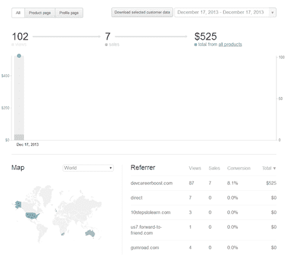
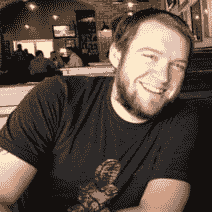

# 最疯狂的企业家挑战:3 个开发者能在 24 小时内每人赚 100 美元吗？(第 3 页，共 3 页)

> 原文:[https://simple programmer . com/24 小时 100 次挑战第三部分结果/](https://simpleprogrammer.com/24-hour-100-challenge-part-3-results/)

这是一系列三篇博文中的第三篇，这些博文将从我们各自的角度详细介绍我和我的智囊团的两位成员发起的 24 小时 100 美元挑战。

*   在第一篇帖子、[乔希·厄尔](http://joshuaearl.com/)、[吴镇男·贝利](http://lostechies.com/derickbailey/)和我谈论了我们在比赛前的想法、我们的感受和心理准备，以及我们计划要做的事情。
*   在第二篇帖子中，我们每个人都谈到了 2013 年 12 月 17 日午夜钟声敲响时到底发生了什么。以及我们如何熬过 24 小时的考验。
*   最后，在这最后一篇文章中，你将听到比赛的最终结果，我们每个人都在讨论我们的结果，分析我们认为我们做对了什么，我们做错了什么，以及我们如何以不同的方式做事情。

## 我的结果

嗯，你可能已经猜到了，但我在 100 美元的挑战中表现得相当不错。这一天结束时，我总共赚了 525 美元，这是 7 次销售的收入。 Gumroad 对每笔交易收取大约 5%的费用，我花了大约 30 美元订阅我的登录页面的 Leadpages，所以我一天总共净赚了大约 470 美元——对于一天的工作来说还不错。

我对结果非常满意，但是我也有点失望，因为我没有突破 1000 美元的大关。我觉得如果我想出了一种方法来提高我的转换率一点点，并获得更多的流量，我可以很容易地超过 1000 美元。

最棒的是，我现在有了一个已经通过市场验证的产品——我所要做的就是创造出产品的其余部分，然后发货。实际上，在没有任何额外广告的情况下，我甚至在第二天就收到了另外 6 份订单。

### 我做对了什么

我认为我做得最正确的一件事就是卖出足够高的价格，然后打包出售。如果我以 10 美元的价格出售一本简单的电子书，我将不得不多卖几本，这也不会让我更容易获得流量。通过销售高价商品和预售，我能够充分利用时间——不仅是在我一天销售产品的有限时间内，而且是在我未来实际生产价值 75 美元或更多的东西的时间内。

正如我之前提到的，在我为一个产品投入大量工作之前，我也进行了相当多的市场验证。通过预售产品，我最终没有做任何实际工作，直到我接到订单。如果我最终没有获得足够多的订单来表明人们对该产品有真正的兴趣，我本可以退还我已经收到的订单，并提前中止该项目，而不必在它上面浪费更多的时间。当一个人花了几个月甚至几年的时间创造了一种产品，却发现没有市场，这是一个真正的悲剧。在产品上市销售的前两个小时内，我得到了市场验证，这告诉我我正朝着正确的方向前进。

最后，我要说的是，利用杠杆的力量来营销产品是我成功的最大因素之一。我没有做很多可能会吸引一些访问者的营销策略，而是创建了一个已经给人们带来价值并可能被分享和传播的博客帖子。如果我只是试图让人们来我的销售页面，或者只是直接营销销售页面，我可能会有令人沮丧的结果，不会有任何杠杆作用。但是，通过创建一些我可以广泛传播的免费内容，我能够获得足够的流量来产生销售。

### 我做错了什么

###  [

T4】](https://simpleprogrammer.com/wp-content/uploads/2014/02/wrong.jpg)

我真的没有足够的营销想法。我的大部分结果都取决于我写的第一篇博文的成功，这篇博文在当天早些时候获得了一些关注。如果没有这篇文章的成功，我的销售额会少得多——如果有的话。

我真的需要整天忙于推销产品，以获得最大的收益。如果我提前知道要去哪些论坛，并多花一点时间来规划发布会的营销方面，我可能会有更多的想法。我还浪费了相当多的时间试图获得一个电子邮件地址列表，这可能会有很低的转换率。

我犯的另一个大错误是在比赛期间写书。如果我想充分利用我的时间，我应该花整整 24 小时什么也不做，只是把销售页面放上去并进行营销。当然，在一天结束前完成这本书很好——或者至少是它的第一稿——但是，我为自己争取了额外的 24 小时来完成它，所以我花在写书上的任何时间都是我可以用来营销产品的时间。

### 我会有什么不同的做法

我不得不说，我从整个经历中学到了很多。我发现自己在营销产品的能力上存在一些严重的弱点，并发现了一些我可以改进的重要领域。这整个过程就像是将一个完整的产品生命周期压缩到 24 小时内。

如果我必须从头再来一遍，我会确保我对如何使用点击付费广告有足够的了解。对于价格如此之高的产品，我可能已经找到了通过购买广告来赚钱的方法。我不太了解如何有效地利用广告媒体，所以我依赖有机流量和其他营销技巧，但我确实觉得，由于不了解这种营销策略，我把钱留在了桌子上。

我也没有试图建立某种联盟计划。如果我有诱饵，我可能会进一步扩大我的影响力，更大胆地寻求帮助来推销我的产品。这是我的另一个弱项。我不太了解如何创建一个联盟计划，以及如何让人们报名参加。我不确定这是否能在一天之内完成，但是如果我再做一次这样的比赛，我会确保我对联盟营销有足够的了解。

正如我之前所说的，我会尽量更好地利用我的时间，不要在 24 小时的推销时间里创造产品。相反，我会努力确保我有足够的广告活动来充实一整天。

**我还应该在登录页面**上设置一些 A/B 测试，这样我就可以整天调整文案以提高转化率。我几乎把我的页面放了起来，然后一整天都不知道对副本的小改动是否会导致转化率的大变化。

总的来说，我对这次经历很满意。作为一名企业家，这是我不得不做的最可怕的事情之一，但我觉得这段经历让我经历了一些快速增长。关于成功地将一个产品推向市场，我还有很多要学习的，但现在至少它不像这个小实验之前那么可怕了。

## 吴镇男的结果

在那一天的挑战中，我做了很多事情。我挺过来了，尽管在这一天和整个过程中，我的胃里充满了压力和痛苦。然而，尽管我完成了所有的事情，我还是彻底失败了。那天我赚了整整 0 美元。直到午夜最后期限过后不久，我才从那本电子书中赚到钱。但我认为这一天在其他方面是成功的。不为别的，它教会了我很多我擅长什么，不擅长什么。

### 课程重申:我可以建造东西

我相信这是我的优势之一。我能在相当短的时间内把一个想法变成有价值的东西。我从一本书的想法开始，很快就有了这本书，并在几个地方做了广告。我的软件开发历史，早期和经常的交付，在错误发生时修复错误，并把事情做好，渗透到我所做的很多事情中。我写了章节，我努力让它们变得更好。我发行了这本书。我继续改进它。我在建筑方面做得很好。但其他方面就没那么多了。

### 教训:我对营销一无所知  

这可能是我从这一天学到的最重要的事情。很久以前我就知道我不擅长营销。我很幸运，因为在过去我从来没有真正需要做任何重要的营销。但我不再那么幸运了。我现在直接需要做好营销，因为我正试图销售一项服务、截屏、书籍和我的咨询服务。

到了制定营销计划的时候，我手足无措。我只知道推特和博客。我不知道如何故意建立一个观众群，让自己出现在别人的眼前，或者在别人的眼中创造价值，这样他们就会向我砸钱。我绞尽脑汁想出主意，从与我们策划小组的谈话中找出一些窍门，最终在每一方面都失败了。

### 经验教训:跳出框框思考，首先需要知道如何跳出框框思考

我缺乏理解市场营销的能力，这给我带来了一大堆失败，因为我不能“跳出框框思考”或站着思考。谈到营销，我没有生存本能，因为我一开始就对营销了解不够。

与乔希和约翰的后续对话揭示了一些非常有创意的快速建立受众的方法。至少可以说，我对他们在如此恶劣的环境下如何成功地赢得观众感到吃惊和惊讶。他们真的知道如何将营销潜力转化为新的想法，并找到让人们访问他们网站的方法。他们知道如何打破常规思考。但事实证明，如果你不知道如何在盒子里思考，那就是一场闹剧。

### 经验教训:外包 It

当你在成长和学习时，遵循一些最简单的营销理念的基本规则和指导是绝对必须的。我没有立足之本，只能挣扎着从基础做起。但就像生活中的大多数事情一样，我学会了如何利用自己的弱点去创造更好的东西。我没有试图承担学习和成为营销专家的任务，而是选择了一个更好的方向。我正在把我工作的那个方面外包出去。从那以后，我和很多帮助我做了很多了不起的事情的人建立了联系。是的，我还需要努力。我必须努力教这些营销专业人士我在做什么，为什么。然而，一旦我让他们理解了，他们就能快速有效地帮助我让我的潜在观众理解。

我已经获得了建立一个人际网络的好处，我可以将这些事情外包给他们。我的关系网也在继续扩大，我将很快成为一支侦察力量……不是靠我自己的力量，而是靠我所结盟的团体的力量。

### 最后…

我很高兴我坚持到底了，就像我做的那样。它教会了我很多关于我自己，我的优势，以及我如何需要与他人的力量合作，以真正建立和做一些伟大的事情。这一天对我和我的职业生涯都很重要。被扔进树林，除了一把刀什么都没有，这将教会你深入内心，找到你仅有的一点生存本能。能够走出困境，反思你的经历，并用新发现的经历规划未来…这是无价的。

我既害怕又期待我们的下一个策划挑战。

## 乔希的结果

在比赛开始前，我知道这将是一场挑战。但是我想当时机成熟时，我会全力以赴去完成它。

然而，当真正的困难出现时，它让我措手不及。事实证明，我最激烈的竞争对手不是约翰或吴镇男，而是我自己。

### 因为我想失败

从挑战日醒来的那一刻起，我就知道每走一步都会不舒服。更糟糕的是，每一个小小的成功都意味着我不得不做一些更不舒服的事情。一天中没有一刻我不想放弃。让我坚持下去的唯一动力就是想给约翰和吴镇男一个好的表现。

我很惊讶写这篇博文有多难，而这篇博文是我策略的关键。毕竟，几个月前我就想写了。但是害怕把自己放在那里是很难克服的。

### 在恐惧中，我打破了我的一个重要的生产力规则

过分关注一个你无法控制的结果是生产力的丧钟。最好是低着头，想想那些你能直接控制的事情。

我的策略依赖于流量，但我不能直接控制流量。我掉进了看我的实时谷歌分析统计的陷阱，而不是接触更多的人，请求他们帮助推广我的帖子。我本应该更好地完成我的计划，尽管…

### 我的计划有缺陷

虽然我应对挑战的策略在一定程度上奏效了，但我犯了几个代价高昂的错误:

*   我应该事先决定好我要卖的产品。我想先研究工具，但最后我花了一个小时，选择了我已经熟悉的工具。完全是浪费时间。
*   建立电子邮件列表并在一天内将用户转化为买家的想法过于乐观。首先，我没有想到很多人不会马上确认他们的电子邮件订阅，所以注册需要一段时间。即使我让足够多的人点击了订阅按钮，我也要到第二天才能够联系到他们中的许多人。
*   我高估了黑客新闻首页的点击率能给我带来多少流量。我按计划登上了头版，但只有大约 2000 次点击。我在想我会得到 10，000。

但是我那天最大的错误是太胆小了。我应该直接在帖子上推广我的 Google Hangout 产品，但我让恐惧战胜了我。当我换挡加油门的时候，我已经过了一天的交通高峰。

### 然而，奖励真的让我吃惊

我下午晚些时候的订单成了我当天唯一的销售，我只赚了微薄的 23.97 美元。这就是懦弱的代价。

尽管我没有达到赚 100 美元的目标，但我在挑战期间的工作对建立一项有价值的资产大有帮助——我在地图上找到了我的新博客。

当一天结束时，我的博客收到了:

*   2 723 次页面浏览
*   1，887 名独立访客
*   7 条评论
*   17 个新的电子邮件列表订户
*   1 个客座博文请求
*   44 条推文
*   黑客新闻 36 分
*   Reddit 上的两次投票

我还得到了帕特·弗林的关注，他亲自回复了我的电子邮件，并为我发了一条推特。如果不是这次比赛，我永远也不会去找他。

几个星期后，这个帖子继续为我工作。它产生了源源不断的流量，自比赛日以来，我的博客已经获得了超过 7600 次页面浏览量，尽管从那以后我没有做过任何额外的推广。我的邮件列表在比赛期间迅速增加，已经有近 100 名订户，我收到了几十条感激的推文、电子邮件和博客评论。

Leanpub 对我的帖子非常激动，他们问我是否可以把它变成他们博客的客座博文。我照做了，那个版本*也*上了黑客新闻，在头版花了几个小时。

比赛后的第二天，我收到迪恩·德怀尔发来的一条推特，他是“让转变发生”播客的主持人。他采访过像[蒂姆·菲利斯](http://www.fourhourworkweek.com/blog/)和帕特·弗林这样的企业家。我愿意上他的节目，谈谈我写书和推销书的经历吗？他想知道。这是一次很棒的经历，采访将在接下来的几周内发布。

这只是最大的问题。我还获得了几十个我的网站的反向链接，这将有助于我的网站在未来的几周和几个月里在谷歌中排名靠前。

### 行动是成功的关键

尽管我的策略有缺陷，执行也不稳定，但我一天专注努力的回报在两个多月后仍会滚滚而来。如果我没有努力让自己行动起来，这一切都不会发生。

这场比赛坚定了我的信念，如果你能走出去做一些事情，即使并不完美，成功也是不可避免的。

百分之九十的人永远也走不到那一步。

你会吗？

## 喜欢这篇文章吗？我们还会有更多…

如果你喜欢这一系列的帖子，请务必在这里注册，我会确保在未来更新类似的帖子。我们仍在为我们的策划小组计划更多像这样的挑战。此外，如果你决定自己接受挑战，或者和你的一些朋友一起接受挑战，让我们知道进展如何。请在下面张贴您的结果评论或您的文章链接。