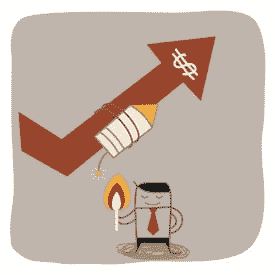
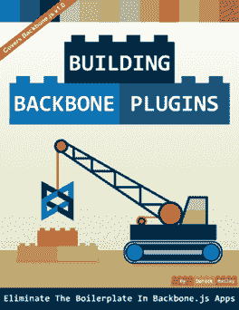
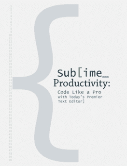

# 最疯狂的企业家挑战:3 个开发者能在 24 小时内每人赚 100 美元吗？(第 1 页，共 3 页)

> 原文：<https://simpleprogrammer.com/24-hour-100-challenge/>

你被直升机扔到森林的中央，除了一把猎刀什么都没有。你是做什么的？你是怎么活下来的？

这是我和我的几个朋友接受挑战的基本前提，只是我们的比赛不是在森林里进行，而是完全在网上进行。

这个想法很简单。你有一天的时间——24 小时——在网上赚至少 100 美元。唯一的问题是你不能使用你已经拥有的任何东西。你不能使用你的推特账户，你不能使用你的博客，你不能出售你已经创造的产品；**无论你做什么，你必须在 24 小时内完成，而且你必须拿到现金——我欠你的不算数。**

这是一系列三篇博客文章中的第一篇，这些文章将从我们每个人的角度详细描述这个故事的事件。

*   在这第一篇文章中，[乔希·厄尔](http://joshuaearl.com/)，[吴镇男·贝利](http://lostechies.com/derickbailey/)和我将谈谈我们在比赛前的想法，我们的感受和心理准备，以及我们的计划。
*   在下一篇的[文章中，我们将各自谈论 2013 年 12 月 17 日午夜钟声敲响时到底发生了什么。以及我们如何熬过 24 小时的考验。](http://wp.me/p3pzCs-2Nb)
*   最后，在最后一篇文章的[中，你将听到比赛的最终结果，我们每个人都在讨论我们的结果，分析我们认为我们做对了什么，我们做错了什么，以及我们如何以不同的方式做事情。](http://wp.me/p3pzCs-2Nn)

## 我的故事

")

如果你关注了[我的博客](https://simpleprogrammer.com)，你可能已经对我有所了解，但我会为其他人介绍我自己。我叫约翰·桑梅兹。我已经做了大约 15 年的软件开发人员——至少这是我从事专业工作的时间。

我为大大小小的公司工作过，当过承包商和雇员，使用过各种各样的编程语言和技术，但我真正的热情一直是教学。

几年前，我开始为 Pluralsight 制作课程，在那段时间里，我制作了 54 门课程，从 Android 和 iOS 到游戏开发。这次创业的成功让我辞掉了工作，全职在自己的公司工作，做一名简单的程序员。从那以后，我一直在写博客，制作 [YouTube 视频](http://youtube.com/jsonmez)，[创建播客](http://getupandcode.com)和生产[产品，在生活的各个领域帮助开发者](https://simpleprogrammer.com/howtomarketyourself)。

### 挑战

我必须承认，我有点被这个挑战吓倒了——尽管是我提出这个挑战的。谈论在 24 小时内在网上赚 100 美元是一回事，努力去做又是另一回事。

我觉得很有信心，我可以很容易地完成这个目标，直到我们实际上在日历上设置了一个日期，并承诺这样做。

我们制定的规则之一是，我们实际上不能提前写下任何东西或做任何准备工作——这些都必须在我们的脑海中。我想我最好想出一个计划，所以我开始思考一些可能的方法，我可以在一天内赚到 100 美元。

一个显而易见的方法就是开始随机向人们讨钱。解释比赛本身并不违反规则，所以我基本上可以告诉人们我想赢得这场比赛，看看他们是否会做出贡献。我很确定在 24 小时内，我可以和足够多的人交谈来凑齐这笔钱，即使我不得不一次花一块钱，但这个想法对我来说并不太有吸引力。我想为这次比赛做点什么，这可能会让我长期受益。 *(我确实把这个想法藏起来，作为在我的主要计划失败的情况下使用的最后手段。)*

我的下一个想法是做一些联盟营销。至少我可以尝试销售一些亚马逊产品，并从我卖出的商品中获得 6%的佣金。但是，我也可以找到一些其他高佣金产品，并尝试出售。这种方法的问题是，我不会真的有任何受众可以推销；我基本上得像一个挨家挨户上门推销的推销员一样，在论坛和脸书团体上随机发帖，试图做成一笔买卖。而且，这对我没有任何长期的好处。这个选择似乎是可行的，但我认为一定有更好的办法。

我的下一个想法是创造一个我可以销售的小产品。我想也许我可以把一本大约 5000 到 10000 字的小电子书放在一起，然后建一个小网站来卖这本书。这种方法的唯一问题是，我将不得不花一天的大量时间来写电子书，然后我将不得不尝试获得我的销售页面的流量。但是，在一天结束的时候，我实际上已经有了一个可以在未来销售和改进的产品。这个想法看起来很有希望，但是我怎么能在一天之内写完一本书，并且还有时间把它推向市场呢？

### 该产品

离比赛还有几周时间，所以我花了一些时间在跑步训练中思考我的策略。我很确定我要创造一些产品并试着销售它，但是我不确定我到底应该创造什么样的产品，以及我应该如何给这个产品定价。

我很早就想到的一件事是，如果我以低价出售某样东西，我就必须进行大量的销售，但是如果我能够创造出一种可以以足够高的价格出售的产品，那么我就可能通过一两次销售达到 100 美元的目标。尝试销售高价商品似乎是最有意义的，因为没有足够的时间进行足够的营销来获得销售大量小商品所需的流量。**但是我怎么能在不到 24 小时的时间里做出我**

****

**能卖一大笔钱的东西呢？**

原来，我已经计划开设一门课程，教开发人员如何推销自己，以获得更好的工作，促进他们的职业发展。我有了这个想法，因为我意识到我从我的博客、播客和 [Pluralsight 课程](https://simpleprogrammer.com/pluralsight)中获得的宣传对我的职业生涯是多么有价值，我觉得我可以将我从这次经历中学到的信息浓缩成任何其他开发人员都可以重新创造的东西。唯一的问题是，我曾计划在第二年开设这门课程，而这门课程的开设需要很长时间——我们说的是几个月，而不是几周。

然后，我有了一个绝妙的主意！预售课程怎么样？我可以为这门课程制作一本电子书的初稿，并在 24 小时内分发给所有购买了整个课程预售版的人。如果我告诉预购课程的客户，他们将在购买后 24 小时内收到电子书，实际上甚至会为我购买额外的 24 小时来创作这本书。*(这些都没有违反比赛的任何规则，因为我会在 24 小时内拿到钱，即使我后来交付了货物。)*这有点冒险——我的意思是，我仍然需要在大约 24 小时内写完一本书的整个初稿——但我认为这是卖出高价商品的最佳机会。作为一个额外的奖励，比赛的所有工作将迫使我实际上创造出我一直计划在下一年创造的产品，并将实际上给我一个做这件事的开端。

### 战略

下一步是试图弄清楚我到底要做些什么来销售这个产品，并充分利用我的 24 小时。我不得不在脑子里跑了一会儿，排练了一会儿，但是我想出了一个我认为很可靠的计划。

我决定，我可能应该在比赛的前一天晚上很早就睡觉，并尽量在午夜左右醒来，以便最大限度地利用我必须实际创造和销售我的产品的时间——这是非常明显的，我希望我的竞争对手也会这样做。

然后，我开始思考我大概会想按什么顺序做事。在我看来，**我希望有尽可能多的时间来推广产品，并让产品上市销售**，所以首要任务是建立某种登录页面，让产品尽快上市销售。

但是，真正的大问题是如何营销这个东西。当你只有 24 个小时，并且不能使用你现有的社交平台时，你会做什么？如果我可以发一封电子邮件到我的电子邮件列表或者在我的博客上发表一篇文章，这将会很容易，但是从零开始并且只有 24 小时让这变得相当困难。我想了一些我可以做的事情来传播这个消息。

一件显而易见的事情是给我认识的其他开发者发电子邮件，他们有很多观众，看我是否能让他们在他们的社交网络上提到我的产品。我想我可以列出一大堆愿意帮助我的开发人员，我可以给他们发一封电子邮件，这样可以有效地利用我的时间。

我的另一个想法是写一些史诗般的博客文章，我可以在黑客新闻或 Reddit 上看到。我将不得不创建一个全新的博客来做到这一点，因为我无法使用我现有的博客，但如果我成功了，它可以为我的登录页面带来相当大的流量，有了足够的流量，我应该能够获得我需要的少量销售。

我也考虑过我可以在各种开发者论坛和社区中发帖。我可以回答帖子或者创建我自己的帖子，里面会有一些相关的信息，但最终会把别人引到我的登陆页面。这将是另一种方式来扩大我的影响，借用另一个观众。

最后，我认为作为最后的手段，我可以购买一份开发者电子邮件地址列表，然后一次性发送电子邮件来尝试销售产品。这可能会被认为是垃圾邮件，但是如果我能给足够多的开发者发一封电子邮件，我至少能做成几笔生意。

我不得不在脑子里不停地思考这份营销想法清单，这样我就不会在比赛前忘记它们，因为我不允许把它们写下来。

原来如此。那是我的计划。我打算尽快为我的[如何将自己推销为软件开发人员课程](https://simpleprogrammer.com/howtomarketyourself)创建一个登陆页面，并尝试主要通过利用现有受众来推销它，因为我无法使用我自己的受众。我觉得这是一个不错的计划，但我仍然对自己实现它的能力有一些严重的怀疑和保留。

这听起来可能没什么，但这个挑战让我望而生畏。当然，我已经在一天之内通过电影放映、图书销售和其他事情赚了几百甚至几千美元。但是不得不在一天之内完成这件事，不使用现有的资产或网络…我一想起这件事就感到胸闷、反胃。

## 吴镇男·贝利的故事

[吴镇男·贝利](https://plus.google.com/u/0/101060306397560578875?rel=author)是企业家、问题解决者(和创造者？:P)，软件开发者，编剧，作家，博客作者，演说家，德州中部(奥斯汀北部)的技术领袖。他经营[SignalLeaf.com](http://signalleaf.com/)–**令人惊叹的播客音频托管服务，每个人都应该使用**和[WatchMeCode.net](http://watchmecode.net/)，在那里他抛出 JavaScript 挑战让你跟上速度。他从 90 年代末开始就是一名专业软件开发人员，从 80 年代末开始写代码。在 twitter 上找到我: [@derickbailey](http://twitter.com/derickbailey) ， [@mutedsolutions](http://twitter.com/mutedsolutions) ， [@backbonejsclass](http://twitter.com/backbonejsclass) 在 web 上找到我: [SignalLeaf](http://signalleaf.com/) ， [WatchMeCode](http://watchmecode.net/) ， [MarionetteJS](http://marionettejs.com/) ，[我的 Github 简介【T24](http://github.com/derickbailey)

### 决定做什么

在我们确定日期之前，我们已经讨论过这个问题很多次了，在这些讨论中，我决定集中精力做好这一天的服务。是的，SignalLeaf 是我已经开始的东西，但它在流量和网络方面几乎没有任何东西。只有几个人关注 [@SignalLeaf](http://twitter.com/signalleaf) Twitter 账户，博客上几乎没有流量(博客上几乎没有一两篇帖子)，网站也没有得到任何重要的使用。约翰和乔希都欣然同意让我专注于 SignalLeaf，因为其他任何事情都可能意味着开始一个新的商业模式或找到一个一次性的事情去做。我对寻找新的商业模式并不感兴趣，尽管这个一次性的想法让我很感兴趣。

### 创建计划

在得到其他人的认可后，我在脑子里为我将要做的事情制定了一个计划。我会专注于创作和销售一本关于如何开始播客的电子书。我想帮助人们克服他们对开始的恐惧，对失败的恐惧和他们不断拖延的策略。我想向人们展示开始播客是多么容易，并给人们一条清晰的道路，让他们在网上获得第一集。电子书似乎是一个很好的方法，我已经用我的[构建主干插件](http://backboneplugins.com/)电子书取得了很多成功。就这样定下来了。电子书将是我挑战日的主要焦点。

但是在我选定电子书后，我想到了其他的东西…一些有点迂回和不光明正大的东西。除了电子书之外，我决定要建立一个网站，让人们给我钱，这样我就能赢得这个挑战。我会在挑战赛当天购买一个域名，建立一个非常简单的页面，上面有一个 PayPal 捐赠按钮，并找到一种让人们访问它的方法。因为我们不能使用自己现有的博客或社交网络，所以我的计划是借用别人的。我打算给一些非常有名的开发者和朋友发电子邮件，请求他们发一个链接到我的新网站。这是一场卑鄙、肮脏的战斗，听起来完全像是为了赢而值得做的事情。

因此，我的一天的大致轮廓，包括电子书和网站建设，将是:

*   午夜 12 点:起床，吃早餐
*   凌晨 1 点:为“给我钱”网站买一个域名
*   凌晨 2 点:发布网站
*   凌晨 3 点:开始写播客电子书
*   中午 12 点:发布我在 Leanpub.com 的所有信息，并建立营销页面
*   下午 1 点:通过我能想到的任何方式开始营销这本书
*   中午 12 点(午夜-24 小时后):得到一份我当天收入的最终报告

太棒了。计划设定。通知了妻子和孩子，并安排了休假。现在，我等待着这一天的到来。

### 日益加剧的恐惧

##  [

T4】](https://simpleprogrammer.com/wp-content/uploads/2014/02/fear.jpg)

随着这一天的临近，我变得越来越害怕——害怕失败，害怕被嘲笑，害怕有人叫我出去，告诉我我是一个骗子，或者是一个讨钱的营销骗子。太可怕了，我让那种恐惧占据了我。我继续在脑子里制定我的计划。我想了想电子书会说些什么。我考虑了建立“给我钱”页面的想法。我想知道如何给人们发电子邮件。但是一直以来，当我在想这些事情的时候，我感觉我的胃在转圈，在打结。日子越来越近，我感觉越糟糕。

老实说，在开始之前我就想放弃了。我想到了我将要写的书，以及我是否能推销和出售这本书。我想知道卖一本关于播客的书是否可行，因为已经有很多资源可以开始学习播客了。我甚至给乔希和约翰发了一封电子邮件，表达了我对能否出售这款产品的担忧。恐惧折磨着我，我想放弃。但是我没有，我很高兴我没有——不是因为我成功了，而是因为我从那天学到的东西和我为此付出的努力。

### 于是它开始了

仅仅带着一把刀把自己扔进树林的经历是可怕的——当你知道它就要来的时候就更可怕了。所以我早早上床睡觉，试图入睡，我的大脑疯狂地想着各种想法，让我保持清醒的时间超过了我应该保持清醒的时间。然后我的闹钟响了，这一天到了。我从床上爬起来，开始工作。

## 乔希·厄尔的故事

[乔希·厄尔](https://plus.google.com/u/0/105743778515636381937?rel=author)是一名软件开发人员、作家和企业家，来自宾夕法尼亚州匹兹堡。他是两本自助出版书籍的作者，分别是 [Sublime Productivity](http://sublimeproductivity.com) 和 [Writing Sublime Plugins](http://writingsublimeplugins.com) ，这两本书都是关于 Sublime Text 的，这也是他的[SublimeTextTips.com](http://sublimetexttips.com)博客的主题。他还经营[DeskHacks.com](http://deskhacks.com)，一个面向立式办公桌爱好者的网站，以及在[joshuaearl.com](http://joshuaearl.com)关于写作和商业的博客。他的推特账号是 [@josh_earl](mailto:is@josh_earl) 。

## 接受挑战…

当约翰第一次提出这个挑战时，听起来就像一场爆炸。放一天假，花点时间构思一个商业点子，通过电子邮件嘲讽朋友，赚点钱。多有趣啊。

更好的是，我觉得我很有机会赢。

我有一点网上做生意的经验。我出版并销售了一本关于崇高文本的电子书，赚了将近 20，000 美元，创建了几个博客，每月点击数千次，并创办了一个利基网站，每月从亚马逊会员收入中赚取数百美元。我已经在 Twitter 上聚集了近 13，000 名粉丝，邮件列表上有超过 5，000 名订阅者。

我也很享受为我的网站创造“即时流量”的成功。我在 LifeHacker 上发表了四篇文章，另外半打文章在 Hacker News 的首页上花了几个小时。

战线一旦划定，我的计划很快就形成了。

我已经向自己证明了我可以很快获得流量，所以我决定发挥这一优势。如果我能获得足够的流量，我知道我能找到一种方法把它转化为金钱。

## 我能创造出什么来吸引成千上万的访问呢？

答案很明显。

有一篇我很久以前就想写的博文，它是关于我出书以来的一年里，我是如何增加我的读者和收入的幕后故事。我会尽可能透明地分享我做得好的地方和我做得差的地方。然后，我会总结过去一年我学到的一些经验教训。

网络喜欢这些帖子——帕特·弗林(Pat Flynn)围绕他的月收入报告建立了很多粉丝，而[艾米·霍伊(Amy Hoy)](http://unicornfree.com)和[内森·巴里(Nathan Barry)](http://nathanbarry.com)也很好地利用了这些帖子。

我有一个很好的故事和鼓舞人心的结果，我知道如果我写了这篇文章，它会很受欢迎。

我决定把农场押在这篇博文上。我会投入任何必要的时间来写作和推广它，然后用剩下的时间去想如何从流量洪流中赚几块钱。

我有几个想法，希望能增加我打全垒打的机会。第一，黑客新闻。一篇登上首页的帖子，一分钟就能收到几十甚至上百次的浏览量。我想如果我在一天中足够早的时间(美国东部时间早上 7 点是黄金时间)发帖，我可以策划一个头版头条。为了最大化我的帖子的吸引力，我计划研究几个在 HN 表现良好的收入报告类帖子的例子，并利用它们的标题和结构来获得灵感。

第二，我会尽可能坦诚地讲述我的成功和奋斗。这个帖子将是真实的，信息丰富的。

第三，我计划提及为我的成功做出贡献的知名人士，给我一个借口，通过电子邮件或 Twitter 直接联系他们，请他们与更多的受众分享这篇文章。

总结一下我的流量生成策略，我计划以我知道受特定受众欢迎的体裁写一篇杀手级的帖子，然后尝试借用其他人的受众来帮我宣传。

## 但是我如何从这些流量中获得收入呢？

如果说在过去的一年里我学到了什么，那就是电子邮件是在线销售产品的最佳工具。从我推销我那本崇高的书的经历中，我学会了如何使用免费赠品作为激励，让人们注册我的邮件列表，我也学会了如何让人们打开并阅读我发送的电子邮件。

我计划使用我在推销我的书时有效使用的策略——只是这次我会以极快的速度进行。在我文章的最后，我会通过提供有用的赠品来吸引读者加入我新创建的邮件列表。这个“销售线索磁铁”可能是与帖子相关的东西——可能是我用来创作和营销我的书的工具列表。

这意味着我需要创建赠品，并写一封电子邮件欢迎人们加入我的列表，并将他们链接到工具列表。根据经验，我知道这封邮件会有很高的打开率。我也知道在邮件中添加附言是吸引人们注意力的好方法——在主题行之后，这是大多数读者会看到的一件事。所以我会在欢迎邮件中使用附言来推销我决定提供的任何产品。

哦，对了，那个。

## 我到底能卖什么？

除了竞赛规则，我还有一个自我约束，限制了我能提供的东西:我不希望这个产品在竞赛结束后需要太多的持续承诺。这意味着预售一本书是不可能的——那时，我正埋头编辑我的下一本崇高的教科书,[编写崇高的插件](http://writingsublimeplugins.com)。我最不需要的就是另一个让我感到内疚的大型写作项目。

有两个想法似乎很合适:我可以提议让人们与我预约时间，进行一对一的营销帮助，或者我可以把座位卖给一个 Google+ Hangout，在那里我可以更深入地研究我是如何推广我的书的。我不确定我会选择哪一个，这部分取决于哪一个更容易设置。我需要对日程安排和活动软件做一些研究，但我不能提前做这些。

这似乎是一个合理的策略。我把它当成了一道数学题。如果我的博客帖子有几千个页面浏览量，我可能会让 100 个人注册邮件列表。由此看来，我可以以 20 到 30 美元的价格卖出 4 到 6 个座位或辅导课，这似乎是合理的。

这一整天都将是一次创造性的优先排序、及时创造和运送物品的练习。以下是我对这一天的设想:

*   早上 5:00–7:00—研究博客文章格式。勾勒并撰写帖子。设置邮件列表订阅表单。
*   早上 7:00—发布帖子。黑客新闻上的帖子链接。
*   上午 7:00–中午 12:00—通过电子邮件、Twitter 推广帖子。
*   下午 1:00–3:00—决定产品形式。写销售页面。
*   下午 3:00–5:00—创建名单注册赠品。撰写并发送欢迎电子邮件，包括赠品和活动推广。安排欢迎电子邮件自动发送给新订户。
*   晚上 7:00–9:00—寻找推广博客文章的其他方法。尝试直接向朋友和熟人出售活动或教练名额。

## 随着 12 月 17 日的临近，我的信心开始下降

我开始害怕比赛，而不是期待比赛。

这种压力有两个主要来源。一个是我没有写这篇博客的原因，另一个是大多数人都患有的一种基本的恐惧。

正如我前面提到的，这篇博文的想法已经在我的待办事项列表上放了几个月了。尽管我知道这部电影会大受欢迎，但我还是拒绝出演。为什么不愿意做一些我知道对我的生意有好处的事情？

一想到要发表这篇文章，我就觉得自己像个骗子。虽然我在营销方面取得了一些小小的成功，但还有很多人比我更了解这个话题。我从艾米·霍伊的 30×500 课程以及内森·巴里和帕特·弗林等人的博客帖子中学到了我所知道的大部分知识。我担心这些营销老手会怎么想。他们会嘲笑我并留下讽刺的评论吗？

然后还有另一个可怕的可能性:如果我的帖子做得很好，我卖出了几个座位，我就不得不对一群人说话——并声称知道我在说什么。对我来说(和大多数会呼吸的人一样)，公开演讲就像天鹅跳进响尾蛇的洞里一样。

恐惧与日俱增。我知道我有机会赢得这场比赛，但是当我 12 月 16 日上床睡觉的时候，我不确定我是否想这样做。

## 下一个

在这个系列的下一篇文章中，你将会听到我们每个人是如何度过每一天的。所以，敬请关注。如果你不想错过更新，请点击这里订阅。