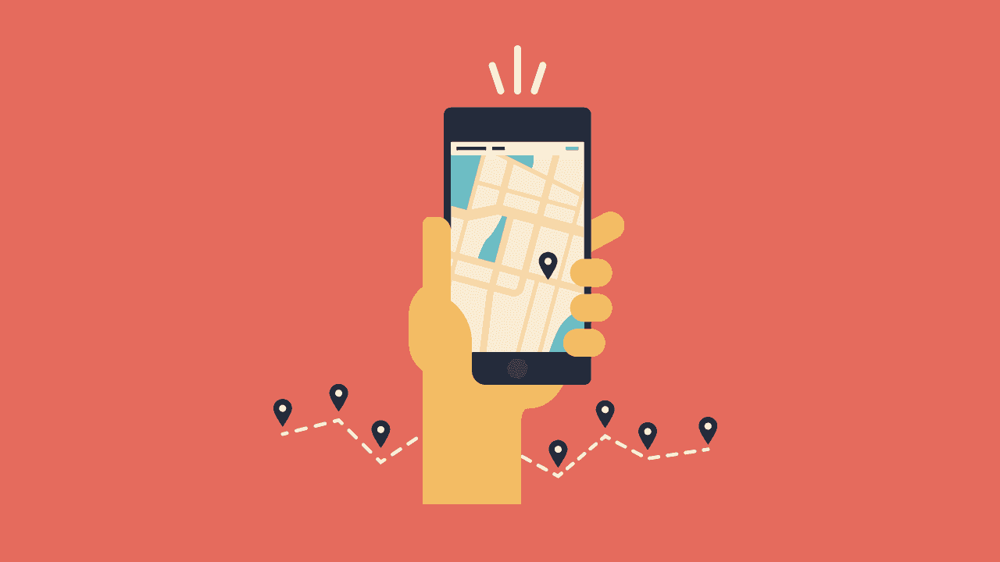
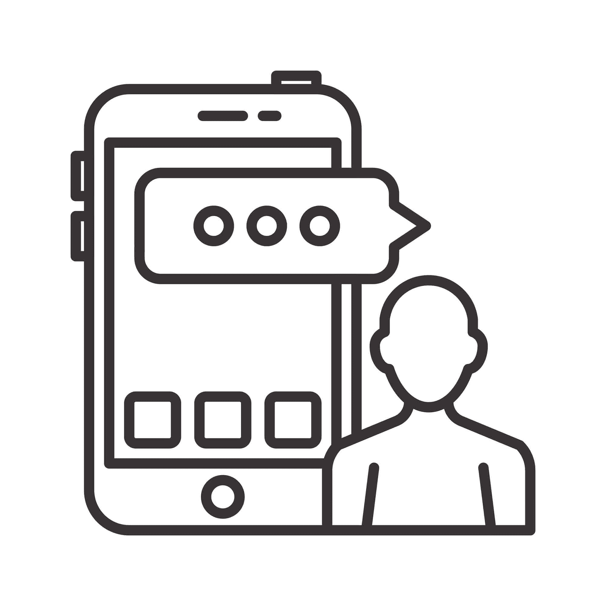
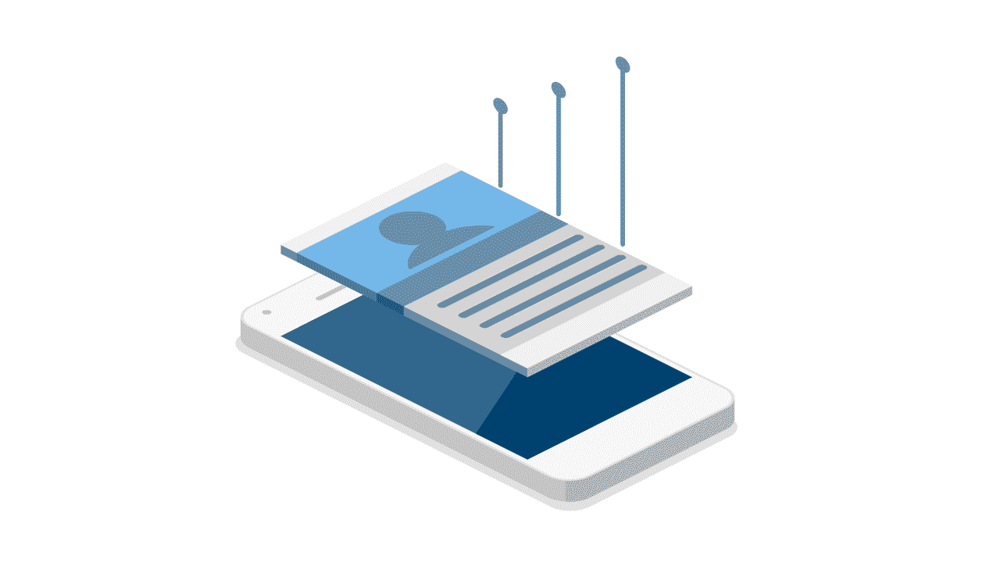

# 在启动移动应用程序之前，要问自己的 4 个法律问题

> 原文：<https://simpleprogrammer.com/4-legal-questions-mobile-app/>

启动一个手机应用程序[可能是一项艰巨的任务](https://simpleprogrammer.com/2012/04/23/predicting-the-mobile-future/)。你不仅要确保它的完美和运行顺畅——这本身并不容易——还要满足一些关键的法律要求。

大多数开发人员忽略了这些关键需求。可以理解的是，人们通常关注的是现在和启动应用程序的所有事情，而不是保护自己免受未来的法律责任。

你已经开发了一个功能正常的应用程序，并且你已经做了所有你需要做的事情来用吸引人的词语描述这个应用程序，准确地传达它的功能。现在您需要弄清楚如何满足这些法律要求。

需求因您所在的州和目标用户群而异。不管具体要求如何，你都需要在你的应用中包含适当的法律文件。

如今有这么多法律术语，很难知道和理解您的应用程序真正需要哪些法律文档。隐私政策、条款和条件、DMCA 和 EULA 等术语可能会让人混淆；其中哪些是你的手机 app 真正需要的？

更重要的是，你的应用程序是否缺少其中任何一项？

下面，我们全面概述了你的移动应用程序的四个基本法律考虑事项，并涵盖了你是否以及何时需要采取行动来补救它们。

我将和你分享我给与我合作的小企业的建议。但我要指出的是，尽管我为开发者提供咨询，为他们的应用量身定制法律政策，但我不是律师。虽然这些考虑对你的移动应用程序至关重要，但向真正的法律专业人士寻求法律咨询也很重要。

## 1.你的应用程序会收集个人信息吗？

从法律的角度来看，**这是问你自己**关于你的[即将推出的移动应用](http://www.amazon.com/exec/obidos/ASIN/B00J3C4RE6/makithecompsi-20)的最重要的问题。如果您从用户那里收集个人信息，您将自动受到一些州和联邦法规的约束。

移动生态系统在不断发展，[允许与更多人](https://www2.deloitte.com/uk/en/pages/press-releases/articles/3-point-5-million-photos-shared-every-minute.html)——和团体分享更多信息，因此最好了解自己的做法。

个人信息是指可用于识别个人身份的任何信息，包括姓名、电子邮件地址、生日、登录信息、信用卡信息和设备数据。

有几个州和联邦法律与移动应用程序收集、存储和使用个人信息有关。这些法律涵盖的行为包括使用跟踪技术(如 cookies)收集信息。它也适用于您使用的任何第三方服务收集的信息，包括分析软件和支付网关。

如果您的应用程序或您使用的任何第三方服务收集(或有能力收集)其任何用户的个人信息，[法律要求您在显眼的地方张贴隐私政策，解决这些做法](https://leginfo.legislature.ca.gov/faces/codes_displayText.xhtml?division=8.&chapter=22.&lawCode=BPC)。

这个通知可以是任何东西，从放置在应用程序主屏幕上的链接到“设置”部分中完全嵌入的文档。[虽然我不是律师，但我知道如果不这样做的话，每次违反](https://consumercal.org/about-cfc/cfc-education-foundation/california-online-privacy-protection-act-caloppa-3/) 可能会导致超过 2500 美元*的罚款——这意味着个人信息被收集的每一个用户。*

各大应用商店，包括[苹果的 App Store](https://www.apple.com/ios/app-store/) 、 [Google Play](https://www.google.com/aclk?sa=l&ai=DChcSEwiMxqiizPvVAhWWBCoKHfcsDJ8YABAAGgJ0bQ&sig=AOD64_0sOsngDConOi-Aqtw8RtKzzjB_oA&q=&ved=0ahUKEwi6gKOizPvVAhWKWLwKHeIcAlMQ0QwIIw&adurl=) ，以及像 [AdWords](https://adwords.google.com/home/) 这样的第三方服务商，也都有这个要求。因此，不仅你个人有法律义务提供隐私政策，而且你的商业伙伴也要求你提供隐私政策。

那么到底什么是隐私政策呢？

移动应用隐私政策的定义是:一份[法律声明](https://termly.io/privacy-policy/privacy-policy-for-mobile-apps/)，详细披露你如何收集用户的个人信息，你为什么收集这些信息，以及你如何使用这些信息。该声明履行了保护用户隐私的法律义务，同时也保护该公司免受联邦监管机构和法律挑战。

这些政策的内容和各个组成部分可能会因行业或商业模式的不同而有很大差异，但它们都是为了告知用户他们的隐私权利，最重要的是，保护在线业务和移动应用程序并使其符合法律规定。

如果您或您的第三方服务提供商收集任何类型的个人信息，**您的移动应用程序必须有隐私政策。**

## 2.你想为你的应用程序建立指导方针吗？

(你应该)

不管你的移动应用程序的类型或功能如何，肯定会有一些你不希望人们使用它的方式。对应用程序的不当使用可能是对应用程序本身或其他应用程序用户的滥用，也可能是将应用程序用于可能被视为非法的事情。

尽管大多数人会按照预期的方式使用应用程序，但总会有一些坏蛋存在。为了以一种给你法律依据的方式处理这些坏蛋，你需要[有一份全面的条款和条件协议](https://termly.io/terms-and-conditions/sample-terms-and-conditions-templates-guide/)。

条款和条件协议也称为服务条款或使用条款，是您和用户达成的法律合同。在本文档中，您陈述并描述了您的应用程序使用的所有规则、指南和规定。**这些规则完全由你决定**(最好是咨询律师)，然后由用户决定是否同意——或者决定不使用该应用。

**这份法律合同保护您作为应用程序所有者的地位**。它让你有权按照自己的方式处理滥用的用户，并让法律站在你这边。

您还可以终止滥用用户的帐户，在发生法律纠纷时制定管辖法律，并限制您自己对可能进入您平台的贡献者和第三方链接的责任。

此外，它保护你的知识产权:你的应用程序的设计、内容、徽标、图像和功能都是合法的。你的应用程序上的所有版权和商标材料都是你的知识产权的一部分。就金钱、时间和精力而言，所有这些材料都具有巨大的价值。

在您的条款和条件中，您确立了对该知识产权的合法权利。如果该财产受到侵犯，在您的条款和条件中包含这些条款将从法律角度保护您的投资，并使其更容易在法庭上解决。

没有条款和条件，你将在与滥用者和知识产权窃贼不可避免的斗争中失去优势。

## 3.你介意你的应用被复制吗？

想象一下这个场景:你已经花了数百个小时来构建和完善一个新颖的应用程序，它有可能获得极大的成功，并推动你过上你梦想不到的生活。你已经把它提交到你选择的应用商店，事情开始起飞。钱开始进来，你感觉很好。

然后，不知从哪里冒出来一个与你如此相似的应用程序，这不可能是巧合。随着这个新应用程序获得牵引力，你的销售和下载量开始减少。即使你在这个新的竞争对手面前保持领先，它也会一直影响你的成功。

发生了什么事？

有人可能下载了你的应用程序，并对其进行逆向工程，这样他们就可以为自己的利益制作一个类似的应用程序。本质上，他们没有抄袭你的应用程序的设计或知识产权，但同时，如果没有你的应用程序，他们的应用程序也不会存在。

那么如何防止你的应用被逆向工程呢？

让我们从头开始。为了让任何人下载和使用您的应用程序，必须首先复制它。毕竟，你不会希望有人从你那里拿走你唯一的原版。无论你选择哪家应用商店，都会制作你的应用程序的合法拷贝，然后用户可以下载。本质上，每个使用你的应用程序的人都拥有并使用原版的拷贝。

为了让用户合法地复制您的财产，**您必须首先给予他们这样做的许可**。开发者在所谓的最终用户许可协议或 EULA 中给予这种许可。

[EULA 是用户和开发者之间的合同](http://searchcio.techtarget.com/definition/End-User-License-Agreement)，它规定了应用程序可以被复制和使用的方式。根据经验，EULA 适用于应用程序的*宏观*使用，即更为全球化的外部使用，如复制和逆向工程，而条款和条件适用于应用程序的*微观*使用，即应用程序本身功能的使用。

如果你想通过 app store 发布你的应用，EULA 是必不可少的。事实上，如果你没有提供，大多数应用商店都会有一个默认的 EULA ,贴在你的应用上。

然而，这个默认契约并不像您希望或需要的那样彻底——尤其是逆向工程，并没有得到解决。为了获得更全面的 EULA，最好咨询律师或使用网上可以找到的许多 EULA 建筑商之一。

对于任何一个开发应用程序(或任何软件)的人来说，EULA 是必不可少的，他们希望发布应用程序而不用担心自己的想法被窃取。提醒:我不是律师，所以最好的做法是咨询有执照的律师，在你的条款和条件声明中加入 EULA 条款，这将为你的投资提供全方位的法律保护。

## 4.你愿意为用户内容承担法律责任吗？

许多应用程序具有允许用户发布内容的组件和功能，这被称为用户生成内容(UGC)。这种类型的内容可以包括任何东西，从图像、文章到外部网站的链接，甚至是公开显示的用户名。

**如果 UGC 具有攻击性或侵犯了他人的版权材料，您可能会在法律诉讼中承担责任**。一个十几岁的孩子用“谷歌”这个名字注册的小事情可能会引发法律诉讼——而你会被逼得走投无路。

那么你能做些什么来保护自己和限制你的责任呢？

答案很简单:确保你遵守[数字千年版权法(DMCA)](https://www.copyright.gov/legislation/dmca.pdf) 。DMCA 是 1998 年生效的美国版权法。基本上，它让在线业务和移动应用免受用户上传的版权侵权和用户发布的攻击性内容引起的法律挑战。

它本质上是你的手机应用程序的一张免罪卡。然而，我不是律师，所以请咨询有执照的律师了解更多细节。

为了遵守数字千年版权法，你所要做的就是[在美国版权局](http://www.dmlp.org/legal-guide/protecting-yourself-against-copyright-claims-based-user-content)注册一个 DMCA 代理。DMCA 代理可以是任何与你的网上业务有关的人(最好是律师)，他或她可以很容易地在网上注册。

一旦你注册了一个代理，你只需要在你的条款和条件协议中添加一个 DMCA 条款——概述你的 UGC 相关政策，并提供你的代理的联系信息。然后，只需遵守取下命令和通知，你的应用程序被覆盖！

## 不要等到太晚了才问法律问题

发布你的移动应用的道路可能会充满压力，充满减速带和潜在陷阱。你可以通过简单地问自己这些问题，并根据你的法律政策采取适当的行动，为自己省去很多压力和麻烦。

在一天结束时，最负责任的做法是在启动你的移动应用程序时咨询有执照的律师以获得指导。