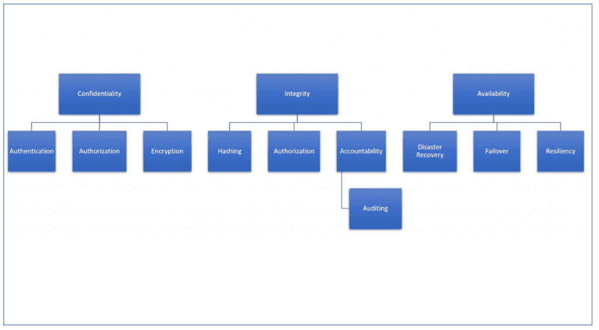
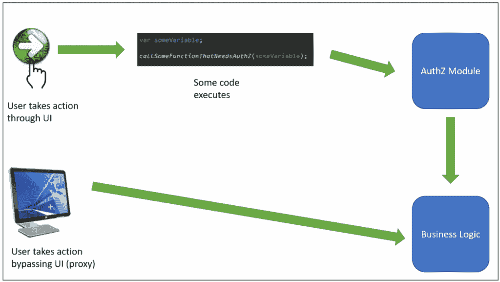
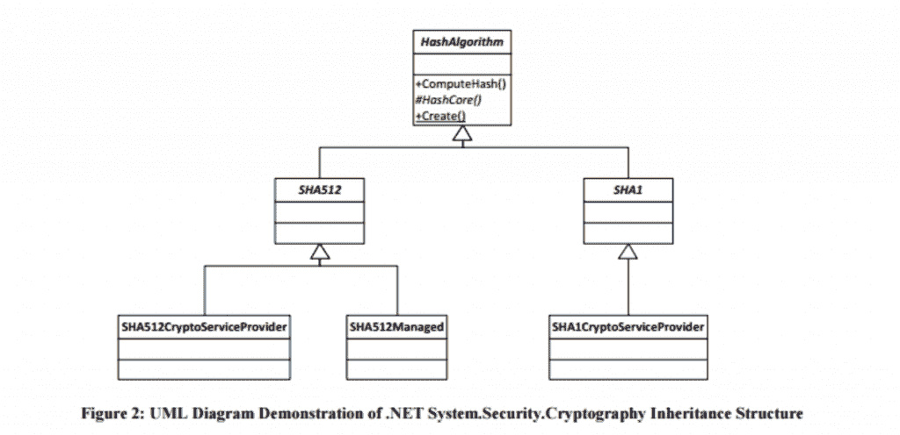
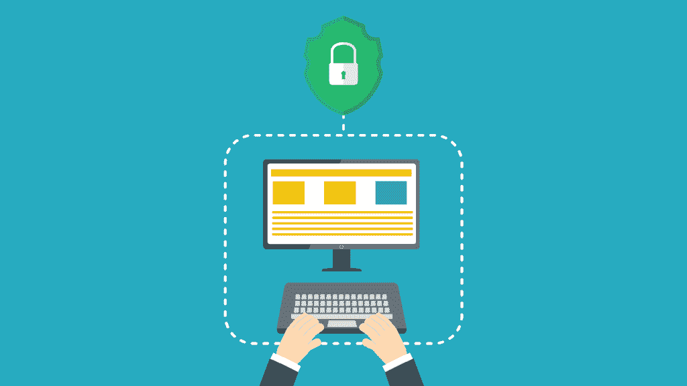

# 每个开发人员都应该理解的 5 个安全概念

> 原文：<https://simpleprogrammer.com/5-security-concepts/>

软件开发中一个持续的危险是开发人员不知道或者不愿意知道如何保护他们的软件。

当前的技术水平创造了一个应用程序不断受到攻击的环境。应用程序通常是公司基础架构中最薄弱的环节。

这意味着软件开发人员在不了解如何保护软件的情况下开发软件是不专业的。

有些人可能觉得学习如何开发好的代码已经够难了，也没有时间去学习安全性。但事实是，安全代码是好代码。生产中的一个错误可能会导致大问题。攻击者利用您的软件中的漏洞来窃取敏感数据同样糟糕(在某些情况下甚至更糟)。

编写代码时要记住这一点:安全的代码是好代码。

开发人员不需要成为安全专家来构建安全软件。有专家可以在需要和棘手的情况下提供指导，但每个开发人员都应该努力学习关键的安全概念。

让我们看看所有开发人员都可以并且*应该*理解的五个安全概念。

## #1:中情局三人组

构成任何安全活动基础的核心安全概念之一是中央情报局三位一体。这不是一个秘密政府组织；相反，它是机密性、完整性和可用性三者的缩写。所有安全活动都是为了支持和保护这三种质量的数据。其他关键的安全概念从这些基本概念中分支出来。

### 机密

简而言之，机密性意味着数据应该只提供给有权查看的人。机密性的关键概念是**认证、授权和加密**。

认证是用户证明他们是他们在系统中所声称的人的过程。这可以通过三种方式实现:通过你知道的东西(密码或 PIN)，你拥有的东西(令牌)，或者你是什么(生物识别)。只有被归类为公开的数据才应该对那些没有被认证的人开放。认证几乎是每个网站的基本需求。

授权不同于身份验证。授权是确定是否允许经过身份验证的身份执行某项操作或查看某段数据的过程。例如，登录你的银行网站并不能让你看到系统中每个账户的余额。相反，你只被授权查看你自己的账户余额。

最后，加密是确保机密性的主要方法。当数据处于静态或传输中时，加密可以防止任何窥探的眼睛看到真实的数据，从而保护其机密性。继续上面的银行例子，银行使用 HTTPS 连接来加密在客户端和服务器之间来回发送的信息。这意味着诸如登录凭证、帐号或社会保险号等敏感信息不会被窃听连接的人读取。

### 正直

机密性确保数据只被授权查看的人看到，完整性确保数据只被授权修改的人修改。

完整性是指确保您看到的数据是真实的数据，并且没有在传输过程中或被其他人更改过。完整性的主要分支概念是**散列、授权、责任和审计。**

上面结合机密性讨论了授权，但是它也影响完整性。对于系统来说，能够确定哪些身份被授权查看数据(机密性)以及更改数据(完整性)是非常重要的。如果未经授权的一方能够更改数据，则发生了完整性故障。

处理数据完整性的另一个关键概念是问责制。责任是系统知道谁在何时改变了什么的能力。虽然最好不要对您的数据进行未经授权的更改，但是如果不幸的事件发生了，问责制会有所帮助。这将确保至少可以检测到变化，并且在必要时可以及时修复。

一个相关的原则是不可否认性，或者确保某人不能否认他们做了某事。这通常是通过在应用程序中记录事件来处理的。可以记录重要事件的信息，包括完成操作的用户、采取的操作以及操作发生的时间。

不可否认性有助于方便以后的审计，如果出于法规遵从性的目的需要的话。此操作还可以确保，如果数据由于某种原因发生了更改，在需要时可以检索到更改者和更改目的的记录。

最后，哈希是一种可以用来确保完整性的工具。散列涉及通过单向函数传递数据，这样数据的散列很容易计算，但是给定输出，输入几乎不可能计算出来。此外，即使输入中有一位发生变化，输出也会完全不同。

通过散列的过程，如果你有一个存储在某处的数据的散列，你可以计算一个新的散列；如果它们匹配，您可以确信数据没有改变。例如，Windows Update 使用这种机制来确保更新在传输过程中或通过其他方式没有被更改。

### 有效

可用性是保证授权用户在需要时可以访问系统及其数据。这个过程确保您的网站在用户需要的时候是可用的，或者您的 REST 服务在您的客户想要调用它的时候是可用的。拒绝服务(DoS)和分布式拒绝服务(DDoS)攻击是针对可用性的攻击。

与可用性相关的一些主要话题包括**灾难恢复、故障转移和弹性。**

灾难恢复计划有助于在发生重大灾难(无论是自然灾难还是人为灾难)时恢复系统。您应该了解如果您的服务器被洪水或其他灾难摧毁会发生什么。Web 开发人员可能不总是创建这些计划，但是他们应该知道它们包含什么。

故障转移通过冗余实现；在服务丢失的情况下，该服务的另一个实例可以立即接管，提供近乎恒定的可用性。想象一组 Docker 容器，当出现问题时，它们可以旋转起来或者被破坏。这种冗余也是通过负载平衡实现的，如果服务器环境出现问题，负载平衡可以重定向流量。

弹性是系统抵御攻击的能力。无论是 DDoS 攻击还是其他类型的攻击，一个有弹性的系统都不会轻易崩溃。避免单点故障是恢复能力的最佳第一步。

中情局三人组是所有安全原则的基础。开发人员应该理解这一点，因为开发人员需要在他们的系统中构建支持机密性、完整性和可用性的功能。

查看此图，作为不同概念如何从安全的三个基础中派生出来的简单参考。

## #2:最低特权

开发人员的下一个关键安全概念是最小特权。最低特权原则是用户应该只拥有完成工作所需的访问权限，并且只在需要的时间内拥有这种访问权限。

您可能认为这更像是一个信息安全原则，应该是一个身份治理和管理的策略，而不是开发人员在工作中需要了解的东西。但这并不完全正确。

您可能认为最低特权是关于单个用户的。然而，同样的原则也适用于应用程序。

例如，您的应用程序是否使用具有超级用户权限的帐户连接到数据库，比如 SQL Server 中的 dbo？这可能会让你受到剥削。如果您的应用程序有一个 SQL 注入漏洞并被利用，攻击者可能会丢弃表，对您的应用程序的数据库做各种讨厌的事情，或者跳到另一个应用程序的表。

一种更安全的方法是只为您的应用程序创建一个 ID(通常称为服务帐户)，并且只授予您的应用程序完成工作绝对需要的那个 ID 的权限。如果您的应用程序 ID 只有读写权限，那么即使发生最坏的情况，您的表也不会被销毁(或者更糟的是，另一个应用程序的表)。

支持数据库中最小特权的第二个策略是让应用程序访问视图和存储过程，而不是底层表。

数据库管理员和其他数据库专家可以使用底层表创建视图，但是一旦创建完成，您的应用程序只会将视图视为只读数据源，而不是基表。存储过程可以以受控的方式更新数据，而不是允许应用程序更新它想要的任何表。

最低特权还意味着您的应用程序应该只能访问服务器文件系统中必要的部分。

当对手试图导航到您网站之外的服务器区域时，就会发生目录遍历攻击。他们可以通过传入一个"../"字符串，它将告诉服务器导航到父目录(站点文件夹结构之外)。

这可以通过您的应用程序不能访问敏感目录并且不能以 root 用户身份访问服务器来防止。

## #3:完全调解

完全调解可能是一个你不常听到的术语。但这绝对是开发人员应该理解的一个概念，尤其是如果您正在构建由客户端框架使用的 REST 服务，比如 AngularJS。

完全中介的原则是确保在没有验证用户是否被授权执行某个操作之前，不能执行任何潜在的敏感操作。这可以通过 Windows 操作系统中的用户访问控制来说明。

无论你输入多少次管理员密码来安装一个程序或删除一个受保护目录中的文件，你都必须每次都这样做。如果您重命名受保护的文件，请输入您的管理员凭据，然后再次尝试重命名，系统会再次提示您输入管理员凭据。

这个原则在使用 REST 服务的 web 应用程序中非常重要，这些服务由客户端使用。例如，一个 SPA 应用程序使用 REST 服务来提供功能。一个天真的开发人员可能会认为 REST 服务的 URL 没有在任何地方发布，因此只会被 UI 应用程序调用。然后，只要 UI 应用程序知道你是谁，REST 服务就不需要对每个调用进行授权。

这将是一个错误的假设。有人可以通过“查看源代码”或 Fiddler 之类的代理很容易地获取您正在调用的 URL。然后，他们可以创建请求，并将其发送到 REST URLs，而无需与客户端进行任何交互。

这就是完整中介在安全授权中发挥作用的地方。对 REST 端点的每个调用都需要授权。服务器端代码应该总是在执行任何工作之前执行授权，因为客户端(例如加载到浏览器中的页面)很容易被操作。

最好以这样一种方式设计代码，即所有调用都可以通过一个无法绕过的授权模块传递。这是完全调解的本质。

### 而不是这个:

### 执行以下操作:

## #4:加密/加密灵活性

加密技术与任何保存敏感数据的软件、PII、PHI 或任何符合行业标准(如 PCI-DSS 或 HIPAA)的软件高度相关。

由于这些数据非常敏感，所以开发人员了解在什么情况下使用什么算法，以及哪些算法比其他算法更强是非常重要的。

对于良好的安全软件设计来说，加密算法的选择只是一个开始。在设计安全软件时，加密灵活性更加重要。

加密灵活性是一个设计原则，它规定软件应该在需要的时候自由地改变它的加密算法。这是一个设计原则，因为它要求你在设计阶段，在你真正写任何代码之前，考虑这个问题。

一个很好的例子就是。NET 框架。

的。NET framework 是在考虑加密灵活性的情况下构建的。它还允许开发人员以加密灵活性进行设计。下面是。NET 框架的哈希实现(来源:[blackhat.com](https://media.blackhat.com/bh-us-10/whitepapers/Sullivan/BlackHat-USA-2010-Sullivan-Cryptographic-Agility-wp.pdf))。

加密灵活性在这种设计中以两种方式发挥作用。首先，每个哈希算法类都继承了一个 HashAlgorithm 基类。本质上，当开发一个新算法时，所需要的只是一个从 HashAlgorithm(或者 SHA512 或者 SHA1，视情况而定)继承的新类。

其次，使用这个名称空间开发代码的开发人员可以使用 HashAlgorithm 基类的 Create()方法。此方法采用一个字符串参数来指示所需的算法，允许开发人员编写应用程序，以便可以使用配置文件或数据库记录轻松获得新的实现。下面是这段代码的一个例子(同样来自[blackhat.com](https://media.blackhat.com/bh-us-10/whitepapers/Sullivan/BlackHat-USA-2010-Sullivan-Cryptographic-Agility-wp.pdf)):

Java JDK 实际上以非常相似的方式构建，以允许相同的加密灵活性，并且 [Blackhat 提供了关于该结构的进一步示例](https://media.blackhat.com/bh-us-10/whitepapers/Sullivan/BlackHat-USA-2010-Sullivan-Cryptographic-Agility-wp.pdf)。

在尝试实现加密灵活性时，有两件事可能会引起问题。首先，如果您使用配置文件或数据库作为算法的来源，请确保使用最低权限并充分保护它，以便只有管理员才能更新它。你最不需要的就是黑客将你切换到 MD5 哈希，然后在你有机会做出反应之前破解你所有的哈希。

其次，仔细规划加密或散列数据的数据库列大小。假设您在很多年前构建了自己的数据库，当时您使用 MD5 来散列数据。如果您只为列大小分配了 128 位(MD5 数字签名的大小)，那么您将无法升级到 SHA-256 或 SHA-512(至少不容易)。

需要找到一个平衡点，但是在规划列大小时要尽量保持一致的缓冲。例如，您可能决定分配两倍大小的摘要，以便可以容纳具有更长摘要的新算法，而无需更改代码或数据库。

## #5:威胁建模

每个开发人员都应该理解的最后一个概念是威胁建模。我不久前就这个话题发表了一篇文章,所以请参考那篇文章以获得更详细的讨论。相反，我想在这里多谈一谈为什么开发人员出于安全目的理解威胁建模很重要。

作为一名软件开发人员，你有责任确保你的软件或你编写的软件片段不被用来危害你或你的客户的组织；你必须确保你的软件是安全的。

这个过程的一个重要部分是威胁建模。它包括模拟攻击者可能如何攻击或滥用您的软件。

这种评估分四个步骤完成:查看数据如何通过您的应用程序，检查信任边界，识别威胁，以及使用攻击树来识别安全控制和缓解措施。

威胁建模应该发生在设计阶段的末尾，也就是设计即将完成的时候。到那时，您可以使用这些技术来检查您的应用程序在攻击者面前的表现，并确定需要注意哪些方面来防止攻击。

举个例子，本文前面的主题是最低特权、完全中介和加密灵活性。就其本身而言，这些都是抽象的概念，一开始可能很难看出你在哪里需要它们。

如果您已经为您的应用程序准备好了一个基本的设计，那么威胁建模真的可以帮助提供关于这些概念如何归属和归属的明确方向。

你是否严重依赖一个数据库，并预见到 SQL 注入是一个威胁？那么最低特权将是有用的。

您是否已经用一个调用 REST 服务来获取所有数据的单页面应用程序设计了您的解决方案？您是否预见到攻击者试图在未经授权的情况下调用这些服务？然后你就会知道完全调解在哪里发挥作用。

您的应用程序是否需要高度加密来保护敏感数据？然后考虑将加密灵活性构建到您的应用程序中，以适应加密领域的进步。

从一开始就将安全性构建到软件中是很重要的。在软件已经构建好的情况下，试图增加安全性要困难得多，成本也更高(更不用说效率更低了)。

## 保护您的应用！

应用程序安全是一个很大的领域，随着时间的推移和更多的攻击来自应用程序，它变得越来越重要。我们讨论的五个安全概念可以帮助不是应用程序安全专家的开发人员构建更安全的软件。概括来说，它们是:

1.  **CIA triad**——什么构成了安全的基础，以及在这个基础之上构建了什么。
2.  **最低特权**–只允许您的应用在需要的时候访问。
3.  **完成中介**–不允许任何代码路径绕过授权。
4.  **加密/加密灵活性**–了解您的算法，并设计您的应用在必要时进行切换。
5.  **威胁建模**–了解坏人如何攻击您的软件并设计对策。

攻击者会在你的软件中寻找弱点。构建安全性是有效抵御有害攻击的唯一方法。使用这五个概念，让安全性成为你日常工作的一部分，生产出更安全的软件。

为什么？因为安全代码是好代码。