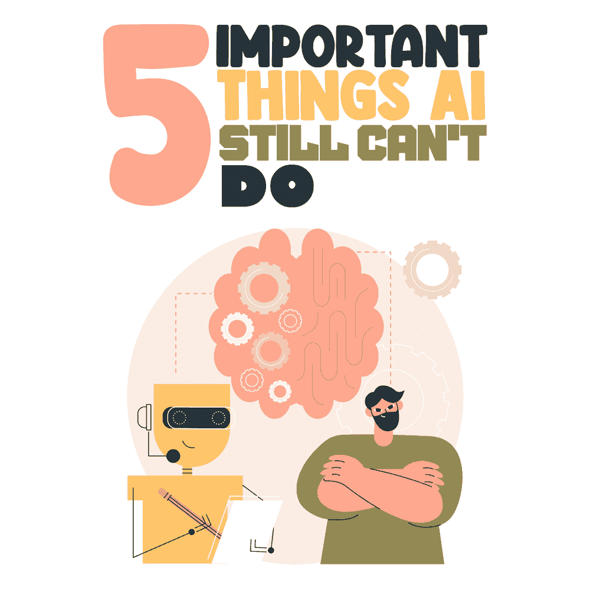
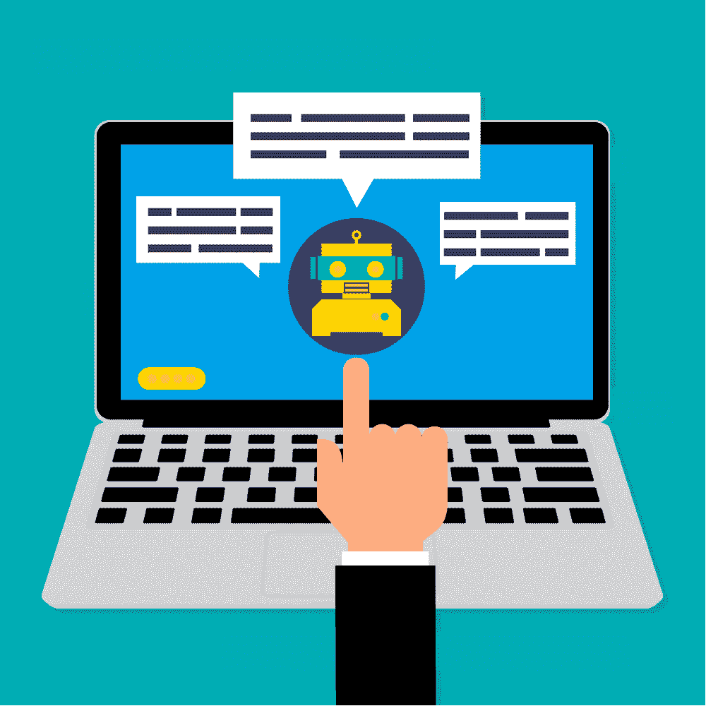

# 5 件重要的事 AI 还做不到

> 原文：<https://simpleprogrammer.com/5-things-ai-cant-do/>

“人工智能可能是人类遇到的最好或最坏的事情。”斯蒂芬·霍金

Artificial intelligence (AI) has been transforming the globe with its many salient features, touching upon our lives personally and professionally. Almost all segments of industry  are influenced by the spread of AI, leveraging its potential to the utmost degree. AI has turned out to be instrumental in bringing other modern-day technologies (like IoT, machine learning, big data, and robotics) closer to us.

此外，最近的疫情已经成为一种催化剂，鼓励商业世界适应基于人工智能的技术，以增强他们的组织。事实上，全球[人工智能市场](https://www.marketsandmarkets.com/Market-Reports/artificial-intelligence-market-74851580.html)的规模预计到 2026 年将达到 3096 亿美元，在预测期间的复合年增长率为 39.7%。

[人工智能一直在扩展技术领域](https://simpleprogrammer.com/ai-ml-transformation-technology-landscape/)，为连续交付、无服务器微服务、流程编排、多云计算和数据分析等多个层面提供服务。它已经为组织产生了大量的经济价值，我们正在目睹人工智能越来越多地参与到我们的日常生活中。

尽管如此，无论技术多么丰富，它也不可能总是胜过人类。还是有一定的局限性；某些活动还不能单独通过人工智能开发来执行。

但是，在我们了解 AI 不能做什么之前，让我们快速浏览一下它的众多功能。

## 人工智能——它能做什么？

人工智能无处不在，无论是在你的企业，你的家庭，还是你的智能手机。你当然可以说人工智能无处不在，对人类非常有用，但它也有自己的问题——隐私问题和故障排除困难，等等。

总的来说，AI 带来了很多东西——有好的也有坏的——我们需要找到一种方法来恰当地使用它并与之共存。

以下是人工智能可以做的一些重要事情:

*   无人驾驶汽车
*   预测你的偏好并提供相关的建议
*   追查非法活动，如贩卖人口或走私
*   帮助诊断和治疗罕见疾病
*   利用人工智能聊天机器人进行类人协助
*   网上购物和广告
*   机器翻译
*   数字个人助理
*   帮助残障人士阅读、书写、视觉、语言、嗅觉、触觉和行动受限
*   玩游戏
*   语音或书面文本中的情感识别
*   家庭和组织中的安全性

还有更多…

## 人工智能——它不能做什么？

与此同时，还有很多事情是 AI 仍然没有能够完成的。尽管人工智能相关机制发展迅速，但仍有一些东西滞后。

简而言之，我们可以说，人工智能不能进行多任务处理，它不能对任何人产生同情或共鸣。因此，人工智能不能完全取代人类劳动，当然也不能取代律师、作家、设计师、开发人员或精神病学家等专业人士。

考虑到这一点，让我们仔细看看 AI 仍然不能做得很好的一些事情。

### AI 不会写软件

无论人工智能有多发达，它都缺乏编写软件代码所需的人类理解能力。开发代码需要大量的人类思维，因为它涉及到错误检测、可能的障碍、客户感知、真实世界场景等。

所有这些思维过程可能无法通过人工智能实现，因为它无法进行更深入的思考。人工智能当然可以帮助寻找模式、软件测试、测试用例生成和测试安排，但它不能自己编写代码。

此外，AI 无法找到恶意软件或进行创意写作。它可以根据指导方针直接创建内容，但必须由人类监督，因为人工智能的创作能力有限，对情感的关注不太真实。

### 人工智能无法凭借同情心、独创性和创新独立完成任务

AI is of great help to humankind, in the sense that we feel it is replacing certain laborious human activities. However, it lacks a few attributes that only humans possess. AI is not able to conceptualize, plan, and create something, given a set of associated goals. It can’t choose objectives and implement activities based on those chosen tasks.

AI 感觉不到任何情绪。它可能试图复制人类的感情，但却不能带来必要的真实性。也许有机器人可以取代人类，但只是在日常工作中，而不是在提供情感服务方面。

在执行复杂任务时，人工智能可能会落后。它可以处理预定义的简单任务，但在处理不确定或复杂的事情时，它可能无法给出完美的结果。

### AI 无法感知原因和影响等式

人工智能技术可以找出详细的模式和数据相关性，前提是它们拥有底层的原始数据。但 AI 无法理解现实生活中的场景，包括它们发生背后的原因以及它们可能产生的任何进一步的影响。

总体而言，人工智能可以在某些情况下发挥作用，但无法理解背后的基本原因。它将无法像我们一样看待世界，这将永远是人类必须填补的空白。

### 人工智能不能自己做出道德决定或发明

人工智能不能自己做出道德决定。它没有任何情感，因此，当必须做出道德判断时，人工智能需要依靠人类的互动。自动驾驶汽车正在流行，但必须有人参与，因为在路上，汽车不能自己做出所有决定。

不可否认，AI 可以帮助加速和自动化，但当涉及到完全创新时，没有人力资源就帮不上忙。AI 擅长按规则来玩，但它不能从一开始就创造规则。它只能根据过去的经验做出决定，不能跳出框框思考。

此外，人工智能不能像人类一样根据当前场景或环境做出即时决定。它坚持自己预先设定的规则，在决策中不涉及道德。

### 人工智能不能利用常识

人类拥有而人工智能没有的一个非常重要的品质是常识。这在所有日常活动中非常重要，这也是人类占上风的地方。人工智能不能用自己的理性来理解任何概念，因为它只依赖于预先定义的事实和数字。

这个世界上有很多事实是因为人类使用的常识而存在的。如果这些事实与一组既定的动作不一致，AI 可能无法感知这些事实。人工智能不能像人类一样，利用环境和经验在心理上准备事物的模型；它只能将原始数据中的关系链接到它正在查看的模型。

## 人工智能发展继续占据主导地位

人工智能和人工智能解决方案在个人和专业层面上对我们的生活都很重要。几乎所有行业领域—医疗保健、交通、金融、娱乐、教育、零售等。—一直受益于人工智能的使用。

是的，正如我们在这篇文章中看到的，有些事情是 AI 目前还无法完成的。但是它的发展方式，以及人工智能开发公司的扩张，未来几年可能会看到人工智能在上述活动中超越人类！只有时间才能告诉我们未来几年人工智能会有多普及。