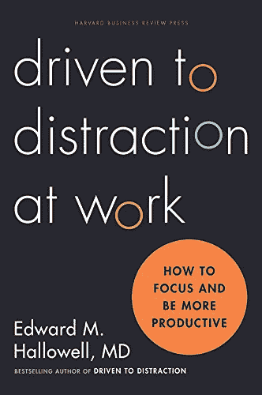
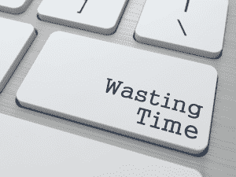

# 摧毁你生产力的 5 种方法

> 原文:[https://simple programmer . com/5 种摧毁你生产力的方法/](https://simpleprogrammer.com/5-ways-to-destroy-your-productivity/)

嘿你。

是啊，你。

想知道如何彻底摧毁你的生产力吗？

很好。你来对地方了。

高产被高估了。

我是说真的。这对你有什么好处？

你做的工作越多，你被要求做的工作就越多。

所以，这里有一些快速提示，可以帮助你确保你在职业生涯中保持现状，永远一事无成。

## 提示 1:留出足够的分心空间

现在，当我写这篇博文的时候，我正在查看脸书，在 Twitter 上发几条推文，和我的狗聊天，跑半程马拉松。

我当然不会坐在这里专注于我的电脑，试图在我写作的时候屏蔽掉其他一切。那就太有效率了。我很有可能在合理的时间内完成这篇博文，然后我会很想再写一篇。

如果你真的想确保尽可能长时间地完成任务，你必须打开所有的浏览器窗口。

说真的。你认为他们为什么会发明标签？

所有现代浏览器都有标签是有原因的。这是因为你应该不断查看是否有人在脸书上发布了一个新的“暴徒生活”视频，或者是否有人转发了你几分钟前发布的那条聪明——哦，如此尖刻——的推特。

哦，别忘了把你的手机调到最大立体声铃声模式。如果有人给你打电话或发短信，这是一个很好的借口，让你在努力工作的 2 分钟里休息一下——这是你应得的。

IM 也是必须的。尝试登录尽可能多的即时消息服务。我推荐 Skype，Google Hangouts，脸书消息，还有 ICQ。(how-owse 宝贝里的 ICQ。)

位置也非常重要。不要躲在你的房间或办公室里。到野外去。没有人喜欢隐士。尽量找一个人多的地方——别想着戴上耳机听古典音乐。

你要活在当下。

与宇宙融为一体。感受潮起潮落。

在你发泄之前，你必须把所有的都放进去。

## 提示 2:试着一次做多件事情

Multi-tasking is the shiznick. Seriously.

你可以假装你做了很多事，但实际上你什么都没做。

没有比像老板一样一心多用更好的爬行方式了。

写代码看电视？摇滚明星！

写电子邮件和同事聊天？多任务忍者！

当你看起来很专注的时候，你甚至可以同时处理多项任务。

让我告诉你真正提升你多任务处理能力的快捷键“alt+tab”(或者 Mac 上的“command+tab”)。)

通过这个简单的按键，你可以在电子表格、ide、浏览器窗口和任何你喜欢的东西之间来回切换，速度快得惊人。

当你变得非常优秀的时候，你可以发展出一种节奏，在这种节奏下，你永远不会在一项任务上停留足够长的时间来完成任何事情。你整天都在换窗户。技术不是福佑吗？

想想写一行代码… alt+tab

检查你的电子邮件… alt+tab

重新思考那行代码… alt+tab

哦，看一封新邮件…

这就像你是超级马里奥，有一个不可战胜的明星，扇着生产力的耳光，大喊“又怎么了，婊子？”

## 提示 3:先处理一堆不重要的垃圾

你知道当你坐在办公桌前，先把最重要的任务敲掉会发生什么吗？

是吗？

好吧，我告诉你会发生什么。

你变成了一个无聊的，小的，拍马屁的，超级多产的，蹩脚的，黄鼠狼。

你想成为一只黄鼠狼吗？

你想得到提升，得到更重要的工作吗？

不，你不知道。

那么，为什么你会在重要的事情上工作，而不是在早上第一件事就是立即查看你的电子邮件和脸书呢？

生产力就是先把最重要的事情做好…优先考虑的人。

如果你这样生活，你会成为 b-o-r-i-n-g。

重要的事情可以等一等。你有一堆小的、不重要的任务需要去做，这些任务要有趣得多。

你知道网上有人是错的吗？

不，说真的。他们是错误的，他们向你的新闻发布错误的东西。

你打算袖手旁观让他们犯错吗？啊，不，你不是。

你得对这些帖子发表评论。你得告诉他们他们错了。你应该分享那些有趣的猫咪视频。

如果你首先关注最重要的事情，这种事情就会被忽略。

如果你忙于重要的工作，那是你永远也抽不出时间去做的事情。

在你弥留之际，你真的认为你会说“伙计，我希望我能过上更有成效、更充实的生活？”

不，你会说“我希望我能分享更多的 YouTube 视频，评论更多的脸书政治帖子，回复一堆不重要的电子邮件。”这就是生活的全部。这些才是重要的事情。

当你回顾你的生活时，它将主要由你赢得了多少场互联网辩论来定义——相信我这一点。

先做不重要的、简单的事情，然后再处理重要的工作。

此外，有时当你忽视工作时，它会神奇地完成。

当我把我的盘子放在桌子上，把我的袜子放在地板上的时候，你认为它们会呆在那里吗？

不，一个神奇的仙女会在我睡觉的时候照顾我。

忽视问题往往会让问题不了了之。

## 秘诀 4:像专家一样拖延

Programmer. Pro-grammer.

你是语法专家吗？

我也不是。

但你知道我擅长什么吗？

疯狂。

没错，你也可以。这并不难，而且这完全是你能做的最好的事情之一，可以直接提高生产力。你可以成为拖延症的查克·诺里斯。

我要教你一个秘密短语，这个短语已经从拖延大师传到拖延学生。(曾经有一段时间，这个短语完全丢失了，因为当时的拖延大师在他真正开始把它传给他的学生之前就去世了，但最终它被重新发现了。)

这句话是“我以后再做。”

让这成为你的咒语。

活下去。呼吸它。

当你坐下来工作时，深呼吸，打开你的 IDE 或文档，然后马上站起来，大声宣布“我以后再做。”

猜猜如果你在到期前完成了某件事会发生什么？

你需要做更多的工作，让它变得更好。

你想做更多的事情吗？我不知道。我宁愿等到最后一分钟，做一个半吊子的工作，并声称这不是我的错，因为我没有时间了。

我的儿子，这就是为什么他们称我为“专业”的攀岩者，而不是业余的攀岩者。

这远没有看起来那么难。事实上，一旦你养成了拖延的习惯，你会发现越来越容易。

一段时间后，你的默认操作模式将是把事情推到最后一分钟。

除非你真的不得不工作，否则你永远也不会真正工作，即使那样——如果你很聪明并致力于“方式”——你仍然会找到避免工作的方法。

但是我必须提醒你，许多疯狂的学生没有达到精通，成为真正的拖延者，因为他们忽略了一些重要的点。

我把它们列在这里，这样你就可以避免这些同样的陷阱:

*   永远不要过早开始一项任务。总是等到最后一分钟。
*   当你坐下来工作的时候，不要工作，[做别的事情](https://simpleprogrammer.com/2015/01/26/work-non-work-things-work/ "Should I Work On Non-Work Things At Work?")。你总可以做一些比工作更有趣的事情。相信你的直觉，你会找到的。
*   工作看起来越大，你就越有可能成功地拖延它。尽可能把任务做得大而不可完成。如果你把它们分解开来，完成它们就很容易，你的拖延症梦想就会被生产力的岩石击碎。

坚持到底，我的朋友，你也会找到“方法”

## 提示 5:要求你做的每一件事都做到完美

有些人认为完美主义是一种弱点——我不这样认为。

如果你想降低你的工作效率，确保你很少完成任何事情，你必须坚定地坚持这样一个理念:如果事情不完美，那就是没有完成。

事实上，只要想想一项任务需要完成得多么完美，就会对完成它产生巨大的阻碍。如果你能设法什么都不做，生产力实际上就完全被摧毁了——任务完成了。

当其他人在运送垃圾和“完成很多工作”时，如果你追求完美主义，你可能根本没有任何产出，但至少你会对你生产的每样东西 100%有信心。

与普遍的看法相反，你应该得到一颗金星，因为你花了几个小时苦苦思索那个算法——那个已经解决了你试图解决的问题的算法——试图再多一点性能或给变量取一个正确的名字。

如果你追求完美，过早优化不仅是你的朋友，而且是你永远的伴侣。

你经常会厌倦试图让事情变得完美——这需要很长时间——所以，如果你继续做下一件事而没有完成第一件事，没有人会责怪你——你以后会再回来。

完美的代码比所谓的“工作代码”好 100 倍，如果你明白我的意思的话。有的人标准更低；你不知道。

当面临运送不是 100%完美的东西和错过最后期限之间的选择时，总是错过最后期限。

你错过的截止日期越多，它们对你来说就越不重要，一旦你对截止日期变得麻木，这就像你从擂台上的最高绳索上跳下来，把生产力丢在脸上！

哇哦儿子！

## 扼杀你的生产力很容易

我知道这 5 个建议可能看起来有点过分，但是不要担心。

一旦你开始把它们付诸实践，它们就会自动出现。

事实上，你可能已经在做这些事情中的几件，而你甚至不知道。但是不要担心这些——你总是可以在明天找到答案。