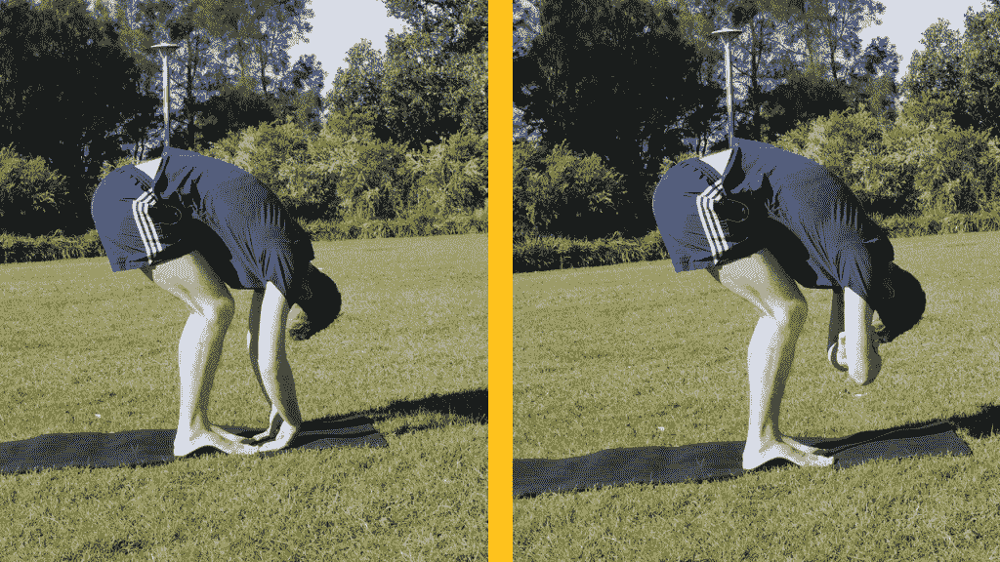
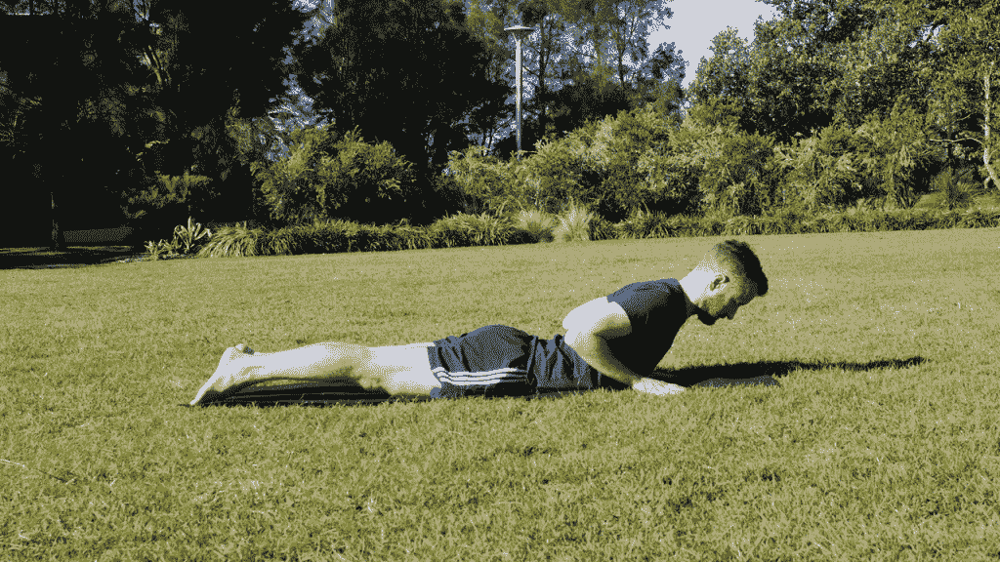
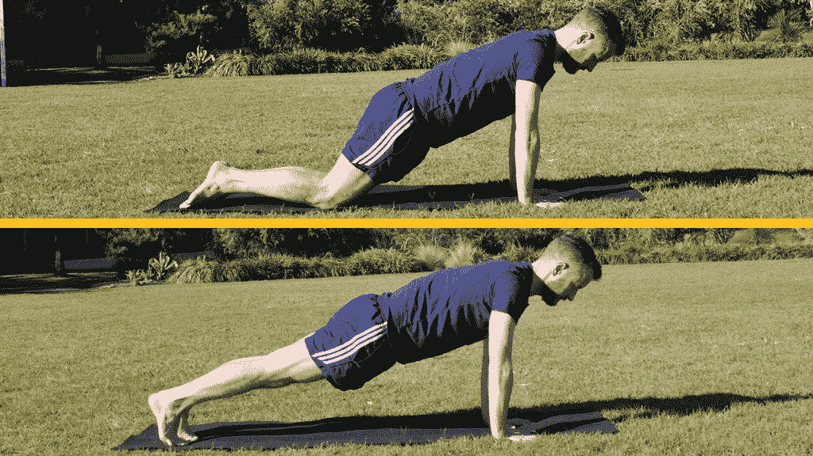
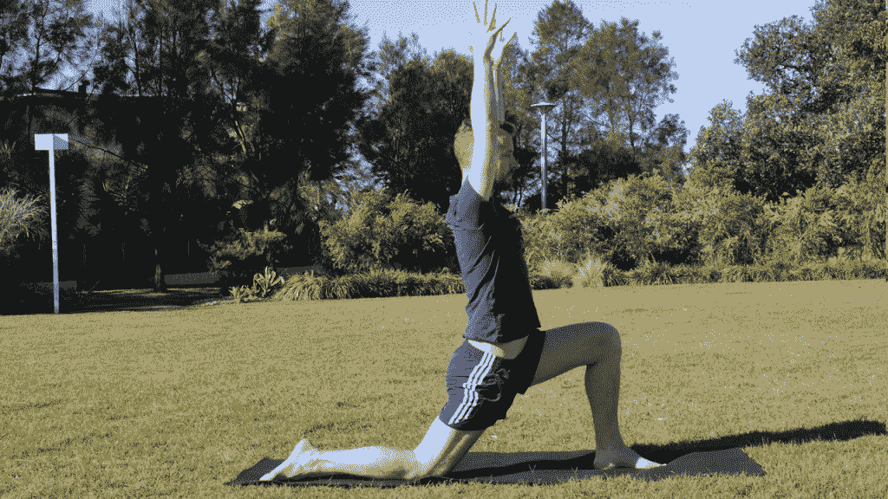
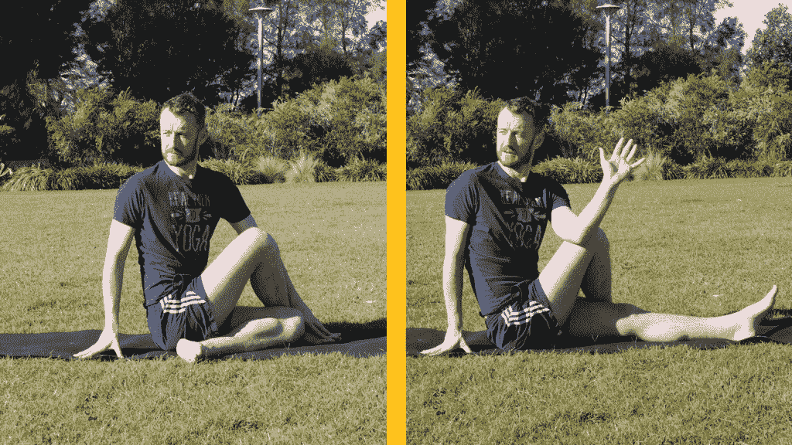

# 每个程序员都应该尝试的 5 个瑜伽姿势

> 原文：<https://simpleprogrammer.com/5-yoga-poses-every-programmer-try/>

你可能还不知道， [**坐着是新的吸烟者**](http://www.mayoclinic.org/healthy-lifestyle/adult-health/expert-answers/sitting/faq-20058005) 。这也是大多数程序员生活中一个非常突出的特点。

编程工作需要你连续几个小时坐在椅子上(除非，像我一样，你是一个在家工作的自由职业者，在这种情况下，你可以连续几个小时坐在沙发上！)

我不知道你怎么想，但是我很喜欢我的脊椎给我带来的灵活性。

我喜欢在非工作时间随心所欲地四处走动。我喜欢许多体育活动，如果没有 33 块精心设计的骨头、大小支撑肌肉、软骨和组成我脊椎的其他组织，我就无法进行这些活动。

当我努力谋生的时候，我特别珍惜我的脊椎让我保持直立。我想尽可能让它保持这种状态。

在我早期的职业生涯中，我不像现在这样善于照顾自己。

我对瑜伽的兴趣始于我完成硕士学位的时候——比我想承认的时间要长得多(好吧，16 年了——哇！)

我去上了第一堂课，看到一些人在做倒立，我觉得这看起来很酷。

我很幸运在我人生的那个阶段发现了瑜伽。

即使在 21 岁的时候，我就已经因为坐太长时间的椅子而饱受背痛的折磨。

无论是坐着还是从事体力活动，我的下背部都会疼痛。我感觉肩膀上有一块结实的紧张感。

我看着驼背的老年人，担心我会像他们一样！

当我刚刚开始我的编程生涯时，我知道在未来的几年里我可能会花更多的时间坐着。我需要一个解决方案。

正确的姿势当然很重要。有一个抵消损害的运动程序也是必要的。[瑜伽符合要求](http://www.amazon.com/exec/obidos/ASIN/149034327X/makithecompsi-20)！

## 坐着的问题

长时间坐着会导致你身体的几个常见问题。

### 椎间盘受压

当整天坐着时，重力会轻轻地将你的椎骨(组成脊柱的骨头)拉在一起，对它们之间珍贵的软骨盘造成压力。

这些光盘非常有用！它们起到韧带的作用，将脊柱连接在一起。它们也可以作为减震器。这对简单的日常活动很重要，比如四处走走。

### 降低强度

坐着的时候，你背部的肌肉会关闭，导致它们变弱。这意味着你不太能保持直立，而且当你移动时更有可能扭伤某些东西。强壮的肌肉防止受伤。

当肌肉使用不当时，它们会变弱。坐着几乎肯定会削弱你的脊椎。

### 臀部屈肌紧绷

当你坐直时，你臀部前部的深层肌肉几乎是永久性的。人体并不是真的被设计成长时间像这样成 90 度角。

髋屈肌激活，以保持骨盆的这种不自然的前倾。这会导致肌肉紧绷和缩短。

这是**不好的**-这意味着你的骨盆灵活性降低，这可能会直接导致腰部疼痛(下背部疼痛)，因为那里的肌肉在正常运动中变得紧张。

### 驼背的肩膀和圆形的上背部

没人想当驼背，对吧？我当然不知道！但是双手伸向键盘坐着，偶尔停下来眯着眼睛看屏幕，这是迈向圣母大学的一步。

### 腹部力量减弱

当你坐着的时候，你的腹部肌肉很容易完全关闭——如上所述，你的臀部屈肌为了让你保持直立而过度工作。

你的腹肌是你核心肌肉结构的重要组成部分。你做的几乎每一个动作都与核心有关——如果你曾经有过肋骨受伤，你就会知道它有多虚弱。

保持核心力量是任何运动养生法的重要组成部分。

### 腿部力量减弱

坐着时，你的臀肌(臀部和大腿上的肌肉)会进入睡眠状态，再次削弱它们。这些肌肉通常对移动很重要，你不会希望这种情况发生的。

那么程序员该怎么做呢？

## 瑜伽如何有所帮助

每个人都知道，起身走动几乎是处理久坐引起的问题的必要手段。

瑜伽提供了一套伟大的运动，直接抵消上述问题。

我将分享我最喜欢的五个姿势，包括如何做的说明，以及它们解决的问题。

> 免责声明和警告:你的身体是一个聪明的装置。如果有什么问题，它可能会以疼痛或严重不适的形式让你知道。如果你感到疼痛，立即停止。T3】

如果这种类型的运动对你来说是新的，放松并倾听你身体发出的信号。

如果任何姿势引起疼痛，轻轻地出来。

如果你的脊柱或身体的任何其他部位感到严重不适或疼痛，请在尝试这些练习之前去看专家。

如果你决定去瑜伽馆，我会把这些体式的梵文名称包括在内——我强烈推荐！

### 向前折叠(乌塔纳萨纳)

**有助于:**脊椎的压缩。

**怎么做:**这个很简单。站直，慢慢从臀部开始向前折叠。当你低下头，双手放在地板上时，开始弯曲膝盖。

当完全折叠时，你的膝盖应该足够弯曲，这样你的下腹部就可以靠在你的大腿上。

在这个体式中，让重力将你的头轻轻地拉向地面。你的椎骨之间会有一个温和的压力暂停，给那些重要的脊椎盘一个喘息的机会。

如果你已经有明显的下背部疼痛，请小心。如果是这种情况，弯曲你的膝盖更深。

随着你的进步:努力伸直你的膝盖。这将提高腿筋的灵活性。

### 眼镜蛇式

**有助于:**这将有助于增强你脊柱周围的肌肉。它还会抵消肩膀驼背，打开胸部。

**怎么做:**俯卧，额头贴地。将双手放在肘部以下的地面上，高度在胸部中间。

让你的大脚趾接触并轻轻压入你下面的地板。

通过向上拉膝盖来激活你的腿。想象你的尾骨向脚跟延伸。激活下背部肌肉的同时，将臀部压向地板。

剥离你的前额、胸部、肩膀，最后双手离开地面。低头看地板，保持你的脖子很长。当你吸气和呼气时，感受你自己的上升和下降。

当你吸气到胸部中央时，在背部中间将肩胛骨的尖端拉在一起。

保持几次呼吸，然后把你的胸部和前额降低到地板上放松。

如果你正受到下背部或椎间盘问题的困扰，请小心。

随着你的进展:朝着蝗虫式(shalabasana)努力。开始时双手面朝下靠着臀部，像以前一样抬起上半身。抬起腿时，保持臀肌活动，脚趾并拢，然后双手离开地面，形成深的全身后弯。

### 平板姿势(Uttihita Chaturanga Dandasana)

**有助于:**通过核心部位强化，包括腹部和肩部。增加臂力。

**怎么做:**这是一个高俯卧撑的姿势。从你的手和膝盖开始，手腕稍微在你的肩膀前面。

将你的重量放在手上，膝盖离开地板，这样你的身体从脚跟到头顶形成一条直线。

通过你的脚后跟向后压，通过拉起你的膝盖骨来打开你的腿。向脚跟方向拉长尾骨。向手掌的四个角推进，将下腹部轻轻拉向脊柱。

如果你愿意，你可以跪在地板上来一个稍微不那么激烈的版本。

要出来，慢慢降低到地板上——看看你是否能让你的胸部和腹部同时接触到地板！

如果您最近或长期肩部或手臂受伤或脊椎受伤，请小心。

随着你的进展:当你保持整个身体的长度时，降低你自己平躺在地板上，脸贴着地面。从这里，你可以推回木板，或上升到眼镜蛇上面。

### 低弓步

**有助于:**这个体式非常适合锻炼紧绷的臀部屈肌。

**怎么做:**开始向前折叠，如上。向后伸展右腿，将右膝放在地板上。松开你的脚趾，让它们指向你的背后，右脚尖放在地板上。

花点时间找到你的平衡点。吸气，双手举过头顶，同时抬高躯干。你的前(左)膝保持在你的前脚踝上方。将你的前脚轻轻压向地板。

你的肩膀靠在臀部上。张开手指，将头顶向天花板延伸。

回到折叠状态，在另一边重复

如果你有任何明显的臀部或膝盖问题，请小心。卷起来的毛巾可以作为你后膝的不错的垫子。

### 坐姿转体(Ardha Matsyendrasana)

**有助于:**臀部的活动范围和脊椎压缩。

如何做:开始时坐着，双腿伸直。从地板上抬起你的臀部通常是一个好主意，也许用一条折叠的毛巾或垫子。弯曲你的膝盖，让你的脚平放在地板上。

将左大腿外侧放在地板上，左膝向前。将右脚跨在左膝盖上——你的右膝盖仍然指向天花板，脚仍然平放在地板上。

随着吸气，当你的头顶到达天花板时，将尾骨向地板内拉长——你在感觉脊椎的长度。将右脚压向地板，呼气时，向右扭转身体。将右手指尖放在身后的地板上会有所帮助。

每一次吸气，感受身体前部的长度，拉长脊柱。当你呼气的时候，慢慢地向转体深处放松。

如果你正遭受任何形式的脊椎损伤，请小心。

随着你的进步:如果你感觉到了灵活性，你可以把你的左肘钩在你的右膝之外。

## 去做瑜伽吧

由于工作的久坐性质，程序员需要积极工作来保护和加强他们的身体。健康的头脑存在于健康的身体里。

现代瑜伽融合了古老的东方实践和哲学，以及来自西方体操训练的最新技术。对于程序员或者任何长时间坐着的人来说，这是一个很好的工具。

你不需要通过练习的哲学层面来保护你的脊椎——尽管我需要，并且已经看到了巨大的精神和身体益处。

单独练习这些体式[会有好处](https://simpleprogrammer.com/2015/12/07/your-fitness-goals-are-all-wrong/)。每个体式都是为了照顾你的肌肉骨骼系统的一些相关部分而设计的。

一堂好的瑜伽课将开始从一个体式到另一个体式按顺序流动。一个知识渊博的老师会创造平衡力量和灵活性的序列。我完全推荐你尝试一个！

我制作了一个简短的视频，解释如何从这些姿势中构建一个序列。如果你想在收件箱里收到一份免费的，请告诉我。