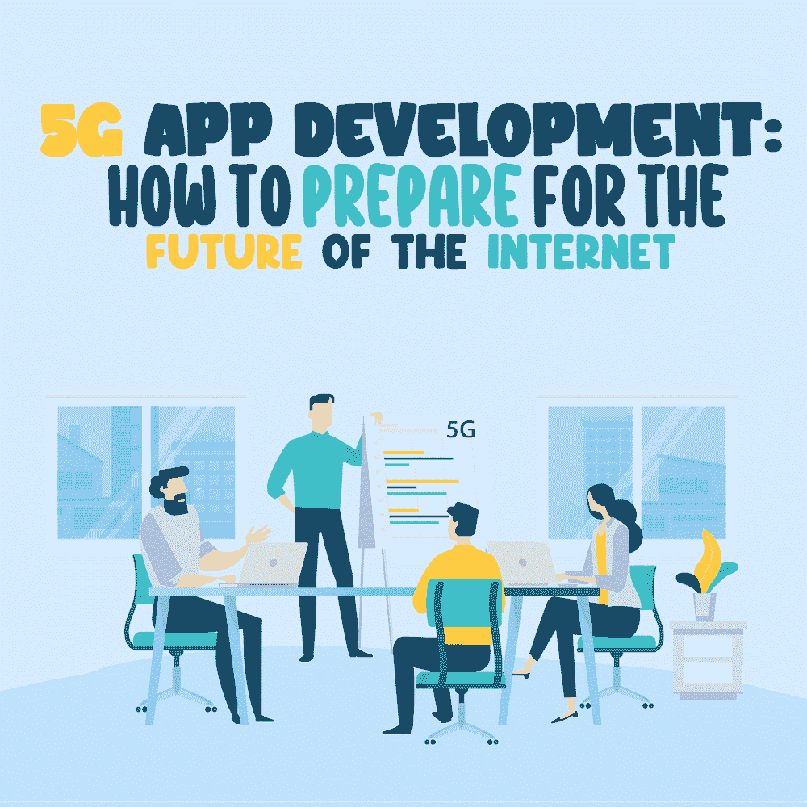

# 5G 应用开发:如何为互联网的未来做准备

> 原文：<https://simpleprogrammer.com/5g-app-development/>

5G is the fifth generation of broadband cellular mobile networks and is expected to bring a huge change in the world of wireless technology. As a significant upgrade to the existing 4G network, 5G will provide faster download speeds, wider coverage, and stable connectivity.

此外，5G 的核心属性使其成为支持互联网未来需求的关键投资——正如我们将在下面更详细地看到的那样，5G 不仅仅是 4G 的更好版本。根据移动经济报告，5G 预计将在 2025 年达到 20 亿用户。

不可避免的是，像 5G 这样强大的升级也可能对软件开发产生影响。因此，5G 对于程序员来说是一个巨大的机会，他们可以利用最新技术展示自己的技能，并通过下一代移动应用提供更好的用户体验。以下是开发人员如何准备他们的移动应用程序，以充分利用 5G。

## 5G 与之前的一切有何不同

正如我上面提到的，5G 不仅仅是 4G 的改进版本。基于其特性，5G 承诺提供以下功能:

*   高速无线连接。5G 的数据速率有望达到 10 Gbps，这是对现有 4G 的重大改进。
*   低延迟。5G 配备了超可靠的低延迟通信，将能够在数毫秒内交付数据，而在 4G 网络上通常需要更长时间。
*   更大的带宽。5G 网络有望在广泛的移动应用中实现更好的连接。

作为重大增强的结果，5G 将为网络上的数据传输提供更高的安全级别。记住这一点，开发人员将不得不致力于更安全的认证方式，如生物识别措施。除此之外，由于 5G 在连接和延迟方面的问题很少，开发者可以为移动应用引入新功能，而不必担心性能。让我们更详细地了解一下。

## 无缝采用人工智能

5G 将成为物联网的游戏规则改变者。高连接速度将使可穿戴设备、智能设备和基于传感器的设备更广泛地采用物联网。与此同时，开发人员还可以将人工智能(AI)和机器学习(ML)应用到他们的移动应用程序中，以提供更智能的服务。在人工智能集成应用的帮助下，开发人员可以提供强大的身份认证，以确保安全可靠的网络数据分发。

此外，为了确保个性化的体验，开发人员可以利用 5G 网络上的人工智能，并致力于语音识别和自动聊天等功能。这对于为高度移动环境设计的应用程序非常有帮助，因为在这种环境中，用户不能不断地输入他们的需求。

此外，开发者可以致力于收集用户数据的自学应用，以提高参与度。在当今竞争激烈的市场中，提供相关内容极其重要，随着 5G 的到来，这将变得更加简单。

未来 5G 的崛起将使人工智能在移动应用中的采用不可避免。以此为线索，开始学习你需要知道的关于人工智能开发如何工作的知识。专注于 Java、C++、Python 等 AI 的编程语言。

接下来，尝试熟悉先进的大数据技术，因为人工智能开发人员必须处理大量数据。虽然理论学习是额外收获，但不要忘记软技能。参与有助于提高你的商业智能技能的项目，以发展商业投资。

## 沉浸式游戏的快速流媒体

5G 承诺覆盖范围广，下载速度更快，连接稳定——所有这些功能都有望将增强现实(AR)游戏提升到一个新的水平。由于超高速流媒体，AR 和 360 视频可以帮助推动用户参与。使用 5G，开发者将有机会构建高质量的移动应用，让用户体验身临其境的游戏。

5G 的低延迟将在交付流畅游戏中发挥巨大作用，即使网络上有大量并发用户。这种改进对于用户要求最小延迟的竞技游戏来说至关重要。根据这些更新，开发者可以专注于多人在线游戏，因为 5G 将更容易支持这些游戏。

为了[建立一个涉及 AR 和 VR](https://simpleprogrammer.com/programmers-competitive-vr-gaming-industry/) 的移动应用，开发者必须适应使用 Unity 或 Unreal 这样的游戏引擎。此类引擎使您能够构建 3D 设置。除了游戏引擎，你还需要熟悉 C++、Javascript 和 Swift 等编程语言。作为一名有抱负的 AR/VR 开发人员，你的首选资源必须是编码训练营，它可以让你在短时间内快速上手。

## 探索远程机器连接

机器遥控在全世界都有巨大的潜力。随着 5G 技术的到来，现在可以在对人来说太危险的环境中远程控制机器。在发生灾害时，应急响应人员需要实时图像访问来执行时间敏感的行动。在 5G 的支持下，响应者可以获得 4K 视频质量，以控制无人机并有效地执行搜索。

那么，这一切对你来说意味着什么？作为一名渴望充分利用 5G 的开发人员，远程机器连接可能是一个新的探索领域。一个很好的例子是无人机控制应用程序。首先，您需要一个合适的软件开发工具包(SDK)以及一些应用程序编程接口(API)。关注非功能性需求(nfr)是很重要的，比如可伸缩性、性能、维护和安全性。

测试是开发一个好的无人机控制应用的关键。为了进行成功的测试，请确保您的应用程序可以在各种手机上运行——您的团队可以帮助您访问云中的数百台设备进行测试。最后，跟上远程机器访问或无人机行业的最新发展。仔细阅读将有助于你迎合相关市场和顾客的需求。

## 瞄准正确的行业

The 5G technology is slowly rolling out to multiple different industries with notable applications. Stakeholders are making arrangements to install 5G on a massive scale in order to bring out substantial change. As a developer you must be aware of where 5G is going to have the most impact and how you can use it to your advantage. Making just any mobile application is not going to have much value unless it's targeted toward the right industry.

制造业是一个主要行业，5G 将用于实时监控数百万件物品的状态。在这里，运行在 5G 网络上的物联网、机器人和自动驾驶汽车等技术已经节省了 50%的时间，提高了 30%的生产率。

受益于 5G 的下一个大行业是医疗保健。在医院，5G 能做的远不止跟踪设备。提示远程医疗:5G 将通过可穿戴设备实现远程监控，并让外科医生在不同的位置对患者进行手术。

另一个值得关注的可行行业是零售业。5G 将通过超精确的跟踪能力优化供应链运营。除此之外，AR/VR 的整合将改变消费者和品牌的互动方式，让顾客只需通过智能手机就能进入实体店。

记住这些例子，可以说一旦 5G 进入市场，开发者将有无限的机会。然而，作为一名开发人员，你应该专攻你感兴趣的领域。5G 的大规模实施仍在进行中，这给了你时间来探索你的优势，并了解更多对你有用的东西。

## 了解环境计算

5G 的采用是新技术融入我们日常生活的一条途径。这些天被大肆宣传的一种这样的技术被称为环境计算。环境计算的目标是减少机器和人类之间的互动。启用环境计算后，您将无需主动与设备交互；相反，设备会对你的动作做出反应。

5G 的大规模采用将促进环境计算在日常生活中的普及。提示移动应用程序开发:环境计算是一个具有巨大潜力的领域。虽然环境计算听起来很像物联网，但还是有一些区别。物联网仍然被认为是以屏幕为中心的，而“环境”技术的目标是完全消除设备的作用。

一些环境应用的例子包括自动驾驶汽车和自动传感器，以检测设备的磨损和撕裂，以安排维护。

作为一名开发者，你需要工具来帮助你创造以应用为中心的技术，比如 [Flutter](https://developers.googleblog.com/2019/12/flutter-ui-ambient-computing.html) 。通过使用 Flutter，你可以专注于创建应用程序，而不是考虑迎合某个设备。要使用 Flutter 进行开发，你需要学习一种叫做 Dart 的编程语言——主要专注于移动和 web 应用程序的前端开发。

## 拥抱即将到来的 5G 革命

5G 技术即将到来，你应该为此做好准备。由于其高速连接和带宽，5G 将提供前所未有的优势。凭借物联网、AR/VR 和远程机器控制等独特功能，5G 是你探索兴趣和跳出舒适区的信号。作为一名开发人员，你应该专注于驱动你激情的领域，并获得追求激情的技能。

5G 的采用将消除许多开发限制，这将是程序员构建具有新功能和解决方案的应用的巨大机会。因此，开发行业将慢慢改变步伐，适应 5G 提供的新稳定性。

限制越少，意味着创建高性能应用程序的自由度越大。因此，现在是做好准备的时候了——学习技能，实践工具，准备好正面面对互联网革命！