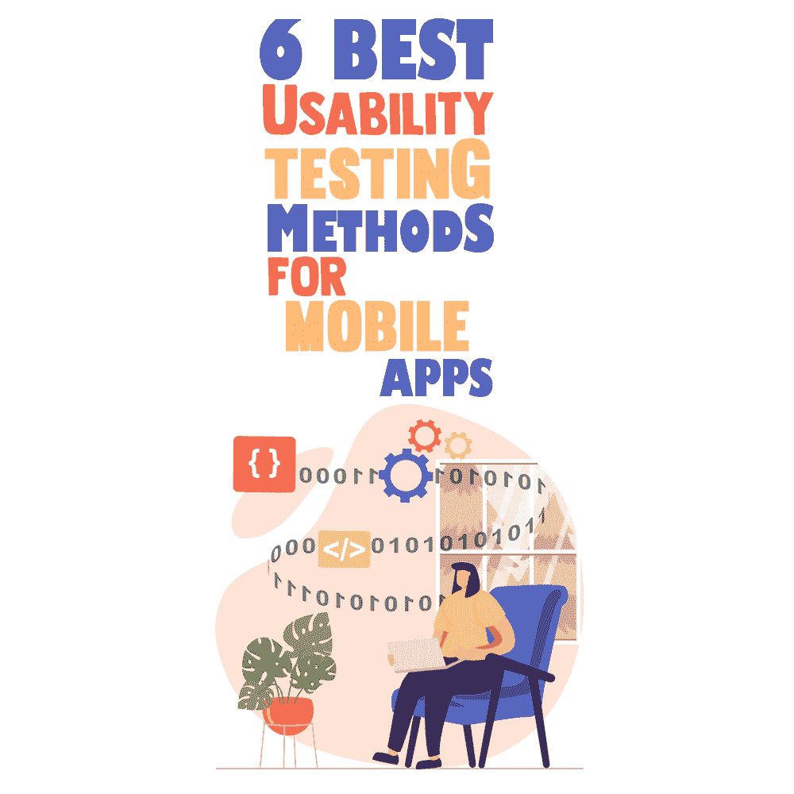
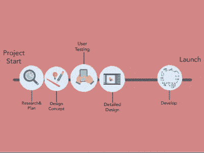
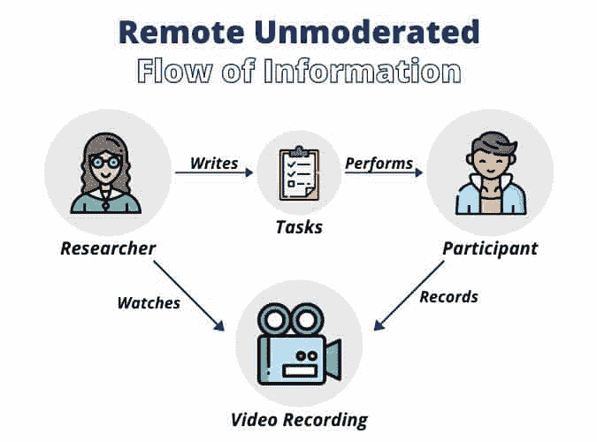
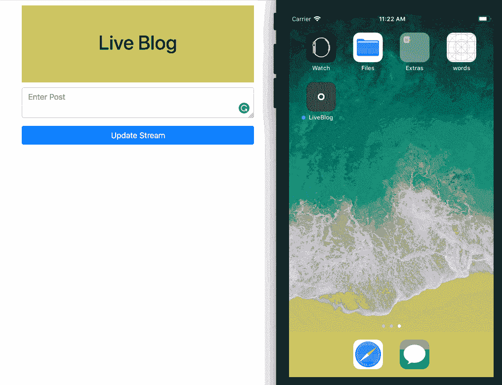

# 移动应用的 6 种最佳可用性测试方法

> 原文：<https://simpleprogrammer.com/6-best-usability-testing-methods-for-mobile-apps/>

Around [22% of mobile phone users](https://www.statista.com/statistics/1224510/time-spent-per-day-on-smartphone-us/), aged 25-40 years, spend 3-4 hours on their phones—and that even excludes checking work-related emails.

除了上网，人们往往会在聊天工具、约会应用、电子商务应用、股市应用等移动应用上花费大量时间。如果一个手机 app 的 UI 很混乱，这个 app 就不会获得用户。

因此，移动应用程序用户测试对于通过修复问题来优化您的应用程序至关重要，无论问题是大是小，都可以实现无缝的用户体验。

Play Store 和 App Store 充斥着数不清的应用，但大多数都没能留下印记。想知道为什么会这样吗？这背后的可能原因是什么？

答案如下:

一个小漏洞成为不同应用无法取悦用户的最大陷阱。呆滞的用户界面，缺乏功能，糟糕的用户体验，以及不充分的[移动应用程序可用性测试](https://www.resourcifi.com/blog/app-development/?utm_source=SimpleProgrammer&utm_medium=offsite)是击败应用程序的一些常见原因。

在这篇文章中，我将向你展示所有你需要知道的移动应用程序可用性测试方法。从准备和测试方法(以及何时实施)到最佳实践和测试工具，在你读完之后，你会对移动应用开发的这个重要领域有更好的理解。

## 可用性测试准备

在进行可用性测试之前，与团队讨论几个要点可以减少潜在的麻烦。讨论将有助于确定目标，缩小范围，并选择正确的移动应用程序可用性测试方法。

通过关注团队讨论中已经确定的目标，可以更容易地理解用户对整体产品设计和核心功能的想法:

*   用户将如何**导航**应用程序
*   如何执行特定任务
*   特定任务的**持续时间**是多少
*   应用程序内容的**易懂程度**

在获得一组目标的清晰图像之后，接下来就是理解用户测试元素。

### 用户测试元素

用户测试元素对于设置移动应用的线框是至关重要的。以下是 android 和 iOS 移动应用程序的移动应用程序用户测试的步骤列表:

*   创建原型
*   规划预先测试
*   设计测试计划
*   建立测试组
*   进行测试并获得结果
*   改善用户收到的移动应用程序

来源:媒体

## 移动应用可用性测试方法

*“如何测试手机 app 可用性”*是一个有待回答的问题。执行移动应用可用性测试的最佳方法是什么？接下来，我们将揭示移动应用程序最突出的可用性测试方法。

### 适度测试(面对面测试)

**实验室测试-** 实验室测试评估用户在应用程序上完成一组定义的任务的简单程度。这些测试非常昂贵，并且是在受限的环境中进行的，这意味着它们不能反映实际的客户群。

**游击测试**–[游击测试简化了移动应用程序的可用性](https://simpleprogrammer.com/devops-in-mobile-application-development/)。它允许在虚拟环境中执行测试。公司经常随机选择测试参与者进行游击测试，以换取丰厚的优惠或优惠券。

### 远程测试

**视频通话**——这是测试团队远程工作时广泛使用的可用性测试方法之一。参与者受到监控，他们的工作被远程跟踪，也称为眼球跟踪。

作为测试移动应用程序的经济解决方案，这种方法有助于在更短的时间内从广泛的区域获得更多的数据。

来源:苗条身材

**卡片分类-** 卡片分类是一种相当有趣的手机 app 可用性测试方法。有趣的是*包含了目标受众。*

合适的受众有助于为他们设计的应用程序的发展。当测试团队包括测试应用程序的预期受众时，应用程序在各方面的增长都得到了保证。这将有助于根据目标受众对应用程序的使用情况获得更好的理解。如果目标受众是多样化的，那么把他们都作为目标受众会带来更好的效果。

### 会话记录

会话记录被认为是一种有效的可用性测试方法。记录用户会话的音频和视频，以检测设计和可用性问题。这是一种可靠的方法，因为它有助于应用程序开发人员在个人与应用程序交互时解决可用性问题。

## 何时实施移动应用可用性测试方法

移动应用可用性测试是一个简化的过程。目标受众使用该应用程序，并就他们面临的现有问题提供反馈。开发团队和测试团队一起分析不满来修复故障。

每个应用程序的测试阶段因开发阶段而异。下面，你可以找到一个移动应用可用性测试方法的列表:

### 原型用户测试

原型用户测试是当你还在设置整个应用程序的线框时应该实施的方法。使用这种方法，您将节省大量时间和资源。

### MVP 用户测试

MVP 用户测试是在移动应用的初始版本推出之前必须实施的方法。进行最大限度的可用性测试有助于调整所有可能影响最终版本功能的部分。

### 实时应用测试

实时应用测试是最常见的可用性测试方法。在启动应用程序后不久，从用户那里收集数据。基于他们的输入，您可以继续进行进一步的更改和修改或修复错误。

[来源:推手](https://images.ctfassets.net/1es3ne0caaid/DXndn8OaXYOsmIYImoc4g/57197aefae945c69127b5289f6566b3c/swift-liveblog-demo.gif)

## 移动应用可用性测试实践

遵循某些实践对于[移动应用用户测试](https://www.amazon.com/dp/0134191714/makithecompsi-20)至关重要。通过遵循这些实践，克服细微差别和挑战并不令人畏惧。这些建议有助于成功部署移动应用。

### 去掉原型

通过在实际的 Android 和 iOS 设备上进行测试，您可以获得与移动应用程序设计相关的更好的见解。在不同的设备上使用它会产生不同的结果，最终，可以毫不费力地解决与设备兼容性相关的问题。

### 多样化测试组

多样化的选择总是会产生更好的想法，有助于构建更好的移动应用。在测试组中召集不同的移动用户，以获得不同的结果。如果你的目标受众是不同年龄段的人，那么把他们包括进来会带来最好的效果。

### 团队规模很重要

为了确保移动应用程序能够维持激烈的竞争，请确保测试组由五名以上的参与者组成。团队中不同的头脑可以很容易地解决大多数与应用程序设计相关的问题。

例如，如果测试组中有七名成员，那么每个成员都可以使用应用程序来分享有助于提高应用程序性能的想法。

### 注意测试环境

用户将在不同的环境中使用应用程序，这是显而易见的。因此，您必须考虑测试环境。搭建测试环境，必备的包括网络、服务器、系统和应用、前端运行环境等。

测试环境将有助于解决用户面临的可用性问题。为了确保没有任何东西妨碍测试过程，环境中的每个包含都应该更新到最新版本。

### 简短的测试会议

除了移动可用性测试之外，第二重要的优先级应该是测试会话的持续时间。尽管一切都取决于进度，但是所有参与可用性测试的团队成员都必须尽最大努力来保持测试进度。

保持测试持续时间短将会节省资源和时间。此外，它还将有助于解决最初的问题或缺陷。

## 可用性测试工具

以下列表将帮助您选择合适的工具来检查移动应用程序的[可用性。使用这些工具可以减少可能的障碍，并有助于创建一个视觉上令人愉悦的移动应用程序。](https://www.amazon.com/dp/B07H7WBDQL/makithecompsi-20)

*   **回望。**提供不同的功能，如在移动会话中捕捉屏幕触摸、创建精彩片段、构建精彩片段卷、与团队轻松协作、导出数据等。
*   用户缩放。 UserZoom 是首选，因为它易于使用，快捷，有助于快速创建调查。
*   **用户分析。** UserLytics 已针对团队会议、测试时的实时对话、树测试、多通道测试等进行了配置。
*   **CleverTap。**它是移动应用程序开发和测试行业初创公司的完美工具。它具有用户识别、活动、营销运作等功能。

## 有了正确的方法，一切都变得简单了

移动应用程序可用性测试似乎是一项具有挑战性的任务。但是，当你通过选择正确的方法为可用性测试过程设定目标时，所有的障碍都会消失。

从学习如何做好准备到选择最佳的可用性测试方法并知道何时实施，如果你遵循我在这篇文章中强调的最佳实践，测试你的移动应用程序的过程将会大大简化。

最后但同样重要的是，使用上面提到的测试工具，如 LookBack、UserZoom、CleverTap 和 Userlytics，将有助于测量应用程序的[成功率。仔细改编一切，见证 app 下载量的不断增加。](https://simpleprogrammer.com/mobile-app-development-knowledge-useful/)