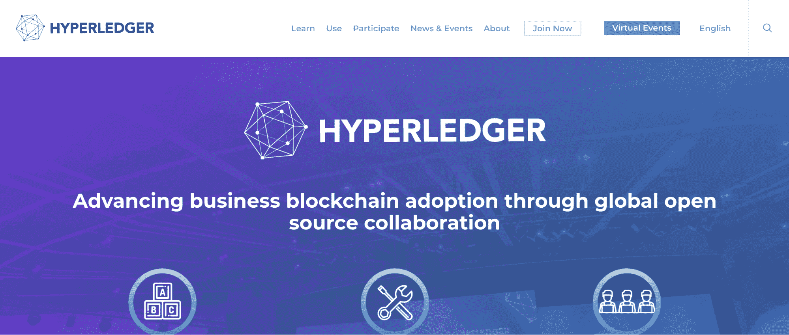
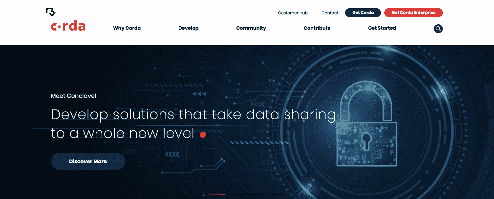
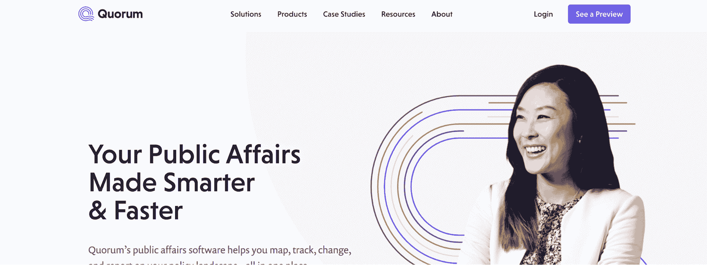
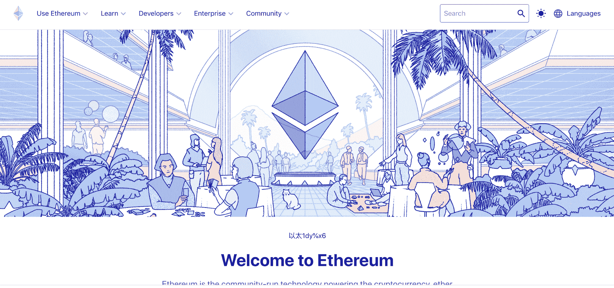
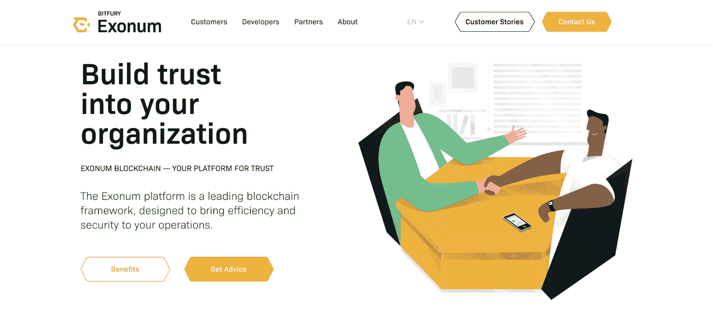
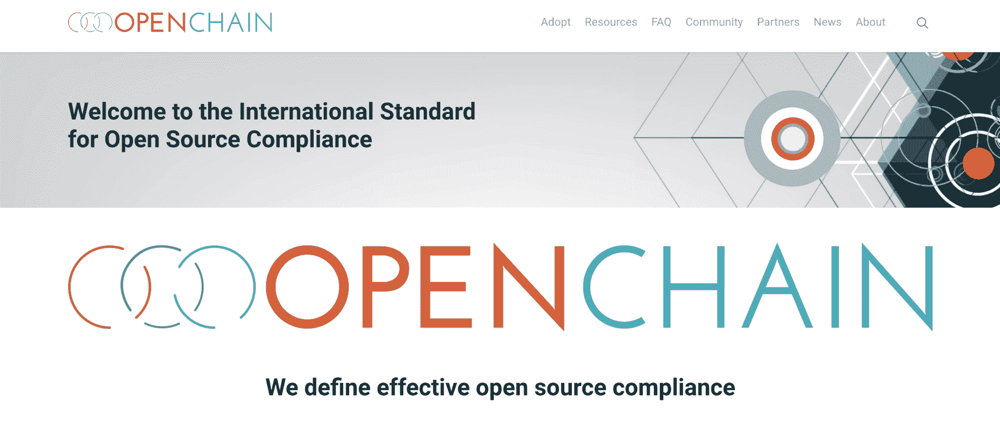
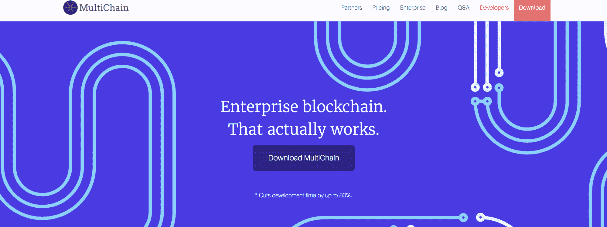

# 区块链应用的 7 大最佳框架

> 原文：<https://simpleprogrammer.com/7-best-frameworks-blockchain-apps/>

想象一个你想盖房子的情况。为此你需要开发一个项目或者买一个现成的。在第二种情况下，你将能够编辑房间的布局、装饰和小东西，但像主墙、污水和电力等东西将保持不变。同时，它将大大简化和加快建设进程。

区块链框架也是如此。它们是专门为加速[开发过程](https://simpleprogrammer.com/beginners-blockchain-programming/)而设计的模板。这里的一切都是经过深思熟虑的:你的程序或网站将如何工作；它将如何与数据库、支付系统等交互。

在这篇文章中，我将与你分享区块链应用的七大框架。尽管所有这些都被认为是最好的，但它们确实有个体差异，了解它们可以帮助您了解哪一个最适合您的需求。

## 超总帐会计管理系统

2016 年出现的一个[开源](https://simpleprogrammer.com/open-source-crisis-management/)框架。Hyperledger 的模块化系统允许定制特定的交易和项目。使用它，可以隐藏只对相关用户可用的频道和信息。

共识的广义解释允许一个稳定的大规模系统。有机会根据您的需求创建区块链解决方案，使用数据搜索，并获得智能合同支持。

Hyperledger 在流行的编程语言中工作，如 [Java](https://www.amazon.com/dp/0131872486/makithecompsi-20) 、 [Golang](https://www.amazon.com/dp/0134190440/makithecompsi-20) 等。它为开发人员提供了开放的网络连接，并且在业务逻辑上的一致使流程自动化。它还消除了交易参与者之间的相互信任问题。

与专注于基于[加密货币的区块链](https://www.scnsoft.com/software-development/blockchain)模型的其他框架不同，Hyperledger 的运营目标是区块链的模块化构建模块，以便在全球解决方案中获得支持。

## 金色琴弦

这个框架是由 R3 CEV 联盟创建的。其主要任务是记录和监控受监管金融机构之间金融交易的执行和同步。

该平台将记录在登记册上并向公众开放(即向其他参与者开放)的数据与从未进入登记册的数据分开。后者中的变化借助于必须被验证(遵守由合作方预先确定的规则)和唯一(100%唯一的意思是通过相应的分析器程序)的交易而发生。

在这个框架中，该系统只是部分开源，因为它涉及第三方开发商和供应商。

## 法定人数

摩根大通开发的开源框架。交易以一百比一秒的速度执行。平台上有一个预先规划的选项。

根据模块化系统保持操作原理。该平台开发的动作旨在编写与各种编程语言兼容的代码。总的来说，该系统具有类似以太坊的特征，因为它是其原型。

编码和逻辑和以太坊很像。Quorum 使用 Truffle 和 Remix，Solidity 工具来实现它的工作。界面清晰，并给出了关于行动顺序和发展计划的建议。所以没有客观的理由去寻求昂贵的程序员的专业服务。

## 以太坊

以太坊是第一个为加密行业所知的平台。在技术层面，可以区分“交易”层和“智能合同”层。这允许 ico 和 DApps 在平台上执行。

该框架是开源的。有了它，你可以用一种标准化的方式放置代币。以太坊已经出色地证明了自己是一个没有财务基础的解决方案平台。以太坊的重点是维护银行和相关行业的交易和合同的匿名性。

## 外来地名

Exonum 是一个软件包，其行动旨在基于区块链技术的信息分散存储。这种框架的优点包括每个参与者无一例外的开放动作、容错性、易审计性、数据的紧凑性以及对信息的全天候访问。

Exonum 可防止复式记账并消除文件欺诈，是公司财务系统的绝佳选择。高速允许每秒处理大约 5，000 个事务。

## 开链

该系统基于 RR 实例，每个实例都可以连接到自己的管理员。一项资产的所有要素都可以完全控制与之相关的所有交易。完全控制数字资产的生命周期是可能的。

该框架的一些功能包括可扩展性和速度、与区块链绑定的比特币、拥有自己的接口、简单的技术组件(SQL、API、JSON)、框架内的层次结构、在节点内交换和验证交易的自有规则、创建管理员的能力以及开源。

Openchain 解决方案使金融机构能够高效地管理各级流程。

## 多链

MultiChain 是一个用于构建私有链应用程序的开源平台。该框架旨在通过限制分类账的可见性、允许机构对交易进行控制以及放弃分布式挖掘来消除与比特币相关的问题。

主要优势包括:同时支持多种货币，能够在参与者之间交换资产，快速部署等。

它旨在使开发人员能够快速、轻松地创建区块链和应用程序。

## 有许多选择，许多好的选择

这些区块链应用的框架当然是最好的。然而，正如我在这篇文章中向你展示的，它们并不完全相同。有选择——事实上，有许多好的选择——但是一个选择只有在服务于这些需求时才是适合您的需求的。

为了弄清楚哪个框架最适合你，你需要了解它是如何工作的，它对你来说有多直观，以及某些系统是如何工作的。为了了解哪一个最适合你，你必须亲自和每个人一起工作，也许不止一次。