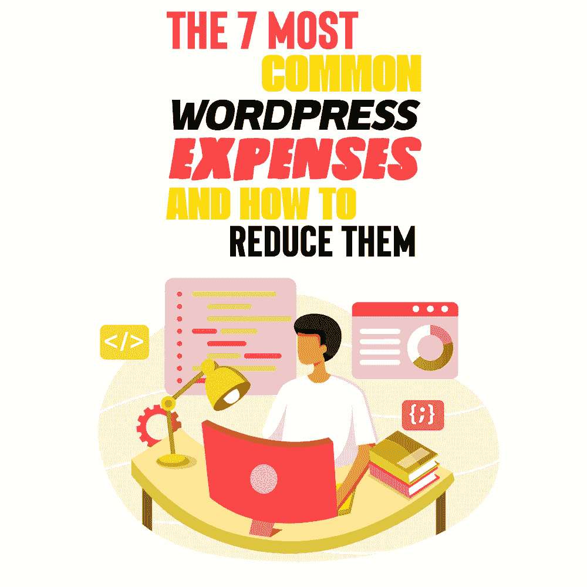

# 7 种最常见的 WordPress 费用以及如何减少它们

> 原文：<https://simpleprogrammer.com/7-common-wordpress-expenses/>

As a business owner, your first thought when making your website is probably to use WordPress. While WordPress claims to be free, if you truly want your website to run as a head-on competition to the rest of the market, you’re going to have to take on several “add-on” costs.

这些包括让你的搜索引擎优化更好的插件，设计和高级主题，虚拟主机服务，让客户互动体验更好的应用，等等。最重要的是，你需要雇佣一个专门处理你的内容和功能的 WordPress 开发者。

在这篇文章中，我将分享你需要知道的一切，保持跟踪，并控制减少 [WordPress 费用](https://www.amazon.com/dp/1539991849/makithecompsi-20)而不损害你的生产力。我会教你如何在不增加成本的情况下提高工作质量。

## WordPress 费用的类别

我们可以将 WordPress 的费用大致分为两类:**专业费用**和**网站相关费用**。在我们考虑如何减少这些费用之前，了解它们的基础是很重要的。

当谈到 WordPress 开发者的**专业费用**时，所涉及的费用是不言而喻的:这些费用取决于开发者的经验水平、你想要完成的工作量、你想要你的网站有多精致以及你的目标和期望。他们的价格也将取决于你想要多少维护，定期更新网站。

开发者的费用从几百美元到几千美元不等。一个业内的业余爱好者不会像 WordPress 开发者一样拥有相同的实践技能，这就是为什么他们通常挣得少。您可以根据每个人的方便程度选择按项目、按小时或按月付费。

**网站相关费用**包括为提升您的网站体验而增加的各种不同费用。正如我之前解释的那样，WordPress 本身是免费的，但是像大多数免费增值模式一样。他们希望你为额外的功能付费，这些功能在初级阶段之后变得必不可少。

所有这些功能都需要钱！

如果没有像 Grammarly 这样的语法检查应用程序，制作优秀的网站是很有挑战性的。你的搜索引擎优化需要通过像 Yoast 插件增强。此外，你可能会使用像海明威这样的应用程序来增强语言，以最适合大多数读者能够理解的风格。

根据你的项目，你可能想要一个专业的或者简单的设计，你可能希望某些主题和设计与你的品牌相匹配。也许你更喜欢面向客户的交互设计。其他应用程序，如基于人工智能的聊天机器人、自动电子邮件服务、WhatsApp 通信，也几乎是必不可少的。您可能还想将电子商务选项链接到您的门户网站。因此，我们看到开发者费用不仅仅是支付给个人的工作费用。它们还包括一些不可避免的“其他”费用。减少它们的第一步是学习如何追踪它们。

## 跟踪费用的重要性

管理任何业务费用，甚至个人费用的最好方法是有一个跟踪机制。费用跟踪有助于您以多种方式管理预算。

第一个好处是它可以帮助你做出合理的预算决策。[费用追踪](https://www.wellybox.com/blog/expense-tracking-101/)也有助于计算税款以及预测公司的未来。跟踪 WordPress 开发费用有助于在预算范围内修复整个门户。

这促进了健康的财务习惯，比如保持储蓄和财务控制你的 WordPress 网站。此外，了解你的支出可以让开发商负责——在期限和预算方面——并增加财务安全和减少财务压力。

最终，跟踪费用有助于开发者实现你设定的目标，并保持你的网站正常运行。了解你的预算并记录下来对于经营任何类型的生意都是至关重要的。

有七种常见的与网站相关的费用。我现在将解释它们是什么，然后介绍减少它们的方法。

## 7 大最常见的网站相关费用

根据我为客户扫描的数百万张收据，WordPress 开发者费用有几种类型。以下是一些最常见的:

**域名托管:**托管基本上就是付钱给一个公司或者一个服务器来安全的拥有你网站的文件。它使网站能够成功加载。WordPress 本身也提供了几个托管你的网站的计划。但是，您可以选择额外的安全功能、后端加密、VPN 设施等等。代理服务器也可以托管相同的内容。

主题:主题元素是用来给网站提供
一致性的配色方案、字体、大小、方框和模板。这些元素也为你提供了一种描绘网站某种情绪或基调的方式。例如，简约的网站设计已经流行多年了。此外，您可以使用一些设计元素来增加互动性。

插件:插件是一种为你的网站添加功能和增强用户体验的方式。一些插件可以帮助你拓展博客，比如 Yoast。其他插件有助于发送电子邮件和分析。

安全: WordPress 本身有几个安全特性。一些安全功能包括镜像、DDOS 保护、备份和高级恶意软件保护。有足够的选项可供选择，你甚至可以给你的 WordPress 添加银行级别的保护。

**支付网关:**根据您销售的产品和服务，您可能会考虑几种不同类型的支付网关。一些公司甚至提供验证或基于 OTP 的交易，并保存卡的详细信息，以便将来无缝支付。

**域名:**默认情况下，WordPress 会为你提供一个在 URL 中包含“WordPress”的域名。使用默认域名会让你的网站(和你的公司)不那么专业，因为看起来你没有钱，没有能力，或者根本不在乎多走一步创建一个域名。只需稍加编辑，你就可以轻松地切换到. com。选择 GoDaddy 等可靠便宜的域名注册网站，选择适合自己品牌的域名。

****

**专业费用:**最后，最关键的是各种[自由开发者](https://simpleprogrammer.com/freelance-web-development-pricing/)，设计、编辑、维护这些变化的人工成本。开发者会想要一份报酬来适当地补偿他的时间、努力和专业技能。根据项目和偏好，您可以选择基于每个项目、基于每小时或基于每月。

减少开支是增加利润最可靠的方法。增加利润是每个企业的目标。然而，降低成本不仅仅是这样，因为它还可以释放您的预算，投资于其他领域。减少开支也解放了你的双手，让你可以寻求扩张。

最棒的是，你不需要偷工减料来减少开支。实施更有效的方法也同样有效，所以让我们更仔细地看看如何实现它。

## 如何减少你的 WordPress 费用

降低 WordPress 的成本包括一个精心计划和执行的多层过程。降低成本的两大支柱是**更好的计划**和**收据管理。**

当你计划未来时，设定合理的目标是很重要的。长期投资，但不要为不确定的未来浪费手头所有的现金和资源。确保你当前的产品、服务和开发者也满意。请记住，一个杂乱无章、毫无意义的网站不会像一个简单而直观的网站那样为一个小规模的项目带来大量的流量。

至于收据管理，对你的账单和收据进行简单的统计可以确保你不会重复支付任何东西。当你能客观地看待这些数字时，它也能确保你有最好价格的最好选择。请记住，您还可以使用[收据管理软件](https://www.wellybox.com/expense-report-software/)来管理您的账单，并创建季度、月度或年度报告，以减少“专业费用”和“网站相关费用”

事实上，特别是，当涉及到专业费用时，你可以通过计算预算来减少 web 开发人员的开支。经验丰富的用户明白，如果 T2 开发更新的技能，网络开发人员可以赚更多的钱。因此，向专家支付合理的费用更有意义，因为他们能为你的公司创造更多价值。与该领域训练有素的专家建立良好的关系可以大大减少你的长期开支。

另一方面，与网站相关的费用——如付费主题、设计或插件——可以通过为符合你目标的简单网站选择最佳选项来减少。

## WordPress 费用可以管理

正如我向你展示的，WordPress 并不完全是免费的——而且通常不像它应该的那样便宜。然而，事实是，只要有一点点计划，你就可以管理开支，从而产生一个富有成效的产出。投入的资金可能物有所值。

WordPress 开发者不会把所有费用据为己有；他们遇到几个必要的费用，让你的网站脱颖而出。这些服务可以是插件、主题、工具、域名注册、托管以及其他功能。重要的是，仔细看看你可以减少开支的领域。

明智地管理你的开支可以有利于你网站的长期财务和消费者互动。