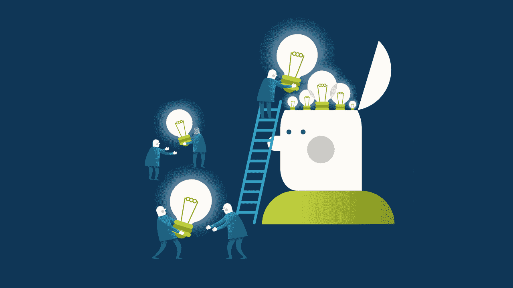

# 高效程序员的 7 个习惯

> 原文：<https://simpleprogrammer.com/7-habits-highly-effective-programmers/>

我们程序员每天做的事情中，大约有 40%到 45%是自动完成的:刷牙、早上喝杯咖啡、坐在办公桌前时打开电子邮件，以及许多其他事情。这些习惯在我们的日常生活中为我们节省了大量的时间和精力，并且对我们日常任务的整体质量和成就非常重要。

脸书首席执行官马克·扎克伯格有每天穿同一件衣服上班的习惯，因为他注意到这有助于节省能量。“我真的很幸运，每天起床后，我都可以帮助十多亿人。如果我把精力花在生活中愚蠢或琐碎的事情上，我会觉得自己没有尽到自己的职责。”

微软创始人比尔·盖茨每天晚上洗碗，因为这个习惯可以减轻压力，提高创造力，帮助大脑思考和解决创造性问题。

斯蒂芬·科维写了一本名为《T2》的书，名为《高效人士的 7 个习惯》，已经售出 2500 万册。这本书是关于发展一套核心的价值观和思想，帮助你用一种综合的和以原则为中心的方法解决个人和职业问题。是一本帮助了很多人改善生活的经典书籍，相信软件开发者也能从中受益。由于软件开发人员能够将想法转化为现实并解决现实生活中的问题，因此他们受到了广泛的欢迎。

下面的习惯可以进一步增强这种能力，并使之更加有效。

## 1)积极主动

每个人的生活中都会发生很多事情。有些事情你无法控制，也无能为力。

你可能生活在一个因为签证问题而不允许你出国利用一个非常有吸引力的工作机会的国家。你工作的公司可能会破产。你的经理很容易生气，所以你总是害怕表达你对团队重要问题的想法。你可能不被允许使用测试驱动开发，因为你的团队领导认为这花费了太多的时间，尽管你尽力让他们相信这是一个非常有效的长期策略。

如果你想成为一名高效的程序员，你就不应该关注那些超出你控制范围的事情。你应该采取积极的态度，而不是责怪社会，讨厌你的工作。在你能控制的事情上投入你的精力和努力。

你应该准时上班，这样你就不会因为错过了和其他团队成员的每日 scrum 会议而感到内疚。你应该学习新的概念和技术，而不是在没有任何任务分配的情况下，花无数的时间在无意识的浏览上。你需要看新书，看教程，参加开发者大会。你应该在空闲时间写博客和参与开源项目来帮助他人。

你需要追求不断的学习和进步。用亨利·大卫·梭罗的话来说，“我所知道的最令人鼓舞的事实莫过于人类通过有意识的努力提升自己生活的不容置疑的能力。”

你不应该让不受你控制的事情占据你大部分的注意力。你需要关注那些在你影响范围内的事情。你需要积极主动地养成新的好习惯。

## 2)从心中的目标开始

有效的程序员通常对他们未来的自我有非常令人信服的目标。

盖茨和他的商业伙伴保罗·艾伦设定了让每个家庭都拥有一台电脑的目标。扎克伯格[说他想利用脸书](https://www.wired.com/2010/05/zuckerberg-interview/)让世界更加开放。约翰·桑梅兹设定了在 35 岁退休的 T4 目标。

想象一下，如果你在自己的葬礼上，你的家人、朋友和队友用充满感情的话语称赞你。你希望他们怎么评价你？你希望如何被人记住？你想留下什么贡献或遗产？

这些问题可以提醒你你的核心价值观，可以帮助你明白什么对你来说是真正有价值和重要的。

积极对待你的生活。规划你的人生。

想象你未来的自己和你想要在生活中拥有的东西。你不能击中你看不见的目标。对你来说，设定明确的目标是非常必要的，你要去哪里，你在生活中真正想要的是什么。令人信服的目标激发大规模的行动。

尝试逆向工程，设定你认为会让你朝着那个目标前进的目标和里程碑。

设定真正激励你朝着目标努力的年度目标——与你的价值观一致的目标。让它们可以衡量，并把它们分解成季度、月和周目标。每周回顾一下你目前所处的位置，以及你需要达到的目标。确定哪些是有效的，哪些需要改进。对自己诚实，无情地切断阻碍你的活动、常规或关系。坚持计划、执行和评审。

## 3)将[最重要的事情放在第一位](https://en.wikipedia.org/wiki/First_Things_First_(book))

我们生活在一个令人分心的时代，很难抵制我们定期收到的无数电子邮件或脸书和垃圾信息。它们可能代表了我们工作的一个重要部分，因为我们需要在开始实现之前理解需求。

然而，有时我们的注意力和精力会被不必要的干扰耗尽，这不仅会占用我们很多时间，还会增加我们的罪恶感和压力。我们可能会开始想为什么我们不能完成我们应该做的事情。

你可能有很多工作要做，随着时间的推移，新的工作可能会突然出现。当您正在开发一个需要实现的重要特性时，突然之间，生产中出现了一个严重的 bug。

因此，你在选择做什么和做什么权衡之间处于一场持续的战斗中。柯维说得很清楚，“我们大多数人花太多时间在紧急的事情上，而没有足够的时间在重要的事情上。”他进一步解释道，“关键不在于优先考虑你日程表上的事情，而在于安排好你的优先事项。”

显然，不是每个任务都有相同的重要性和紧迫性。柯维提到了我们应该遵循的最有效的顺序:

1)重要和紧急

2)重要不紧急

3)不重要和不紧急

4)不重要且不紧急

如果你想成为一名高效的程序员，你需要通过把重要的事情放在日程的首位来充分利用你的时间。你需要成为一名领导者，并根据上面的排序模式管理你的日程。

正如柯维[所说](https://www.forbes.com/sites/kevinkruse/2012/07/16/the-7-habits/#41ff3bfc39c6)“最主要的是保持主要的东西是主要的东西。”

有很多书和文章提到了“时间管理”事实上，你无法管理时间。你只能管理你的优先事项。

分清主次似乎很困难，因为你可能害怕错过其他事情。然而，一旦你习惯了坚持不懈地做这件事，并看到它带来的好处和情感回报，它就会变得更容易和令人愉快。

## 4)认为[双赢](https://en.wikipedia.org/wiki/Win-win_game)

## 

无论你是否是项目中唯一的开发人员，你都不能让你的自负导致你只考虑自己。[对于开发者来说，自我是最大的敌人](https://medium.freecodecamp.org/ego-is-the-enemy-for-software-developers-585909fb0501)。

一些开发人员倾向于认为*赢输*，即其他人必须输才能有人赢。如果你的同事在你的经理面前看起来很糟糕，你认为你会得到晋升或加薪。结果，你会把你的行为导向尽可能的炫耀，没有价值的邀功，或者贬低你的同事，所有这些都是为了表现你更优秀。

这不仅会给你一种表面的满足感(因为你一直在试图贬低你的同事)，还可能会损害你的团队整体生产力，因为你和你的同事根本不愿意一起工作。

如果你想成为一个有效的开发者，你需要把自己和大多数人的做法区分开来。在任何情况下，你都应该努力为整个团队找到最好的选择。

你应该考虑最终会带来更好的长期解决方案的互利解决方案，而不是在这种情况下只有一个人能如愿以偿。

培养问自己这样问题的习惯:“他们有什么好处，我也能从中受益？我们如何才能在不破坏我们关系的情况下，各取所需？”

你可能有时会和同事发生误解和脾气暴躁，但这并不意味着你所拥有的和谐和关系会被破坏。你与人相处的能力是你生活中的一个重要方面。

尽可能避免争论，关注长期利益。当你开始时心里有了目标，即使你达到了最大的目标，你也不想孤独。

## 5)先寻求理解，再寻求被理解

沟通是我们需要具备的最重要的技能之一。我们大部分时间都在交流。

我们上班前和家人沟通。我们旅行时在街上和邻居交流。我们与队友、客户和顾客交流的时间比我们写代码的时间多。

我们阅读技术书籍，学习如何使用 Docker 和开发图形应用编程接口(API)，但几乎没有人向我们提到倾听和理解他人的重要性。如果我们想要健康的团队协作，那么我们需要理解我们的团队成员。

我们通常更多地看着我们的智能手机，而不是面对那些已经处理了很长时间的问题的同事。

如果我们想成为高效的程序员，互相激励，我们需要使用共情倾听，并真正理解我们的同事。这迫使其他人回应你的倾听，并愿意受你的影响。

提醒你自己，你没有能力独自完成伟大的项目，也没有能力打造自己的产品来影响数百万人。不要忽视你的队友。成为持续帮助他们的人，无论是工作任务还是软技能。当你试图向别人解释一个概念，或者帮助他们解决一个问题时，实际上你自己学得更好。教学有助于你的学习。

因此，这不仅会让你和他人感觉良好和重要，因为你的话和倾听对他人很重要，而且还会创造一种互相关心和帮助的氛围。移情可以成为软件开发人员的超能力。

## 6) [协同](https://en.wikipedia.org/wiki/Synergy)

毫无疑问，大型项目是由许多团队成员开发的。

盖茨和艾伦一起创立了微软，艾伦甚至想出了微软这个名字。埃隆·马斯克(Elon Musk)与他的兄弟金巴尔(Kimbal)创建了他的第一家 IT 公司 Zip2，然后他以 3.07 亿美元的现金和 3400 万美元的证券将该公司出售给 AltaVista。Instagram 最初是由凯文·斯特罗姆和迈克·克里格创立的。

亚马逊大约有[34.1 万名员工](https://www.geekwire.com/2017/amazon-soars-340k-employees-adding-110k-people-single-year/)。微软拥有超过 [12 万名员工](https://news.microsoft.com/facts-about-microsoft/#3uT4yq8pCixa1Bui.97)。谷歌在对建立*完美*团队进行大量研究后，[发现](https://www.nytimes.com/2016/02/28/magazine/what-google-learned-from-its-quest-to-build-the-perfect-team.html)一些最有成效的团队是那些拥有培养协同作用和拥抱心理安全的环境的团队。

哈佛商学院教授 Amy Edmondson [将](https://www.nytimes.com/2016/02/28/magazine/what-google-learned-from-its-quest-to-build-the-perfect-team.html)心理安全描述为“一种自信，认为团队不会因为某人说出来而使其尴尬、拒绝或惩罚。”每个人都有贡献、合作和参与他们想要的任何事情的自由。

每当你发现自己成为与同事争论的一部分时，试着理解他们的核心兴趣。解决它们，使它们变得互惠互利和富有成效。

这样，通过利用每个成员的优势，你的团队会更有成效。团队合作大于各个部分的总和。

如果你想成为一名高效的程序员，试着帮助你的团队变得更加协同。这可以通过尊重每个队友的自由来实现，并帮助他们在表达不同观点时感到非常舒适，而不必担心尴尬。允许每个人在他们觉得有趣和值得贡献和关注的事情上做出贡献和合作。

## 7)磨快锯子

想象一下，你看到一个同事因为无法完成一项任务，在过去的两天里没有睡觉，陷入困境，压力很大。他们没有最后期限，但他们只是非常渴望完成工作，所以他们没有优先考虑睡眠。你建议他们休息一下，因为你同情他们。“我太忙于编程了，”他们可能会回答。

这可能有点夸张，但事实并非如此。更多的时候，我们被日复一日的生活事务所困扰，以至于我们很少退一步思考我们的生活。我们被困在“忙碌”中，以至于我们甚至没有时间去磨利锯子。

根据柯维的说法，磨利锯子意味着更新我们自己，在我们本性的所有四个方面。这些维度是生理、心理、社会/情感和精神。

我们需要健身和健康饮食来改善我们的身体状况。Sonmez 是两本程序员相关书籍的畅销书作者，他每周进行三次两小时的锻炼。

我们必须[掌握数据结构、算法和设计模式等基础知识](https://medium.com/mozaix-llc/learn-programming-like-einstein-learned-physics-ffc6d3f2c243)；编写具有挑战性的任务；看别人的代码，新书，博客帖子；并为开源项目做贡献，以在精神上提高我们自己。我的导师[戴恩·米勒](http://dain.io/about/)，甚至[都建议多读书，而不是多写代码](https://www.youtube.com/watch?v=moTlZBY66Ng)。

我们需要乐于助人，对同事感同身受，培养协作精神，在社交和情感方面提升自己。

我们需要成长和贡献来更新我们的灵性。这些代表了我们需要满足的一些最稀有的需求。我们需要在个人和职业上成长。杰夫·考夫曼(在谷歌工作)和他的妻子将他们年收入的 50%捐赠给有效的慈善机构。我们不需要在谷歌工作来给予，给予不仅仅意味着经济上的。为开源项目做贡献或者通过写文章来教导他人也是给予的例子。

我们必须努力在所有这些方面保持平衡，否则可能会造成不平衡。我们可能会假装任何失衡都没有那么痛苦，但从长远来看，它可能是痛苦的。

柯维建议每天集中一个小时磨利锯子。我们必须提醒自己，磨利锯子是一场马拉松，而不是短跑。正如亚伯拉罕·林肯所说:“给我六个小时去砍树，我会用前四个小时去磨斧子。”

## 建立有效的习惯

许多真正擅长自己技术的开发人员分享了一些我们都可以借鉴的共同习惯。我相信成功会留下线索，当我们有一些可以效仿的、被证明有效的东西时，我们都会变得更好。

[习惯很强大](https://simpleprogrammer.com/2014/01/02/habits-powerful-goals/)。

如果你想成为一名有效的程序员，首先你必须决定这样做。正如柯维所说，“我不是环境的产物。我是我的决定的产物。”卓越不是偶然的，而是精心计划、努力工作和全心投入的结果。正如亚里士多德所说，“我们就是我们反复做的事情。因此，优秀不是一种行为，而是一种习惯。”

开始实践这些习惯中的任何一个，自己看看效果如何。