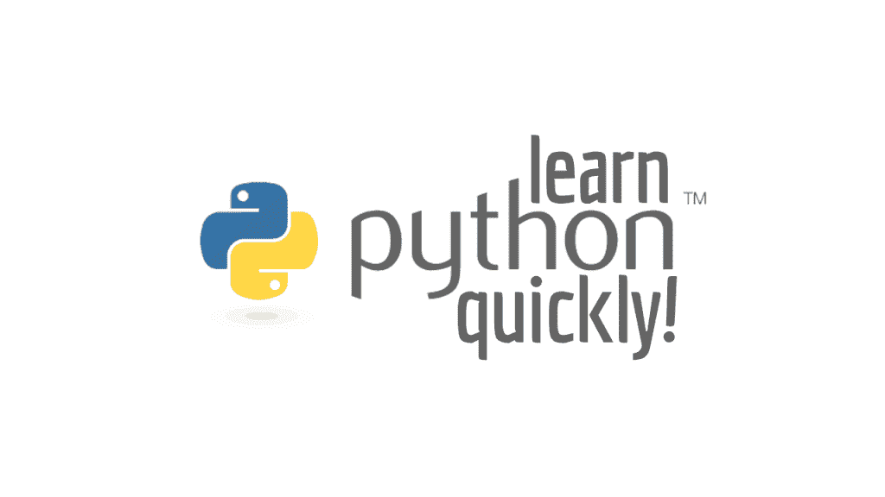
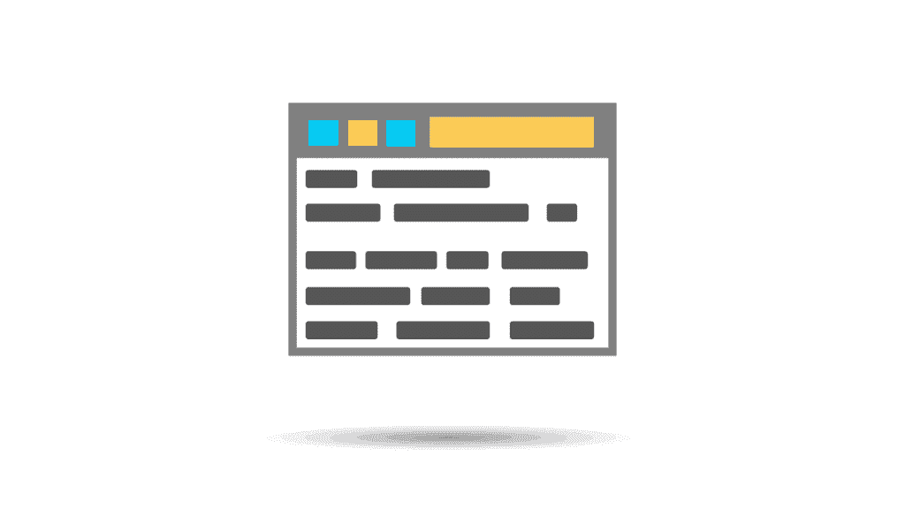
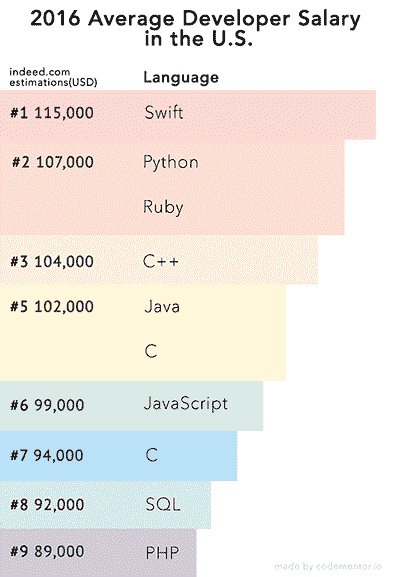
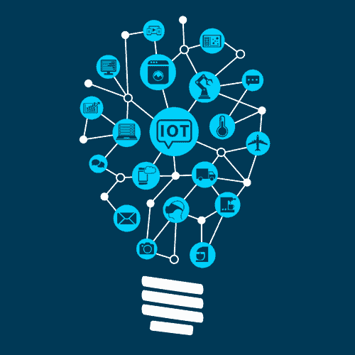

# 为什么要学 Python

> 原文:[https://simple programmer . com/7-reasons-why-you-should-learn-python/](https://simpleprogrammer.com/7-reasons-why-you-should-learn-python/)

在这篇文章中，我们将讨论为什么你现在应该学习 python。

1.  [Python 非常适合初学者](#great-for-beginners)
2.  [使用 Python 进行 Web 开发](#web-development)
3.  [迭代、敏捷设计](#iterative-agile-design)
4.  [Python 有高薪](#python-salary)
5.  [Python 安全性](#security)
6.  [Python，人工智能&机器学习](#ai-machine-learning)
7.  [Python 的多样性&灵活性](#diversity)

你知道我最讨厌什么吗？

面向程序员的技术文章，解释*为什么*你应该做一些作者没有利用*任何个人经验*的事情。

说真的——你怎么能相信一个从未上过战壕、打过仗，或者带着伤痕回家却取得胜利的人呢？

在整理这篇文章时，我采用了一种不同的方法，写了一些我相信像我一样的其他程序员会想听的东西:

七个真实的个人故事，关于 Python 编程语言以及它如何在我的职业生涯中帮助我。

我不是来为 Python 布道的。

我不是来告诉你 Python 是“最好的编程语言”(不管那是什么意思)。

我甚至不会告诉你“尝试”用 Python 构建你的下一个项目，因为我不知道你的下一个项目是什么，也不知道 Python 是否适合它。

相反，我的目标是作为一名程序员与你交流。我将分享一些我的程序员生涯中的个人故事，我希望你能明白为什么你应该学习 Python。

如果你留下来通读这篇文章的其余部分，我想你会得出和我几年前一样的结论——不管你是否意识到，Python 将会对你的未来产生影响。所以希望你明白为什么要学 Python。

说到这里，让我们开始吧。

## #1.第一次做程序员？赶紧学 Python 吧。

我记得 15 年前，当我开始成为软件开发人员的旅程时。

我当时只是个孩子，最多 13 岁。

安德鲁是我儿时的朋友，他向我介绍了计算机的世界，并向我展示了它们不仅仅可以连接互联网和访问网站。

他向我展示了 HTML 的基础知识，以及网站实际上是如何使用“标签”和一种基本的标记语言来构建的。

从那以后，我就上瘾了。

不受约束的控制水平。创造者的自由。艺术家的画布。我是一名成长中的程序员。

第二天早上，我恳求妈妈开车带我去当地的图书馆，这样我就可以学习更多关于计算机编程的知识。

也许不出所料，我拿到的第一本书的标题中有单词“ *BASIC* ”。对于初学者来说，光是名字就能吸引你。

整个夏天(在 Andrew 的帮助下)，我用那本书学习了编程的基础、基本的控制结构以及如何组织一个程序。

但是到了最后，我感到非常失望——秋天开学的时候，我几乎完全放弃了编程。

怎么会这样

我不能用 BASIC 做任何"*酷*"的事情——这种语言，就其本质而言，是极其局限和紧缩的(具有讽刺意味的是，因为我现在使用 Python，这是以一种在吃猎物前挤压和碾碎猎物的蛇命名的)。

我无法访问低级系统资源。

我无法加载和处理图像。

以及任何类型的统计或计算分析？

别提了。

我花了所有的时间*学习如何编程*，但是我真的没有什么可以展示的。

总之，我勇往直前。我意识到我的编程“生涯”不应该停留在基础阶段。

在我高一的时候，我开始学习 C/C++。这是一门更难的语言，我花了一段时间才精通。我也真的很享受 C 给我的自由，即使这意味着时不时的搬起石头砸自己的脚。

在 C/C++之后，我转向了 Java 和面向对象编程。这很有趣，但感觉好像要花很长时间才能完成任何事情。

到了高二期末，我第一次尝试了脚本语言:具体来说就是 Python。

我很惊讶。

代码很容易阅读——就像写基本的英语或简单的抽象数学。

代码本身也有面向对象的味道。不像在爪哇那样极端，只是一点点，让我觉得它是一个老朋友——当我需要它的时候。

也许最令人惊讶的是我的代码看起来多么优雅。

空白的使用确保了我的代码被连贯地组织成整齐的小块。通过遵循基本的编码标准和建议，在我使用这种语言的第一天结束时，我已经写出了外观漂亮、易于维护的代码。

回想起来，我希望我能从 Python 开始。

当然，BASIC 教会了我编程的基础，但是 Python 也能以同样简单的方式做到这一点。

如果让我回到过去，我会跳过 BASIC 直接去学 Python。我会更加享受这种体验，获得更好的时间投资回报，并为学习 C/C++和 Java 做好更充分的准备。

因此，如果你想决定学习哪种编程语言最好，Python 值得认真研究一下。

## #2.Python 用于 web 开发。

我承认:

当我第一次开始编写 web 应用程序时，我没有使用 Python，而是使用 PHP。

事实上，我是如此喜欢 PHP，以至于我甚至不会考虑另一种编程语言可能更适合 web 开发的可能性。

我错了。

大错特错。

直到我的朋友 Patrick 向我展示了 Python web framework[Django](https://www.djangoproject.com/)，我的想法才彻底改变。

在 PHP 中曾经花费我几个小时的事情，使用 Python 可以在几分钟内完成。

更不用说我的代码比以前更快更稳定了。

从 Django，我转到了另一个 web 框架 [Flask](http://flask.pocoo.org/) ，它很小，并且是为可定制性而构建的。

一旦我开始使用 Django 和 Flask，我就再也没有回头看 PHP。

虽然大多数网站仍然运行在 PHP 上，但许多新的 web 应用程序正在使用 Python 构建。

如果您计划进行任何 web 应用程序开发，请尝试一下 Python 和 Django/Flask。我想你会印象深刻的。

## #3.迭代、敏捷的设计。

创业公司的成功不是一蹴而就的。

相反，它来自一系列*迭代*，通常看起来像这样:

1.  找出(潜在)客户想要/需要什么。
2.  构建最小可行产品(即解决客户问题的*最小*可能功能集)。
3.  给顾客看。
4.  重复这个过程，直到顾客满意为止。

这个过程允许创业公司“一步一步”走向成功。从一个想法开始，然后提炼这个想法和产品，直到你“成功”

在网络世界中，Python 非常适合这个过程。

这种语言允许你快速编码，用最少的代码行构建复杂的应用程序(比 Java 少 5 倍，比 C++少 10 倍)。

从*想法到实施*快速进行是创业世界中**至关重要的**，所以如果你有兴趣与创业公司合作，我强烈建议你学习 Python。

我个人从 18 岁开始就在创业公司工作。

无论特定的产品是基于网络的、移动的还是企业的，Python *最终*还是作为核心产品的一部分或者作为支持工具进入了公司。我毫不怀疑这一趋势将在未来继续下去。

## #4.高薪。

由 indeed.com 创建并由 [codementor.io](https://www.codementor.io/learn-programming/beginner-programming-language-job-salary-community) 发布的 2016 年开发者薪资研究发现，Python 开发者的平均薪资为 107，000 美元:

根据这项研究，Swift、Python、Ruby、C++和 Java 会让你赚到最多的钱(PHP 排在最后)。

鉴于移动应用的货币化，Swift 名列榜首或许并不令人意外，因为它通常用于开发 iOS 和 macOS 应用。

但仅次于 Swift 的是 Python 和 Ruby:前五名中仅有的两种脚本语言。

虽然 Ruby 是一种通用编程语言，并被用于许多应用程序，但当你调查一组 Ruby 开发者时，你会发现他们经常使用 Ruby 进行 web 开发。

Python 则不同: ***它更加多样化。*T3】**

不要误解我的意思，你无疑会看到许多程序员使用 Python 进行 web 开发，但是*你也会看到 Python 也为科学应用提供动力。*

从我个人的经历来看，我可以告诉你，我遵循的正是这个工资的图腾柱。

当我还是一名 PHP 开发人员时，我挣的钱是职业生涯中最少的。

然后我转到 Java 和企业开发，在那里我有了很大的提升。

但是对我来说，真正的改变直到我开始在计算机科学 Python 社区工作才发生。

虽然这只是一个传闻，但我*真的相信*Python 比 Ruby、*、T3 打开了更多的大门，尤其是从科学的角度来看、T5。*

我的预测是，鉴于 Python 不仅作为一种通用编程语言，而且作为一种科学编程语言的崛起，我们将很快看到 Python 在更高的薪水方面取代 Ruby。

## #5.Python 安全性。

五个月前，我的一个健身伙伴把我介绍给他的儿子肖恩。

肖恩刚刚高中毕业，准备在秋季学期前往芝加哥大学。

出于对他专业的好奇，我问肖恩他打算学什么。

他的回应？

网络安全。

这是一个很好的领域，可以赚很多钱。

想想看——参与网络安全与经营一家围绕停尸房和殡仪馆设计的企业有许多相似之处。

它可能令人毛骨悚然，但人们将继续死去；除非我们神奇地找到长生不老药，否则殡仪馆的生意不可能停滞不前。

同样，也不会缺少网络攻击。甚至有人猜测，下一次世界大战的胜负将发生在网络空间，而不是通过地面部队的行动。

Sean 告诉我他高中时的编程课，他如何花了两年时间学习 Java、面向对象编程和软件设计。

虽然我对他的培训甚至有两年的编程课程印象深刻，但听到他们没有教授任何脚本语言，我有点难过。

圣诞节假期，我找到肖恩，问他在芝加哥大学过得怎么样。

他做得很好。

他在所有的计算机科学课上都表现出色。

他加入了学校的网络安全团队…

他甚至一路学习 Python。

咧着嘴笑，因为我已经知道答案了，就问他:“是什么让你学 Python 的？”

他回答道:“这太简单了，伙计！用 Python 你可以做任何事情。当我第一次加入网络安全团队时，我正在用 Java 编写渗透测试器。我花了几个小时编写代码，而我的同行们只需几分钟就能完成。”

Sean 已经意识到了脚本语言的力量。

虽然您可能会牺牲一些执行速度，但您获得了更大的灵活性、编写代码的便利性，以及最棒的是能够更快地进行实验。

我的观点是 Python 包含了所有这些世界的精华。如果你还没试过，你真的应该试试。

## #6.Python 是人工智能和机器学习的未来。

T2】

Python 编程语言目前正在推动科学编程，但情况并非总是如此。

在*年*里，学术学者和私人研究人员使用 MATLAB 语言进行科学研究。

随着 Python 数值计算引擎如 [NumPy](http://www.numpy.org/) 和 [SciPy](https://www.scipy.org/) 的发布，这一切都开始改变，允许复杂的计算通过一个“导入”语句后跟一个函数调用来完成。

缓慢但稳定地，Python 开始成为计算机科学研究的首选语言。

事实上，我用 Python 编写了用于为我的博士论文收集结果的所有代码。

当我获得学士学位毕业时，甚至非计算机科学专业的学生也开始自学 Python，并用它来支持自己的研究。计算生物学是一个非计算机科学家利用 Python 的很好的例子。

这些天来，我花在编写科学 Python 代码上的时间比我做任何其他事情的时间都多，所以我显然有偏见，但我可以告诉你:

Python 是人工智能的未来。

考虑到这种语言的灵活性、速度以及诸如 [scikit-learn](http://scikit-learn.org/stable/) 、 [Keras](https://keras.io/) 和 [TensorFlow](https://www.tensorflow.org/) 等库提供的机器学习功能，我们将继续看到 Python 主宰机器学习领域。

在我看来，毫无疑问:如果你对从事计算机科学研究有丝毫兴趣，**,你应该学习 Python。**

## #7.多样性和灵活性。

在过去的这个夏天，我建立了我的第一个 401k。

我和我的理财顾问在很多场合聊过天，讨论了各种投资工具和策略，以及配置投资组合的不同方法。

不管对话是如何开始的，它总是在同一个地方结束:

*管理我的风险，更具体地说，**如何最小化风险。**T3】*

在投资界，这简单地归结为“不要把所有的鸡蛋放在同一个篮子里。”如果你掉了篮子，你就打碎了所有的鸡蛋。

因此，你的目标是分散投资:将一部分资金投入大公司股票，另一部分(较小的)投入中小型公司股票，然后再投入债券，最后将剩余资金投入国外市场、贵金属等。

有道理，对吧？

如果你把所有的钱都投入到股票中，当市场再次像 2008 年那样崩溃时，你的退休投资组合将会彻底崩溃。通过分散投资，你可以最小化你的风险。

信不信由你，编程世界并没有什么不同。

在过去的十年里，拥有一个编程专长变得越来越有价值，但是你必须小心不要把自己归类为“那个 Java 家伙”或者“那个 C++家伙”

虽然拥有一个利基市场和专业非常重要，但你也需要让自己有市场。T3】

比如我是程序员，我*专攻*计算机视觉和机器学习。

然而，我不是“Python 迷”或“OpenCV 迷”

我已经使用 Java 构建了大型企业和政府应用程序。

我已经利用 C++开发了实时应用程序。

我甚至定制了 PHP 应用程序来扩展到成千上万的用户。

我的观点是这样的:我的简历和*履历是**多元化**T3】。*

我有自己的定位，并且非常了解自己的定位，但我也可以承担任何其他任务。

如果你还没有 Python，考虑把它添加到你的技能中，增加你作为程序员的多样性和市场性。

## 现在怎么办？

[https://www.youtube.com/embed/hcbfF8I9zCo](https://www.youtube.com/embed/hcbfF8I9zCo)

So, you’re ready to learn Python, *but how do you get started?*

下个月我会回来回答这个问题，并提供我最喜欢的学习 Python 编程语言的资源。

到时候见！