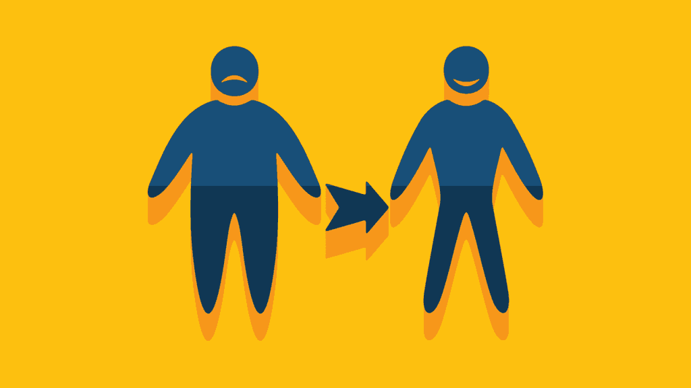
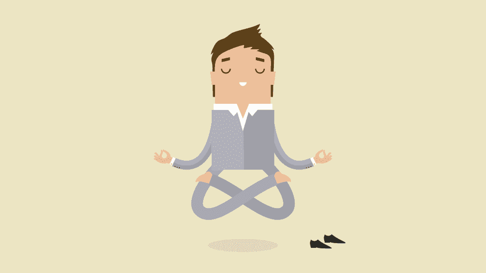
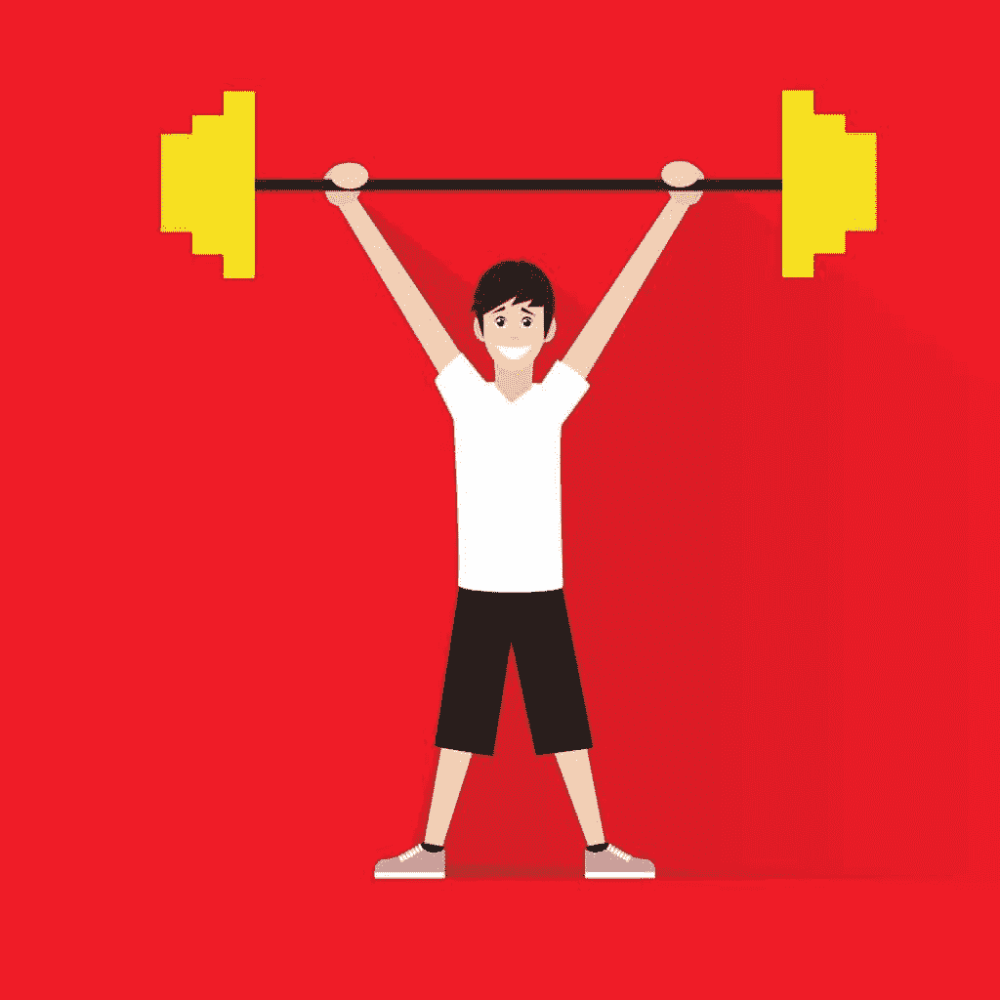
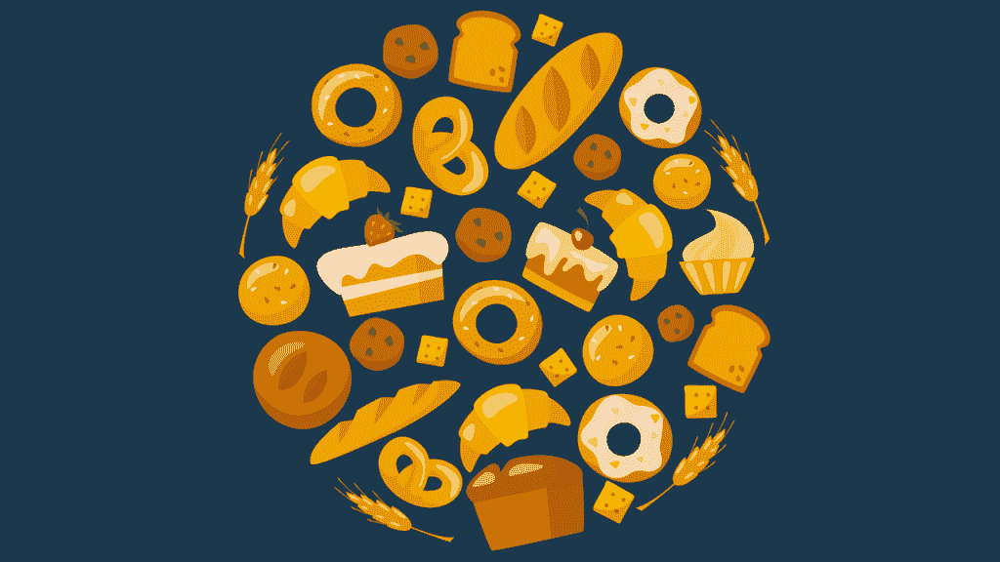
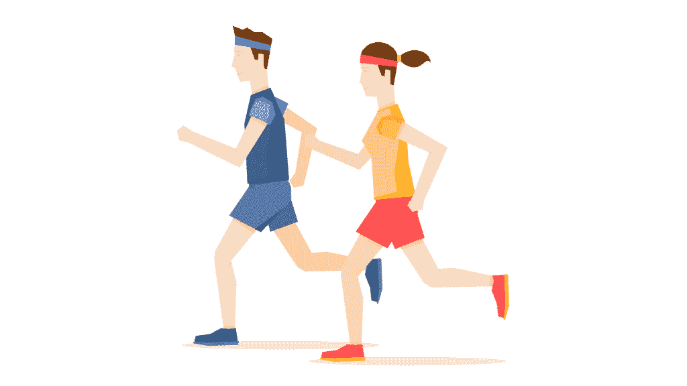

# 用 75%算法改变你的减肥生活

> 原文：<https://simpleprogrammer.com/75-algorithm-weight-loss/>

## 我从哪里来

在我十几岁的时候，我很重，非常重。我一直都是个大块头，但这不是一个骨架大或骨架大的问题，尽管我身高 6 英尺 4 英寸。我很胖，我很肥胖，我讨厌那样。

人生的前 17 年没有教会我很好的饮食或锻炼习惯，这个问题在我十几岁时加剧了，当时我发现了自己对计算技术的热爱。我花了无数个小时坐着，把脸埋在电脑显示器里。我学到了很多关于计算机和编程的知识，但是在已经很重的基础上又增加了很多重量。

在我青少年时期最糟糕的几年里，我不运动，习惯性地吃得很差，我的体重最高达到 398 磅。我讨厌变得那么重，但没有令人信服的理由去改变，所以我没有。我坐在办公桌前，吃着薯片，写着 C 代码。

直到 17 岁进入大学，我才开始在意自己的体重和外貌。大多数人会认为高中的社会和同龄人的压力可能会鼓励我改变，但不幸的是，我没有这种影响力，因为我在高中期间一直在家接受教育。让我们诚实面对自己，即使在公立学校也有很多借口不关心我们的外表和健康状况。

进入大学后，没多久我就感受到了一种压倒一切的想要改变的欲望。我不想在 45 岁时死于心脏病，我想融入社会，我想能够参加体育运动，甚至更多，我想在约会中有一个战斗的机会，而且，鉴于我已经是一个反社会的书呆子，我知道我需要任何我可以得到的帮助。

起初，我不知道我需要做什么来减肥和保持身材。在自我厌恶和强烈渴望改变的第一年后，我开始学习，学习，学习，我发现没有神奇的饮食，没有神奇的药丸:只有努力工作和聪明的思维才能帮助我。作为一个有技术头脑的人，我觉得我最好的方法是把自己规划成更健康的生活方式。

因此，我踏上了一条能让我生活的方方面面都变得更好的道路。我希望我所经历的经历，我为自己创造的过程，以及我所获得的知识，能够帮助那些曾经或正在经历与我相同情况的人。

## 概述

我经历的学习过程有几个阶段，并且持续了许多年。在我告诉你我的经历之前，我想给你一个关于改变生活方式的关键阶段的简要概述。

### 心理准备

第一步是心理准备。在这个阶段，你将不得不变得苛刻，并且残酷地对自己诚实。尽管诚实会带来伤害，尽管对自己非常不满意很难，但这是激励自己做出改变的必要过程。

在我十几岁的时候，我经历了几年不喜欢我自己和我的身体，讨厌我整天整夜坐在办公桌前。当我进入大学时，我对自己和自己的身体感到双重的不快乐，那段时间的自我厌恶让我为改变做好了准备。

最终，变革的动力必须来自内部。没有人会让你改变或者让你减肥；你要对自己有动力和心理准备。这和解决一个硬编码问题，设计一个复杂的系统，甚至是写一篇冗长枯燥的技术文档是一模一样的。焦点和动力必须来自你自己。

### 习惯和技能

正如学习任何新的学科一样，更重要的是尽早记住你知道的正确的东西，并据此行动，即使你还不明白为什么它是正确的。把车停在离门更远的地方。走楼梯，不要坐电梯。永远不要在免下车餐馆点“大份”套餐。多吃纤维。多喝水。所有这些都是小例子。

当你学习编码时，你的课本或老师会告诉你，“千万不要使用 GOTO！GOTO 语句不好！”你不知道它们为什么不好，但你肯定不会用它们。在你能独立思考之前，你必须养成良好的习惯和决策能力。(这不同于意志力，我稍后会解释)。

这是我经历的第二个阶段:训练自己从外到内看待自己的生活，练习良好的习惯和好的决策，即使我不明白为什么有些事情很重要。

### 主要活动

一旦我掌握了一些基本技能和知识，是时候开始真正展示我的意志力和基本决策技能了。一开始，我每天都绕着我的街区散步，没有例外。随着时间的推移，随着事情变得越来越容易，我强迫自己跑更多的圈数，直到有一天我开始慢跑——一开始比走路少，但最终我恢复了相同的圈数，甚至更多。

增加既能锻炼你的身体，又能给你带来快乐的活动是改善你健康的主要部分。如果我每天都去健身房，让自己在健身器上锻炼，我会无聊死的。

出去走走给了我锻炼，也给了我一些快乐。你必须两者兼得才能成功。

### 培养你的品味

到目前为止，最困难，但也是最重要的阶段，我经历了这一点。训练我的口味，让我对更健康的食物感到满意。这很难，并且在任何阶段都需要最大的意志力。不这样做也能减肥，但不能整体“健康”。如果你不经历这个阶段，减肥的负担将被完全放在活动阶段，这是可以做到的，但它使其要求更高。

## 我的阶段详情

既然我已经给了你一个参考框架来阅读本文的其余部分，我想直接进入我减肥过程中每个阶段的细节。

### 精神的

如前所述，这是最容易的阶段。自我感觉不好并想改变并不难。见鬼，如果你是人类，你每天都会对自己身体的某些方面、个性、地位等有这种感觉。

难的是做点什么。当你决定行动时，你必须有正确的心态，否则你会失败。并行者会试图用面向对象的语言编写功能代码。如果你的心态和参照系是错误的，你就会失败。

每个人都认识这样的人。一个对自己的体重不满意的朋友或亲戚，和许多人不同，他正试图为此做些什么。他们尝试旧石器饮食法，他们尝试阿特金斯饮食法，他们尝试服用凌晨 3 点从家庭购物网上购买的药片，这些药片只会让脂肪“融化掉”

问题是，这个朋友或者亲戚在做的事情是行不通的，以后无论他们做什么都行不通！除非他们改变减肥的方式。

想要改变是好的，但是你必须首先明白改变不可能是一天、一个月或者一年。

改变是你带着永恒的目标去做的事情。你可能会对我说，“咄，我不想只瘦一年，我想瘦一辈子！”这很好。我想让你瘦下来，也适合你的余生！

### 训练你的思维

不过，你的想法有问题。问题是，为了让你的身体在你的余生中有所改变，你的思想也必须在你的余生中有所改变。

程序员不能简单地通过一遍又一遍地键入语法来学习如何编码，直到肌肉记忆使键入编程语言变得容易——你的大脑必须参与理解你正在做的事情的意义，否则你永远不会成为程序员。那么，为什么我们认为我们可以不用训练我们的大脑就能减肥，就像训练其他后天技能一样？

现在，我不是说你的思想必须立刻改变，但是你必须意识到，就像改变你的身体是一个缓慢的迭代过程，需要时间，改变和训练你的思想和思维过程也是如此。

如果你没有花任何努力尝试节食和锻炼，而是花了每一盎司的精神能量说服自己快餐不好，生蔬菜好吃又好，我保证你会比你醒着的时候想吃巨无霸却尝试节食和锻炼更健康。

这里的目标不是在一夜之间改变你的思维方式，或者甚至在你开始任何其他事情之前，而是要认识到随着时间的推移反复思考和日常锻炼一样重要。没有神奇的隔夜解决方案。如果你想改变生活，那么你必须愿意投入大量的时间和精力去改变。

小贴士:在这个阶段对我帮助很大的一个练习就是大声告诉自己，无论何时我做了什么，我都在做一些不健康的事情。我没指望马上就不做了，我只是没有用无知或者半真半假对自己隐瞒什么。

## 习惯和技能

我们经常学习如何正确地做某些事情，却不知道为什么要这样做。但是人们经常想知道为什么他们应该以某种方式饮食或者遵循特定的锻炼计划。如果他们得不到他们理解的“为什么”的答案，他们可能不想继续这个项目。

当我在读我的第一本 C 编程书时，我不知道什么是依赖反转，或者为什么它是好的，甚至不知道如何做这样的事情，即使有多年经验的人非常仔细地向我解释为什么它是好的，以及为什么我应该知道它。我一无所知。

当你刚刚开始学习如何减肥和开始健身计划时，当你问“为什么”时，你需要明白这一点你很可能会得到一个初学者的答案。可能有一个更复杂的答案，更难理解或解释，但这个答案是通过时间和实践获得的。

如果我们未能减肥或保持健康，通常是因为我们没有用良好的习惯训练我们的大脑。

每天吃大份的熏肉，除此之外别无其他，可能是你想做的事情，但这对你并不健康。你可能会在短期内减肥，但你不会因此变得更健康。

为了证明我们想要的东西是正当的，或者证明不做我们不喜欢的事情是正当的，我们会告诉自己很多事情。你必须消除这一弱点，毫无疑问，你可以通过培养良好的习惯和技能来消除它。

这些事情不一定是大事——就像任何一套训练有素的好习惯一样，每一个都可能是非常小的和可管理的。

我从来没用过电梯。永远不会。直到今天，除非有什么事情需要我乘电梯，否则我会走楼梯。

*   我从不把车停在离我要去的商店或商店最近的前 10 个地方。

*   我从来没有在快餐店点过“大”份的超值餐。

*   我开车的时候从来不在车里吃东西。

*   我从不在电脑前或看电视时吃东西。

*   如果我想吃东西，我会花时间去吃，然后继续做我正在做的事情。

*   我吃得更少，更频繁。我不明白为什么这很重要，但是很多人说这很有帮助，所以我照做了。

注意:一旦你达到目标体重并进入维持模式，你可能会发现你的日常饮食计划会改变，但这与减肥是非常不同的阶段。你甚至会发现在维持状态下，一天一餐对你来说是最好的。

*   我让自己从办公桌前站起来，每隔一两个小时就四处走动一两分钟。我无法想象为什么这一点点练习会有帮助，但我这么做了，因为很多比我更有经验的人都说会有帮助。

*   当我在思考一个难题的时候，我坐在办公桌前，拿着我那本 Knuth 的《计算机编程艺术》做二头肌弯曲。最终我加了第二卷！

*   我开始尽可能多地站着，在一张高桌子前工作，甚至养成了思考时来回踱步的习惯。

小贴士:定步调的额外好处是它可能会让你的同事发疯！

我毫无疑问地做了无数其他事情，因为我知道即使我可能或可能没有完全理解为什么，我知道它们从长远来看对我有好处。

你现在必须训练自己良好的习惯和技能，以便在以后事情变得困难时给你需要的基础。例如，当你极度不想进行你的五英里慢跑或者不想再吃一份鸡肉和糙米的时候。你必须让实践和纪律在你的大脑中根深蒂固，只做你知道是正确的事情，在小事情上练习会让以后更大的事情变得更容易。

## 主要活动

这就是困难所在。不再有五分钟的散步或短暂的“站起来伸展”活动。在某些时候，你真的必须开始做一些困难的事情，在你的每周例行工作中加入一些重要的活动成为一个必要的步骤。

就像其他步骤一样，慢慢开始是个好主意。正如我上面提到的，我的第一个活动是让自己每天绕着街区走一圈，不管我愿不愿意。无论晴雨，繁忙的工作还是学校，都没关系；我强迫自己去散步。有了让自己遵守小规则的练习，这变得更容易了。另外，只是散步，对吧？

小贴士:让这段时间富有成效的一个简单方法是让别人听听你的有声读物，或者在脑子里练习解释设计模式。如果您是承包商或远程员工，请安排一次会议，以便在此期间可以通过电话进行沟通。随着时间的推移，你要变得更有效率、更有创造力，这样你就永远不会发现自己并没有坐在办公桌前。

随着时间的推移，我走的路越来越长。我每隔几天就增加一圈，直到我每天走一个多小时。嗯，那会消耗很多时间，所以作为一个注重效率的书呆子，我决定我需要开始慢跑。

当然，我慢跑的圈数没有走路多；我会得心脏病的。就像步行圈一样，我从一圈开始。我会走一圈热身，然后慢跑一圈。

第一次慢跑简直是一场噩梦。第二天我全身都疼。更不用说我感到尴尬，超重，在街上蹦蹦跳跳。但有一件事我知道我必须做:继续前进。

就像散步一样，无论晴雨，忙碌一天与否，参加派对或在家度过慵懒的夜晚，我总是慢跑我的大腿。最终，我加了第二圈。那真是美好的一天！我绕着街区慢跑两圈的那天，我和我的室友一起庆祝。我想那天晚上我喝了几杯啤酒，当然我一直在努力避免。

小贴士:如果你发现自己在减肥的时候渴望偶尔喝点酒，烈性酒比啤酒或葡萄酒的卡路里要少得多。在我减肥的那些年里，我成了相当的苏格兰鉴赏家，同时避免在晚餐时喝啤酒或一杯葡萄酒(但记住要永远负责任)。

这种模式继续下去，随着时间的推移，我增加了越来越多的圈数。最终我连续慢跑了半个小时，速度不快，也不优雅，我还在街上蹦蹦跳跳，但我做到了，这太神奇了！

提示:这些胜利非常重要；陶醉其中。享受克服每个阶段以及整个阶段的挑战，是推动你前进的主要动力之一。这和你解决一个硬编码问题，或者学习一个新的设计模式没有什么不同。你对技术的兴奋和热情是你前进的动力。用同样的动力和热情来锻炼你的身体。

### 更上一层楼

正是在这一点上，我开始对更剧烈的活动越来越适应了。我以前从未进行过举重锻炼，所以我尝试了一下。我一直喜欢户外，所以我尝试了更具挑战性的徒步旅行，一位喜欢骑自行车的同事说服我买了一辆自行车，和他一起去骑行。

起初，所有这些活动都是很好的补充，但我从未跳过慢跑。

最终我对不同活动的“涉猎”变成了对少数人的喜爱。我非常喜欢举重和徒步旅行。直到今天，这些活动的元素还在我每周的例行公事中。

小贴士:快速克服任何主要身体活动疼痛的最好方法之一是在任何剧烈运动前做轻微的热身运动，在任何活动后做全身伸展运动。

这里最重要的想法是:我喜欢一些活动。当你第一次进入主要活动阶段时，你会尝试你讨厌的事情，这很好——只是做一小会儿，然后继续——但你必须找到一些你喜欢的。

你在此之前养成的习惯会帮助你在一段时间内继续寻找和做重要的事情；不是永远，但希望足够长，让你找到自己喜欢的活动。做你喜欢的事情是关键，因为你唯一会坚持做的运动是你喜欢的，唯一有价值的运动是你坚持做的。

最终，这个自我发现的过程引导我走向空手道。所以现在我自己的日常锻炼围绕着我对武术技巧的持续追求。

你还会坐在桌子前敲 Emacs、Visual Studio、Eclipse 等吗？如果你不热爱你所做的事情？当然不是。事实上，大多数其他人认为我们都因为热爱自己的工作而精神失常。无论你喜欢什么体育活动，在这个阶段你必须找到它，并拥抱它。如果没有一项你热爱的主要活动，再多的意志力也无法帮你度过难关。通过培养技能和习惯来不断增强你的意志力总是很重要的，但这仅仅是个开始。

## 改变你的口味

到目前为止，最困难的阶段是这一阶段。我们的品味在我们的一生中根深蒂固，我们做某事的时间越长，就越难改变。但是，这是可能的。

正如我上面所说，这个阶段非常重要，也非常困难。大多数人尝试节食的这一阶段的失败是许多人体重反弹的原因。

同样，我们开始时很慢。

我做的第一件事就是停止在食物中加盐。哦，当然，我仍然吃巨无霸和薯条、墨西哥玉米卷和墨西哥卷饼(或者寿司和沙拉，当我试图变得更健康的时候)，但是我从来没有从一个罐子或一包里加盐。这是一件小事，但这是一个开始。我注意到一些东西的味道不同，而在一些东西上我没有。

从盐开始可能看起来很奇怪，因为它不一定会增加你的腰围，但这种疯狂是有方法的。对我来说，原因有两个:我担心血压和心脏健康，盐是现代社会消耗过多的三种东西之一，它让我们的味蕾充满了不知如何处理的味道。

想想你自己，“当我坐在电脑前工作/玩游戏/看电视的时候，我最喜欢的零食是什么？”我敢打赌，对大多数人来说，它含有大量的盐。

另外两样东西，也是我改变口味的下一步，是糖和脂肪。

糖是第二个要扔掉的东西。我的咖啡或茶不再加糖，偶尔喝点汽水，我也喝减肥饮料。吃甜品的时候，我挑了含糖量低的。因为我在这个阶段也试图减少盐的摄入，所以我选择的零食倾向于无盐坚果。

我不想撒谎。此时我已经奄奄一息了！想或说需要做什么很容易，但真正去做却困难得多。我努力不让盐和糖进入我的饮食。我有无法抗拒的诱惑，更糟糕的是，这种渴望更加强烈，因为我知道我在对自己做什么。我想永远摆脱这些东西。我试图训练我的大脑讨厌咸的和甜的东西。

这个阶段并不容易，你会为此奋斗很长时间，但这是必须要做的。前两个阶段导致了这一点。到目前为止，你一直在练习良好的习惯，训练你的大脑有更健康的想法，陶醉于一路上给自己精神毅力的大大小小的胜利——这一切都是为了这个。

注意:绝对不要停止练习前面几个阶段的步骤，尤其是当你达到健康或健身的新水平时，自我庆祝的部分。这对于保持自己的动力至关重要。

安装

是的，对我来说太多了。我太喜欢盐了。糖对我来说更容易，但我对盐有所退步。我还没来得及吃油腻的东西，就退步了。

### 这是一场斗争

多年来，我一直在和自己的盐味作斗争。随着时间的推移，糖更容易受到限制，主要是因为我对盐和脂肪的口味一直大于糖。我走了又走，走了又走。

最终，我认为我在糖方面取得了进展，这是一件好事。我总是要和盐斗争，我知道这一点，所以，我也可以同时和我对脂肪的口味斗争。我在心理战中加入了脂肪。

一开始看起来我做得并不好。我努力不让过多的盐和脂肪进入我的饮食。我吃过一些简单又健康的食物，比如没有酱油的寿司，但是你不能每天都吃同样的东西。

在我改变口味的过程中，我依赖于对前面步骤的掌握。我尽情享受每一次胜利。我惊奇地发现我已经接近目标体重，并且保持体重。我徒步到山顶，骑了 40 英里的自行车，锻炼了 65 磅的二头肌，但我仍然不开心，因为我无法摆脱对脂肪和盐的嗜好。

### 回报

就在几年前，我意识到。我和我的妻子出去吃饭，我点了一些带酱的东西，我想是一道鸡肉菜。在我们等待晚餐到来的整个过程中，我一直在告诉自己我是多么不健康，调味汁可能充满了脂肪、盐和糖，我应该点一份素肉或沙拉。然后晚饭上来了，我尝了尝……而且很难吃！我不喜欢它。我生平第一次心想:“这食物太油腻了。”我刮掉了调味汁，吃了没有调味汁的鸡肉。

起初我认为这是一个侥幸，厨师搞砸了，在菜里放了太多的东西，但它再次发生。几个月后，我们又出去了，我吃一些食物有困难。它太油腻了。

随着时间的推移，我意识到这些都不是意外。这些都是我每天战斗的直接结果，我正在**赢得**。它并不快，我也看不出一天比一天有什么不同，但它就在那里。我赢了。我相信这个过程，每天都遵循它，随着时间的推移，我看到了结果。

意识到这一点后，我开心了一个月。就像，“在我的研究生课程中以‘A’的成绩通过了分布式系统高级研究 789”高兴。开心地找到了大学毕业后的第一份开发工作。得到了我的第一个“高级”软件工程师的头衔。

所以，当然，我庆祝了，拥抱了快乐，并利用它加倍努力。

我仍然在挣扎，我仍然有后悔我饮食选择的日子。我体重增加了几磅，也减少了几磅。但是现在，我很高兴这样做，因为我赢了。

## 我的主要指导原则

在我减肥的过程中，我得到了一个指导原则，我想和大家分享一下。这是我事后才发现的事情，但可能是我一直在不知不觉中做的最重要的事情之一。

### 75%规则

这是最重要的。统治他们的一条建议。75%规则。

我们都是人。我们都会犯错，没有人有绝对的意志力。正因为如此，你必须定制你的过程，以容忍你什么时候会失败，并优化你什么时候做得对。

回想起来，大约在我意识到我“赢了”的同时，我意识到我一直在做的事情。我用的是 75%规则。这是一个简单的规则。不管你现在处于什么阶段，或者你正在为什么特别的事情而奋斗，当你在奋斗的时候，你只需要在 75%的时间里做出健康的选择。

说实话，我不是超人。我没去锻炼。后期吃了垃圾食品，后悔了。即使是最健康的人也有某种“嗜好”。但对我来说，当我知道我可以偶尔吃一个汉堡，或者偶尔跳过一次锻炼时，我很容易控制自己。大致的时间，我会变得懒惰或不健康。这让我变得坚强，因为现在我不再对自己说，“我再也得不到我喜欢的东西了！”，我知道我偶尔会。

重要的是不要滥用这条规则。只有在你挣扎的时候才适用。不是每天的每个决定。“我应该在早餐吃垃圾食品吗，不，我应该在午餐吃垃圾食品吗，不，我应该在下午吃糖果棒吗，不，我应该在晚餐吃一个大的至尊比萨吗，是的！75%法则！”…事情不是这样的。

当你的意志力很强，并且很容易做出决定时，你会做出正确的决定，因为这样做更容易。当你的意志力薄弱，你在挣扎的时候，那就是你告诉自己，“我有四分之二的渴望，再坚持一次，我就可以放纵了。”

## 一生的追求

奋斗是生活的一部分。它定义了我们，让我们与众不同。

无论你变得多么有动力，你都将努力保持动力，并做出正确的选择。我相信，我学到的东西可以帮助任何经历这种生活变化的人，但我绝不是永远保持动力和克服所有健康问题的所有答案。

如果没有一些古老的亚洲智慧，一篇改变生活的文章算什么呢？正确

所以现在开始。在我多年的武术训练和健身之旅中，我经常想起冲绳空手道大师船桥的两句话，他在 20 世纪 20 年代负责在日本大陆推广空手道。首先是这样的:

“空手道是一生的追求”——Gichin Funakoshi

我们中有多少人将自己的一生奉献给了技术、编程、写作或商业？奉献的生活是富有成效的，激情推动着这种生活。你必须对你的健康和健身有热情，有了这种热情，你就会有追求一生健康的动力。

第二句话是这样的:

空手道的最终目的不在于胜利或失败，而在于参加者品格的完善。Gichin Funakoshi

完美的性格不应该是我们在日常生活、工作和人际关系中努力追求的吗？如果我们想要完善我们的性格，那么我们想要过健康的生活方式，不仅是为了我们自己，也是为了给别人做个榜样。

如果你已经读到这里，那么谢谢你的阅读。我真诚地希望这篇文章和我的经历能帮助你拥有你想要的健康生活方式。如果只有一个人读到这封信并受到鼓舞，那么我就满足了，我花在写这封信并反思我的经历的所有时间都是值得的，不仅仅是为了我自己，也是为了你，为了那个人。