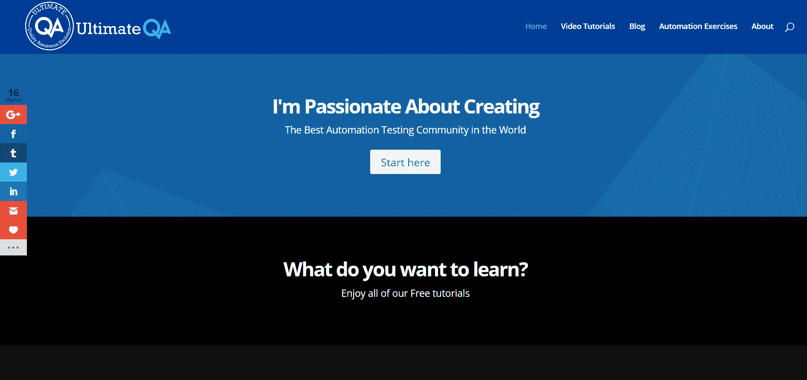
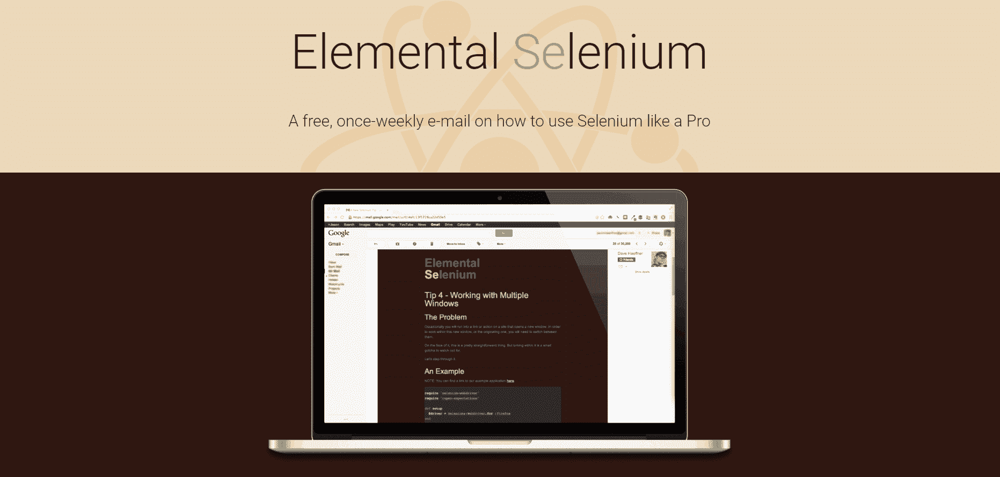
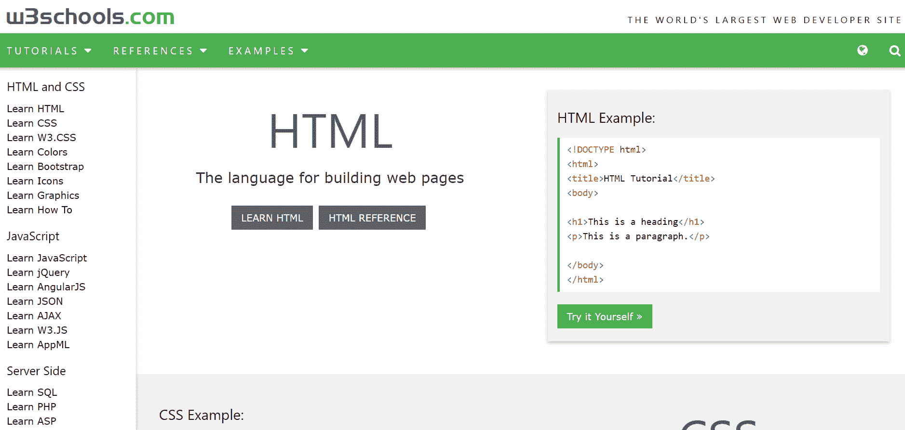
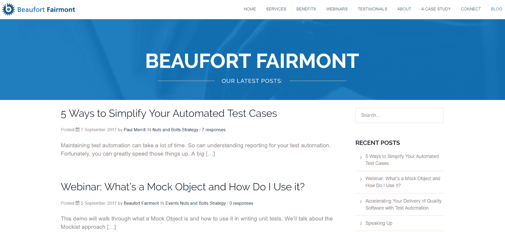

# 学习 Selenium WebDriver 的博客

> 原文:[https://simple programmer . com/9-blogs-learn-selenium-web driver/](https://simpleprogrammer.com/9-blogs-learn-selenium-webdriver/)

Selenium 是一个非常有用的工具集，用于自动化 web 浏览器，而 WebDriver 是一个高级工具，可以让您针对多种不同的浏览器测试您的脚本。每个 web 开发人员都需要知道如何使用 Selenium WebDriver。

如果你浏览一下这九个博客，你很快就会成为专家。

1.  [Selenium HQ Wiki](#a-1)
2.  [终极问答](#a-2)
3.  [谷歌测试博客](#a-3)
4.  [元素硒](#a-4)
5.  [JoeColantonio.com](#a-5)
6.  [W3C 学校](#a-6)
7.  [自动化星球](#a-7)
8.  博福特费尔蒙
9.  [EvilTester.com](#a-9)

如果你没有时间去上一堂课，或者如果你知道一点点，但想成为专家，一个很好的方法是通过阅读相关的博客来了解更多。

但是有个问题:真的很难找到好的博客来教你 Selenium WebDriver。

这并不是说他们不存在。他们是。然而，这样的博客太多了，很难从好的中筛选出不好的。

所以我为你做了。

很多年前，当我第一次开始用 Selenium 做[测试自动化时，我很难找到好的博客资源来帮助我提高技能。所以，当我发现一个有价值信息的好博客时，我就把它保存了下来。我今天仍然这样做。](https://simpleprogrammer.com/2013/09/28/creating-automated-testing-framework-selenium/)

最终的结果是收集了我的顶级博客资源来帮助你学习 Selenium WebDriver。这些资源不分先后，全部列出:

*   提供有价值且可操作的信息
*   他们的观点没有偏见
*   通过丰富的经验传达优秀的知识

我包含了每个博客的链接、博客涵盖的主要主题、简要描述以及一些你可以期望了解的要点或你应该看看的相关文章。

## [Selenium HQ Wiki](https://github.com/SeleniumHQ/selenium/wiki)

* * *

*Selenium WebDriver*

如果没有 Selenium WebDriver 知识库，就没有测试自动化的资源指南。这个神奇的维基涵盖了与硒相关的一切。您可以从贡献者那里了解到的一些主题包括:

*   [高级用户交互](https://github.com/SeleniumHQ/selenium/wiki/Advanced-User-Interactions)
*   [构建网络驱动](https://github.com/SeleniumHQ/selenium/wiki/Building-WebDriver)
*   [开发者提示](https://github.com/SeleniumHQ/selenium/wiki/Developer-Tips)
*   [页面工厂](https://github.com/SeleniumHQ/selenium/wiki/PageFactory)

## [终极问答](http://ultimateqa.com/)

 [* * *](http://ultimateqa.com/) 

*Selenium Webdriver |自动化测试|质量保证(QA) |软件测试*

该网站涵盖了与 QA 相关的所有内容，特别关注使用 Selenium WebDriver 的自动化软件测试。有些帖子和视频教程会一步一步地教你如何使用 Selenium WebDriver。以下是一些你应该通读的帖子:

*   [常见的 Selenium WebDriver 错误及其修复方法](http://ultimateqa.com/common-selenium-webdriver-errors-fix/)
*   [用 C#课程完成 Selenium WebDriver】](http://courses.ultimateqa.com/courses/selenium-with-c)
*   [如何使用 Selenium WebDriver 使用 iFrames】](http://ultimateqa.com/working-selenium-webdriver-iframes/)
*   [合适的黑盒测试设计](https://www.ultimateqa.com/proper-black-box-testing-case-design/)
*   [ChromeDriver 和 Chrome 浏览器配置](https://www.ultimateqa.com/chromedriver-configurations-selenium-webdriver/)

## [谷歌测试博客](https://testing.googleblog.com/)

* * *

*测试自动化|片状测试*

谷歌是一个创新者，他们遵循的理念和模式应该被其他 IT 行业效仿。我喜欢向最优秀的人学习。

我知道这不是一个 Selenium WebDriver 博客。然而，这个博客总体上提供了很好的信息，它确实涵盖了与测试自动化技术相关的主题。它还包括如何编写优秀代码的信息。以下是我最喜欢的一些文章:

*   我们的片状测试来自哪里？
*   代码健康:对你的代码审查有太多的评论？
*   [代码健康:减少嵌套，降低复杂度](https://testing.googleblog.com/2017/06/code-health-reduce-nesting-reduce.html)
*   [代码健康:用提交消息提供上下文](https://testing.googleblog.com/2017/09/code-health-providing-context-with.html)

## [元素硒](http://www.elementalselenium.com/)

 [* * *](http://www.elementalselenium.com/) 

*Selenium WebDriver | Ruby*

谈到测试自动化，Dave Haeffner 是一个很好的资源。他多年来一直在分享网络驱动的知识，他的网站是一个重要的信息金矿。如果您想了解如何使用 Selenium WebDriver 解决标准问题，请浏览文档并研究代码示例。下面是一些使用 Selenium 可以学习的例子:

*   [如何使用 Selenium Grid](http://www.elementalselenium.com/tips/70-grid-extras)
*   [如何使用 Safari](http://www.elementalselenium.com/tips/69-safari)
*   [如何使用 JMeter 和 Selenium 进行负载测试](http://www.elementalselenium.com/tips/68-load-testing-revisited)
*   [如何测试破损图像](http://www.elementalselenium.com/tips/67-broken-images)

## [JoeColantonio.com](https://www.joecolantonio.com/)

*自动化测试|质量保证|开发*

毫无疑问，Joe Colantonio 是我最喜欢的测试自动化思想领袖之一。Colantonio 不断提供各种不同主题的优质内容。他的播客 **[TestTalks](https://joecolantonio.com/testtalks/) ，**有许多精彩的访谈，他还在自己的博客上发布了访谈的文字记录。通过通读这些采访，你有机会在一个地方向各种各样有丰富经验的专家学习。主题包括:

*   [测试自动化](https://www.joecolantonio.com/category/software-test-automation/)
*   [配对测试](https://www.joecolantonio.com/2016/07/21/pair-testing-free-testers/)
*   [安全测试](https://www.joecolantonio.com/2016/07/19/3-free-api-security-tools/)
*   [快速测试专业/统一功能测试](https://www.joecolantonio.com/2010/08/12/quicktest-object-recognition/)
*   [移动测试自动化](https://www.joecolantonio.com/category/mobile-testing/)

## [W3C 学校](https://www.w3schools.com/)

 [* * *](https://www.w3schools.com/) 

*HTML | XPath | CSS | Web*

拥有强大的编码基础与了解 Selenium Webdriver 等特定工具一样重要。W3C Schools 与 Selenium WebDriver 没有直接关系，但是在准备使用 Selenium 执行测试自动化之前，它是一个很好的资源，可以用来学习或温习您需要的基本技能。如果你没有这些基本技能，你将无法使用 Selenium WebDriver。

我在需要时会回头参考这篇博客，尤其是这两个方面:

*   [HTML](http://www.w3schools.com/html/)
*   [XPath](https://www.w3schools.com/xml/xpath_intro.asp)

## [自动化星球](http://automatetheplanet.com/)

* * *

*测试自动化| c# | Jenkins | Visual Studio | Team Foundation Server(TFS)| Telerik Test Studio*

我跟随安东·安杰洛夫已经很多年了，因为他了解自动化。安杰洛夫经常展示同一问题的不同代码解决方案:例如，用数据映射和不用数据映射来编码一个页面对象。他始终如一地交付高质量的内容，我用这些内容来提高我作为测试自动化专家的技能。他撰写的博客文章涵盖了许多与 Selenium WebDriver 相关的有用主题。例如:

*   [最详尽的 WebDriver 定位器备忘单](https://automatetheplanet.com/selenium-webdriver-locators-cheat-sheet/)
*   [一博](https://automatetheplanet.com/category/series/designpatterns/) [开发设计模式系列](https://automatetheplanet.com/category/series/designpatterns/)
*   [Selenium 测试中的流畅 API](https://automatetheplanet.com/page-objects-partial-classes-fluent-api/#tab-con-7)
*   [深度报道](http://automatetheplanet.com/category/series/webdriver/) [与 Selenium WebDriver 相关的各种话题](http://automatetheplanet.com/category/series/webdriver/)
*   [引人注目的星期天是他最喜欢的帖子的集合](http://automatetheplanet.com/compelling-sunday-07082016/)

## 博福特费尔蒙

 [* * *](http://beaufortfairmont.com/blog/) 

*测试自动化*

我第一次看到 Paul Merrill 是在 2017 年自动化协会的一次演讲中。他提供的信息是相关的和有见地的。从那以后，我一直在看他的博客。

他的工作非常关注如何做好测试自动化。Merrill 提供了优秀的策略来加速测试自动化并交付更高质量的结果，这是我们在使用 Selenium 时都想要的。他还定期提供充满精彩信息的高质量网络研讨会。我最喜欢的一些帖子包括:

*   [简化自动化测试用例的 5 种方法](http://beaufortfairmont.com/2017/09/07/5-ways-to-simplify-your-automated-test-cases)
*   [测试自动化 ROI:展示商业利益的 5 种方式](http://beaufortfairmont.com/2017/06/27/5-ways-to-roi/)
*   什么是 API，我如何测试它？

## [EvilTester.com](http://eviltester.com/)

* * *

*测试|自动化| Java*

我知道艾伦·理查森至少有五年了。谈到测试自动化，他是一个非凡的资源。例如，他写了《面向测试人员的 Java:快速学习基础知识》这本书和《T2 硒简化版》这本书。

和大多数优秀的资源一样，这个博客不仅仅关注单一的工具。他涵盖了与测试自动化相关的广泛主题。然而，毫无疑问，他的资源将帮助你大幅提高你的 WebDriver 技能。这里有几个我最喜欢的资源:

*   图帮助你理解如何抽象出你的测试自动化类，使它们更容易使用和导航。
*   一篇关于测试自动化的 Javascript 和在哪里学习它的文章。
*   [从哪里学硒](http://blog.eviltester.com/2011/06/how-can-i-learn-to-automate-my-testing-using-selenium.html)从艾伦的角度。

## 让最好的东西帮助你成长

* * *

当你想更多地了解某个主题时，博客是一个很有价值的工具。就 Selenium WebDriver 而言，有太多的博客，很难知道哪些值得花时间和精力通读。

这个列表中的博客确实帮助提高了我的 Selenium 技能，我相信您也会发现它们是一个有用的资源。

这些博客将帮助您降低 Selenium WebDriver 和测试自动化的学习曲线。利用这些博客的丰富经验和知识，帮助自己成长。