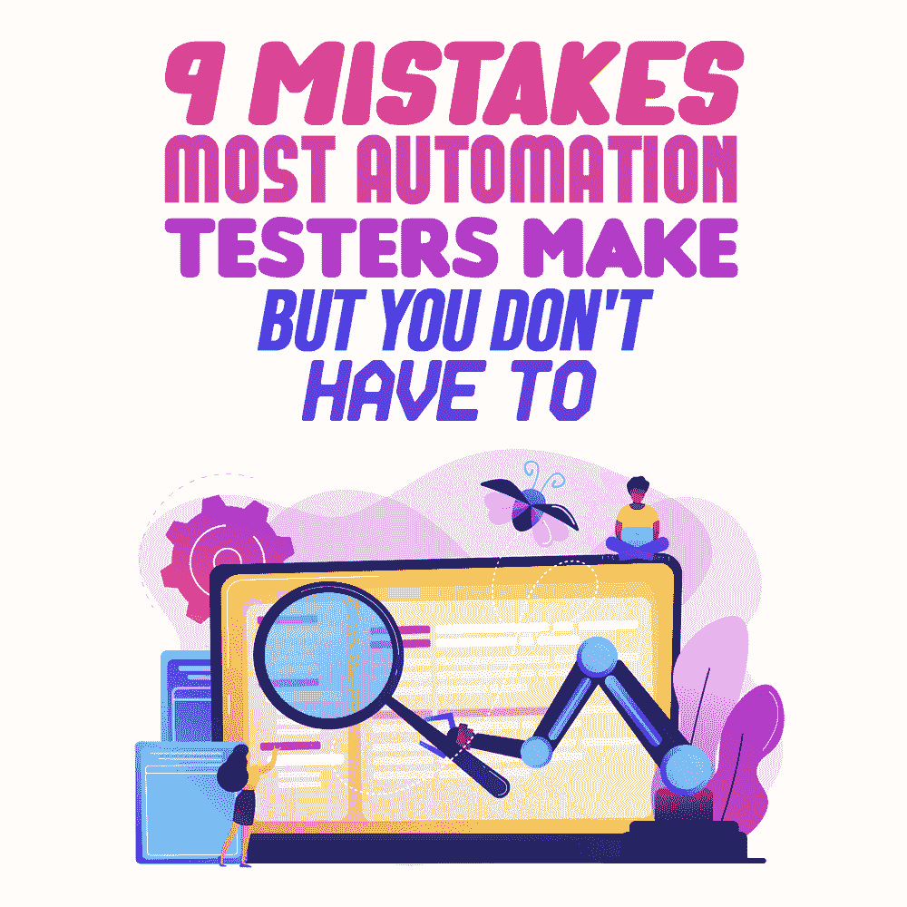

# 大多数自动化测试人员会犯的 9 个错误(但是你不一定要犯)

> 原文:[https://simple programmer . com/9-errors-automation-testers-make/](https://simpleprogrammer.com/9-mistakes-automation-testers-make/)

If you have decided to become an automation tester, you’re bound to make mistakes, especially if you are doing complex [automation testing](https://simpleprogrammer.com/ultimate-automation-testing-guide/). If you want to avoid errors and become proficient in automation testing faster, learn from others' mistakes. With that in mind, below are nine common mistakes that most automation testers make, but you don't have to.

在我们开始之前，记住 100%自动化是一个神话，我们总是需要手工测试人员。

## 1.自动化一切

我的第一个任务是为 web 应用程序自动化 Selenium 测试脚本。为了给我的导师留下深刻印象，我也选择了另一个模块，几天后我就碰壁了。

事实证明，该模块并不意味着自动化，因为它可能会导致许多误报和漏报。它耗费了我的时间和名誉。我想说，我的第一印象到此为止。

总是首先定义测试的范围，然后考虑自动化。作为一个[新的自动化测试人员](https://www.amazon.com/Automation-Made-Easy-Everything-Automation-ebook/dp/B007JBBNC2/ref=sr_1_6?dchild=1&keywords=Automation&qid=1601362284&sr=8-6)，我们想要测试一切。您可能自动化了项目的 95%,但是这值得花费时间、精力和金钱吗？保持好奇心是至关重要的，但永远记住自动化不是魔杖，也不可能让一切都自动化。

总是问你自己为什么你需要自动化一个特定的项目。多问问有经验的同事。如果他们认为它提供了真正的好处，那么就把它当作一盏绿灯。只自动化那些提供价值和节省资源的测试。

提示:必要时自动操作；不要为了自动化而自动化。

## 2.不注意工具

工具可以使测试变得容易或具有挑战性，所以明智地选择它们。你需要清楚你的目标，这样你才能相应地选择你的工具。不同的工具可以帮助你实现不同的目标。

比如你要为一个网站测试 API，你要选择 Postman 如果你要检查你的网站的跨浏览器兼容性，使用像 [LambdaTest](https://www.lambdatest.com/blog/the-definitive-guide-to-automation-testing-for-it-teams/) 这样的工具。一个项目可以分为许多目标，我们可以使用不同的工具来实现每个目标。

提示:首先找到问题，然后找到解决问题的工具——而不是相反。

## 3.与其他测试人员不协调

很有可能作为一个新的测试人员，你将在一个团队中工作。通常，一个团队由具有不同专业水平的人组成。更好地了解你的测试伙伴将有助于你理解谁在做什么，谁擅长做什么——这样你就可以相应地联系他们。

通过更好地了解他们和他们的技能，你可以在遇到问题时节省时间，因为你知道该向谁求助。此外，这将减少随机任务分配的机会。

提示:在开始测试之前，充分了解你的测试同事。

## 4.没有对资源进行检查

测试是一个昂贵的过程。但大多数时候，人们会忘记这些成本。记住:测试人员的工资并不是测试过程的唯一成本。工具、基础设施、机器、培训和升级也是费用。

如果您使用 Selenium 这样的开源框架进行跨浏览器测试，测试人员必须接受框架培训。有时他们需要工具来升级测试。对于跨浏览器测试，在本地机器上的自动化测试对于一个成长中的公司来说可能是不够的；您的团队可能需要基于云的并行测试基础设施。

团队可能需要一些工具的培训，比如跨浏览器测试工具，或者订阅第三方云服务，比如虚拟主机。所有这些都是费用，甚至在测试过程开始之前。在你职业生涯的早期阶段，通过利用所有资源来获得最大的生产力，你将能够对资源的投资回报率产生积极的影响。

提示:要成为团队的资产，你首先需要了解负债。

## 5.只关注无代码自动化

如果你想快速完成工作，无代码自动化是一种简单的逃避方式，但它不会帮助你发展技能。如果你只凭这个技能去面试，你会很难破解。

软件和网站正变得如此复杂，以至于几乎不可能使用无代码自动化工具来自动化一切。所以，你不能逃避代码。

提示:在你知道如何编写测试代码之前，不要使用无代码自动化。

## 6.没有关注测试设计过程

测试设计用于从一般用途、观察和目标中构建有形的测试用例。

作为一个新手，我曾经通过直接跳到自动化脚本编写来破坏测试设计的过程。测试设计对我来说是一项无聊的任务，我认为这是我最大的错误，因为我从未对我想要的最终结果有过全面的了解。这导致了许多回顾性的修改和时间浪费。

设计测试将有助于您创建现实世界中适用且有意义的测试。这将在你写第一行代码之前给你一个总体的想法，并使测试过程对你来说非常有效。

小贴士:第一次就把工作做好，这样你就不需要浪费资源去修理了。

## 7.陷入假阳性和假阴性的陷阱

假阴性是指尽管通过了测试，但测试结果错误地显示测试失败。假阳性反之亦然。

检测报告不是放之四海而皆准的真理，我们需要半信半疑。例如，如果您正在测试登录功能，并且报告显示用户成功登录，您最好去检查用户是否实际登录。在这类事情上犯错误会损害你作为测试人员的可信度。

**提示:先测试你的测试代码，然后再测试别人的代码**

## 8.不遵循自下而上的方法

一步一步来，从小步开始。自上而下的方法要求您首先对较小的模块进行自动化测试，然后逐步升级到较大的模块。

作为一个新手，你可能不知道所有的出站和入站流程。你可能缺乏为更大的模块编写测试的技能，结果在几天的工作后没有任何东西可以展示。所以，总是从小处着手，从这里开始培养你的技能。

小贴士:从小处着手会让你为更大的模块做好准备。

## 9.不执行探索性测试

One of the common mistakes most automation testers make is not incorporating exploratory testing into their weekly routine—I have done it too. Don't fall into the trap of looking at scripts and pre-written tests only.

使用探索性测试，您可以找出可能不在预先编写的测试中的新测试用例。因此，不要忘记定期进行探索性测试。

提示:别忘了探索。

## 准时成为自动化测试员

现在是加入自动化测试的最佳时机。几乎所有的主流框架要么可以自动化，要么正在向自动化的方向发展。

当你步入自动化测试的世界时，你肯定会犯一些错误。然而，遵循上面的提示将确保你避免主要的错误。