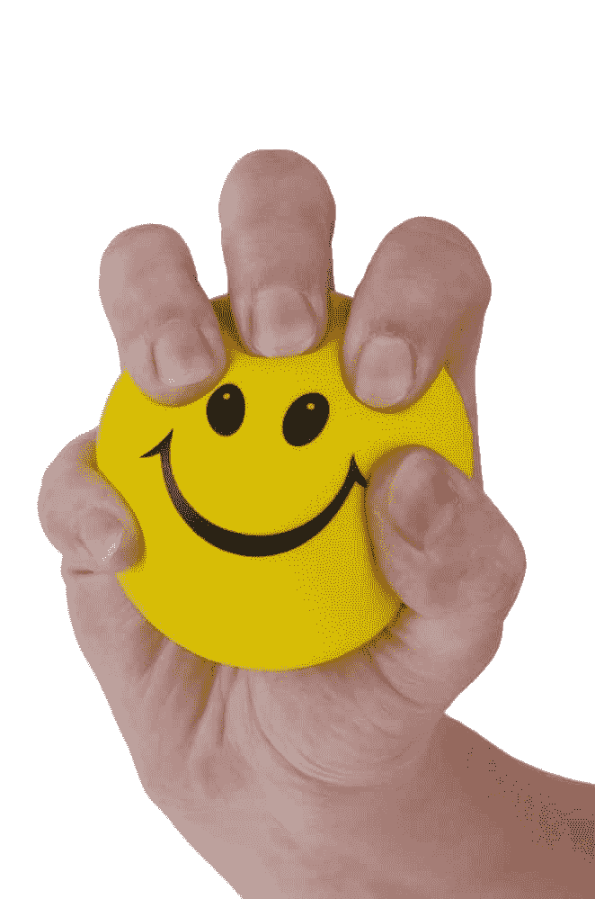
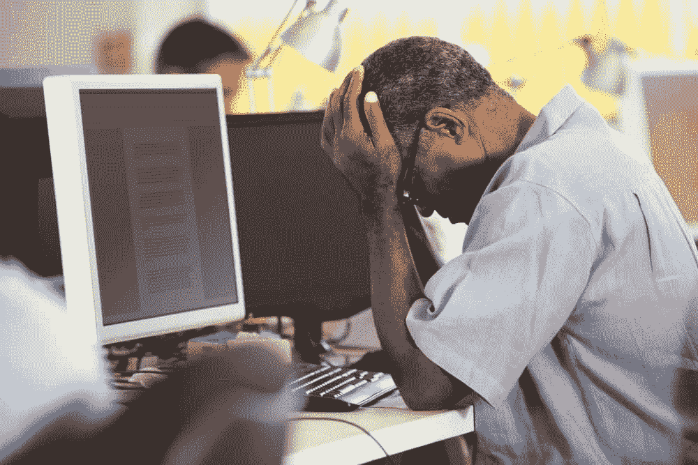
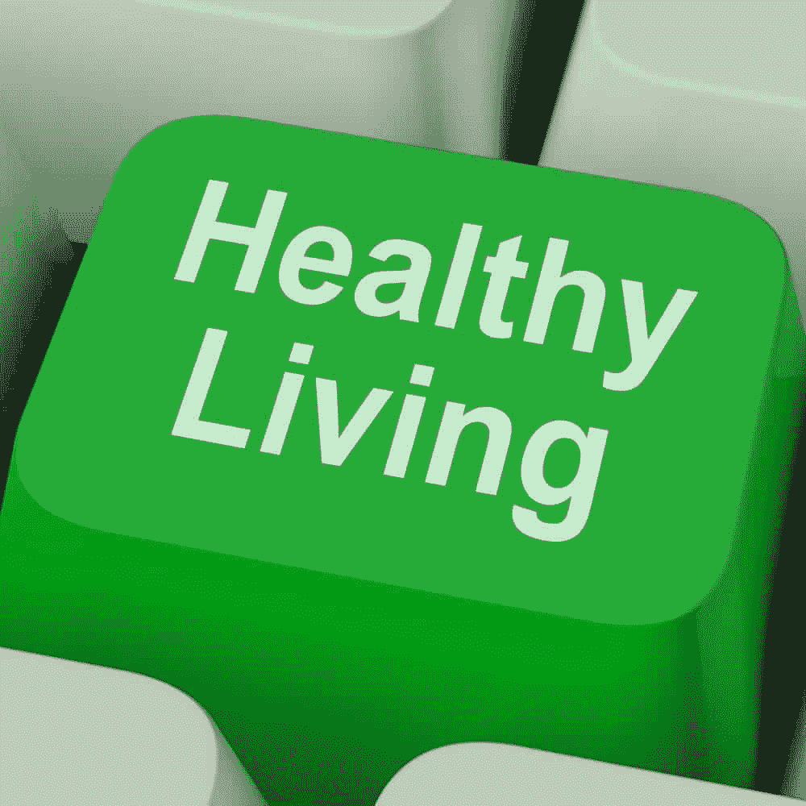

# 程序员管理压力指南

> 原文:[https://simple programmer . com/a-programmers-guide-to-managing-stress/](https://simpleprogrammer.com/a-programmers-guide-to-managing-stress/)

有一次我差点失去理智。这是发生在我身上最好的事情。

我差点失去理智，因为我没有照顾好它。对于一个重要的项目来说，太多的紧张时间，加上我个人生活中的一些持续问题，使我应付日常生活的能力陷入赤字。

我压力非常非常大。

我心跳加速。我的心在狂跳。我清晰思考的能力——当你试图把工作软件推出去的时候，这是非常重要的——已经荡然无存。

它影响了一切，包括我的感受，我的人际关系，我的睡眠和食欲，尤其是我的工作能力。那不是一个好地方——我处在某个肮脏地方的边缘。倦怠。

这是发生在我身上最好的事情，因为当我从悬崖边回来的时候，我学到了很多关于人类如何工作的知识。特别是，我了解了我们的精神和身体极限，压力和焦虑的本质，最重要的是，如何照顾自己，以便我可以阻止这种事情再次发生。

这是有价值的信息，适用于所有人。编程通常在工作满意度方面得分很高，但是程序员也是人，和其他人一样受到 T2 的限制。

## **压力是如何工作的**

编程文化强调优秀和能力。这让我们很难向自己或他人承认我们可能有压力问题。

### 

然而，它实际上已经融入了我们的神经和物理电路，所以每个人都必须在某个时候处理它。

### 

T2】

### **身心压力**

### 

压力是一系列的*生理和心理变化，当我们的身体和心灵感知到环境中的 ***威胁或挑战*** 时就会发生。*

*压力反应——也被称为*——在我们处理表明我们受到威胁或面临挑战的信息时发生。身体症状可能包括:**

*   **肌张力**
*   **心率和血压增加**
*   **浅呼吸**
*   **恶心**
*   **脑力劳动的感觉**
*   **狭窄的注意力焦点**
*   **情绪反应**

### 

**进化理论提供了一种简洁的方式来解释人类在生存方面所经历的任何事情。**

**压力反应可以被视为一种 ***手段，通过让我们做好迎接挑战的准备，让我们保持活力*** 。**

**所有与压力相关的生理反应都有一个目的。例如，我们在准备爆发性运动时会紧张——如果我们要逃离在森林小径上遇到的熊，这非常有用。**

**如果我们伏案运行一些单元测试，这并不总是有用的…**

**或者我们的消化系统关闭了，这样它所消耗的能量可能会被重新用于逃跑，这就解释了恶心。**

### 

**同样的事情也发生在我们的免疫反应上。通过暂时关闭能量来保存能量，代价是免疫力下降。这就是为什么你经常在压力增加的时候生病，也是为什么过度的压力会导致长期的慢性疾病。**

### ****压力和神经系统****

****

**压力是人类相当低级的反应。由*的 ***交感神经分支*** 介导。

### 

自主神经系统负责人类的一大堆自动行为——你不必去想，你只要去做就行了。

也有一个 ***副交感神经分支*** ，当它被激活时，具有几乎相反的效果。这是个好消息，我们稍后会看到。

你可以把这些想象成汽车的油门和刹车。你需要两者来到达你要去的地方，但是太多的话，你要么哪儿也去不了，要么直接开出马路。

### **对威胁的感知**

压力反应的一个有趣之处在于，它不需要真实的、身体上的威胁。仅仅记住一个紧张的情况就能引发身体和精神上的反应。来吧，试试看！

当*感知到挑战或威胁时，威胁响应可以被激活。这就是为什么即使你没有直接的身体危险，与你老板的电子邮件或谈话也会有压力。*

## ***好的和坏的压力***

*每样东西都有一点点是好的，适量。红酒，项目管理流程，甚至压力。*

### 

*在充满挑战或威胁的情况下，压力实际上是一种非常有用的反应。我们作为一个物种繁荣的众多原因之一是我们逃避威胁和迎接挑战的能力。为了完成任务，我们需要一点压力反应。称之为好的压力。*

**

*例如，当我写这篇文章的时候，我正在经历一些低水平的压力症状。随着肾上腺素的释放，我的脚在滴答作响，当我专注于写作的过程时，我的思维变得敏锐。

### 

在我们的职业生涯中，我们都曾因多次经历编码会议而兴奋不已。对我们中的一些人来说，它会上瘾。

低水平的压力为完成工作提供动力。

当我们的压力反应被过度激活时，问题就来了。

每个程序员在某个时候都经历过死亡行军。想想你在紧缩模式下几周后的感受。你可能累了，可能生病了，你的注意力正在减弱，你只是总体上感觉不好。你的注意力下降，这对你的工作效率没有好处。

事实证明，不断让压力荷尔蒙充斥你的系统，削弱你的消化系统和免疫反应，被过度思考消耗不仅令人不舒服，而且从长远来看对你非常不利。

## **程序员和压力**

### 

所有职业都有压力来源。有时压力是由特定的工作环境引起的——例如，糟糕的管理或团队关系。

### 

有时，职业本身的性质会导致固有的压力来源。

作为程序员，在检查我们与压力的关系时，我们需要考虑许多因素。

### 我们生活在我们的头脑中

我们大多数人转向编程职业是因为我们喜欢思考问题和解决问题。我们大部分时间都生活在自己的头脑中，并且很开心。

这意味着我们会变得有点脱离我们的身体。因为我们并不总是注意，所以很容易忽略压力的一些身体症状。如果我们没有注意到这个问题，我们就不能着手解决它。

健康压力管理的一部分是当我们经历过度压力时注意到，这样我们可以采取适当的行动。

### **文化期望**

压力的外在来源存在于我们所处的工作文化中。压力和忙碌可以被视为一种荣誉，一个富有成效的员工的标志，或者只是工作的一部分。

因为我们都是神奇的超人代码机器(提示:我们不是！)，人们常常期望我们会一个接一个地交付超高标准的 sprint，一个接一个的项目，没有时间休息或修复。

压力的内在来源来自我们自己。编程文化重视智力，这导致我们将自己与他人进行比较，这导致了[冒名顶替综合症](http://www.geekmindfitness.com/mindfulness/how-mindfulness-meditation-stopped-me-feeling-like-a-fake/)或[负罪感](https://www.youtube.com/watch?v=CFoxeiurl_E)，两者都是压力的来源。

### **饮食和锻炼**

“程序员是一个将咖啡因转化为代码的机制，”俗话说得好。我也会把糖加到那张单子上！像咖啡因这样的兴奋剂实际上会放大压力反应(T4)。同样，这在适度的情况下是好的，但从长期来看并不好。

整天坐在办公桌前不利于身体健康。紧张是压力反应的一部分，会在体内积累，随着时间的推移，会导致巨大的压力。

当谈到编程和压力时，饮食和锻炼肯定是等式的一部分。考虑多运动，或者放松一段时间，不要吃咖啡因和含糖的零食。

## **压力管理策略**

那么一个忙碌的程序员该做些什么呢？压力是存在的，有时会变得过度，从长远来看，这对你没有好处。

如果你知道这是你开发和维护的系统，你会采取行动，对吗？

谢天谢地，压力已经被彻底研究过了。当你试图管理生活中的压力时，有许多策略可以考虑。

它们分为三类:

*   移除来源
*   消除损害
*   降低你的基线

### **移除信号源**

有时候，努力消除生活中的压力来源是必要且明智的。想想什么给你带来最大的压力，并努力去做些什么。

开始和你的老板谈论所有的加班对你产出的影响。放弃那个麻烦的客户。如果有必要，考虑换工作。如果可以，请你的家人在个人管理方面给予更多支持。

考虑让自己远离生活中任何有害的关系。如果你时间紧迫，考虑一下你是否真的需要那些爱好中的*。*

*简而言之，找些时间休息一下，放松一下神经系统。*

*通常我们也可以研究内部资源。你对忙碌的信念是什么？你认为它重要吗？这是你自我价值的一部分吗？你会给自己额外的压力吗？即使你少工作 10%也没关系。*

*你的前景如何？你倾向于灾难吗？你是以消极还是积极的态度看待每一种情况？*

*你的饮食怎么样？你的日常体育锻炼？*

*如果可能的话，对你生活中的内部和外部压力来源进行一次快速检查会给你提供一个行动清单，你可以采取这些行动来消除它们。和朋友或同事讨论一下会很有帮助。当你处于生活中的压力时期时，有时很难有一个清晰的视角。*

### ***撤销伤害***

*当然，不可能消除生活中所有的压力来源。如果你找到了一条路，数不清的财富在等待着你，所以恭喜你！请让我知道你的秘密。*

*不过，你当然可以尝试挽回损失。锻炼是一种非常有效的方式。运动释放内啡肽，不仅感觉良好，还可以减少释放的压力激素的负面影响。*

*锻炼制度是非常个人化的；找到一个适合你的可能需要一段时间。我最喜欢的压力克星是瑜伽——它将身体需求与深呼吸结合起来，正如我们很快会看到的，这是一种很好的放松方式。但是任何涉及到中等强度的体育锻炼都可以。*

### ***主动压力管理***

*我们都有一个基线压力水平，在我们的一生中不断波动。通过采取积极主动的方法，有可能降低这个基线。*

*把减轻压力作为你生活的目标是一个有价值的目标。压力对你的影响越小，你就越有效率。*

*拥抱有意识的放松练习，比如下面这个。或者学习正念技能，许多研究表明这可以减少压力的影响。*

### ****快速放松练习****

**

*这里有一个帮助大多数人放松的快速练习。

它的工作原理很简单，即有可能 ***激活你神经系统的副交感神经分支***——负责放松反应的部分。你开始放慢和加深你的呼吸。缓慢、深呼吸与副交感神经反应有关，所以当你控制放松反应的这一方面时，它会欺骗你的身体激活其余部分。

找一个你可以安静地坐几分钟的地方。你的办公桌就可以了，但是如果你能找到一个可以独处不受打扰的地方，那就更好了。

我们大多数人呼吸浅而快，这与压力反应有关。在这个练习中，把你的手放在腹部。我们会专注于深呼吸。

闭上眼睛，记下你的感受，慢慢吸气。以这样一种方式呼吸，在你的胸部扩张之前，你感觉到你的腹部在上升。尽可能长而慢地呼吸——也许开始会稍微快一点，然后慢下来。呼气时，让腹部先于胸部收缩。

重复这个动作几分钟，通常是 10 到 15 次呼吸。注意到你的精神或身体状态有什么变化吗？

这对你有多大作用？

## 你通过压力测试了吗？

在学习如何管理生活中的压力时，每个人都有不同的需求。你面对压力时的适应力是由一系列复杂的生物和环境因素决定的。在你的一生中，你与压力的关系可以而且确实会发生变化。

许多人发现，更多地了解他们与压力的关系是非常有益的。慢性压力是一种能量被误导的状态，它会导致你生活的许多方面受到影响。

*最佳性能和压力之间存在微妙的平衡*。压力太小或太大都会把我们踢出“禁区”。

控制过度的压力有很多好处，无论是纯粹的身体上的，比如提高免疫功能、血压等等；或者精神上的，比如思维更清晰，注意力更集中，找到心流状态的可能性更大。

作为一名程序员，面对一份脑力劳动，自然会寻找提高思维质量的方法，而*压力管理是一条直接的途径*。

一个有压力的人会有情绪反应，这通常会影响沟通和决策。学会自然地管理过度的压力*会导致情绪平衡*，这在你所有的关系中都有连锁效应:放松的人更容易相处。

程序员倦怠是一个真实的现象，通常工作压力是一个很大的因素。我亲身经历过两次(这也是我为什么对压力了解这么多的原因！).在所有的工程项目中，预防性措施更便宜，从长远来看更有效。所以，如果你觉得自己快要精疲力尽了，为什么不把这种方法应用到生活中的压力管理中呢？

那么压力在你的生活中是如何表现的呢？刚刚够？太多了？你今天能做些什么来开始减轻负担呢？*****