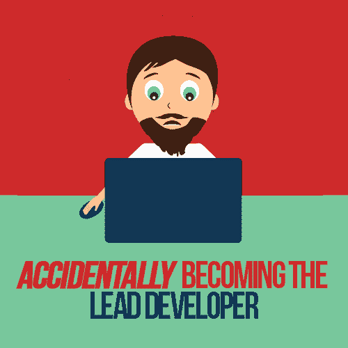

# 意外成为首席开发者

> 原文：<https://simpleprogrammer.com/accidentally-lead-developer/>

When I began working as a developer, I was deeply focused on the little things: how an algorithm works, the exact syntax for the language I was writing in, why an answer on Stack Overflow broke my code, and all the other roadblocks along the way.

随着我职业生涯的发展，这些障碍不再经常阻碍我，我变得更加关注我的代码实际上在做什么。我过渡到了我的第一个全职开发人员角色，在那里，我的项目经理给我分配任务，并一次完成一个任务，随着我变得更加自信和有能力，我承担了项目的更大部分。

然后，突然之间，我发现自己在做一个有点不同的项目。

项目团队中有两个经验比我少的开发人员，我直接与客户的技术团队合作，没有专门为我的项目指派的高级开发人员。

我意外地成为了首席开发者。

## 做一名首席开发人员和做一名普通开发人员有什么不同？

成为一名首席开发人员并不容易，它伴随着许多挑战。你将不得不适应工作流程中的变化，受到更多来自其他人的干扰，这些人希望你在比你习惯的个人贡献者角色更广泛的问题上发表意见，并且同时兼顾创造者和协调者的任务。

当我担任这个新角色时，我发现的第一件事就是我的日常工作流程变化非常快。我习惯于早上走进办公室，坐下来，戴着耳机埋头写几个小时的代码，然后去吃午饭，在下午剩下的时间里变得更加社交化和协作化。我习惯于做一个“创造者”。

作为首席开发人员，我似乎带着一堆电子邮件来到办公室，回复公司其他人对项目的检查，以及我团队中其他开发人员的问题。我会有开放的拉取请求等待我的审核，并且我的日程表上已经有会议了。我被迫成为一名“协调员”

这可能发生得很快，或者你会发现你的协调员任务进展得更慢。在这两种情况下，重要的是要认识到你是在处理创建者任务还是协调者任务，并相应地调整你的工作。

### 创建者与协调者

如果我能够认识到这些新的职责是我的新焦点，并从创造者模式转变为协调者模式，那就好了。但我没有。我仍然相信我可以在会议、电话和其他开发人员的拜访之间花一整天的时间写代码。

现在回过头来看，那是一场灾难。

确信我能完成“真正工作”的唯一时间是在其他人都回家后，在协调了一整天的项目后，我开始呆在办公室里完成编码。剧透:这是不可持续的。

管理团队、协调开发工作、架构咨询以及帮助调试和部署等工作都是真实的工作，即使你没有直接编写代码。作为一名个人贡献者，你习惯于用那天你提交了多少提交或者你在一个特定的项目上写了多少行代码来衡量你的工作。

作为首席开发人员，您所做的工作不那么有形，但可能更重要。你正在影响你的整个团队的生产力，这种影响甚至比你个人对项目的贡献还要大。

作为一个习惯于全职开发的人，这个概念可能很难理解，但是从纯粹的写代码后退一步，可以让你更好地管理你的团队。尽管创建者角色是你更熟悉的角色，但你不能因为不熟悉或害怕就忽视或回避协调者角色。

作为一个领导者，你需要编写代码要少得多。你不会完全放弃它，因为仍然有优化和重构可以贡献给项目，因为你能够看到更大的画面。然而，作为一个协调者，你将帮助其他人以最有效的方式编写他们的代码，而不是自己编写。您将使用您的编码技能来节省团队中其他人的时间和挫折，而不是自己运送所有东西。

### 您团队的成功=您的成功

作为首席开发人员或技术主管，您的首要任务是让您的团队保持正轨并帮助他们茁壮成长。作为一名创作者，你的成功取决于你完成分配给你的任务的效率。现在，作为一个领导者，你的成功是当你的*团队*实现了他们的目标并交付了交给他们的*任务。有时候，这可能会打乱你目前正在做的事情。但是，作为领导，能够放下工作去帮助你的团队是很重要的。*

作为首席开发人员，您会发现在每个项目中，都有更多初级团队成员不具备处理技能的工作，例如部署、与外部系统的集成，以及任何比他们习惯的明确定义的功能更模糊的工作。这些正是你作为领导者应该承担的棘手任务。弄清楚这些种类的过程将帮助您的团队更有效率，而不会使项目经验不丰富的开发人员远离对项目的直接贡献。

作为领导者的另一个重要部分是帮助你的团队发展成功所必需的技能。当给开发人员分配任务时，试着试探他们是否相信他们有完成任务的知识。如果没有，坐下来一起浏览一些脚手架代码通常是有帮助的。即使只是在代码注释中写出应该如何实现该特性的一般流程，也可以帮助 kickstart 开发，并减轻团队中缺乏经验的成员盯着“空白页面”的负担。

### 你是领导者，不是独裁者

### 

T2】

作为首席开发人员，现在您的工作是做出高层次的技术决策，并仲裁团队之间的技术纠纷。然而，这并不意味着你应该不咨询你的团队就单方面做出决定。

当涉及到一个决策时，比如在开发某个特性时采用什么方法，你的团队成员很可能对前进的方式有他们自己的想法。重要的是要考虑这些意见，并对它们进行评估。

有时候，你的团队成员会提供更好的方法，允许这种讨论发生是很重要的。你可能是领导者，但你有时会错，这就是为什么你需要在前进之前听完所有的想法和方法。你在一个团队中，所以你不必自己做所有的决定，使用你所有的资源是很重要的。

然而，在进行这些重要讨论的过程中，会出现一些分歧。有时候，你的团队中有两个不同的成员在技术方法上有分歧，你将不得不对这一争议进行仲裁。

开发人员可能意志坚强，尤其是在捍卫他们的代码和想法的时候。这很好，但作为调解人，不要让这些讨论带有个人色彩也很重要。重点应该放在所建议的每种方法的技术优点上。这些调解技巧可能很难学习，但是随着您参与更多的此类对话，您将学会如何领导持有不同观点的开发人员，并让他们团结在一个共同的解决方案后面。

### 你有一整套新技能要学

在开发人员职业生涯的早期，您可能主要关注于学习技术技能，比如新的编程语言、新的编辑器和新的构建工具。然而，现在你处于领导角色，你也需要学习一些软技能。这些技能包括将一个较大的项目分解成多个任务，处理预算问题，雇佣和培训其他开发人员。

有一整套管理技能被大多数开发人员视为不重要。现在你是首席开发人员，你不能再有这种态度了。两大入门资源是 *[Peopleware](http://www.amazon.com/exec/obidos/ASIN/0321934113/makithecompsi-20)* 和 *[神话中的人月](http://www.amazon.com/exec/obidos/ASIN/0201835959/makithecompsi-20)。每本书都从一个经理的角度来看待开发项目的生命周期，并提供了当你不是编写所有代码的人时如何管理团队的视角。*

在新的首席开发人员角色中，要学习的最重要的技能是在头脑中记录多个任务而不会不知所措的能力。以前，作为一个独立的贡献者，你有更多的余地专注于一项任务，直到它完成，你自己消除依赖，专注于完成它。

在你的新角色中，会有一些任务需要你决定一个行动的过程，但是在其他依赖完成之前你不能向前推进。重要的是转移到其他的任务上，当你可以继续前进的时候，有意识地回到你原来的任务上来。

此外，向在你之前来过这里的人学习也很重要。向开发主管角色过渡的最好方法之一是向过去已经成为经理的开发人员学习。Patrick Kua 有一个关于他在领导和参与各种开发团队时所见所闻的精彩演讲。

当你继续你的新角色时，重要的是专注于学习你成功所需的所有技能，而不仅仅是技术技能，因为这些对你来说已经变得更自然了。你可能会发现自己在阅读那些你曾经认为没有什么可以提供给你的商业和领导力书籍。这太棒了！发展这些技能可以让你超越首席开发人员的职位，成为项目经理或者更大的管理职位。

## 作为首席开发人员向前迈进

## 

T2】

首席开发人员是一些开发人员试图在其整个职业生涯中实现的角色。如果管理技术人员是你喜欢的事情，并且你足够幸运地晋升到这个职位，你可以在工作和职业生涯中找到更多的满足感。

成为首席开发人员的最大回报之一就是当你所有的努力都有了回报，你看到你的团队成功了。看着初级开发人员掌握您教给他们的新技能，并将它们应用到您团队的工作中，这是一种难以置信的感觉。或者看到你们作为一个团队所决定的方法，并让项目按时完成。这种满足感是成为首席开发人员的最大好处之一，也是很多开发人员在接受这个角色时不会想到的。

重要的是要记住，你现在必须平衡创造者和协调者这两个角色，不要太偏向任何一方。牢记这一点将有助于你顺利过渡到这个新角色，并推动你的团队前进。