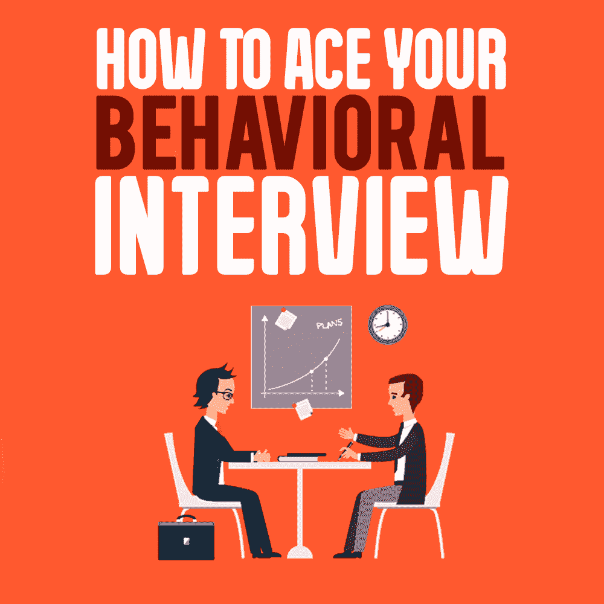
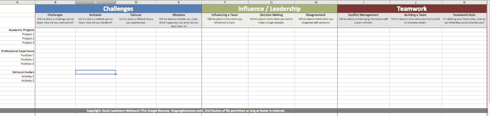
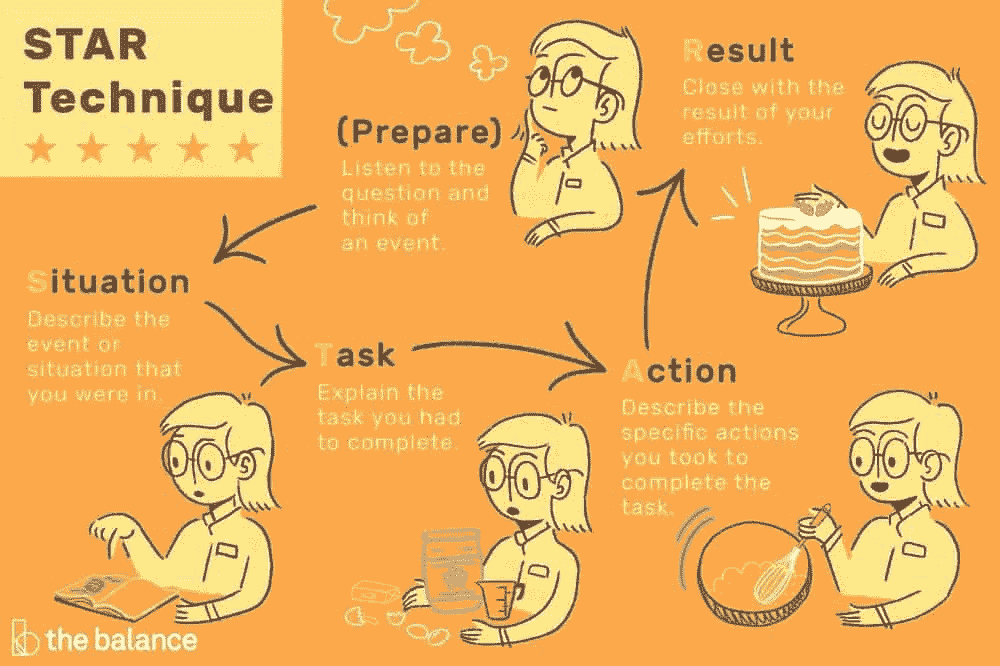

# 如何赢得行为面试

> 原文：<https://simpleprogrammer.com/ace-behavioral-interview/>

When we think of coding interviews, most of us tend to think of technical interviews—staring at a whiteboard and hoping that a solution will magically come to us (although there *is* [a better way](https://www.byte-by-byte.com/stuck-on-coding-interview/)).

至少我是这么想的。

编码面试是重要的，不要误解我的意思，但是专注于白板而忽略其他任何东西也是有害的。行为面试对获得这份工作也非常重要。

“行为面试”基本上是对你在面试中要做的所有事情的概括，而不是编码。

这可能是在谈论你的副业。这可能意味着讨论你为什么对这家公司感兴趣。不管是什么，在这些面试中取得成功的最好方法就是练习，然后有备而来。

在过去的三年里，我已经帮助我在[的数百名学生成功地在所有主要的科技公司找到工作，从谷歌到亚马逊到 Snap 等等。在这篇文章中，我将详细说明你在准备行为面试时应该使用的策略——这样即使你之前没有太多的经验，你也会显得很聪明并得到一份工作。](https://www.byte-by-byte.com/)

## 行为面试错误

我们将从这里开始，因为在某些方面，避免这些错误甚至比做好其他事情更重要。然后，当你应用本指南其余部分的原则时，你将在行为面试中取得成功。

这些是我见过的你需要避免的最常见的错误:

### 杂乱无章的

保持你的答案简洁至关重要。你对任何问题的回答都不应该超过两分钟。如果你的面试官想深入挖掘你提到的任何事情，他们会问的，否则你就是在浪费宝贵的时间。

用一两句话来建立你的故事，然后说说你做了什么。如果你花了时间准备，你应该已经知道如何以简洁有趣的方式开始你将要讲述的故事。

### 不要推销自己

行为面试的全部要点是推销自己，向面试官展示为什么你是这份工作的合适人选。这意味着你可以在这里吹嘘你的成就。不要对此反感，但不要犹豫，自信地谈论你的成就。

一个你可能不经意间低估自己的地方是当你谈到你作为团队的一员所做的工作时。是的，你和团队一起工作的事实很重要，但是特别强调你自己的成就也很重要。当谈论你所做的事情时，说“我”而不是“我们”。

### 不真诚

如果你曾听到有人说他们的弱点是“工作太努力”或类似的话，这是一个很好的例子，说明你的面试官看起来不真实。你想推销自己，但是选择一些被很多人认为是积极的品质看起来像是你试图掩盖你真正的弱点。

专注于讲述真实的故事，并将这些故事与公司对员工的要求联系起来。如果你做到了，你就不必完美。没有人期望你是完美的。他们想看到你是一个他们想一起工作的人。

### 不回答问题

这也归结为准备。如果你没有为面试做好充分的准备，脑子里有一些故事，就很难想出问题的真正答案。记住，你不想听起来像一个回避问题的政客。

特别是如果你知道有些领域你没有强有力的答案(例如，也许你没有很多工作经验或领导经验)，花一些额外的时间来准备如果你在这些领域被问到的问题你将谈论的内容。

如果你在准备行为面试时牢记这些错误，你将避免人们在回答行为问题时犯下的大多数代价最大的错误。

## 行为面试准备

[//www.youtube.com/embed/Ebr1jM94fzQ?not_used=1](//www.youtube.com/embed/Ebr1jM94fzQ?not_used=1)

The real key to doing well in behavioral interviews is preparation.

你可能认为你可以用这些问题来即兴发挥，因为它们都是关于你自己的经历，但关键是你要回去真正地分析你的经历。通过遵循这些步骤，你将为自己做好准备，以一种有影响力的方式回答行为问题，让你的面试官真正做出回应。

### 第 0 步——研究公司

我将此作为第 0 步，不仅因为我们是软件工程师，还因为它在真正的准备工作开始之前。在你具体计划你将在面试中说些什么之前，看看你申请的工作的职位描述，看看他们在寻找什么样的软技能会很有帮助。

大多数公司会说，他们在寻找一个有很强的主动性、领导能力或其他模糊表述的软技能的人。行为面试给了你一个绝佳的机会来展示，而不是告诉你的面试官你是多么适合这家公司。

当你完成剩下的步骤时，想想如何挑选能展示这些软技能的故事。你如何将它们融入你的答案中？例如，你可以谈论你如何协调许多不同的团队成员，或者当你有一百万件其他事情要做来展示你的组织或领导能力时，你是如何完成每件事情的。如果你有创意，有很多方法可以把它融入你的回答中。

这是一个先进的策略，但如果你做得对，它就是黄金。

### 步骤 1-填写面试准备表格

盖尔·拉克曼·麦克道尔在《破解编码访谈》 和她的其他几本书中都谈到了这个网格。最简单的形式就是一个矩阵:在一个轴上是你最大的项目。另一个轴是常见的行为问题。

你可以在这里找到表格的 Excel 版本。

**停！** *在你做其他任何事情之前，填写这个表格是至关重要的。在你下载并填写表格之前，不要继续阅读这篇文章。这将为我们在这篇文章的剩余部分将要讨论的内容提供非常必要的背景。*

### 步骤 2-准备每个项目的描述

对于你将要讨论的每一个项目，你都需要用一两句话来描述你正在谈论的项目或情况。在这里真的很容易东拉西扯，给出又长又混乱的答案，所以这是一件提前计划好的事情。

写出每个项目的描述。保持简洁明了，把重点放在与你将要谈论的内容相关的关键点上。一旦你写了这些，练习大声说出来，这样你就知道它们听起来是什么样的，并且可以清楚地表达出来。

### 第三步——使用网格练习回答问题

在我们试图记住网格上的所有内容之前，我们只是将网格放在面前，练习回答一些标准问题(比如下面的问题)。针对不同的项目和问题组合，练习对每个问题做出一到两分钟的回答。

例如:“你不得不做出一个不受欢迎的决定的时候是什么时候？”

仔细检查你列出的每一个项目，并尝试根据下一节的[明星技巧](https://docs.google.com/document/d/1puRi85xZkeTIXSgCsMYdGVi0GXJ1ANUXEvgnnhVH9Cc/edit#heading=h.h0zj7foglh3b)制定你的答案。边走边大声练习说话和思考。你希望事情变得简单。

### 第四步——现在，不用网格练习

如果你在第三步花了足够的时间，你就不应该花太多时间去记忆网格本身。通过练习和应用这些信息(也因为这是你的生活)，你应该会对每个项目的内容感到非常舒服。

然而，仍然要确保你在不依赖网格的情况下做一些额外的练习，因为你不想让它成为你的拐杖。继续练习更多的问题(它们非常相似，所以你应该习惯于期待什么和说什么)。

### 常见问题:如果我没有相关经验怎么办？

有时候，你似乎对某个特定的问题没有任何相关的经验。

百分之九十九的时候，这是因为你想得太狭隘了。考虑这个问题“告诉我你团队中有人没有尽自己的职责的时候。”如果你从未工作过，你就不会有在企业团队工作的经验。但这并不意味着你没有在其他地方团队工作的经验。

想想其他可能相关的故事。你参加的一个运动队怎么样，那里从来没有人来训练？一个你不得不做所有工作的学校项目？也许你是团队中的一个问题，你可以谈谈这个问题以及你从经历中学到了什么。

并不是你谈论的每件事都必须与过去的工作经历直接相关。谈论你生活的其他方面(只要你展示出它们是如何相关的)会让你看起来更全面。不要太拘泥于这种思维方式，尤其是如果你之前没有很多工作经验的话。

## 组织你的答案

既然我们知道要谈论什么，重要的是我们也要讨论如何谈论它。你组织答案的方式会对你的清晰程度和吸引力产生很大的影响。尽你所能，你想讲一个让面试官感兴趣的故事。

思考如何组织你的答案的最简单的方法是使用 STAR 技术。

星星代表 **S** 状况， **T** 询问， **A** 行动， **R** 结果。在你的回答中，按照这个顺序，包括每一条。

这里先有一个完整的 STAR 技术的例子，然后我们再来分解一下:

我要告诉你我暑期实习时发生的一件事。大学三年级后，我在脸书实习。实习快结束的一天晚上，我的导师让我加班，帮他做一个项目。我们正在为 X 服务构建一个新的消息处理器。我对 Y 和 Z 技术了解不多，但他帮我搞清楚了，到凌晨 1 点我们已经建立了一个工作原型。在接下来的两周里，我们对其进行了改进，并将其投入生产。由于我们通宵工作，我们提前两周完成了代码，我让我的导师看起来很棒。我还学到了很多新技术，我们设法将工作处理速度提高了 20%。这是我超出预期的一个例子。

对于任何询问你的经历和你如何处理不同问题的面试问题来说，明星技巧都是很棒的。像“你最大的弱点是什么？”或者“你是如何应对一个难相处的团队成员的？”在这里就像在家一样。

### 情景( *1-2 句话*

我们已经谈过一点情况了。这是你要设置故事的地方。给出一两句背景知识，让你的面试官知道你将要谈论的内容的背景。最起码，你应该提到你在哪里，以及这发生在你职业生涯的哪个阶段。

或者，你也可以在开头加一句话，更具体地总结你要讲的内容。这有助于确保你的面试知道该关注什么，尤其是对于更复杂的故事。

例句:“我要告诉你我暑期实习时发生的一件事。大学三年级后，我在脸书实习。”

### 任务( *1 句话*

这是这种情况的一部分。你想分享你实际上想要达到的目标，这些目标引导你采取下一步行动。基本上，你是在为他们的问题设定答案，并给他们所有相关的细节，这样你就可以证明你在说什么。

例:“实习快结束的一天晚上，我的导师让我加班，帮他做一个项目。”

### 动作( *3-5 句话*)

现在我们进入了事情的实质，你实际上要描述你做了什么。因为我们正在进入更相关的东西，你可以花更多的时间来描述你做了什么。

**注意:**不要在这里过多的进入*技术细节。除非你的面试官熟悉这项技术，否则如果你讲得太深入，他们可能不会理解你所讲的全部内容。另外，太深入会花费很多时间。*

*如果你不确定要给出多少细节，宁可少一些。你可以随时使用下面的短语:“如果你感兴趣，我很乐意更详细地描述。”*

*例:“我们正在为 X 服务构建一个新的消息处理器。我对 Y 和 Z 技术了解不多，但他帮我搞清楚了，到凌晨 1 点我们已经建立了一个工作原型。在接下来的两周里，我们对其进行了改进，并将其投入生产。”*

### *结果( *3-5 句话**

**

*This is the part where you really have to bring it home and make sure that you’re connecting back to the core question. Describe the outcome, and give any specific metrics that you can.

同样，尽你所能把你的回答和最初的问题联系起来。试着把所有的东西都完整地圈起来，确保你保持简洁，就像其他的东西一样。

例子:“由于我们通宵工作，我们提前两周完成了代码，我让我的导师看起来很棒。我还学到了很多新技术，我们设法将工作处理速度提高了 20%。这是我超出预期的一个例子。”

## 常见的行为面试问题

到目前为止，我们一直在讨论如何回答行为问题。这些可能很难，需要做大量的准备，因为我们不知道会被问到什么。然而，有两个具体的问题，你应该期待在每次面试中被问到。

### “说说你自己吧。”

从一开始，几乎每次采访都是这样开始的。

诚然，这不会总是出现在技术面试中，因为面试官可能只是想抓住要点，但你绝对应该准备好回答这个问题。

核心原则同样适用于这个问题。

*   保持简洁，不要东拉西扯。
*   除非他们特别要求，否则不要讲太多的技术细节。
*   保持两分钟或更少。
*   推销自己！

Laakmann McDowell 推荐以下基本模板，它为您提供了一个很好的起点:

“我是 _____ 的 _____。在大学里，我在 _____ 学习 _____。然后我在 _____ 工作了 _____。然后我在 _____ 工作了 _____。在我目前的职位上，我完成了 _____。在我空闲的时候，我喜欢 _____。”

很明显，你会想稍微调整一下，让它更好地为你工作，但这是一个很好的开始。对于每份工作，最多关注两三项你的主要成就**，给出一些高层次的技术细节。如果他们想要更多的信息，他们可以随时要求你进一步扩展。**

**此外，你不必分享你在空闲时间做了什么，但这可以是一个很好的人性化的方式。你分享什么并不重要，但一定要考虑你的所作所为会给你带来怎样的影响。**

### **“你有什么问题要问我吗？”**

**这是另一个你可以提前准备好的。如果你有具体的问题，这是一个了解公司更多的好机会。**

**这里要考虑的一件重要的事情是，即使你在问问题，它仍然是面试的一部分。你的面试官会根据你问的问题来评估你。因此，确保你有好的问题…不要问假期之类的事情，因为这不是一个好的第一印象。**

**这里有一些问题让你开始。我喜欢观点问题，因为你可以得到有趣的答案，并且可以问每个人同样的问题。不要害怕询问消极的方面:**

*   **“你能分享一下这个职位的日常职责吗？典型的一天是什么样的？”**
*   **"这份工作中你最喜欢和最不喜欢的部分是什么？"**
*   **"你为什么决定加入 X 公司？"**
*   **"你能告诉我 X 公司的职业发展机会吗？"**

**你可以问更多可能的问题:**

*   **[平衡职业生涯](https://www.thebalancecareers.com/job-interview-do-you-have-questions-4138097)**
*   **[缪斯女神](https://www.themuse.com/advice/any-questions-what-to-ask-in-an-interview)**

### **其他常见问题**

****

**While there are lots of different variants of behavioral questions that you could be asked during your interview, most of them are pretty similar. With your grid completed, it should be relatively easy for you to come up with decent answers on the spot even if you haven’t seen the exact question in the past.

以下是一些您可以练习的示例问题:

*   告诉我你面对逆境的一次经历。
*   你最大的缺点是什么？
*   告诉我一个没有按计划进行的项目。
*   你觉得你目前的工作最令人兴奋的是什么？什么让你早上起床？
*   你最近学到了什么新东西？
*   告诉我你有太多事情要做而时间不够的时候。
*   描述一个你的团队中有人没有尽职尽责的情况。你是怎么处理的？
*   告诉我你在工作中犯过的最大的错误。

我在下面链接了几个附加问题。

## 额外资源

如果你想更深入地研究这些东西，这里有一些资源会对你有所帮助。

*   [破解软技能](http://www.thegoogleresume.com/uploads/6/5/2/8/6528028/handout_-_cracking_the_soft_skills.png)
*   [你应该准备好回答的 30 个行为问题](https://www.themuse.com/advice/30-behavioral-interview-questions-you-should-be-ready-to-answer)
*   [行为面试问题(分类)](https://biginterview.com/blog/behavioral-interview-questions)
*   [明星技术](https://www.thebalancecareers.com/what-is-the-star-interview-response-technique-2061629)
*   *[软技能:软件开发者的生活手册](https://simpleprogrammer.com/softskills)*

## 是时候搞定行为面试了

就是这样！还不算太糟，对吧？

行为面试最重要的事情就是简单地准备。

与技术面试不同，你可能被问到的问题范围相当有限，所以行为面试实际上就是花时间来刷新你对过去经历细节的记忆。

稍加准备，你会做得很好！***