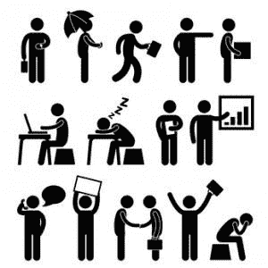

# 作为软件开发人员推销自己的实际意义是什么

> 原文：<https://simpleprogrammer.com/actually-means-market-software-developer/>

今天是你的幸运日！不，真的是。我将告诉你作为一名软件开发人员推销自己到底意味着什么，以及为什么它可能并不是一件坏事。

相信我，我知道你在想什么。

关于推销自己或做任何自我推销的想法，我受到了很多批评。

许多程序员——也许你也是其中之一——认为任何形式的营销或自我推销都是低俗的，如果我可以用一个大胆的词来形容的话，“垃圾”

> Many programmers-maybe you are one of them-think that any form of marketing or self-promotion is vulgar, and if I can use a bold word to describe it, it is "garbage"

别误会，我明白你的意思。我见过你说的那种垃圾营销。我见过有人无耻地推销他们自己或他们的产品，却没有真正考虑他们推销产品的对象的利益。我收到了那些不受欢迎的电子邮件，这些邮件来自所谓的营销人员，他们试图以很低的折扣向我推销他们的仿制伟哥药丸。

# 酷故事老弟

作为旁注。我要坦白一件事。有一次我真的买了一颗假伟哥——嘿，我很好奇。

总之，**我很确定他们只是卖给我一堆有毒的干蓝颜料，**因为它其实什么都没干。但是，最大的错误不是打开电子邮件和购买他们的药片。它给了他们我的真实电话号码。现在我的手机每天都会接到电话，让我重新订购伟哥药片。我可能最终不得不改变我的号码。

所以，我讲这个故事的原因不是为了强调我的糟糕判断或过多分享个人细节——尽管我很确定我两者都做了——而是要指出，我也理解垃圾邮件和挑衅性营销是多么令人讨厌和不恰当。(我还想使用我博客的新 WordPress 主题支持的酷内容框。)

然而，严肃地说，营销并不一定要装模作样。真的没有。

## 给予价值

到目前为止，这篇文章可能看起来不像营销，但它是。

它是如何营销的？嗯，希望是因为它为你提供了一些价值。

让我打开包装。

  

“哦，妈妈，这是一篇博文！关于编程！”

我写这篇博文是有目的的。我写所有的博客都是有目的的。

目的是为你提供某种价值，我这样做并不是因为我是一个慈善的人。

不，相反，我提供大量免费价值的原因是因为这是我认为有品位的——也是最有效的——营销方式。

现在，我没有任何市场营销的高级学位，也没有销售背景，但我知道，当有人给我一些我认为有价值的东西时，特别是当他们免费提供时，我会对他们说的话更感兴趣，如果他们碰巧在销售产品，我也会对听到这些更感兴趣。

> For me, this is the basis of marketing: give away 90% of what you do for free and collect 10% of it.

对我来说，这是营销的基础:免费赠送你所做的 90%的东西，并收取其中的 10%。

我并不是说你永远不会看到我做推销或试图推销我的付费产品——事实上，你会在这篇博文中看到我这样做——但是，我想说的是，当你去看看我制作的所有内容和我免费赠送的东西时，你会发现它比我试图出售的任何东西都多，至少是 9 比 1。

不给予价值，就无法获得价值。

等等，等等……等等，是时候引用金克拉的话了——我就是喜欢那个家伙。

[blockquote cite=”Zig Ziglar” type=”right”]You will get all you want in life, if you help enough other people get what they want.[/blockquote]

(注意，这也是使用我的新 WordPress 主题的另一个很酷的功能的另一个机会。啊…太好了。顺便说一下，当我尝试这个的时候，我想，“也许你想知道我的博客用了什么新的 WordPress 主题，也许他们有一个联盟计划。[事实证明确实如此，我使用的新主题叫做 X | The。](http://themeforest.net/item/x-the-theme/5871901?ref=jsonmez)看看这是怎么回事。)

## 这如何应用于营销你自己

所以，你现在可能想知道两件事:

1.  我什么时候才能告诉你这实际上如何适用于你
2.  我什么时候才能向你推销我的产品

第一个问题的答案是:现在。我们一会儿会讲到第二个。

我想花点时间把技术和理论分开。我们将更多地讨论理论。我们将关注如何以及为什么我们需要学习营销自己的总体想法，如果你感兴趣，稍后，我会给你一些关于如何学习相关技巧的指导。

所以，让我们来谈谈这对你，作为一名软件开发人员，坐在你的办公桌前编写代码意味着什么。

> Most software developers are what I call professional developers. This means that you just want to find a good company job, enjoy your job and get a high salary at the same time.

大多数软件开发人员是我所说的职业开发人员。这意味着你只想找到一个好的公司工作，享受你的工作，同时获得高薪。

如果这是你，那么有三样东西你最有可能感兴趣:

1.  在一家好公司找到一份好工作
2.  为你的技能获得最高的市场价值(获得更多的钱)
3.  加薪和升职(权力和金钱)

做这些事情最有效的方法就是让自己变得更有价值——更受欢迎。(此时你应该点点头，心想“约翰，你还没说我还不知道的事情呢。”)

## 如何让自己更有价值

好吧，我们听听这个。有两种主要的方法可以让你变得更有价值。

第一种方法是增加你的技能。你的技能越有价值，你就越有价值。

[skill_bar heading=”Nunchuck Skills” percent=”95%” bar_text=”95%”] [skill_bar heading=”Bug Fixing Skills” percent=”80%” bar_text=”80%”] [skill_bar heading=”Dirty Dancing Skills” percent=”90%” bar_text=”90%”]

(同样，我可以使用新主题中的一个特性。)

无论如何，即使你的双截棍或辣身舞技巧可能非常有价值，它们也只能带你走这么远。

我的意思是，如果没有人知道这些技能，它们就一点价值都没有。

> Think of marketing as a multiplier to double the value of your skills.

这就是第二部分的用武之地……进入市场营销。

让自己变得更有价值的第二个方法，本质上就是让自己更为人所知。人们对你了解得越多，你的技能就越出名，你就越受欢迎，因此你就越有价值。

把营销想象成一个倍增器，让你的技能价值倍增。

[skill_bar heading=”Nunchuck Skills * Marketing” percent=”120%” bar_text=”120%”]

因此，通过使用正确的营销方式——记住这主要是基于为他人提供免费价值——你可以通过建立稳固的声誉和接触更多的人来成倍增加你技能的价值。

这将带来更多的就业机会。

你从事不同工作的机会越多，你找到那份完美工作并拿到更高薪水的几率就越大。

此外，一旦你找到了那份完美的工作，变得更有价值会让你的老板更有可能给你加薪和升职，以阻止你去别的地方。

所以，你看，我们的最终目标不是去做一些低俗的挨家挨户推销假伟哥的推销员，而是简单地通过学习如何推销自己，主要是通过给予他人价值，让自己变得更有价值。

现在，我不想把这一切描绘得太简单。这不像创建一堆免费内容并发布到网站上那么简单。营销自己不仅仅是制作内容。你需要建立一个个人品牌，有一个发布和分发内容的平台，通过社交网络和其他媒体传播你的内容，以及其他一些东西。

但是，希望你至少理解我所建议的这种营销的概念，以及为什么它如此有价值。

## 自由职业者和创业者呢？

哦，我并不是想把你们这些自由职业者和企业家排除在外。当然，你也可以从市场营销中获益——只是你的人数少了很多。

如果你是一名自由职业者，你可能想做三件事:

1.  获得更多工作
2.  获得更多令人满意的客户(非痛苦资产)
3.  对你的工作收取更高的时薪

对你来说，同样的价值前景也存在。你完成这三件事的方法是增加你的感知价值。要做到这一点，你既要拥有有价值的技能，又要很好地营销它们。

你可以整天坐在你的房间里练习你的修女技巧，但是如果没有人知道你有这些技巧，你将永远不会被碧昂斯雇佣为保镖。

事实上，在你的情况下，营销自己要重要得多，因为你必须不断地出去寻找新客户和新工作。一个职业发展者在任何时候都只需要找到一个雇主，但是一个自由职业者必须一直在找工作。

但是，让我问你一个问题:**如果客户直接来找你而不是你去找他们，那不是很好吗？**

是的，当然会，别傻了。什么，你吃的是假冒伟哥的干铅涂料吗？

> You can sit in your room all day and practice your nun skills, but if no one knows that you have these skills, you will never be employed as a bodyguard by Beyonce.

最后，如果你是一名企业家，你应该知道销售任何产品或服务的最佳方式是首先建立一个观众群，然后提供产品或服务。

然而不幸的是，大多数企业家的做法完全相反。他们试着生产一种产品，在生产出来之后，他们试着把产品推销给他们认为想要购买的人。

我并不是说不可能这样做——你当然可以——但是，这真的是最有效的方法吗？

把自己推销到拥有自己的受众，然后向那些渴望购买你所卖产品的受众推出产品，这不是更好吗？

说到这里——现在是我自己做一点营销的时候了——我在我的[如何作为软件开发人员营销自己的课程中做了非常确切的事情。](http://devcareerboost.com)

我没有建立课程，然后试图为它找到一个观众。相反，我已经有了一个来自这个博客和我在软件开发社区做的所有其他事情的观众。通过首先推销我自己，我能够建立起一个想在我的产品一发布就购买它的观众群。

## 那么，作为一名软件开发人员推销自己实际上意味着什么呢？

好了，现在你明白了为什么营销自己是重要的，以及它如何能让你受益，不管你是哪种类型的开发者，最大的问题是“这实际上看起来像什么？”

就像我之前说的，我们不会在这篇文章中讨论技术，但是我想给你一个大概的概念，作为一个软件开发人员来推销自己是什么样子的——这可能和你所想的有很大的不同。

第一步是服装。你需要一套服装——最好是皮制的。你还需要一个不同的自我和一个令人敬畏的名字。类似于“算法”

好吧，我只是在开玩笑，但超级英雄实际上是一种思考个人品牌的好方法——这是营销自己的关键组成部分之一。

你需要开发某种独特的个人品牌，帮助人们迅速认识到你和你的全部。

同样，如何做到这一点还有很多要探讨的，但除了细节，要意识到这是营销自己的一个重要部分，因为为了有效，你需要建立某种品牌认知度。

所以，一旦你有了某种个人品牌，下一步就是开始创造你可以分享的有价值的内容。该内容可以采取多种形式。以下是您可能创建的几种内容类型:

*   博客帖子
*   书
*   杂志文章
*   播客
*   报告
*   录像
*   网络研讨会

或许营销自己的最大部分涉及到创建这种基本免费的内容。

但是，这并没有结束。如果没有人真正看到这些内容，那么所有这些内容都是无用的，所以你必须学会通过什么渠道让尽可能多的人看到你的内容。一种流行的方法是使用社交媒体，但这不是唯一的技术——事实上，这甚至不是最有效的。

因此，作为一名软件开发人员推销自己看起来更像是参与软件开发社区，而不是推销勃起功能障碍广告或向人们的收件箱发送垃圾邮件。

## 现在是球场…

好了，这是你期待已久的时刻。

注意到我是如何告诉你为什么营销自己是如此重要，并给你一个如何做的提示，但没有提供细节？

显然我有办法提供细节，对吧？没错。

如果你在我发表这篇文章的当天或者第二天看到这篇文章，你很幸运。实际上，我正在网络星期一推销我的[如何作为一名软件开发人员推销自己的课程。你可以使用代码:CYBERMONDAY 来获得 100 美元的折扣](http://devcareerboost.com)——但有效期只到明天午夜(2014 年 12 月 2 日，星期二)。)

在那门课中，我会详细讲述如何实际做我们在这篇文章中谈到的事情。

我向你展示如何创建一个精心打造的个人品牌，让你引人注目。我一步一步地向你展示如何创建一个博客，以及如何开始创建有价值的内容。我告诉你如何让你的名字出现在那里，并分发你创造的内容。而且，我甚至会给你一些有价值的材料，告诉你如何制作一份更好的简历和正确的社交方式——大多数开发人员都搞错了。

这也不仅仅是我的想法。我收集了 10 个不同的采访，采访了一些著名的软件开发商，比如:

*   鲍伯·马丁
*   杰夫·阿特伍德
*   乔恩·斯基特
*   康纳利

仅举几个例子。(名降！嘣！)

[promo image=”https://simpleprogrammer.com/wp-content/uploads/2014/12/combo-image-pippity.jpg” alt=”How to Market Yourself as a Software Developer”] [callout type=”center” title=”How to Market Yourself as a Software Developer” message=”4 books, 2 complete video courses, 10 video interviews with top developers and more.” button_text=”Click here to get it now!” circle=”true” href=”http://devcareerboost.com”] [/promo]

我还提供 30 天退款保证，因为我对拿你的钱去买对你的事业没有真正帮助的东西不感兴趣。现在就购买——尤其是在打折的情况下——如果你没有立即看到这门课程如何通过提高你的收入潜力而不仅仅是支付它本身，就给我发电子邮件并退回它。说真的。

总之，别再投球了。我希望你觉得这篇文章很有价值，如果你能分享，我将不胜感激。(尤其是在网络星期一交易正在进行的时候。)

如果有什么问题，就在下面留言吧。

此外，因为这是我第一次发表关于重新设计简单程序员的文章，让我知道你对新设计的看法。你是否注意到它现在是移动友好和响应迅速的？