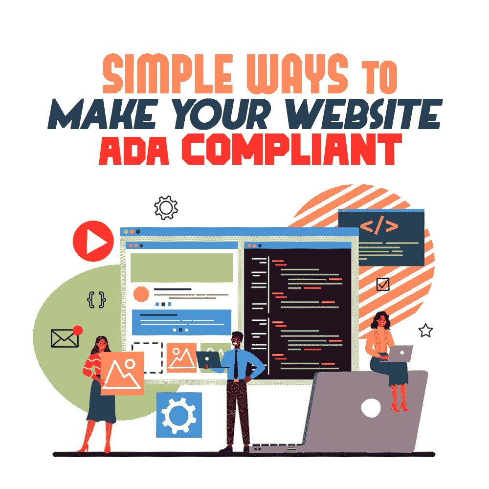

# 让你的网站符合 ADA 的简单方法

> 原文：<https://simpleprogrammer.com/ada-compliant-website/>

I take most websites for granted. I can see and navigate most websites without much struggle because I’ve grown up using the web and don’t struggle with my sight or hearing. Unfortunately, not everyone can say the same.

大多数美国人都熟悉 ADA 合规性。当从概念上考虑 ADA 合规性时，我们通常会考虑无障碍门道、足够的电梯和轮椅坡道，以及零售展示区之间的距离。

然而，拥有网站的企业还应确保所有浏览网站的人，包括残疾人，都能访问他们的网站。维护一个符合 ADA 的网站意味着因各种原因而残疾的顾客可以很容易地访问我的企业，与非残疾人一起订购产品或服务。

近年来，许多企业和名人已经发现符合 ADA 的网站是多么重要，他们的钱包在失败中首当其冲。《美国残疾人法案》在互联网成为主流资源之前就被写入法律，但后来被更新为包括网站在内的常用商业资源。

虽然阅读 ADA 已经发布了一个指南，回答了什么是符合 ADA 的网站的问题，并给出了一些关于如何更好地建立残疾人可访问的网站的一般指导，这是政府机构经常遇到的情况，但语言是不必要的复杂。

我相信让你的 WordPress 或其他网站对残疾人无障碍并不复杂。此外，我相信 ADA 规范可以用来增强每个人的用户体验，让你的网站更好地为所有访问者服务。

虽然你可以很容易地制作一个像摇滚明星一样的 WordPress 网站，但要成为一名摇滚明星网站开发者并使这些网站符合美国残疾人法案，还需要一些额外的思考。然而，我不认为这很难做到，我已经收集了一些信息来帮助你建立更容易被每个人访问的网站。

## 符合 ADA 的网站如何帮助人们？

当我访问网站购买产品时，我可以看到提供的产品。在产品照片上添加替代说明可以让第三方辅助程序将视觉传达成文字，帮助盲人客户理解他们订购的产品。

如果我访问一个有视频展示产品使用方法的网站，我可以选择听音频，或者打开字幕阅读。听力受损的人没有选择，必须依靠字幕。如果一个网站选择不提供字幕，他们就给重听的顾客制造了一个不必要的障碍。

同样，我可以在手机或电脑上浏览大多数文本，没有太大困难。然而，那些视力受损的人可能需要放大字体或以不同的颜色查看它们才能阅读。如果你的网站不能缩放，或者印刷过于精细，或者颜色难以看清，人们就不会花时间去适应。

## 我如何适应 ADA 法规

符合 ADA 的一些步骤是简单地改变你已经在做的事情。考虑一个有残疾的顾客在物理位置上可能遇到的困难，然后以类似的方式调整你的网站。

### 审查要求

知识就是力量。一旦你回顾了 ADA 兼容网站的[要求，你会注意到其他网站上你以前没有看到的特性。](https://www.w3.org/WAI/standards-guidelines/wcag/)

巴德尔-迈因霍夫现象的一个例子。将跟随您到达您的站点。当我在网站上工作时，我注意到对我的代码做一些下意识的调整以使网站更加用户友好已经成为我的第二天性。

科学表明，如果你最近学了一个新单词，并在上下文中使用它，你更有可能更频繁地看到它。写网页内容和建立网站遵循同样的趋势。如果你最近发现了一个新的工具或资源，你会更有效地使用它并在其他作品中识别它。

无障碍网站的一些关键要求是:

*   图像元素的描述性文本
*   包括视频和其他多媒体的抄本
*   能够调整网站和文本的颜色，以获得更好的可视性
*   PDF 下载的替代选项
*   避免闪烁和闪光元素
*   使用描述性标题
*   减少对自动更新功能的依赖
*   对于使用屏幕阅读器的用户，使用跳过导航按钮
*   减少视频和多媒体的使用

### 进行审计

There are several resources available to help you understand where your site could improve and what you’re already doing well. I like to use free resources to get an idea of my needed improvements before investing in more costly options.

Google Chrome 和 Firefox 浏览器提供了一个扩展工具来搜索丢失的 alt 标签、有问题的样式等。它叫做 [WAVE Web Accessibility Tool](https://wave.webaim.org/) ，可以安装在你的浏览器标签上。WAVE 还提供了更高级的辅助工具，只需很少的费用，就可以帮助你进一步提高辅助功能。

互联网无障碍事务局也在他们的网站上提供免费的自动化 ADA 无障碍审查。你所需要做的就是提交你的站点的 URL，并让工具浏览它。您将获得一份关于合规性失败点的完整报告，以及用于提高总体分数的资源。

### 描述性替代文本

当我上传新文章到我的博客或提供新资源时，我确保我所有的图片都有描述性的替换文字。这是朝着正确方向迈出的一大步，因为它为辅助技术提供了一个基线，让你的网站适应用户。此外，您可以使用您的描述性替代文本作为额外的空间，为您的搜索引擎优化捕获搜索。

对于许多网站来说，替代文本很简单:“蓝色背景上的冰淇淋图像”，对于 ADA 感知的网站来说，你可以看到更复杂和有用的东西:“巧克力覆盖的华夫饼筒上的 Tillamook Creamery Monster Cookie 冰淇淋图像，蓝色背景前有彩虹。”

### 网站元素——按钮、标题、超链接

您可以采取的另一个步骤是考虑查看模板的方便性。如果你的颜色很醒目，或者你有闪烁的按钮和颜色很乱的文本，这对于一些人来说会很难看到或者很痛苦。

考虑到闪光灯可能会引发你的一些潜在客户的癫痫发作，并在 90 年代留下这些设计特征。同样，我也避免在浅色背景上使用小字体或浅色文字的网站。我视力相对较好，很难看清。我无法想象这对那些有视力障碍的人来说有多难。

注意网站的超链接，以及它们在使用前后会变成什么颜色，如果它们是一种容易看到的颜色或者辅助技术可以找到的颜色，可以帮助人们以后找到它们。

## 不遵守——会发生什么？

虽然当你犯一些简单的开发错误时会遇到很多问题，但是如果你为你的客户开发一个不符合 ADA 的网站，会给他们带来昂贵的问题。

像 [Foot Locker](https://www.martindale.com/labor-employment-law/article_Leech-Tishman_2223250.htm) 和[凯莉·詹娜化妆品](https://nypost.com/2017/07/11/lawyers-cash-in-on-suits-demanding-ada-compliant-web-sites/)这样的企业都有过在网站上未能遵守 ADA 法规的亲身经历，这让他们付出了代价。这些企业中的每一个，以及其他几个，都被顾客起诉，他们认为他们没有做出足够的努力，使他们的在线存在对残疾人无障碍。

虽然[司法部](https://www.dol.gov/general/topic/disability/ada)通常是被授权采取行动实施残疾人公民自由的法律实体，但是[通常通过诉讼的方式实施合规](https://www.ada.gov/enforce_current.htm)。

在诉讼中，企业损失了金钱，损害了他们的声誉。虽然由于缺乏合规性，大公司可以轻松处理与诉讼相关的费用，但较小的公司很容易在法律费用的重压下崩溃，当构建符合 ADA 的网站如此简单时，为什么要冒这个风险呢。

ADA regulations affect businesses with more than 15 employees and operate more than 20 weeks in a calendar year. Small businesses are the most at risk for substantial damages due to lawsuits because they often don’t have the financial resources to shoulder a significant burden.

一个很难浏览的网站，用户很难填写表格或购物，会降低你可能的销售潜力。通过选择不做出改变来适应，你就排斥了整个潜在付费用户群体。

此外，一个考虑到 ADA 的设计良好的网站自然会在搜索引擎中排名更高。作为谷歌网站图片最佳实践的一部分，他们希望图片有替代文本，以便用户更容易访问。虽然谷歌没有明确表示图像替代文本会提高你的排名，但排名最高的网站往往会遵循谷歌的最佳实践。

此外，在大型商业网站中，未能遵守 ADA 法规的罚款可能高达 50，000 美元，这取决于您的企业所在的州。我知道我不想因为一个简单的修复问题而遭受这种损失。首先，编写一个符合 ADA 法规的网站可能会让人望而生畏；编辑和调整现有网站需要时间。然而，一旦你让当前的内容适应了可访问性，所有未来的内容都将很容易与有意识的设计步骤保持一致。

对于有能力的内容作者和网站设计者来说，上面描述的创建一个兼容且可访问的网站的许多步骤是第二天性。这些技能从一开始就在该行业的大多数大学课程中教授。

## 508 合规性

508 合规是 1973 年国会法案《1973 年康复法案》的一部分。该法案于 1998 年修订了一次，并于 2017 年再次修订，以更新第 508 条，该条要求各机构为残疾人(包括员工和公众)提供电子和信息技术。这种机会必须与给予非残疾人的机会相当。

《1973 年康复法案》第 508 条由[美国准入委员会](https://www.access-board.gov/)管理。2017 年，该委员会发布了一项规则，更新了无障碍标准。这些标准不仅影响了第 508 条，也影响了《通信法案》第 255 条。这些规则从 2018 年开始生效。

这一新规则改变了这两个部分，以应对市场趋势和技术创新。制定该规则也是为了帮助美国的指导方针与欧盟委员会和 W3C 的网页内容可访问性指导方针(也称为 WCAG 2.0)保持一致。

### 508 合规指南

第 508 条中有许多不同的指导原则。我们将着眼于那些与建立无障碍网站最相关的网站。

### 功能性能标准

Section 508 有特定的功能性能标准，所有传播电子通信的人都应该遵守。这些指南可在第 508 节第 3 章[中找到。](https://www.access-board.gov/guidelines-and-standards/communications-and-it/about-the-ict-refresh/final-rule/text-of-the-standards-and-guidelines#302-functional-performance-criteria)

### 电子内容

《1973 年康复法案》第 508 节的“电子内容”部分已经过修改，规定电子内容应符合 WCAG 2.0 A 级和 AA 级成功标准。

**A 级成功标准**

*   控制和输入必须有一个描述其用途的名称
*   不是基于文本的基于时间的媒体应该有一个文本选项，为用户提供关于内容的描述性信息。非基于文本的基于时间的媒体是像音频剪辑或视频这样的东西。
*   任何使用非文本内容(如图像或声音)来创建特定感官环境的测试或练习都应该有一个基于文本的替代方案，为所有用户提供相同的体验。
*   当使用验证码时，应该有一个基于文本的替代或替代的验证码方法，适用于各种不同残疾的人。
*   当使用装饰性的非文本内容时，如格式或不可见元素，它们应该以辅助技术(屏幕阅读器或其他设备)可以忽略的方式实现。

有关 A 级成功标准的更多信息，请参见 [WCAG 2.0 指南](https://www.w3.org/TR/WCAG20/)。

**AA 级成功标准**

*   大尺寸文本和文本图像的最小对比度应为 3 比 1。
*   除非另有说明，否则文本和文本图像的最小对比度至少应为 4.5 比 1。
*   装饰性的文本或基于文本的图像没有最低对比度要求。
*   标识和品牌文字也不需要有最低对比度。
*   当使用文本图像时，最好使用真实的文本来传达信息。
*   如果使用文本图像来传达信息，它们应该能够根据用户的要求进行可视化定制。
*   如果基于文本的图像对于所传达的信息是必不可少的，则不需要将其转换成文本。比如 logos。

有关 A 级成功标准的更多信息，请参见之前链接的 WCAG 2.0 指南。

### ITC 双向语音通信

由于许多网站，尤其是在后 Covid 疫情时代，已经开始建立基于网络的聊天功能，包括语音聊天，我觉得也包括一些这些要求是很重要的。双向语音通信在第 508 节中其自己的部分中被深入处理。

## 有助于网页浏览主观规范的辅助技术设备

ADA Compliance with websites is still a fluid concept. The details on the regulations are outlined and subject to state-by-state interpretation. However, as web resources become more frequently used, the rules will begin to stabilize over state lines.

对于 Simple Programmer，我致力于向我的读者传授最佳实践，以防止以后调整的混乱。我追随潮流，努力学习最新的方法，让我们的读者在游戏中保持领先。

建立一个符合 ADA 的网站相对简单。当你在构建的时候，牢记 ADA 的一致性将会让你保持领先，并增加你作为一个熟练的 web 程序员的声誉。