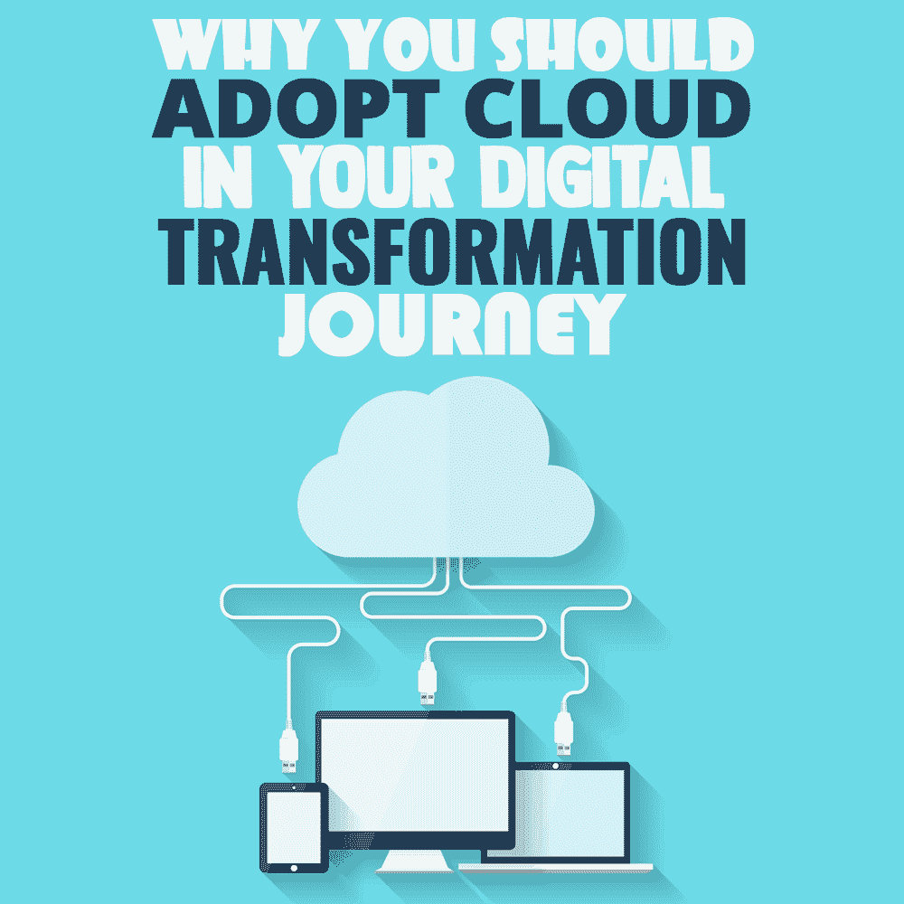

# 为什么您应该在数字化转型之旅中采用云

> 原文：<https://simpleprogrammer.com/adopt-cloud-computing/>

In these technology-driven times, organizations that do not have an online presence risk going obsolete or losing credibility. Going digital has become a necessity for enterprises to remain viable, provide good customer experiences, and remain competitive.

由于这种情况下的成功通常以客户体验来衡量，因此数字化转型成为一项关键的业务需求。在众多推动数字化转型和提供卓越客户体验的成熟技术中，云计算处于最前沿。

该技术使企业能够对未来有一个稳健的愿景，加速数字化转型服务，并为客户提供更好的体验。

企业已经开始意识到走云之路的必然性和好处。在一个竞争日益激烈的技术驱动的世界中，人们关注的焦点是获得转型收益，而不是满足于增量收益。

为了实现这一目标，企业必须建立强大的技术基础设施。然而，对于任何企业数字化转型计划，重点都应该是保持灵活性和顺应行业趋势。

云计算正慢慢成为开始数字化转型之旅的企业不可或缺的一部分。随着数字未来似乎比以往任何时候都更近，这一未来的驱动者，即软件开发人员，需要全面了解云及其本质。

在这篇博客中，我们将深入探讨云计算及其对开发者和企业的好处。

## 什么是云计算？

该流程涉及通过利用基于互联网的服务器网络来存储、维护、管理、分析、处理和保护数据。

这与存储在个人电脑或本地服务器上的数据形成了鲜明的对比。数据的分布式存储和管理有助于企业做出更加明智和准确的决策。

此外，这有助于他们提高生产率、简化流程、节约成本、创新、加快上市时间、增强客户体验并实现投资回报。

## 云计算的类型

云由三种类型的服务组成，即、软件即服务(SaaS)、平台即服务(PaaS)和基础设施即服务(IaaS)。

在 SaaS，第三方云提供商托管软件应用程序，并通过万维网按需向客户交付。SaaS 的一些例子有 Google Apps、Dropbox、Salesforce、BigCommerce、MailChimp、HubSpot 和 DocuSign 等等。

在 PaaS 中，第三方提供商提供在互联网上开发应用程序所需的软件和硬件工具、操作环境、数据库或计算平台。这些例子包括 Windows Azure、Force.com、Apache Stratos、AWS Elastic Beanstalk 和 Heroku 等。

类似地，在 IaaS 中，第三方供应商提供对计算资源的访问，即存储、数据中心空间、安全性、可扩展性、网络组件或服务器等。一些例子是 Linode、DigitalOcean 和 Rackspace。

## 云如何在数字业务转型中发挥作用

为了打破现状并保持竞争力，企业采用数字化转型服务，其中他们需要升级其传统的 IT 基础架构。

此外，为了实现数字颠覆，除了简化业务流程之外，企业还需要利用先进技术。

其中包括增强现实、人工智能和机器学习、大数据分析和物联网(IoT)等。由于这些技术需要强大的计算机能力和存储空间，云计算就成了救世主。它允许开发人员配置自动化构建，同时防止任何停机，从而提供了高度的部署便利性。它使应用程序的快速简单扩展成为可能，从而消除了可扩展性问题。

在数字化转型过程中，云计算带来的总体优势如下。

### 灵活性

为了确保任何数字化转型战略的成功，企业的业务流程可以改变很多次。云允许任何组织通过不投资于建立和维护昂贵的内部 IT 资源(如软件或硬件)来节省成本。

这样，组织可以保持灵活性和敏捷性，因为它可以根据自己的需求利用基于云的资源。例如，如果一个项目需要更大的计算和存储能力，组织可以通过支付额外的费用来扩大其按需云需求。反之亦然，导致资源优化和成本节约。

### 安全性

任何存储在内部的信息都容易受到安全漏洞、意外系统停机以及自然或人为灾难等情况的影响。由于包括备份数据在内的所有数据都包含在一个单一的 IT 系统中，因此任何与安全相关的问题都可能将它清除干净。

另一方面，云托管可以在分布式系统中维护多个数据备份。因此，即使一个节点受到影响，其他节点中的数据也不会受到影响。在涉及大量数据的大数据分析中，任何系统故障或安全漏洞都会带来灾难性的后果。

### 快速原型制作

任何数字化转型实施都需要持续创新、测试和交付产品或服务。这就是云可以帮助拥有平台的企业构建、测试和交付/部署应用的地方，绕过对复杂 IT 架构的需求。

因此，如果一个企业构建了多种产品，那么云平台可以允许快速构建这种应用程序的原型，从而在这个过程中节省成本和时间。

### 无缝协作

Implementing [digital transformation solutions](https://simpleprogrammer.com/remote-first-guide/) would require every stakeholder in the organization to embrace a culture of collaboration. This is congruous to the requirements of DevOps that aim at breaking hierarchies or silos to achieve creativity, quality, innovation, efficiency, and glitch-free delivery.

有了云计算，不同的团队可以无缝地并行开发、测试和交付应用程序。它允许随时随地访问计算资源。此外，可以通过控制用户权限级别来确保最佳的授权委托。

### 成本效益

云服务在满足用户需求方面非常灵活。它们提供了一个可扩展的模型，其中企业只为已经使用的服务付费。因此，没有必要建立和维护一个昂贵的 IT 基础设施(硬件和软件)，从而节省资本支出的过程。

## 云——数字未来的当务之急

考虑到建立和维护强大且正常运行的 IT 基础设施的成本，实现[数字化转型](https://www.cigniti.com/blog/5-steps-towards-digital-transformation/)的需求已变得势在必行。

随着包含新技术的业务流程变得敏捷，以及维护更好的用户体验的需要，迁移到云环境变得必不可少。它帮助企业绕过遗留系统的挑战，始终如一地构建测试驱动质量的软件应用程序。

对基于云的基础设施日益增长的需求开辟了新的途径。有一点是肯定的:云将会比现在更大。话虽如此，开发人员可以理解这对他们的成长和职业加速有多重要。