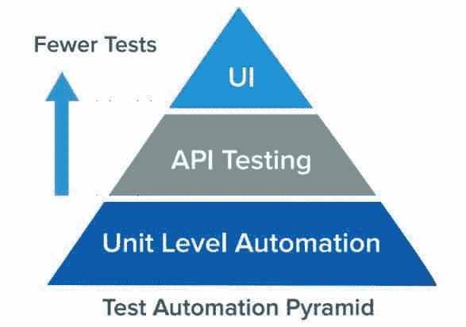

# 质量保证指南和高级软件测试技术

> 原文：<https://simpleprogrammer.com/advanced-software-testing/>

你知道大多数启动软件失败的原因吗？是因为缺乏资源、曝光度、技能、专业知识还是资本？

还是某个 app 或软件失败的背后另有原因？

**其实是有的！**

一个应用程序失败的主要原因是在应用程序的开发过程中，一个糟糕的甚至是缺失的软件测试过程。

在开发过程中犯错误，跳过一些步骤，或者在开发过程中留下一些不固定的东西，都会直接导致不满意的用户体验，无论你付出多少努力，都不会得到赏识。

为了避免这样的问题，市场影响者正在采用[软件测试生命周期](https://www.bugraptors.com/software-testing-life-cycle/)，其他主要行业已经从中受益。

根据 Zion Market Research 最近的[报告，2016 年全球测试自动化市场达到 158.7 亿美元，预计到 2022 年将达到 549.8 亿美元。这些统计数据应该让您对围绕测试自动化的宣传有一个公平的想法。](https://www.globenewswire.com/news-release/2017/07/25/1057737/0/en/Global-Test-Automation-Market-Will-Reach-USD-54-98-Billion-by-2022-Zion-Market-Research.html)

考虑到对高级软件测试策略的过度和强烈需求，各种自动化工具被投入运行以执行软件测试。早期的人工软件测试过程是在人的监督下进行的，但是自动化测试减少了工作量，同时记录了测试套件，这进一步有助于分析错误。

依靠一个合适的测试自动化平台可以帮助您交付高质量的产品和您的客户会喜欢的无缺陷产品。如果你想让你的企业在竞争中脱颖而出，你的重点应该是提高质量，而不是给你的软件增加越来越多的功能。

但是在您投资测试平台之前，了解软件测试领域的一些基本准则是很重要的。

## 软件测试指南

为了交付高质量的服务和完美的产品，您需要实施[质量](http://www.amazon.com/exec/obidos/ASIN/B00GO4I9B8/makithecompsi-20)保证(QA)工具和方法。对于初创公司来说，在执行软件测试过程时，遵循基本的技术和指导方针是非常重要的。

下面是在软件测试生命周期中要遵循的最可靠的技巧和指南的列表:

### 1.规划完整的质量保证生命周期

您将要使用的测试过程必须是定义良好的，计划好的，并且经过深思熟虑的文档化。你需要强调文档，因为良好的记录将帮助你在 QA 团队中建立有效的沟通。QA 生命周期包括质量管理计划、测试策略、测试计划和测试用例。

### 2.遵循面向测试的软件开发管理

实现面向测试的软件开发方法是提高产品质量的最佳方法。它遵循两个主要实践:测试驱动开发和结对编程。您可以使用极限编程(EX)将这些付诸实践，极限编程是一种专注于构建高质量产品同时适应不同需求的方法。

### 3.进行正式的技术审查

正式的技术评审(FTR)是一种在早期识别和揭示逻辑和功能错误的技术。FTR 阶段的目的是确保产品符合预先定义的标准。

### 4.实施用户验收测试

让用户参与产品开发是一个必要的步骤，可以帮助你抓住你的目标受众。为了确保产品满足客户需求，您需要让最终用户参与测试生命周期。这可以通过用户验收测试(UAT)来完成，这通常发生在开发过程的最后阶段。

让最终用户参与进来将有助于您发现通常不会发现的错误。(例如，不同的用户会以不同的心态和眼光来测试软件，并且会检查应用程序的各个方面，这显然是我们无法预料的，并且很容易被单个用户忽略。在这样的过程中，有可能捕捉到任何遗漏的 bug 或问题，并得到解决。这将让你走向一个完美的，理想的，无可挑剔的应用。)

UAT 可以通过多种方式执行，包括 alpha 和 beta 测试、合同验收测试、法规验收测试、操作测试和[黑盒测试](https://simpleprogrammer.com/back-to-basics-unit-testing-automated-blackbox-testing-and-conclusions/)。

### 5.与 QA 团队的健康沟通

测试过程中涉及到大量的活动，在开始之前，您需要有一个协调良好的团队来无缝地执行这些过程。您必须在测试阶段之前提供培训并进行头脑风暴会议，以便所有团队成员可以分享和学习最新的测试工具和技术。

而且你需要和每个团队成员进行定期的沟通，了解他们经常遇到什么问题，知道他们欠缺的地方。

### 6.自动化测试的使用

如果你想用完美的输出给你的客户惊喜，自动化测试是唯一能让你达到那个水平的东西。到目前为止，两个术语已经成为焦点:[测试自动化](http://www.amazon.com/exec/obidos/ASIN/1484238311/makithecompsi-20)和[采用敏捷方法](https://www.bugraptors.com/beneficial-adopt-agile-software-delivery-approach/)。

让我们来看看这些方法。

*   测试自动化:它是一个过程，用于自动化重复的任务和其他各种各样的测试任务，这些任务很难手工完成。自动化测试是一种将实际结果与预期结果进行比较的技术，这是通过编写脚本或使用自动化测试工具来执行的。
*   **Process:** This process includes a pyramid testing strategy. There are basically three different levels. At the base there is unit level automation, then the service layer or API testing, and at the top user interface (UI) testing. The biggest percentage of test automation is performed at the base (unit  level automation) as shown below.

    

*   **UI 和 API 的同化:**UI 和 API 测试的同化通过在 UI 级自动实现 API 测试用例级的变化，使得自动化过程更加容易。使用这些方法将帮助您在早期阶段识别和修复瓶颈，并帮助您按时交付，同时节省您的时间、精力、开发成本和资源。

*   **敏捷方法:**在软件测试中采用敏捷方法的好处:
    *   它节省金钱和时间。
    *   它减少了文档。
    *   它是灵活的，能适应变化。
    *   它提供了一种从最终用户那里接收定期反馈的方式。
    *   它有助于通过日常会议更好地确定问题。)

### 7.代码质量度量

为了使您的软件测试生命周期成功，您必须确保所有的质量目标都被彻底地评审、验证、记录和度量。

当我们谈论[质量代码](https://simpleprogrammer.com/quality-code/)时，没有一个工具可以验证代码质量；相反，有七个主要的指标来定义质量:可靠性、效率、安全性、可维护性、交付率、可测试性和可用性。

### 8.有效的错误报告

如果你有一份写得很差的错误报告(或者根本没有报告)，就很难跟踪错误并指派他们去修复。您必须维护一份错误报告，清楚地定义错误和需要改进的地方。

(bug 报告和有效的 bug 报告是有很大区别的。有效的缺陷报告的一些特征如下:

1.  为每个 bug 分配一个 bug 编号:必须为每个 bug 分配一个唯一的 bug 编号，这将有助于您识别和维护 bug 报告。
2.  确保 bug 是可重现的:如果 bug 是不可重现的，那么就很难解决。这就是为什么一步一步的过程必须详细说明如何重现，以及修复错误。
3.  具体一点:尽量对问题具体一点。避免在 bug 上写文章。中肯的问题很容易处理和解决。)

为此，您需要与开发人员和其他团队成员坐下来定期开会，这样您就不会忽略开发和测试过程的任何一个方面。

这将有助于您确保报告所有错误并修复任何现有问题。否则，你会跳过软件中的错误，并且有可能在启动软件时出错。

## 交给你了！

是时候强调你的产品质量，展示完美、独特的产品来吸引客户的注意力了。否则，您将会重复开发阶段，并在发布后处理客户遇到的问题，并且您将不得不与不满意的客户斗争。