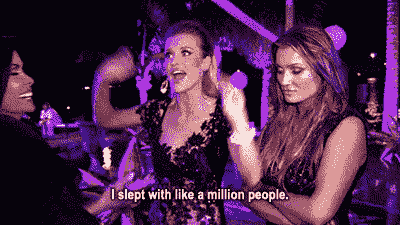

# 当你寻求建议时，你会犯这些可怕的错误吗？

> 原文：<https://simpleprogrammer.com/advice/>

许多自由职业者和创意人员在被问及是否有人可以花几分钟时间向他们请教时，都会坚持“我从不提供免费建议”这句话。

想想——上一次有人向你寻求编程建议是什么时候？如果你能“看一看”他们的博客？跟你妈妈解释，是谷歌一直在改他们的 logo，为什么你控制不了。

我对我可怜的妹夫是个可怕的冒犯者。他是一名程序员，即使我在这个世界上广泛工作，我也无法告诉你他专门研究哪种语言。他花大量时间编写代码和管理他的外包团队。我仍然[请他](https://simpleprogrammer.com/2016/01/07/write-professional-emails-people-wont-ignore/)帮我为我的支付处理器编写 webhooks。

我能感觉到他几乎把手指按在鼻梁上，慢慢地从牙缝里发出嘶嘶声，在短短的一毫秒里诅咒着他选择的新娘。要是他五年前娶了那个女孩就好了，她姐姐是个会计。

最近，我收到一个朋友的请求，要我给他的一个刚开始涉足这一领域的熟人提供一些写作建议。

从对话的第一句话到最后一句话，我可以预测到每一个单词。

免费咨询和帮助的请求总是一样的。我过去常常轻率地回答这样的问题:“你是如何在*福布斯*上获得专栏的？”有了这张 GIF…

…但最终我停止了。我认为太多人相信这是真的。

## 寻求帮助有什么错？

人们缺乏以有利于他们最终目标的方式寻求建议的意识和方式，有很多原因，但不会让他们在互动中表现得像个十足的混蛋。

### 他们没有“真实世界”的经验

互联网和各种技术打破了过去划分工人阶级的壁垒。

你不再需要去上大学，在一个初级职位上呆上 5 到 10 年，讨好老板并证明自己，最终将自己提升到一个中低层的管理职位。

相反，你可以在网上上课来学习你的技能。你可以开一个博客来建立你的个人资料，证明你自己。见鬼，如果你是一个扎克伯格式的天才(或晚年的天才)，你也许能够在其他人整理报告和执行他们在 101 级课堂上学到的策略的五到十年内买卖这个星球。

任何看过社交网络 的人都可以证明，这似乎是一条通往财富和名声的理想之路，但也有很多缺点。

学习那些在你的领域里有几十年经验的人似乎能够内在整合的软技能。

他们能这么做是有原因的。

### 他们没有意识到他们的要求是多么沉重的负担

我收到的这封特别的邮件要求，每封邮件对我来说都是新的回复。

我是如何在我的职业生涯中走到今天这一步的——就好像有一个简短的两段话，这并不是一个需要一整篇博文(如果不是一本书的话)来回答的大问题。

这个人在目前的职位上应该怎么做才能达到我现在的位置——就好像积累十年的经验和专业知识是某个人可以简单复制的一样。

我会愿意分享我的联系方式，让他们联系我为之撰稿的一些编辑和出版物吗——就好像为了一个我几乎不认识的人，一个给我发了三条短信都是要东西的人，把我的名誉丢在公共汽车上，是一场我愿意参加的赌博。

当你提出这些问题时，考虑一下，在另一边的人为了帮助你将不得不做什么或放弃什么。是他们的时代吗？他们的名声？他们的商业秘密和关系？

### 他们简直是自私的混蛋

我喜欢看到人们好的一面。

它是一种生活技能，倾向于很好地为我服务，但偶尔会咬我的屁股。

这就是为什么我更愿意看到这些执行不力的求助——执行不力。而是出于善意；从好人那里。

然而，有时候，当你是一个好人时，人们喜欢抓住这个机会把你当成他们的受气包。

他们会不断回来，榨干你的时间、信息，甚至金钱或资源。

也许这就是为什么他们如此愿意拿你的名誉和事业来冒险。他们不尊重你，因为[他们不尊重很多人](https://simpleprogrammer.com/2016/03/31/change-friends-change-life/)。

这些人类社会的奇妙居民通常只会在你召唤他们的时候才会显露出他们的真面目。

有一次，我收到一个请求，要求我解释我是如何建立我们的编辑部的，因为这个人希望建立一个校对服务，这是我们的一个服务产品的精确副本。

当我告诉她，我很乐意分享，但不打算告诉她如何复制我的业务时，她回答说，我们所有人都有很多，所以我不应该感到威胁。我以前只在我高中的走廊里和各种迪士尼频道的音乐电影中见过这种奇怪的、甜言蜜语的、消极攻击的方式。

我觉得那很可爱。在接下来的至少五天里，每当我想起这件事，都会暗自发笑。

## 你在犯这些错误吗？帮助那些需要帮助的人？

在我们的一生中，我们都发现自己站在建议桌的一边或另一边。

我对那些真诚地寻求我的帮助和建议来推进他们的写作和创业生涯的人有一个门户开放的政策，因为曾几何时，人们花时间对我有一个门户开放的政策。

尽管如此，当这些要求很糟糕时，我还是会给予严厉的爱。虽然这有点刺痛，但让人们知道他们的要求是强加的还是完全荒谬的，从长远来看会对他们有所帮助。

当我与需要建议或帮助的人联系时，我会努力记住我教给别人的规则。

我还没有遇到任何人在他们的领域和职业生涯中如此先进，以至于没有一些关系会对他们的未来有利。在未来的许多年里，我们有责任帮助那些跟随我们的人，并继续关注那些引领我们的人。

只是需要确保我们以一种对所有人都有利的方式来完成它。

也不会让你在这个过程中显得像个混蛋。