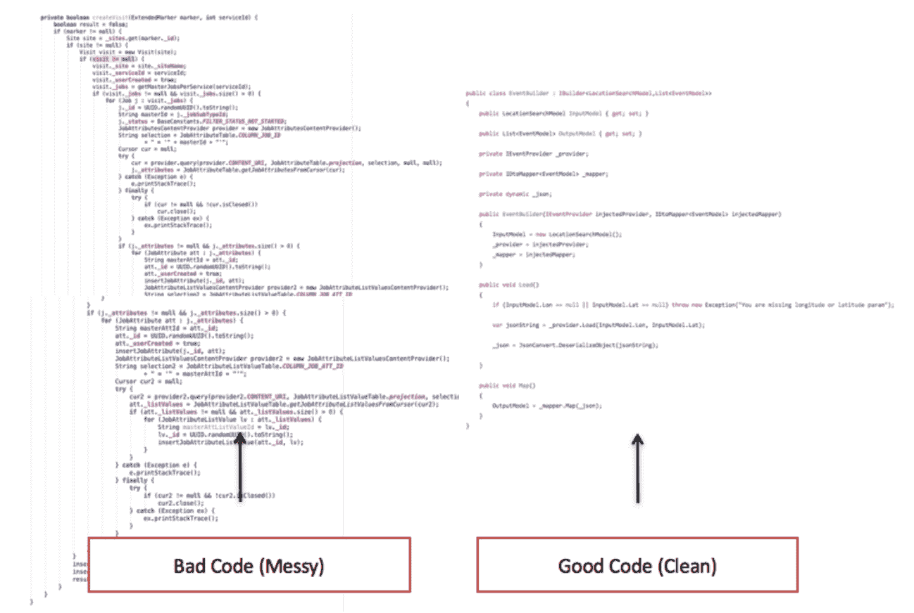
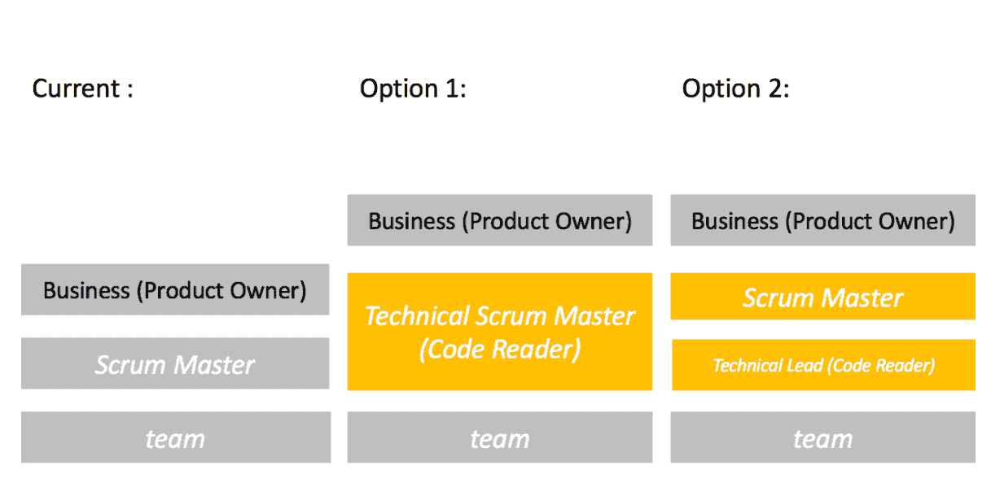

# 为什么敏捷已死

> 原文：<https://simpleprogrammer.com/agile-is-dead-code-review/>

敏捷是由某个官方组织创造的，对吗？不对。它是由一群软件开发人员发明的，他们于 2001 年 2 月 11 日聚集在犹他州 Wasatch 山脉的雪鸟滑雪场，讨论如何使软件更好，并改善开发人员和客户之间的关系。

从敏捷的诞生到现在已经 16 年了，从各方面来看，它确实比瀑布方法学更有效。但这不是一个完美的解决方案。混沌报告显示，高达 23%的使用敏捷方法的项目仍然失败。

如果我们把敏捷看作一种运动，那么和其他运动一样，我们应该问:我们能做得更好吗？具体来说，我们能利用代码评审来提高敏捷吗？我们能让 Scrum 大师来做吗？

## 第一个漏洞出现在《敏捷:非技术性的 Scrum 大师》中

敏捷有许多描述，取决于特定的角度，但是基本上敏捷是非常简单的。创建敏捷的最初会议的描述告诉我们，这只是实现轻量级开发过程以使软件更好的一种方式。

我们可以将敏捷归结为四个基本原则:信任、协作、改进和准确性。

实施敏捷的最大框架是团队过渡到使用 Scrum 方法，这意味着(部分地)帮助我们实现所述的四个目标。

当我开始我的职业生涯时，我总是有一段艰难的时间，因为感觉无论我加入什么项目，总会有比正常情况多得多的问题。交付很晚，漏洞很多，代码总是维护得很差。当我听说敏捷时，我心想:这听起来正是我需要学习的。因此，我和我的合伙人谈了谈，从我们的积蓄(1000 英镑)中拨出了这笔钱，并为自己在伦敦预定了一个为期一周的强化课程，学习成为一名 Scrum 大师。

我第一天就出现了；该课程是一个挤满了大约 20 人的培训室。今天的第一项任务是围着桌子做自我介绍。令我惊讶的是，我是整个房间里为数不多的开发人员之一。那里的大多数人都没有技术背景。这真的让我很惊讶，因为我知道敏捷的历史，我知道在滑雪小屋的那个会议，我知道在那个房间里真的应该有更多的软件开发人员。

我最近在 LinkedIn 上做了一个快速审计。我在伦敦搜索了目前担任 Scrum Master 角色的人，发现 10 人中只有 3 人有软件开发背景。

从我自己的轶事和对 LinkedIn 的研究来看，敏捷在很大程度上被非软件开发人员所主导，这带来了一个潜在的问题。

## Scrum 最重要的部分

如果你阅读了 Scrum 指南，其中提到 Scrum 大师的职责之一是:“帮助开发团队创造高价值的产品。”

创造高价值的产品到底意味着什么？我想我们大多数人都会同意(至少在原则上)价值存在于产品的外部和内部。发布可以工作但代码混乱的软件是没有意义的。我们知道组织付给我们很多钱来编写这个软件，作为软件专业人员，我们有责任做好这项工作。

尽管我们似乎都知道代码质量的重要性，但是我们很少能够在项目中始终如一地交付高质量的软件。事实上，Cast Software 进行的一项研究表明，在平均代码库中，有超过 [$1，000，000](http://www.castsoftware.com/castresources/materials/wp/cast_2010-annual-report_keyfindings.pdf) 的技术债务或代码质量问题。这是为什么呢？

以我的经验来看，主要原因是团队是以一种无组织的方式随意组合起来的——通常是由以前从未一起工作过的人组成的——他们只是被期望继续工作并交付成果。在项目开始时，他们谈论所有正确的事情——TDD、代码质量和重构——但是随着项目的进展和需求的堆积，缓慢但肯定的小裂缝开始出现。函数不再被重构。测试变弱；架构开始分裂。

作为一个软件团队，我们可以抛出所有我们喜欢的敏捷原则，但是最终技术债务将会使项目陷入困境。不可能一直将糟糕的代码覆盖在糟糕的代码上，并掩盖裂缝。在某些时候，我们会失败。

不要抱有幻想，我们项目面临的最大威胁是技术债务。如果交付高价值的产品是 Scrum 最重要的部分，并且 Scrum 是主要的方法论，我们得出一个明确的结论:如果我们想要敏捷，我们必须控制技术债务。

控制技术债务的第一步是识别它。我们被赋予了最强有力的程序来识别这种技术债务。这叫代码审查！

## 代码审查的目的

保证高质量最简单的方法就是停止生产质量差的产品。通过检查代码库的每一个变化，我们可以应用一套标准化的原则来帮助我们提高质量。但是这个质量的高级目标是什么，为什么审查代码如此重要？

我们应该审查代码有三个主要原因:

*1)保护雇主/客户免受不良代码*

像任何产品一样，软件代码在创建期间和创建之后都需要某种程度的检查，这样任何质量下降都可以被尽快识别出来。我们可能发现的一些潜在问题有:

*   缺少单元测试
*   糟糕的建筑
*   不良的依赖性管理
*   耦合问题

*2)提高贡献者的技能(知识共享)*

代码审查迫使讨论。讨论经常会导致争论，而一定数量的关于代码的争论对于增加整体知识和理解是非常有用的工具。

*3)提炼架构和软件模型*

如果每个开发人员都被允许实现他们自己的架构，你可以很容易地在代码库中找到许多优化的但是支离破碎的想法。随着时间的推移，这变得不可维护。最好对项目架构有指导和方向。代码审查提供了一种机制，可以慢慢地将每个人对软件应该如何构建的不同解释纳入到一个单一的定义的愿景中。

## 技术领导者(阅读代码)

到目前为止，我们已经确定，有很强的迹象表明敏捷(至少部分)关注代码质量。并且代码质量需要通过代码评审来务实地解决。

在软件社区中有这样一种观点，软件团队是平等的。

所有开发人员都有同等的权利将代码提交给代码库，并决定如何构思和构建代码。这很奇怪，因为在几乎所有其他使用团队的职业中，这个概念并不存在。建筑师有高级合伙人，建筑商有工头，在体育运动中，你有队长或教练。

为什么软件会有所不同？不应该；一个软件团队应该有一个称职的技术领导。这个领导者实际上应该花一部分时间阅读所有提交的代码。

实现代码评审的正确方法是实际构建您的团队，以便这个领导者拥有比其他开发人员更高的提交权限。他们对正在集成的代码进行最终调用。

团队中至少有一个人需要对代码的质量负责。关键是这个人有一项重要的工作要做，就是阅读代码，他们有责任确保代码是高标准的。

确保任何领域的事情都做得正确，需要你让某人负责。责任通常由领导者承担。这个领导者被赋予了更高的地位，但同时他们也承担了更多的风险，因为他们承担了最终的责任。

从软件的角度来看，一个技术领导者有很多责任；他们应该理解核心接口和深层架构问题，并且他们应该能够对软件设计需要采取的方向有远见。他们应该能够将开发人员提出的设计正式化，并使整个代码库保持一致。

我遇到过许多架构师、技术领导和团队经理，但是我很少遇到坐下来真正阅读代码的人。

## Scrum 大师(阅读代码)

事实上，Scrum 大师的角色是由非技术人员完成的，这让我们陷入了困境。敏捷**的当前主流实现**包含了提供代码质量的机制。

然而，最有可能承担责任的角色已经被没有软件开发背景的专业人士所主导。因此，对于大多数 Scrum 大师来说，阅读代码存在障碍。

我们真正需要做的是退后一步，考虑一下我们是否能设计出一种更好的做事方式。如果我们能够升级敏捷——如果我们能够改造它——那么我们将如何重新定义我们的关键人物之一的角色？

我相信这个关键人物会负责监控代码。我相信我们需要的不仅仅是一个 Scrum 大师，而是一个技术 Scrum 大师。这个新角色不仅有助于团队的管理，而且他们还将参与代码的检查。

## 使用 Scrum 迁移到敏捷 2.0

所以敏捷已经死了。但这意味着什么呢？我认为这意味着敏捷的下一次进化。我们可以称之为敏捷 2.0。

对我来说，从敏捷 1.0 到 2.0 的转变包括了对代码检查的高度重视。既然我们不能在今天的敏捷设置中主要使用 Scrum 来做到这一点，因为关键人物不是开发人员，我们该如何继续呢？

想要提高敏捷的 Scrum 大师有两个选择:

*选项 1:他们学习阅读代码*

这可能会吓到很多非技术背景的 Scrum 大师。精通编程可能需要几年时间。但是有一些关键的东西可以相对容易地被发现，比如遗漏的自动化测试，或者糟糕的依赖管理。

非技术人员有可能学会识别问题。例如，我向人们展示的检查功能分支中缺失的单元测试的一个技巧是注释掉业务逻辑并运行测试。

代码覆盖工具有时也很有用。没有人应该害怕简单地打开并查看代码。即使受过少量培训的非技术人员也能够发现非常非常糟糕的代码(例如，没有经过测试的代码)。

当我向非技术业务领导做关于什么是好代码的演示时，我通常会向他们展示这张图片:

你可以从形状上看出左边的看起来很脏，右边的看起来很干净。

*选项 2:他们与团队中指定的代码阅读器一起工作*

对于大多数当前的 Scrum 大师来说，这可能是最可行的选择，也是一个很好的垫脚石。因为帮助团队创造更好的产品是 Scrum Master 的责任，他或她应该与团队合作，指定一个能够阅读所有签入代码的开发人员，并确保它符合团队设定的质量标准。

## 结对编程

近年来，结对编程变得越来越流行。结对编程可以被看作是一种减少代码审查需求的方法。然而，重要的是要记住，即使是结对也可能犯同样的错误或实现弱架构，就像单独的程序员一样。该对中也可能有一个经验较少的成员。

当审查结对编写的代码时，代码审查可能更轻松(因为结对编写的代码产生的问题更少)，但是仍然应该执行，因为需要有一个控制/责任的单点。

## 结论

敏捷是作为一种使用轻量级流程来帮助弥合企业和开发人员之间的鸿沟的方式而发明的。

它始于崇高的目标，从历史参考来看，其初衷是**开发人员**将使用敏捷；这将是**他们的**工具。但是在这个过程中，这个想法似乎被搁置了。

非开发人员开始在敏捷的主流实现(Scrum)中接受培训，并将其作为管理开发团队的一种方式。

但是在这个过程中，他们忽略了实现敏捷的一个关键需求:检查和改进运行我们软件的实际代码。正因为如此，一般的代码库都有很多技术债务。

糟糕的代码质量会让企业损失大量资金，并让他们面临风险。因此，我们可以建议对敏捷进行改进，这将重新确立代码审查作为其建议的决定性部分。它将升级 Scrum，这样 Scrum 大师将开始通过实际阅读代码来承担责任。

在过渡时期，当前的团队可以提名一名代码阅读员与 Scrum Master 一起工作。从长远来看，Scrum 大师可以学会自己阅读代码，这样他们就可以真正开始帮助团队变得敏捷！