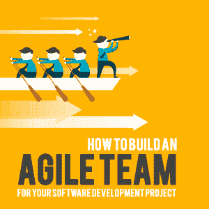

# 如何为你的软件开发项目建立一个敏捷团队

> 原文：<https://simpleprogrammer.com/agile-team/>

Agile companies believe that teamwork is essential to delivering [working software](https://apiumhub.com/tech-blog-barcelona/working-software-go-live-strategy/), and that great Agile teams are about “we” rather than “I.” Unfortunately, many companies claim they have an Agile team, but in reality they don’t. It’s important to learn what an Agile team really is, and to find ways to build them within your own company.

将一群人转变成一个真正的敏捷团队需要一段时间。然而，它稍后会有回报，因为敏捷项目管理[给团队和客户带来了很多价值](https://apiumhub.com/tech-blog-barcelona/benefits-of-agile-project-management/)。

让我提一下[最常见的敏捷优势](https://apiumhub.com/tech-blog-barcelona/agile-methodology/):93%的团队说敏捷帮助他们提高了上市速度，93%的团队说敏捷帮助他们更快、更有效地转变，87%的团队说敏捷帮助他们[更有效率](https://simpleprogrammer.com/getting-things-done-productivity-guide/)，80%的团队说敏捷提高了重要事情的优先级，80%的团队说采用敏捷帮助他们交付了更好、更相关的最终产品。

一个关键的成功因素是提供持续的指导和共享的技能。

当团队成员互相学习时，敏捷转变的过程会变得更加容易和愉快。

## 敏捷团队的品质

最重要的是，团队应该明白变化是不可避免的。能够适应快速变化的环境是敏捷开发和敏捷项目管理的关键。

### 能够快速整合反馈

这种改变通常来自于接受和给予反馈。反馈是敏捷开发的重要部分之一。你能多快交付想要的产品或功能并不重要；如果它不再受欢迎，团队所做的一切可能会被扔进垃圾箱。不幸的是，这在软件开发中经常发生。

当你实际面对一个你已经做了一段时间的项目不会被发表或使用的情况时，你是什么感觉？非常[沮丧和失望](https://simpleprogrammer.com/growing-programmer-struggle/)。

所以，为了与你的利益相关者保持一致，你需要不断地与他们沟通；因此，反馈与内部和外部沟通高度相关。

但是对于敏捷团队来说，不能只听反馈。你还需要快速地融入其中。从敏捷的角度来看，反馈是关于短期进步的。

通常，我们谈论的是两个星期的冲刺——对最重要的功能进行编码、测试和获得反馈的最佳时间。这也有助于更快推出[质量最低的可行产品](https://apiumhub.com/tech-blog-barcelona/minimum-viable-product/)，并更快获得投资回报。

### 像团队一样一起工作

有句话说得很好:“要想走得快，就一个人走。想走远，就一起走。”在敏捷软件开发中，这是至关重要的。你从同龄人那里学到的东西甚至比从书本和课程中学到的还要多。

建立敏捷团队的一个非常重要的部分是授权团队独立工作。

这不仅给所有的团队成员一种归属感和拥有感，也显示了信任和尊重。

在每一次冲刺的最后，总会有一些你需要交付的特性。当团队使用 Scrum 方法工作时，他们有用户故事；他们需要从“待办事项”变成“完成事项”当所有人都在舞台上“完成”时，这激励了团队成员，因为他们可以实际看到他们正在工作的结果。通过更加强调结果，团队成员感到有能力做出决策、解决问题和开发创新的解决方案。

每个敏捷团队的目标都是不同的。在 Apiumhub，我们将工作软件置于许多功能之上，总是进行测试驱动开发( [TDD](https://apiumhub.com/tech-blog-barcelona/advantages-of-test-driven-development/) )和持续集成( [CI](https://apiumhub.com/tech-blog-barcelona/benefits-of-continuous-integration/) )。有目标有助于敏捷团队看到进展，并以正确的方式前进。

帮助明确这些目标的最好方法是让[在敏捷团队](https://apiumhub.com/tech-blog-barcelona/product-owner-role-software-development/)中担任产品负责人的角色。我坚信这在当今是必须的。产品负责人负责产品的业务方向，他们负责创建用户故事并确定其优先级。开发团队负责产品的技术方向，技术团队将实际交付这些用户故事。

然而，需要注意的是，产品负责人总是会考虑技术团队关于用户故事的[优先级的反馈。](https://apiumhub.com/tech-blog-barcelona/user-stories-affect-team-product/)

### 有条理并使用工具

敏捷是关于效率和自动化的。完成的手动任务越少越好。这意味着使用像吉拉这样的工具是必须的。你可以在这里找到其他敏捷项目管理工具。敏捷还意味着在冲刺阶段有几个重要的会议[:冲刺计划、冲刺回顾、冲刺回顾，当然，还有每日例会。召开会议通常意味着每个人都更有可能了解自己的角色和需要达到的目标。](https://apiumhub.com/tech-blog-barcelona/scrum-sprint-explanation/)

每个敏捷团队都有自己对“完成”的定义。但是每个敏捷团队都需要就他们认为“完成了”的事情达成一致这是交付高质量产品和在项目管理和结果、功能和质量方面满足你的利益相关者的关键。基本上，它是一个添加或展示价值并且需要完成的特性和活动的清单。

As we mentioned in the beginning of the article, unfortunately, many teams try to be Agile, but they fail. In the software development world, based on our experience, it’s very important to learn best practices, and to be truly Agile, you must practice TDD, CI, and [unit testing](https://apiumhub.com/tech-blog-barcelona/top-benefits-of-unit-testing/).

实际上，团队要成为一个敏捷团队需要经历一些共同的阶段。让我们看看他们。

## 如何建立一个敏捷团队

创建一个敏捷团队需要时间，成员通常会经历不同的阶段，从仅仅是一组人到拥有共同目标和正确过程的敏捷团队。我不想在这里重新发明轮子；让我和你们分享一下布鲁斯塔克曼的各个阶段，突出重要的事情，以便更好地理解它们。他们一定会帮助你让你的团队更有效率。

### 成型阶段

第一个阶段是形成阶段，这与大学的迎新日非常相似。它是必不可少的，帮助人们互相了解，找到有用的信息，并写下规则。这一阶段的重点是定义和分配任务、制定时间表、组织团队工作等。

### 风暴阶段

加入一个团队就像谈恋爱一样。起初，你可能认为一个人是完美的，但后来你意识到他们实际上并不完美。然后你要么学会管理这段关系，要么它会很快结束。这个阶段也是关于每个团队应该遵循的目标和指导方针，以达到相同的目标。在这一阶段，团队集思广益，找到解决问题的方法。

### 标准化阶段

在这个阶段，团队成员制定他们的目标和实现目标的策略。这时，每个人都专注于发展共同的价值观，并确定最佳的合作方式。人们开始注意到并欣赏他们团队成员的优势，每个人都做出贡献，并作为一个有凝聚力的单位工作。

### 表演阶段

在这个阶段，团队成员自信、积极，能够轻松地合作完成相互依赖的任务。他们也很容易以有效的方式相互沟通和协调。基本上，第四阶段是所有敏捷团队努力达到的阶段。

## 更敏捷团队的团队建设活动

游戏很有趣，而且对团队建设非常有效。这里有一些游戏的例子，虽然很短，但是非常有效。让我们看看最著名的几个:

### 购买一个功能

这个游戏教授功能优先级，大约需要 15 分钟。团体的最佳人数是三到八人。每个玩家都会得到两样东西:一份带有功能菜单和价格的传单，以及一笔游戏币。

功能可以是任何东西，例如:度假必备的物品。所有玩家的钱的总和应该小于所有功能价格的总和。这引入了稀缺性，并迫使团队做出权衡，因为不可能购买列表上的所有项目。

玩家轮流用他们个人的钱来购买他们认为最有价值的功能。一旦玩家花光了大部分资金，或者他们个人没有足够的钱再次购买，或者他们不重视菜单上剩下的东西来购买其他东西，小组将集中剩余的资金，讨论从剩余的物品中购买什么。这个游戏帮助团队成员学习如何区分用户故事的优先级，以及如何进行资源管理。

### 白象上浆

In all software projects, Agile teams need to estimate user stories as well as product backlog. And this game is fantastic to learn how to estimate user stories. In this Agile game, players have 50 user stories and have four hours to estimate them. Everyone’s voices are heard, and everyone contributes equally.

这个游戏的目标是在项目开始之前，快速评估一个敏捷项目的规模和单个故事的规模。我相信这个游戏绝对是必须的，因为大多数敏捷团队在估计他们的项目的时间方面都有问题。

### 战舰

这种敏捷游戏通常用于向人们介绍迭代开发，并解释其背后的概念。这个想法是让人们明白预先的大计划并不是一个好主意！

在这个游戏中，你有两个队:A 队和 b 队。每个队都有一张“战列舰表”和一些圆点。每个小组将有大约两分钟的时间来计划如何放置他们的船只。A 队将有五分钟的时间预先计划打击目标，并将它们标记在他们的表上，然后将它们传达给 B 队，B 队将告诉 A 队哪些船沉没了，错过了哪些打击，等等。然后 B 队也有五分钟的时间来播放他们的每一个安打，但这一次是来自 A 队的关于失误、安打和沉船的实时反馈。

结果显而易见。团队 B 有机会改变其计划，因为他们遵循迭代规则，这将使他们得分更高。在这个游戏中似乎很明显；然而，许多团队在从事真实项目时会忘记这一点。

### 球点游戏

这个游戏在向新的敏捷团队介绍 Scrum 时帮助很大。它有助于评估用户故事、sprint 和整个项目。

规则很简单:你需要在两分钟内给球队尽可能多的球。每个球都必须经过每个队员。为了得到一分，重要的是第一个拿到球的人是最后一个触球的人。所以团队将得到五次迭代，在每次迭代之前，它必须估计他们认为将通过多少个球。然后，在每次迭代结束时记录实际数量，并与团队给出的估计进行比较。

通常，在第一次迭代中，很难给出一个估计，因为团队并不真正知道一个球通过整个团队需要多长时间。但是，在每次迭代之后，都会有回顾，因此团队会调整过程。通常，随着每次迭代，结果会变得越来越好。这个游戏帮助敏捷团队一起工作，学习如何做出评估，不仅考虑个人能力，也考虑团队的整体能力。此外，它有助于理解迭代过程和开发的需要。

## 建立一个敏捷团队来简化软件开发

统计数据显示，通过使用敏捷项目管理，平均来说，上市时间加快了 37 %,敏捷团队的效率提高了 16%。

转向敏捷是一个很好的想法，我真的希望这篇文章给你一个很好的概述，它是什么，你如何掌握它。如果你知道其他有趣的敏捷游戏，欢迎在下面的评论区分享。