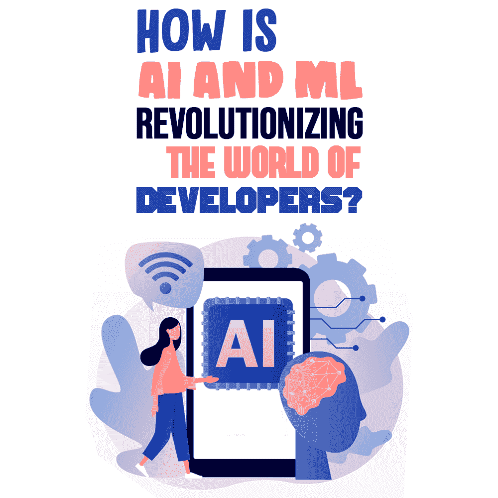

# AI 和 ML 是如何彻底改变开发者的世界的？

> 原文：<https://simpleprogrammer.com/ai-and-ml-revolutionizing-developers/>

In a world still grappling with the pandemic, artificial intelligence (AI) and machine learning (ML) have offered significant help by allowing us to leverage digitization through image scan analysis, voice recognition, natural language processing, contactless payment, reducing workloads of the health care segment, robots to minimize human contract, leveraging contact tracing apps, and more.

根据 Statista 的数据，全球人工智能市场目前价值 3275 亿美元，并继续增长，从 2015 年到 2020 年，全球企业对人工智能的投资总额增加了 550 亿美元。

随着 AI 和 ML 的到来，软件开发的世界经历了一场革命，受影响最大的是开发人员。他们的角色在变化，对他们的期望在提高，他们的工作范围在扩大。

在这篇文章中，我将分析人工智能和机器学习对开发者的影响。为你所在领域的这些发展做好准备，可以让你为工作带来更多价值，并有助于你的职业生涯。

## 人工智能和机器学习——快速概述

根据[维基百科](https://en.wikipedia.org/wiki/Artificial_intelligence)的说法，人工智能(AI)是由机器展示的智能，与人类或动物展示的自然智能相对，[机器学习](https://en.wikipedia.org/wiki/Machine_learning)是对计算机算法的研究，可以通过经验和数据的使用自动改进。

现实世界的人工智能和机器学习应用已经在医疗保健、教育、银行和金融、娱乐、汽车等各个行业领域成功实现。人工智能已经成为一种现代化的方法，其理论和实践证明了它是未来的代表。

在医疗保健领域，[人工智能已经被证明是非常有益的](https://builtin.com/artificial-intelligence/artificial-intelligence-healthcare),成功的进步包括更准确和更早的癌症诊断、更快的致命血液疾病诊断、智能症状检查器、人工智能支持的放射辅助、新药开发等等。

通过关注系统独立适应新事物的能力，而不是通过命令进行编码，人工智能一直在改变人类的未来。机器学习为系统提供数据，并在概念实现后执行相关算法。

AI 和 ML 的关键特征是深度学习；云和量子计算；聊天机器人；面部识别；数据摄取；以及使用领域知识通过特征工程提取特征、数据预处理、连接和集成业务流程与生态系统集成。

## 人工智能和机器学习的日益普及对开发者有何影响？

开发人员不断面临学习新东西的需求。随着技术的飞速发展，他们不可能一直停留在日常的技术知识上。毕竟，在专家水平上学习 AI 和 ML 需要大量的学习经验和这样做的策略。作为软件开发人员过渡到 ML 需要自己的技能，开发人员必须接受培训。

有不同的方法来观察开发者是如何被技术热情所影响的，以及他们的未来会如何。让我们更详细地看看它们。

### AI 和 ML 给开发者生活带来的轻松

这些现代技术给开发人员带来的便利和令人鼓舞的结果是显著的。人工智能和机器学习一起工作，提供了具有个性化和虚拟体验的高质量用户交互。这些技术提供了简单的编码、更智能的执行、更快的 SEO、代码可重用性和精确的期限估计。

开发人员的生活变得更加轻松，例如聊天机器人可以提供更好的交互、创造性的数字营销活动、实时建议决策、快速原型和智能编程帮助。开发人员更有能力通过分析客户行为和自动化分析来执行完整的测试周期。

### 软件业正在发生的革命性变化

软件领域发生了很多事情，直接影响了开发者，尤其是在疫情时代。为了[在日益数字化转型的世界中生存和发展](https://www.amazon.com/dp/B08KH5J7XH/makithecompsi-20)，开发人员正在采用更新的方式和方法来提升他们的知识商数，从而为高级软件开发做出贡献——这是一场革命的未来。

在需求收集阶段，AI 提供了广泛的技术来简化过程并获得最佳结果。此类工具有助于在继续之前识别故障区域。自然语言处理(NLP)等基于人工智能的技术在通过软件模型理解用户需求方面一直很重要。

其他工具如 Infosys Nia、Google ML Kit 等。有助于简化软件开发生命周期的开始。

许多组织现在使用人工智能工具来规划项目，基于 ML 的算法在估计成本和以最佳方式管理业务方面是有效的。

在设计阶段，人工智能通过人工智能驱动的助手提供帮助，这些助手可以根据客户需求、最新趋势和需求的可行性提供各种软件设计组合。这有助于设计师节省时间和精力。这也有助于项目跟上最新的技术发展。

在编码阶段，算法有助于自动代码生成、代码编译和错误检测。这将开发人员从编写代码行和查找错误的负担中解放出来。人工智能也有助于通过自然语言处理将需求转换成可执行代码，并在这样做的同时考虑客户需求和截止日期。

在测试和 QA 阶段，AI 工具在自动化不同级别所需的不同测试服务方面有很大的帮助。这些测试工具是保证产品质量和确保根据需要以不同方式进行定期自动化测试的完美助手。各种人工智能工具有助于快速识别错误，并以最少的人工干预自动修改代码片段。

## 开发者应该害怕被取代吗？

Ever since AI and ML have made their presence felt, a point of concern is “Will they replace developers?”

不，人工智能和机器学习不会取代开发者；但没错，开发商的经营方式肯定会有变化。开发人员的生活肯定会在许多方面经历积极的转变，因为人工智能本身可能会开始编写代码。这就是人工智能的特点:自动代码生成。

人工智能不会消除对开发人员的需求，但它将成为他们的编码助手。它将通过提供自动化的代码片段使编码变得更快，从而减轻他们的负担。

这些人工智能助手将在软件开发周期的每一步提供帮助，但毕竟它们是机器，可能并不总是万无一失。因此，开发人员仍然需要确保准确性和质量。人为干预是必须的；它不能报废或更换！

## 观看 AI & ML 传播他们的魔法

AI 和 ML 的力量是不可阻挡的，是纯粹的魔法。通过各种人工智能助手和基于 ML 的算法，它正在以自己的方式革新软件世界。它在人和机器之间架起了一座桥梁。

世界正在见证拥抱技术的更新方式，开发者也不例外！作为 AI 和 ML 的狂热用户，开发人员一直在享受这些技术的力量。他们的生活改变了，但变得更好了。

是的，开发人员必须改变他们的思维方式，变得更加精通技术，让自己跟上最新的发展，保持开放的心态来接受和适应更新的编码方式。只有这样，他们才能利用人工智能和人工智能的魔力。

坚持传统工作方式的开发人员可能无法感知这些现代技术的力量，因此无法取得成功。

对开发者来说，成为人工智能和人工智能的朋友是很有必要的，世界将会看到软件开发方式的重大改变。如果从积极的角度来看，那些张开双臂适应 AI 和 ML 工具和技术的开发人员是没有回头路可走的。