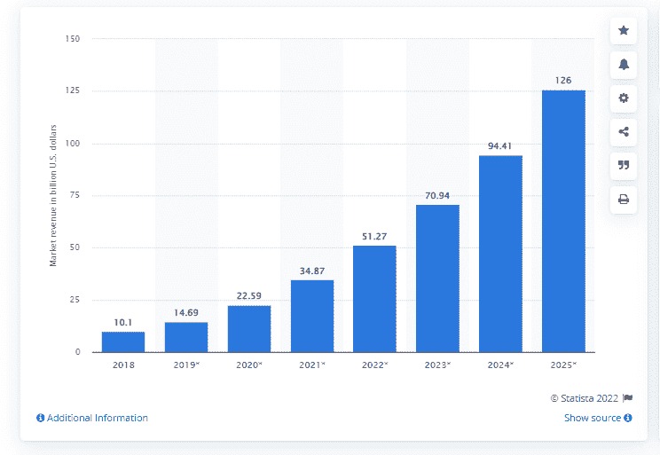
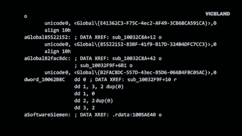
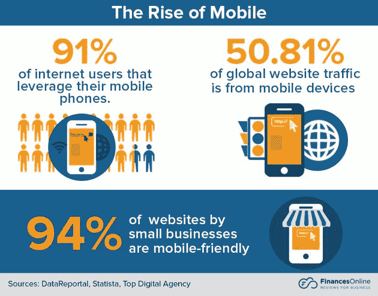

# 网络开发的人工智能:2022 年让你的业务更上一层楼

> 原文：<https://simpleprogrammer.com/ai-for-web-development/>

人工智能不仅仅出现在我们的智能手机和新闻中。它正在改变我们工作、生活和相互交往的方式。根据 Statista 数据，预计到 2025 年，AI 软件市场收入将达到**1260 亿美元。**

图片来源: [Statista](https://www.statista.com/statistics/607716/worldwide-artificial-intelligence-market-revenues/)

因此，许多企业都在竞相采用人工智能技术，以保持领先于竞争对手。像谷歌、脸书、优步等顶级公司已经使用人工智能原理来提高转化率。

面向 web 开发的人工智能具有巨大的潜力，可以改变 web 开发的方式，我们将在本文中讨论这些机会。

## 网络开发的人工智能:10 个有影响力的转变

人工智能在 web 开发中有几种方式可以改变我们今天构建网站和应用程序的方式。它可以让你创建更吸引人的个性化网站。

AI 可以应用在 web 开发过程的几个阶段，包括内容创建、网站布局、用户体验设计、SEO 优化等等。所以让我们来看看一些转换！

### 通过聊天机器人自动化改善用户体验(UX)

人工智能网络聊天机器人可以成为任何企业的有力工具。想象一下，如果用户不需要等待与真人取得联系，而是可以在对他们最有利的任何时候询问机器人。

客户服务将会更快、更方便、更便宜。一项调查显示，87%的客户更喜欢通过智能手机上的即时通讯应用获得客户服务。

此外， **39%的公司**使用这种先进技术使他们的网站更具互动性。reddit、Zendesk 和思科等主要电子商务公司已经在使用聊天机器人提供卓越的客户服务。

### 给你的观众一个更好的网站体验

个性化无疑是网站开发 AI 能做的事情之一。这项技术不仅仅是地理定位，而是在正确的时间向用户展示他们想看的东西。

随着 AI 更多地了解你的客户在你网站上的行为，它可以预测他们想要什么，并相应地调整你的内容。因此，你再也不会向客户展示不相关的内容，这最终会提高你的转化率。

### 人工智能可以帮助简化内容创作

为你的网站和营销创建内容占用了许多公司的大量时间。

内容创作也是许多企业忽视的任务之一，这会损害他们的搜索引擎优化并失去客户。幸运的是，AI 可以通过为你的网站写内容来帮你。

就像任何其他技术一样，人工智能从它可以访问的数据中学习，并使用这些信息来制作有趣和相关的原创内容。

最重要的是，由于人工智能可以定期产生新鲜和有帮助的内容，你不必担心它很快就会过时。

### 人工智能用于网站开发以优化编码

网站是由代码驱动的，代码的质量对其成功至关重要。写得不好的代码会导致不同设备的安全性、速度和兼容性问题。

然而，AI 有潜力通过学习你网站的源代码并优化它来解决这个问题。

这意味着 AI 可以检测出有问题的网站部分，并在没有人工干预的情况下修复它们。

### 人工智能用于网站开发，以提高移动优化

根据现有数据，到 2022 年，**超过 50%的网络流量**将来自移动设备。我们还可以预计，在同一时间框架内，**超过 80%的电子商务公司**将拥有其网站的移动优化版本。

图片来源:[财经在线](https://financesonline.com/web-ux-design-statistics/)

换句话说，拥有一个移动友好的网站不再是一个选项，而是在这个行业取得成功的必要条件。

AI 可以通过学习用户的移动浏览行为来帮助满足这一要求，并相应地对网站进行更改。这将使您能够改善用户的移动体验。

此外，不只是大公司使用人工智能进行移动优化，以帮助他们的客户更快地找到他们想要的产品。许多初创公司和顶级网站开发公司也正在将这项技术融入他们的业务中。

### 使用人工智能提高网站的搜索引擎优化

既然我已经提到了移动优化，让我们谈一谈搜索引擎优化。SEO 对任何网站来说都是增加受众和引领一代人的关键。你在搜索结果中的排名越高，你就越有可能吸引访问者来你的网站。

有了人工智能，你可以通过用相关的关键词和短语训练人工智能来提高你的 SEO 排名，然后它会用这些关键词和短语来分析你网站的内容，以找到相关的模式。

通过研究你网站上的用户行为，人工智能还可以确定哪些内容对你的客户来说表现更好。

在这个过程的几次迭代之后，当你专注于其他项目时，AI 将能够优化你网站的所有方面，包括标题、描述和页面布局。

### 利用人工智能进行欺诈检测

web 开发行业是最容易受到欺诈的行业之一。这种类型的在线犯罪包括**网络钓鱼、身份盗窃**和**恶意软件攻击。** 

用于网站开发的 AI 可用于检测网站上的可疑行为，并防止这些事件的发生。让我们看一些例子:

*   **异常检测**–使用高级算法检测异常行为，例如用户执行他们从未做过的操作
*   **面部识别软件**——通过对照高分辨率图像数据库验证用户面部来识别用户
*   **语音识别**–检测语音记录，并将其与网站音频库中的原始音频文件进行核对

### “无监督机器学习”让你的网站自动更新

用于网站开发的人工智能可以在不需要持续人工干预的情况下保持您的网站更新。

保持网站更新对于保持用户信任和提高搜索引擎优化排名至关重要，但是这需要时间和资源，而这是许多公司所缺乏的。

通过无监督的机器学习，网站可以检测过时的内容，并自动更新自己。**例如**，如果你的网站使用了一张旧图片或一段需要更新的文字，AI 会检测到它，并用新的替换相关部分。

### 利用人工智能获得实时报告

人工智能最伟大的地方在于它在不断学习。记住这一点，你就可以定期得到关于你的网站在给定时间内表现的报告。

人工智能可以告诉你你的网站有多少访问者，哪些主题与当前最相关，流量来自哪里，以及你的客户在寻找什么。最重要的是，人工智能可以根据收集的数据提出建议，以改善网站在未来的表现。

这种实时报告非常有用，可以帮助你了解你的网站转化率，并轻松优化它们。

### 网站开发中的人工智能降低了成本

网站的人工智能可以彻底改变 web 应用程序的开发方式。企业需要在开发上花费足够的资源和保持尽可能低的成本之间找到平衡。

可以提供服务质量同时提高投资回报率的解决方案值得关注，答案是自学式人工智能 web 开发可以通过多种方式降低成本，包括:

*   **自动化重复任务**–AI 可以自动化重复的 web 开发任务，如图像标记、代码生成和问题跟踪。
*   减少手动测试的需求–人工智能在 web 开发中非常有用，可以在问题变成更大的问题之前发现它们。
*   **防止错误和安全问题**——由于人工智能从用户那里学习，它可以识别糟糕的编码模式和常见错误。

## 人工智能是网络发展的未来

人工智能可以优化你网站的所有方面，包括标题、描述和页面布局。这将让你有时间专注于其他项目。此外，人工智能可以检测过时的内容，并自动更新。

你还可以接收实时报告，或者使用[基于人工智能的聊天机器人工具](https://www.amazon.com/dp/1617298832/makithecompsi-20)与观众交流。总而言之，使用人工智能进行网站开发可以让你在互联网上与其他企业争夺访客时获得所需的优势。

此外，人工智能仍然是一项年轻的技术，但它每天都在获得动力。鉴于人工智能必须提供的所有好处，很明显，你不应该浪费时间去做机器已经在为你做的简单事情。

使用人工智能获得的时间来建立新的策略，并从整体上改善您的网站。如果你想领先并利用这项技术，你最好的选择是与人工智能公司合作，帮助你为每个用户创建个性化的网站。

不要忘记与你的同伴分享这篇文章，看看他们对此有什么想法。此外，一定要分享你对人工智能如何帮助你改善网站的想法。