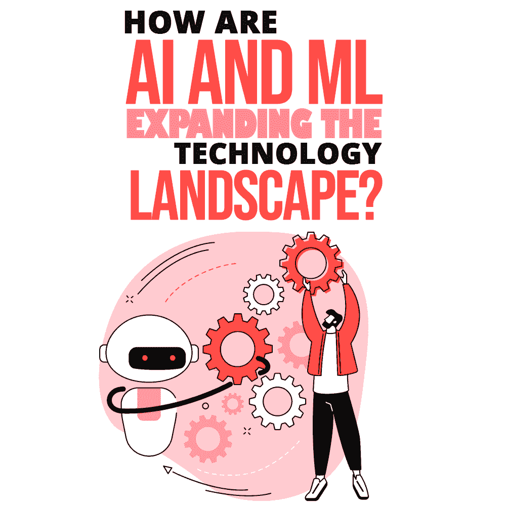
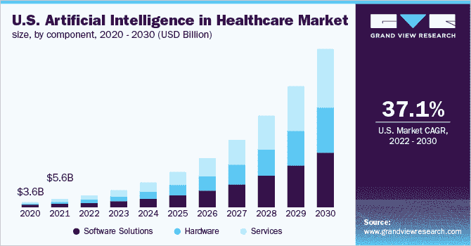
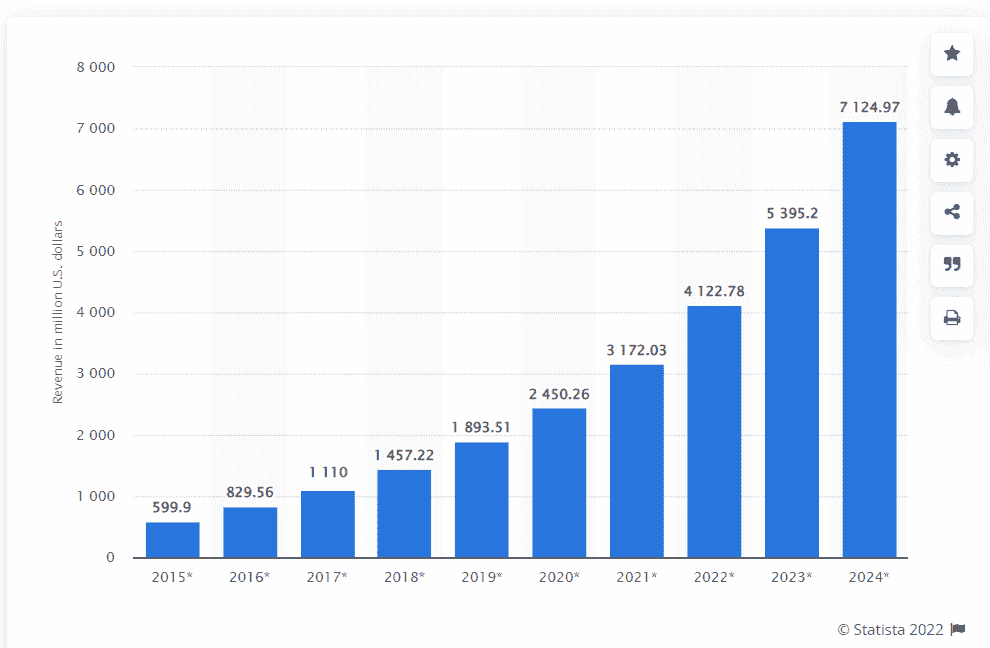
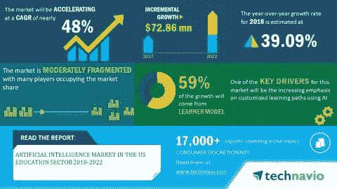
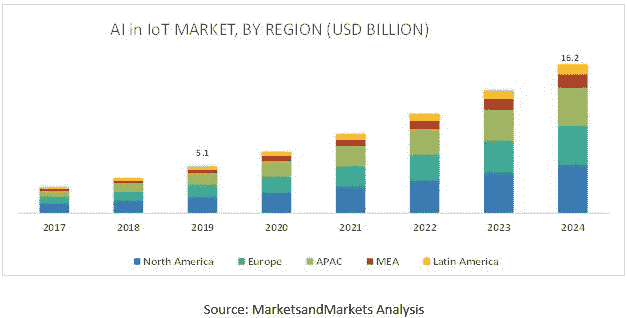

# AI 和 ML 是如何扩展技术格局的？

> 原文:[https://simple programmer . com/ai-ml-transformation-technology-landscape/](https://simpleprogrammer.com/ai-ml-transformation-technology-landscape/)

Artificial Intelligence (AI) and Machine Learning (ML) have been expanding far and wide in the past years. Indeed, it appears the time has come for AI and ML to be indispensable for powerful industry segments like healthcare, transportation, manufacturing, education, IoT, and others.

几乎所有的行业领域都开始依赖人工智能和人工智能算法来处理流程。技术领域正在飞速发展，见证所获得的优势是一件有趣的事情。人工智能和人工智能已经彻底改变了开发者的生活。

这两种技术正在彻底改变工作场所和商业运作的方式。这两个游戏规则改变者正在提高生产率和盈利能力，推动数字化，并使机器像我们人类一样思考。真正的效果是在不断变化的技术环境中见证的。

在我们深入研究人工智能和人工智能带来的变革之前，让我们简单地看一下人工智能和人工智能意味着什么。

## 什么是人工智能？

人工智能是计算机科学的一个趋势领域，致力于创造能够轻松完成人类任务的智能机器。此外，它有自动化的活动或由计算机控制的机器人来执行由人类完成的任务。事实上，人工智能有助于开发嵌入人类智能、归纳和过去学习经验的系统。

人工智能的目标是机器显示的智能及其在正常人类环境中的模拟。人工智能触及我们日常生活的某些例子是深度学习、Siri、Alexa、自动驾驶汽车、对话机器人/聊天机器人、量子计算、电子邮件垃圾过滤器、语音和面部识别、[网络安全](https://www.spec-india.com/blog/role-of-artificial-intelligence-in-cybersecurity)等等。

*人工智能提供的主要优势*

*   简单和重复活动的自动化
*   数据摄取
*   神经网络的创建
*   面部识别和聊天机器人
*   人类智能的模拟

## 什么是机器学习？

机器学习是人工智能的一个组成部分，它为计算机提供了学习的能力。它对分析模型构建进行编程，并帮助识别模式，以最少的人工交互进行决策，以及在没有任何显式编程的情况下预测结果。它利用历史数据作为输入。

机器学习意义重大，因为它为组织提供了客户行为、业务工作流模式等方面的未来趋势。它最常用于欺诈检测、恶意软件检测、垃圾邮件过滤、业务流程自动化和预测性维护等情况。它现在是大多数业务部门的集中组成部分。

*机器学习提供的主要优势*

*   自动数据可视化
*   数据的准确分析
*   客户参与度和满意度
*   提高工作效率
*   数据预处理

如果你对人工智能的深入分析感兴趣，你也可以考虑阅读 *[人工智能图集:权力、政治和人工智能的全球成本](https://www.amazon.com/Atlas-AI-Kate-Crawford/dp/0300209576/ref=zg_bs_491300_14/142-2734711-2349602?pd_rd_i=0300209576&psc=1)。*

## 享受人工智能和人工智能优势的 5 大业务领域

在了解了什么是人工智能和人工智能以及它们如何带来惊人的技术优势之后，是时候看看使用人工智能和人工智能来增强其流程的五大业务部门了。

### 医疗保健和医药

医疗保健是一个更加依赖使用人工智能和机器学习的系统的行业。这里正在进行许多基于预测的分析，深度学习训练计算机来识别和诊断医疗状况，以及使用人工智能实现精确的机器人外科手术。

*来源:[人工智能在医疗保健市场](https://www.grandviewresearch.com/industry-analysis/artificial-intelligence-ai-healthcare-market#:~:text=Artificial%20intelligence%20in%20the%20healthcare,in%20two%20years%20time%2Dperiod.)*

在医疗保健领域的不同领域实施人工智能可以节省时间和降低成本。有效地照顾病人是最重要的，最好通过基于人工智能的实现来完成。例如发现新药、高效的机器人流程、虚拟护理、灵活的治疗方案、放射成像、计算输出、疾病检测方法等等。

人工智能工具易于提前识别可能的疾病，从而导致及时的解决方案。他们还帮助培训病人的自我护理技能，并提供适当的援助和资源。有趣的是看到人工智能如何预测医疗状况并恢复医疗保健系统。

不同的人工智能技术，如内容分析、预测分析、深度学习和自然语言处理(NLP)，在增强医疗保健和分析患者状况方面发挥了比以前更早的作用。

人工智能和最大似然算法被用于诊断领域，可以毫不费力地提取最佳结果，无需太多人工干预。人力资源的匮乏推动了人工智能技术以更快的速度被采用。

### 运输

根据 Markets and Markets 的数据，2017 年至 2030 年期间，人工智能在交通市场的使用预计将以 17.87%的 CAGR 增长。人工智能和相关技术在交通领域的渗透彻底改变了该行业的运营管理方式。现在的运输更快、更灵活、更传统、更便宜、更有效。

具有竞争力的 AI 和 ML 算法已经以非常实惠的价格向用户提供了很高的服务水平。自动驾驶/自动驾驶汽车、像优步 pool/Ola 这样的门户网站、车道变换门户网站、自动车辆引导和制动系统、交通管理、无人机出租车和延误预测都是人工智能和人工智能以积极方式影响交通领域的生动证明。

先进的人工智能和人工智能技术可以帮助驾驶人员监控其他车辆的参数，如驾驶行为、天气、路况等。相关工具帮助驾驶员获得平稳的驾驶。还有光线检测程序，可以测量某个区域的参数，并在任何即将到来的麻烦发生时提醒驾驶员。

交通部门使用的不同工具有助于分析影响交通状况的因素，以便在遇到障碍时提前提醒用户。它们还帮助驾驶员避免与其他车辆发生碰撞，并在意外情况下(如事故或极端天气条件)采取必要的行动。

如果处理不当，过度依赖工具确实会产生影响——例如，盲目跟随导航系统已被证明是危险的——但随着人工智能的发展，未来在交通领域有很多积极的方面。

### 语音、声音和语言识别

[语音生物识别市场预计到 2028 年将达到 58.899 亿美元，同比增长 22.3%](https://www.einnews.com/pr_news/561666425/voice-biometrics-market-size-expected-to-reach-usd-5-889-9-million-at-a-cagr-of-22-3-in-2028) 。很明显，人工智能和人工智能在语音领域的渗透正导致更多人使用这些越来越高质量的系统。

事实上，语音识别和翻译算法在准确性方面已经接近完美，可以帮助有语言和听力问题的人。在个人和职业生活中，语音识别的应用日益增加。人们现在习惯于在从门户网站提取信息时提供语音控制。

*资料来源:[2015-2024 年全球语音识别市场规模(百万美元)](https://www.statista.com/statistics/608523/worldwide-voice-speech-recognition-software-market/)*

甚至翻译成多种语言也增加了它在许多门户网站上的传播。谷歌翻译在不同领域提供帮助，比如阅读街道信号、说明书、广告牌等。用户可以将实时对话翻译成所需的语言，从而实现灵活有效的输出。

像 Google Home 这样的软件也可以接受各国语言的语音命令。这项技术通常被称为语音人工智能，是一种对话式人工智能工具，利用语音命令来接收和解释指令。

基于语音的技术易于与多种设备和软件解决方案集成。凭借其多语言支持和语音嵌入算法，它们为从一个地方传递到另一个地方的信息提供了增强的安全性。

这些人工智能和人工智能驱动的语音和声音软件具有迷人的 GUI，其中嵌入了可以轻松连接到外部系统的算法。活生生的例子——比如苹果的 Siri 和亚马逊的 Alexa——正在使用人工智能驱动的语音识别技术来提供语音或文本支持。谷歌听写就是这样一个语音到文本的门户网站，它将听写的句子转录成文本。

### 教育

教育和电子学习是近年来人工智能和人工智能技术越来越多地被采用的一个领域，今年还会有更多的应用。事实上，人工智能在全球教育市场的使用预计到 2023 年将达到 36.8 亿美元，增长率为 47% 。

像虚拟辅导、在线学院和大学、竞争性备考、辅助学习、现代教育工具和在线学习材料访问等更新的活动已经成为学习和管理学院/学校的新方式。

已经通过人工智能方法将教科书数字化，以便可以以具有成本效益的价格轻松分发这些材料。组织正在提供定制的软件解决方案，以支持嵌入式 AI 和 ML 算法。这些解决方案正在缩小现实世界和数字世界之间的差距。

*来源:[美国教育领域人工智能市场 2018-2022](https://www.businesswire.com/news/home/20191203005524/en/Artificial-Intelligence-Market-in-the-US-Education-Sector-2018-2022-Increased-Emphasis-on-Chatbots-to-Boost-Growth-Technavio)*

在 AI 和 ML 的帮助下，教师的角色也在发生变化。老师们正在使用新技术来评估每个学生的个人表现和需求。这些技巧可以帮助分析学生的强项和弱项，并推荐可以加强学生学术前景的行动。

相关课程材料、测试、在线工作表等。，可以通过人工智能驱动的算法提供给学生。通过人工智能方法可以提供通过测试单的个性化培训。甚至聊天机器人在即时帮助和指导方面的使用也在增加。

由于人工智能和人工智能技术的顺利集成，整个教育和电子学习领域——直到最近还处于次要地位——现在已经发展成为一个成熟的、有竞争力的商业领域。

甚至自然语言处理技术也在教育的广泛传播中发挥了举足轻重的作用。智能内容创建、任务自动化、个性化和灵活的学习以及普遍访问是教育部门因人工智能和人工智能而享受的一些关键好处。

### 物联网和智能城市

物联网拉近了物理世界和数字世界的距离。由于物联网，产生了大量有价值的数据，可以用于未来的利益。正是基于人工智能和人工智能的算法在提取最佳信息和实现整个物联网基础设施现代化方面发挥了重要作用。

为了了解人工智能对全球物联网市场的重要性，预计到 2026 年[CAGR 将增长 27.3%。](https://www.mordorintelligence.com/industry-reports/ai-in-iot-market#:~:text=The%20global%20Artificial%20Intelligence%20(AI,period%20(2021%2D2026).)

新颖的“智能城市”概念也在加快步伐，人工智能技术在其实施中发挥了关键作用。数据科学技术和传感器的利用正在使城市变得更加智能，并与技术交织在一起。它正在帮助城市采取更明智的举措，变得越来越现代化。

*来源:[物联网市场 AI，全球预测至 2024 年](https://www.marketsandmarkets.com/Market-Reports/ai-in-iot-market-43388726.html)*

人工智能和人工智能通过物联网设备给智能城市带来了许多可见的好处:

*   控制污染并提供有效的水和能源管理
*   预测和减轻交通和噪音堵塞
*   预测不同行业的未来需求和商业趋势
*   提供高效的停车系统
*   跟踪回收材料并妥善管理废弃物

这些只是人工智能帮助智能城市变得更加智能的一些可能方式。

如果你有兴趣了解更多关于人工智能未来的可能性，你也可以阅读 *[一千个大脑:一种新的智能理论](https://www.amazon.com/Thousand-Brains-New-Theory-Intelligence/dp/B08VWV2WDK?ref_=Oct_d_obs_d_3887&pd_rd_w=pX2Uc&pf_rd_p=8000bc8c-c3b0-4816-9f00-5038ff54385c&pf_rd_r=VBSV57TWK52X9CH0H5V7&pd_rd_r=33410304-d07b-4ab8-ae5e-e581459fbaf0&pd_rd_wg=yx4YJ&pd_rd_i=B08VWV2WDK)。*

## 世界利用人工智能和人工智能的力量

当你读完以上享受人工智能和人工智能好处的五个部分时，你可能已经意识到，世界正在改变。我们发现自己已经习惯了日常生活中的这些现代技术——无论是个人生活还是职业生活。

从医疗保健和交通到语言、教育和智能城市，人工智能和人工智能为各种问题提供了大量解决方案，让我们的生活更轻松，程序更顺畅。而这仅仅是开始！