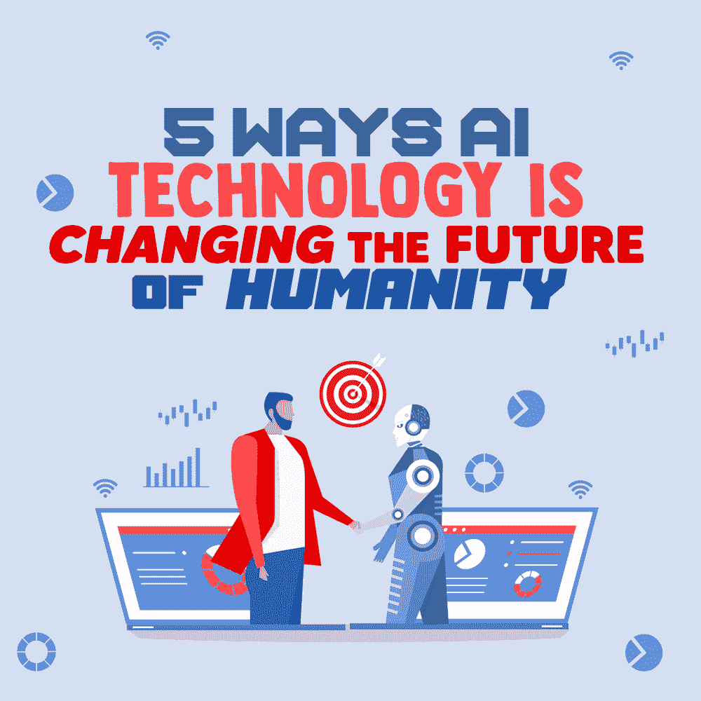

# 人工智能技术改变人类未来的 5 种方式

> 原文:[https://simple programmer . com/ai-technology-changing-the-future/](https://simpleprogrammer.com/ai-technology-changing-the-future/)

In the past, the only way for people to have their wishes fulfilled was a genie in a lamp—and that didn’t work too well because, you know, there is no such thing in reality. Nowadays we have something better, something that actually works.

我们有人工智能作为我们的愿望制造者。

你不相信我？那你怎么能演奏歌曲或者关灯却一动不动呢？谢谢你，阿利克夏！

从智能手机到家用电器，我们放眼任何地方，都能在日常生活中找到人工智能。你可能还没有注意到，但人工智能是我们许多活动背后的驱动力。人工智能背后的能量正在发展，这一切都要归功于计算机不断收集的关于我们的偏好、购买和习惯的大量信息。

人工智能和大数据对我们文化的突破性[影响](https://simpleprogrammer.com/cultural-change-ai-and-big-data/)将产生广泛的货币、法律、政治和行政影响，我们应该对此进行研究和规划。更重要的是，AI 研究利用我们所有的个人数据信息来准备机器，以学习和预见我们需要、喜欢或不喜欢什么。

在本帖中，我们将看看人工智能在未来几年可能影响五大行业的方式，从而进一步导致人类社会和生活方式的变化。作为一个普通公民，尤其是作为一名程序员，为这种变化做好准备的最好方法是见多识广。所以，让我们开始吧！

## 理解人工智能发展

在深入研究人工智能如何改变社会的未来之前，让我们看看一些统计数据，了解一下人工智能的发展:

*   根据普华永道的报告，到 2030 年，人工智能可能为全球经济贡献高达 15.7 万亿美元。其中，6.6 万亿美元可能来自生产率的提高，9.1 万亿美元可能来自消费副作用。
*   据世界经济论坛称，人工智能正在实现流程和工作流程的自动化，从而减少了 8500 万个工作岗位。但与此同时，人工智能也在创造新的工作岗位，据预测，到 2025 年，人工智能将创造 9700 万个新工作岗位。总共增加了 1200 万个工作岗位。
*   根据全球市场洞察公司的一份新研究报告，全球可穿戴人工智能市场规模预计到 2025 年将达到 1800 亿美元。
*   根据 IDC 的预测，到 2021 年，全球在人工智能和认知系统上的支出预计将达到[576 亿美元。](https://www.idc.com/itexecutive/research/topics/ai)

这些数据表明人工智能正在取得重大进展。当然，这种发展并不是在所有领域都一样。一些领域/行业正处于人工智能创业的初期，而另一些则是经验丰富的探索者。无论如何，人工智能将被用于每个领域，使程序变得简单，并将有几家[人工智能开发公司](https://appinventiv.com/artificial-intelligence-development/)协助萌芽中的企业。

因此，考虑到这一点，现在是时候了解人工智能将如何影响人类社会的未来，特别是在交通运输、网络安全、医疗保健、教育和客户服务等领域。

## 运输

自动驾驶汽车，也称为自动驾驶汽车，不是未来的事情；他们已经在这里了。

无论是特斯拉还是谷歌的 Waymo 项目，我们都已经拥有了这种自主技术。尽管还需要几年时间才能完善，但无人驾驶汽车肯定会在没有任何人工干预的情况下将我们从一个地方运送到另一个地方。

这是一项伟大的成就，因为与我们不同，人工智能司机不需要看收音机，努力将注意力集中在一件事情上，或与后座的孩子争论。

我们可以看到这项技术正在获得动力，并扩展到目前统治欧洲城市社区铁路的无人驾驶列车，波音公司正在建造一架自主喷气客机。

## 网络安全

在谷歌上简单搜索一下，你就会发现网络安全是一个严重的问题。例如，2015 年发生了大约[7.07 亿起网络安全违规事件。自那以来，这一数字一直在上升，因为在 2021 年的前六个月，大约有 1，767 起公开报告的违规事件，暴露了总共 188 亿条记录。](https://www.zdnet.com/article/hacks-exposed-707-million-records-in-2015/)

我们可以看到，各组织都在努力保持领先黑客一步的优势。南加州大学的专家表示，AI 赋予的自学和[自动化能力可以更加审慎和合理地保护信息，使个人免受非法欺诈和恐怖主义的侵害。](https://simpleprogrammer.com/ai-become-better-programmer/)

人工智能可以搜索与恶意病毒和程序相关的设计，然后才能获取大量数据或造成破坏——这是人类无法做到的。

## 卫生保健

如今，在人工智能的帮助下，医疗保健行业已经彻底改变了。例如，感染和疾病的分析更加快速和准确，药物发现更加快速和顺畅，虚拟护理助理能够筛选患者，数据分析支持创建定制的患者体验。

人工智能使医疗从业者和诊所能够以更好的方式分析信息，并根据患者的环境和生活方式为他们提供医疗服务。人工智能的好处显而易见，从诊断脑瘤到为患者选择最佳的疾病治疗方法。此外，人工智能正在彻底改变定制医疗的含义。

## 教育

使用先进创新产品、手机或平板电脑的年轻人总体水平正在上升。公司和协会利用新技术在最需要的地方提供教育。

书籍等阅读材料在人工智能的帮助下被数字化。人工智能在教育中的应用正在扩大，虚拟向导可以帮助教师，面部分析可以测量学生的感受，以帮助找出谁在战斗或疲惫不堪，然后根据他们的个人需求定制体验。

组织雇用人工智能开发公司的原因是为了完成工作。

## 客户服务

Gone are the days when manual calling was the thing. Nowadays, Google is working on an [AI assistant](https://www.amazon.com/dp/0262542552/makithecompsi-20) that can make calls like humans to make appointments, for example at your local salon.

自动化框架推动了进一步的有效性和有用性的发展。它们还能帮助大脑避免无数员工每天经历的日常杂事带来的疲惫。这对每个人都有帮助，甚至可以改变残疾人的生活。

例如，有听力障碍的人通常需要翻译来通过电话预约，现在可以使用人工智能来使个人独立。

担心劳动力会因为创新而受到严重伤害并不新鲜。解决这一担忧的方法是数字化，它正随着新的创新而兴起。人工智能和自动化正在简化工作场所的流程，因此，给行业和个人的工作带来了重大变化。

## 人工智能是未来

从银行业和零售业到种植业和制造业，人工智能在日常生活中的[效应已经在广泛的行业中感受到。在医疗保健中，人工智能被用于识别(有时甚至预见)疾病，为医疗保健供应商及其患者提供更好的治疗，并做出良好的生活方式选择。](https://www.mobileappdaily.com/artificial-intelligence-applications)

当人类考虑制造我们图片中的机器时，人工智能激起了恐惧和兴奋。然而，当我们漫步穿过这个特定的入口通道时，很有可能我们不会回来了。

很明显，与 AI 建立联系将成为一项常规活动。人工智能可以用来处理非常棘手的问题，并发现对人类繁荣至关重要的解决方案。这些进步带来了巨大的经济和社会优势。

虽然这种渐进的创新变成了对我们的帮助，但我们仍然没有机会预测它将如何行动。然而，通过适当的保护，我们可以保证人工智能框架是有意的、智能的和多功能的，而不会丧失定义人类的重要特征。