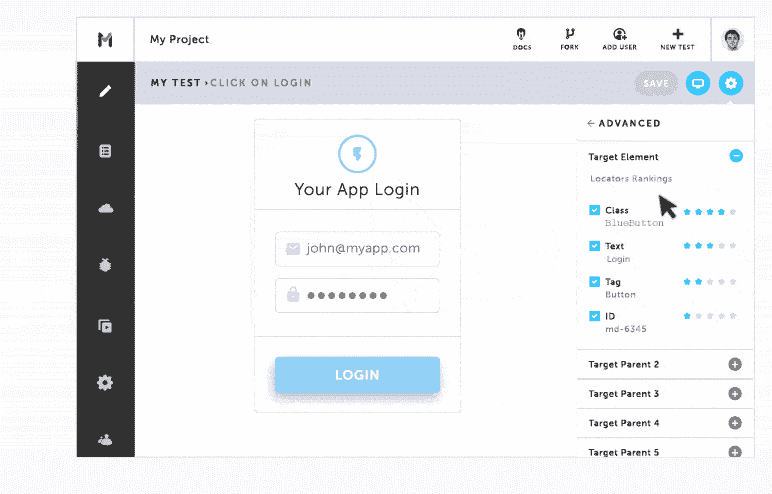
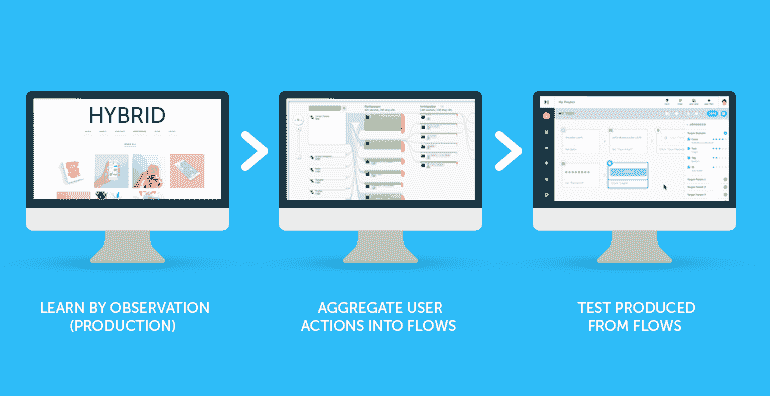
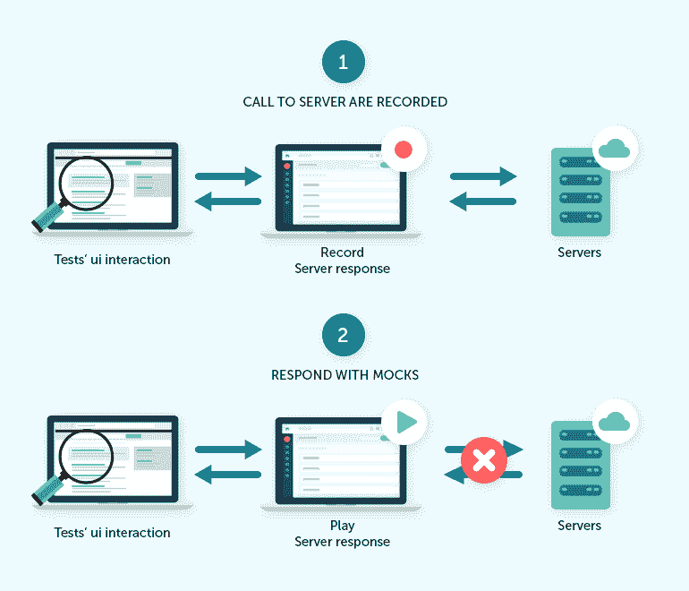

# 人工智能和测试自动化的真相

> 原文：<https://simpleprogrammer.com/ai-test-automation/>

在过去的几十年里，软件测试逐渐发展。在过去，团队习惯于瀑布方法:一切都是有序的，从需求到产品部署。

只有在开发阶段完成后，测试人员才能接触到产品。从历史上看，测试人员会在这个阶段发现大量的 bug，并且需要大量的重新设计和返工来修复它们。这导致了大量的浪费，从时间到精力和成本，再加上团队的士气。

但是在目前的测试状态下，大多数公司都遵循敏捷过程，比如 XP、Scrum、看板或者这些的一些变体。主要目标是快速找到 bug，快速修复，更快发布软件。

为了实现这个目标，非常需要用**自动化测试**来补充已经存在的手工测试过程。这是持续集成(CI)、持续交付(CD)和 DevOps 的重要组成部分，大多数团队现在都遵循这一点，以使他们的软件开发生命周期(SDLC)过程更加精益和有效。

在过去的十年中，各种工具和框架已经发展起来，以帮助自动化测试，但是一种值得讨论的方法是在测试自动化中使用人工智能(AI)。

## 揭开人工智能的神秘面纱

我们先退一步，去神秘化 AI。在最基本的层面上，人工智能是一种可以理解、感知和学习的技术，并使用计算机来解决通常需要人类智能和理解的问题。

另一种看待方式是，AI 将人类的技能和倾向应用于无生命的物体或想法。很像自动化，AI 使技术完成真正的人类任务成为可能。

与流行观点相反，AI 既不是遥远的现实，也不是基于科幻小说情节的概念；相反，它已经渗透到技术领域，并正在推动触及我们日常生活的创新。从冒充客户服务代表的聊天机器人到搜索结果和流量预测，在任何一天，人工智能都在我们身边。

以下是一些关于人工智能采用的令人震惊的统计数据:

*   根据叙事科学最近的一项研究，61%的企业在 2017 年以某种方式实施了人工智能。2018 年采用率只增不减。
*   Juniper Research 的另一项研究发现，到 2022 年，全球零售商在人工智能上的支出将达到每年 73 亿美元，高于 2018 年的估计 20 亿美元。
*   一篇 CMO 的文章声称，到 2035 年，人工智能将帮助劳动生产率提高 40%，并使人们能够有效地利用时间。

## 人工智能在测试自动化中的影响

人工智能已经开始以各种方式影响[测试自动化](https://simpleprogrammer.com/ultimate-automation-testing-guide/)，导致在创作和执行测试、创建更稳定的测试、快速发现错误以及更快发布软件以满足客户需求方面节省了大量时间。以下是发生这种情况的一些方式。

### 更快更稳定的 UI 测试

作为持续测试过程的一部分，软件开发团队有单元测试、服务/API 级测试和用户界面(UI)测试。UI 测试的共同问题是它们缓慢而脆弱，并且需要大量的维护。人工智能可以通过使用动态定位器来避免这种情况。

这是一种策略，通过这种策略，人工智能可以分析用户在应用程序中交互的每个元素的多个属性，并实时创建一个位置策略列表。因此，即使一个元素的属性改变了，测试也不会失败；相反，人工智能检测到这个问题，并采取下一个最佳定位策略来成功识别页面中的元素。

通过这种方式，测试更加稳定，结果，测试的[创作和执行也非常快。](https://blog.testim.io/bringing-simplicity-to-authoring-and-execution-of-automated-tests/)

### 减少维护**和消除片状测试**

测试自动化最常见的问题之一是维护。

例如，假设我们每天运行 100 个自动化测试，以确保应用程序的主要功能仍然稳定；如果第二天我们回来工作，发现一半的测试都失败了怎么办？我们需要花费大量的时间来排除故障，并调查实际发生了什么。这包括找出修复故障和实现修复的方法。然后，我们重新运行自动化测试，以确保一切顺利通过。这有印象吗？

AI 可以避免这样的问题，因为它有自我修复机制。它可以在测试中发现问题，甚至在问题发生之前就开始检测，从而主动修复测试，而不是我们对它们做出反应。

根据测试运行的次数，人工智能可以找出哪些测试是稳定的或不稳定的。因此，它可以为我们提供需要修改哪些测试的数据，以确保测试运行稳定。

最后，基于大量的测试运行，AI 可以优化测试中等待页面加载的等待时间，也可以处理不同分辨率下的测试。所有这些都大大减少了维护测试所花费的时间，并有助于解决持续测试的最大瓶颈之一。

### 从生产数据中不断学习

在这个顾客至上的快节奏环境中，观察和了解顾客如何使用我们的产品非常重要。无论您有 web、移动还是桌面应用程序，都是如此。

有了自主测试，我们现在有一种方法让 AI 开始观察和学习我们的客户是如何使用产品的。基于此，它可以开始创建基于真实用户数据的测试。

它足够智能，可以识别常用的动作，比如登录/退出应用程序，并将它们聚集成可重用的组件。然后，它也将这些新创建的可重用组件注入到我们的测试中。现在，突然之间，我们已经有了人工智能基于真实数据编写的实际测试，以及可以在其他测试中使用的可重用组件。

这让我想起了伟大的史蒂夫·乔布斯的一句名言:“从客户体验开始，倒着做。”

### 删除依赖关系

测试自动化的另一个挑战是为一个可能依赖于其他模块的系统编写测试，这些模块可能已经实现，也可能还没有实现。通常在这些时候，我们会模拟来自服务器或数据库的响应。现在人工智能可以帮助我们做到这一点。

一旦我们编写了一些测试并持续运行了一段时间，AI 就可以开始记录所有的服务器响应。下一次我们运行测试时，测试将访问存储的响应(这是在 AI 的帮助下实现的)，并将继续运行，没有任何障碍。

结果，测试运行得更快了，因为消除了等待响应的延迟，并且完全消除了对物理数据库或服务器的依赖。

### 创作和执行测试的简易性

一些阻碍公司推进自动化的最大障碍是用选择的工具或框架创作和执行测试所花费的时间和精力，以及完成这项任务的熟练资源的可用性。

即使当公司决定推进自动化测试时，由于应用程序、可用工具和使用的编程语言的复杂性，团队也不得不花费大量的时间创作和执行测试。

现在，有一些基于人工智能的工具可以帮助缓解这些问题。过去需要一周时间编写和执行的测试现在可以使用人工智能在几个小时内完成。通过使用动态定位器和轻松创建可重用组件、进行数据驱动测试、快速编写和执行测试，以及将 CI/CD 系统与公共和私有网格轻松集成，这一切都是可能的。结果，我们能够有可靠的测试，更多的测试覆盖，更少的维护，和更快的发布周期。

同时，这也开启了测试自动化的新时代，非技术人员也可以参与到测试自动化中来。这有助于增加团队内部的协作，并鼓励每个人都拥有测试自动化的成果。人工智能现在带来了一种全团队的方法来测试自动化。

### 以发展的速度释放

随着 AI 推动向自主测试的过渡，将维护减少到最低限度，并创建更可靠的测试，团队更快发布的能力比以往任何时候都好。

有了人工智能和自主测试，质量保证(QA)可以专注于探索性测试，而大部分测试是不断创建和自动更新的。现在，您的发布频率只受开发人员编码速度的限制。QA 也更容易通过将测试的创作与映射到真实用户流的生产应用程序联系起来，来最大化用户覆盖率。

现在，我们有能力采取基于风险的方法，并根据真实数据做出决策。最重要的是，由于人工智能的自我修复机制，我们通过主动修复问题而不是对问题做出反应而走在了游戏的前面。

此外，我们现在能够在短时间内创建更多的用户场景。这意味着您可以快速找到 bug 并更快地发布。有了人工智能，测试的未来只会变得更加光明。

如果你经历过或听说过在测试自动化中实现 AI 的其他方法，请在下面的评论部分分享你的想法。