# 2015 年看的所有书

> 原文：<https://simpleprogrammer.com/all-the-books-i-read-in-2015/>

又到了我对过去一年读过的所有书籍进行年度回顾的时候了。

我决定每年都这样做，这样我就可以分享我读过的一些最好的书，也可以提醒自己他们讨论的观点。如果我想回去看看我学到了什么，以及它是如何影响我的生活的，写下这样一个清单可以作为一个很好的参考。

你可以在这里查阅我去年，2014 年看的所有书。

2015 年，我一共看了 57 本书！

当我把它们加在一起时，我非常震惊。我知道我去年读了很多书，但我没意识到有那么多——尤其是因为那份清单上有一些相当大的书。

如果你通过阅读来快速学习概念和技能，那就看看我的课程:[快速学习的 10 个步骤](https://simpleprogrammer.com/store/products/learn-anything-quickly/)。

## 我怎么看这么多书？

Before I get into the list, you may be wondering how I manage to read so many books each year and if I actually read those books or not.

嗯，我肯定读过。我不浏览书籍，除非是为了研究目的。

我最大的秘密是[利用听觉](http://www.amazon.com/exec/obidos/ASIN/B00NB86OYE/makithecompsi-20)来阅读有声版本的书籍。

我几乎总是在听有声书，只要我:

*   驾驶
*   运转
*   举重
*   旅行

我也听 3 倍速的书。(这需要一些时间来适应，但我现在真的想要更快的速度。)

我一般每天晚上都会在跑步机上走 30 分钟左右，期间会在 Kindle 上看一本书。

当我排队等候或无法做其他事情时，我也会尝试利用休息时间用手机上的 Kindle 应用程序看书。

## 我如何挑选我的书

还值得一提的是，我是如何挑选我读过的书的。

在做选择时，不仅要读任何书，而且要读好书，这很重要，所以我在选择我要读的书时很小心。

几乎我读过的每一本书都被至少一个或一个以上的人推荐过，通常是后者而不是前者。

每当我有机会与富人、成功人士、名人或我认为很有智慧的人交谈时，我都会问他们有什么书可以推荐。

我在亚马逊上有一个图书愿望清单，所以每当我寻找下一本书时，我都有很多书可以选择。这可以防止我用完好书，或者拖延或者阅读质量较低的书。

## 名单，没有特定的顺序

事不宜迟，让我们来看看我的 2015 年书单:

***[百万富翁浪子](http://www.amazon.com/exec/obidos/ASIN/0984358102/makithecompsi-20)**T5】*

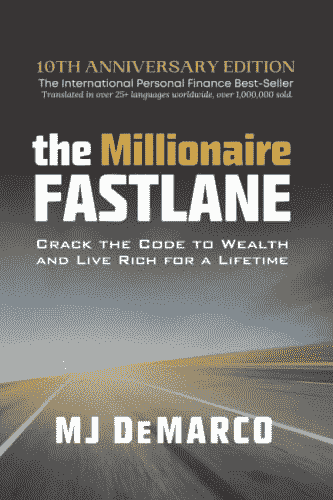

这是那种我可能会买几本分发出去的书，因为它就是那么好。不要让标题在这一点上愚弄你；不是绒毛。

作者谈到大多数人都是他所谓的“路人”，他们花钱时对未来没有计划。

然后，他介绍了“慢车道”，我在那里度过了大半辈子。他谈到慢步行者如何比步行者更好，但当他们变得“富有”并可以退休时，他们就会老了，不能享受了。

最后，他介绍了成为一名“快速学习者”的想法，主要是通过成为一名企业家和开始自己的事业。然而，他并没有就此止步。他继续告诉你最有意义的业务类型，并给你一些真实、实用的建议，告诉你如何建立一个非常成功和可扩展的业务，让你直接进入快车道。

我知道这个建议是有效的，因为这正是我在反复碰壁后自己发现的。

这很容易成为我推荐每个人阅读的最佳书籍之一。

***[搏击俱乐部](http://www.amazon.com/exec/obidos/ASIN/0393327345/makithecompsi-20)**T5】*

我从未读过这本经典著作，而且我喜欢这部电影，所以我决定试一试。

这本书相当不错，但并不出众。在许多方面与电影有很大不同。

这绝对是那种能让你思考的书，但是我对它的写作没有什么印象。我想如果我没有先看这部电影，我会更喜欢这本书。

***[降低你的税收——大时代！](http://www.amazon.com/exec/obidos/ASIN/0071849602/makithecompsi-20)***

在书店看到这本，翻了翻。我决定买下它，因为它看起来很不错，而且我总能得到一些关于降低税收的建议。

看完之后，我并没有真的得到什么革命性的东西。我基本上已经完成了书中的大部分提示，尽管还有一些关于销售或房地产的东西，到时候我可能会回去看看。

然而，真正打动我的一个想法是，每个人都应该有某种副业，至少为了税收目的。

因此，如果你从工资中缴纳了很多税，但你没有副业，你可能会从这本书中获益匪浅。

***[搭配:重新想象你与上帝的关系](http://www.amazon.com/exec/obidos/ASIN/1595553797/makithecompsi-20)***

我不怎么读宗教书籍，但是这个博客的一位读者——我很重视他的意见——给了我这本书，并推荐我阅读。

看完之后，我就明白为什么了。我从这本书中获得了很多价值，因为我发现了一些我持有的没有多大意义的观点。

我觉得读完这本书后，我能以一种更真诚、要求更少的方式与上帝交流。

绝对是我推荐的一本书。

***[致富之道](http://www.amazon.com/exec/obidos/ASIN/1604598875/makithecompsi-20)***

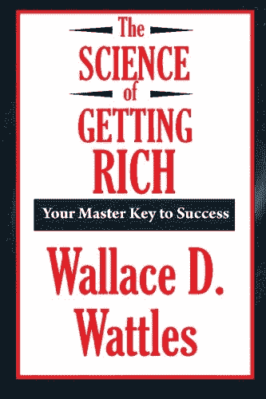

我听到许多其他书籍提到它，这是有史以来出版的第一本真正成功的书。

这本书本质上讲的是吸引力法则。它影响了许多后来基于这一概念的其他流行书籍的作者。

我发现书中的建议非常实用，至今仍然适用。作者鼓励你克服对金钱和财富的误解，并学会如何以不贬低他人的方式追求自己的目标。

老实说，尽管标题有误导性，但这实际上是一本有大量实用建议的好书。

***[美好生活指南:古代斯多葛派艺术](http://www.amazon.com/exec/obidos/ASIN/B0040JHNQG/makithecompsi-20)***

我非常喜欢斯多葛派哲学，所以当有人推荐这本书时，我非常兴奋地阅读了它。

这是一本不错的书，但我不得不承认我有点失望。

如果你从未读过斯多葛派哲学，这本书是一个温和的介绍，但作者似乎想重新解释斯多葛派哲学，并创建自己的半吊子品牌，这最终挫败了整个目的。

它似乎也错过了斯多葛派的一些核心属性，试图对它采取过于分析的方法。

这本书并不可怕，但只要读一读马可·奥勒留的沉思集，或者更好的是塞内卡写给卢修斯的信，就能更好地理解真正的斯多葛派哲学。我也强烈推荐瑞安·哈乐迪的《T4》[《障碍是现代诠释的方式》](http://www.amazon.com/exec/obidos/ASIN/1591846358/makithecompsi-20) 。

***[软件++:软件工程师必备技能](http://www.amazon.com/exec/obidos/ASIN/1514629348/makithecompsi-20)***

有一天，我收到了本书作者科里·伯格(Cory Berg)的电子邮件，告诉我当我写下 *[《软技能:软件开发人员的生活手册](https://simpleprogrammer.com/softskills)* 时，我基本上已经抢先了他一步。在同一封邮件中，他向我介绍了他自己的书。

所以我很自然地想知道我们到底有多少共同点。

事实证明，很多。我真的很喜欢写作的讲故事方式和软技能的实际应用，基于在你的工作中与人打交道。

毫无疑问，我会向软件开发人员强烈推荐这本书——尤其是如果你喜欢我的书的话。

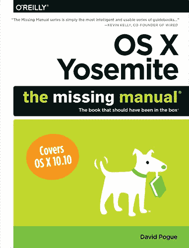

***[OS X 约塞米蒂:失踪手册](http://www.amazon.com/exec/obidos/ASIN/1491947160/makithecompsi-20)***

当我决定全力以赴时，我拿起了这本书。

我想了解 OS X 的来龙去脉，就像我了解 Windows 一样。

虽然这本书很长，而且非常详细，但它不是很有趣，也没有像我希望的那样深入。

这本书实际上更像是一本参考书，所以很难从中学习。

我想我更愿意读一本 OS X 的书，它会带你完成你可能想做的所有不同的任务，并向你展示让它们做得更好的所有小技巧。

无论如何，这是一本好书，但并不完全是一本改变人生的书。

***[【清单宣言】](http://www.amazon.com/exec/obidos/ASIN/0312430000/makithecompsi-20)**T5】*

现在，这里有一本有趣的书，它会让你相信清单是多么的重要和有价值。

我真的很喜欢作者讲述了一个有趣的故事，他展示了使用清单的真正价值。

我对一个简单的清单的影响力感到非常震惊——即使对于医生来说，这应该是一个非常简单和直接的程序。

这本书绝对让我成为清单的信徒，它也很有趣。我强烈推荐它。

***[平台:在喧嚣的世界里引人注目](http://www.amazon.com/exec/obidos/ASIN/159555503X/makithecompsi-20)***

又一本我希望几年前读过的书。

我发现这里的建议很棒，但主要是我已经在做的事情，以发展简单程序员品牌和这个网站。

尽管如此，这仍然是值得一读的，因为我确实学到了一些技巧，而且对你已经在做的事情进行强化总是好的。

如果你正考虑在博客或其他在线业务的基础上开始自己的在线业务，这本书肯定会很有价值，并且可以让你比你自己从多个来源发现所有这些东西要快得多。

唤醒巨人

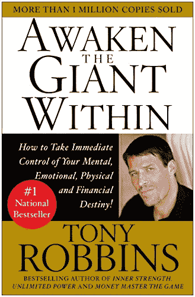

这是我第一次真正接触托尼·罗宾斯的个人发展理论。

这真的是一本好书。实际上，我妻子先读了这本书，作为回应，她让我去参加了托尼·罗宾斯的研讨会——这本身就是一次奇妙的经历。

这本书是关于理解是什么让你前进，弄清楚在生活中什么对你真正重要，然后实施一个切实可行的计划使之成为现实。

有如此多的练习和实用建议，你可能需要多读几遍才能获得最大收益。

这是另一本几乎适用于所有人的书，我强烈推荐阅读。它会彻底改变你的生活。我知道它改变了我的生活。

***[恐惧生命](http://www.amazon.com/exec/obidos/ASIN/1938485025/makithecompsi-20)**T5】*

这是一本相当长的书，由于作者强调世界上每个人都有恋母情结，我几次几乎放弃阅读，但我决定坚持到底。

我还是有点纠结。我对传统心理学有了不错的理解，但我不确定我是否同意这本书的大部分内容。

也就是说，阅读那些你不一定同意或让你感到稍微不舒服的书通常是好的读物，因为它们可以增长和拓展你的视角。

我确实倾向于同意情绪模式可以困在我们的生理中，这是我在阅读这本书之前不会考虑的事情。绝对是条奇怪的短信。

***[爱默生](http://www.amazon.com/exec/obidos/ASIN/0679783229/makithecompsi-20)**T5】*

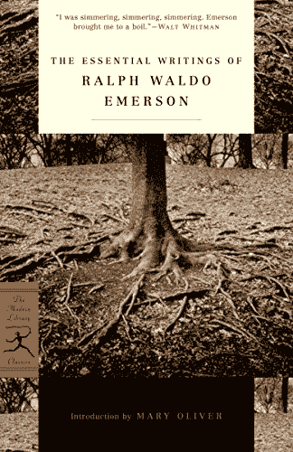

我还在读这本书，这可能是我遇到的最难读的一本书。

我会对你百分百诚实。我觉得我只理解了这本书的 50%——如果有那么多的话。

这是一个相当大的拉尔夫·瓦尔多·爱默生作品集，写于 19 世纪，所以语言很难。爱默生还构建了一些有点难以理解的非常复杂的句子。

我真的很喜欢我所理解的东西，随着我读得越来越多，越来越习惯这种语言，我对它的理解也越来越多。

我学到了很多关于超验主义的东西——这是一个非常有趣的想法，与那个时代的许多自助、自我发展的书籍有着巨大的联系，比如《思考和致富》。

绝对值得一读，但要做好奋斗的准备。

***[超人的社交能力](http://www.amazon.com/exec/obidos/ASIN/B015QA1250/makithecompsi-20)***

这本书是 Tynan 写的一本相当短的书，Tynan 是一个网络名人和博客作者，在我们如何思考和我们对生活的一般哲学方面，我倾向于和他有很多相似之处。

我觉得这本书相当不错，但可能不如他的书《习惯超人》好。

如果我没有做很多泰南推荐的事情，我会更喜欢这本书。

泰纳恩拥有庞大的社交网络，所以他的建议——尽管有时看起来像是常识——绝对值得注意。有很多关于如何与人交往和建立高质量友谊的建议。

******

******

***[终极斩:7 秘笈燃脂快得要命](http://www.amazon.com/exec/obidos/ASIN/B00HMQS8TA/makithecompsi-20)***

我的朋友布兰登·卡特写了这本书，所以我决定去看看。考虑到亚马逊上的低价，我对内容的价值感到惊讶。

这是一个相当短的阅读，但它有一些关于燃烧脂肪的真正可靠的建议，来自一个有证明记录的人。

我学到了一些技巧，我一定会把它们应用到我的节食和锻炼中。

布兰登也是一个很棒的人，也是一个热心的读者。我花了一些时间和他分享和比较我们手机上音频应用程序的书单。

***[最高成就](http://www.amazon.com/exec/obidos/ASIN/0684803313/makithecompsi-20)***

我实际上得到了布兰登·卡特的推荐，因为这是他最好的书之一。

像许多其他人一样，我希望我能早点读到这本书。作者 Brian Tracy 为《思考致富等书中的概念增加了一个实用的方面，详细解释了生活中真正成功的具体自然法则。

这本书基本上是一本成功指南。它包含了非常详细的指导，告诉你如何有效地设定目标，实现你在生活中想要的一切。

我是布莱恩·特雷西的《吃青蛙 的忠实粉丝，但这本更好。

***[如何赢得朋友和影响人](http://www.amazon.com/exec/obidos/ASIN/0671027034/makithecompsi-20)***

今年我又读了一遍，而且我可能每年都会继续读一遍，因为它就是那么好，我总能从中获得新的东西。

这本书改变了你的生活，尤其是你思考与人交往的方式，这可能会给你的生活和职业带来许多机会。

我强烈推荐每个人多看一遍这本书。

***[成长黑客营销](http://www.amazon.com/exec/obidos/ASIN/1591847389/makithecompsi-20)***

我最喜欢的作家之一瑞安·哈乐黛的另一本优秀作品。

我在电话里和 Ryan 谈了我自己的书《软技能》的营销，我不得不说 Ryan 真的知道他的东西。

这本书里的一些概念我已经应用到了帮助我发展业务中，我发现 Ryan 独特的视角是非常有价值的。

很多关于出书、创业甚至博客的好建议。绝对值得一读。

***[金钱:游戏高手](http://www.amazon.com/exec/obidos/ASIN/1476757801/makithecompsi-20)***

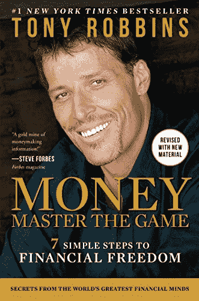

由于这本书的大肆宣传，我有点怀疑。关于金融和投资，托尼·罗宾斯能教给我哪些我在别处学不到的东西，这本书怎么可能对新手和专家都有价值？

原来托尼采访了一些业内最有知识的人，然后将他们的知识浓缩成一种非常容易理解和可操作的格式——尽管相当长。

这是一本每个人都应该阅读的书，这样他们就有了金融行业的基本知识，并可以了解金融投资和市场真正是如何运作的。

如果你依赖于投资于共同基金的公司提供的 401k，这本书会给你一记耳光。

我没有从这本书里得到太多，仅仅是因为我投资的是房地产，而不是股票市场或其他资产类别，但当我将来多元化一点，重新进入股票和债券市场时，我很可能会重读其中的一些部分。

很多人抱怨这本书，但是它有一些非常有价值的建议。

我个人从这本书里得到的一个想法涉及到实际思考你到底需要多少钱来实现你的人生目标。

***[牵引:获取客户的创业指南](http://www.amazon.com/exec/obidos/ASIN/B010CLCJBE/makithecompsi-20)***

今年我读了两本名为《牵引力》的书，这本书给了我很多很好的建议，我觉得它更有价值。

当我明年开始扩展《简单程序员》时，我肯定会重读这本书的部分内容。

这位作者涵盖了你可以用来为你的企业赢得更多客户并不断增长的每一种技术。

这基本上是一个完整的网络营销技术的剧本。

我强烈推荐这本书给任何有任何生意的人。

老实说，我对这本书不太记得了。

我记得我喜欢它，它有一些非常好的故事，关于你如何通过跳出框框和大胆思考来跳过梯子上的横档。

由于采用了故事驱动的方法，这篇文章读起来非常有趣。

我需要在明年下定决心，开始对书籍做更详细的笔记，这样我就能更好地记住我从书中学到的东西。

这本书是我非常喜欢的魔法 2.0 系列的第三部分。

读这本书的时候我很兴奋，它没有让我失望。我真的想要更多这一系列的书，因为我发现这个概念非常有趣，而且故事写得非常好。

人物是三维的，情节很有趣，让你着迷。

我唯一不喜欢的是，它开始以一种政治正确的方式变得有点说教。

但是作者可以引入一些政治上正确和过度进步的对话，而我仍然给它五颗星，这一事实证明了故事和人物的质量。

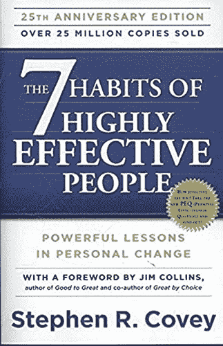

***[高效能人士的 7 个习惯](http://www.amazon.com/exec/obidos/ASIN/1451639619/makithecompsi-20)***

我决定重读这本书，因为我已经好几年没读它了，我很高兴我这么做了。

这一次，我从这本书里获得了比以前更多的东西——也许是因为我终于开始在生活中应用一些概念了。

我会把这本书加入任何想在生活中获得成功的人的必读书目中。

关于如何变得富有成效，如何与人相处，如何优先考虑你的生活，有很多很好的建议。

如果你从未读过这本书，读一读吧。如果你很久以前就已经读过了，可以考虑再读一遍。

这本书让我对减少生活中的复杂性和缩小我的关注点充满热情。

我没有完全达到我最初渴望的本质主义的水平，但这本书无疑刺激了我生活中的一些变化，大大提高了它的质量。

事实上，如果我没有读过这本书，《简单程序员》今天可能就不存在了，因为它让我意识到我做得太多了，我需要开始放弃一些事情，让其他人做一些我不再需要做的工作。

一本极具影响力的书，所有优等生都应该阅读。

***[E 神话重温](http://www.amazon.com/exec/obidos/ASIN/0887307280/makithecompsi-20)***

这是另一本书，它可能在拯救今年被废弃的简单程序员方面发挥了作用，因为它教会了我拥有系统的价值，以便让其他人帮助我从我的大部分业务中解脱出来。

这是任何正在经营企业或考虑经营企业的人必读的商业书籍。

作者迈克尔·格伯(Michael Gerber)采用故事驱动的教学方法，并讲述了一些引人入胜的故事，让你保持兴趣，深入浅出。

我学到了很多关于系统在任何业务中的重要性，以及如何建立好的系统，使几乎任何公司的大部分自动化。

这本书基本上允许我在欧洲旅行三个半月，同时仍然运行简单的程序员，只是在星期五工作。

***[一件事](http://www.amazon.com/exec/obidos/ASIN/1885167776/makithecompsi-20)***

这本书让我想起了很多本质主义，但让我印象深刻的是，思考你可以专注的一件事，以便让大多数其他事情变得更容易或不必要。

在你的日常生活中，同样的概念可以被应用来大大简化待办事项的概念，把它缩减成你每天需要完成的一件事。

这是一个非常强大的概念，我已经开始用它来简化我的计划和减轻压力。

***[影响力](http://www.amazon.com/exec/obidos/ASIN/006124189X/makithecompsi-20)**T5】*

几个人推荐了这本书，我一直听说它是营销方面的经典，所以我决定最终读一读。我很高兴我做到了。

任何从事销售的人都应该阅读这本书。它包含了一些非常有效的技巧，你会发现你很可能已经作为一个不知情的消费者屈服过很多次了。

这本书在一个非常深的层次上审视了我们作为人类是如何被影响的——尤其是在销售和销售技巧方面。

它还包含一些实用的技巧和建议，你可以用它们来抵御推销技巧，或者在推销自己的时候发挥优势。

***[我学到了什么输了一百万](http://www.amazon.com/exec/obidos/ASIN/0231164688/makithecompsi-20)***

这本书是一个有趣的故事，包含了一个很好的教训，告诉我们最初的成功是如何让一个人认为他们知道的比他们实际做的多得多。

我不确定我 100%相信这个故事，但它有一个非常重要的教训，我永远不会忘记。

绝对值得一读。

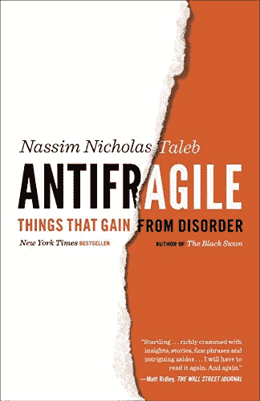

这是我读的第一本书，是纳西姆·尼古拉斯·塔勒布写的，非常好，所以我立即购买了他所有的其他书籍。

抗脆弱真的让我思考了什么是强大，以及我如何设计方法使我的生活不仅抵制变化，而且实际上从中受益。

这本书可以被称为关于如何拥抱混乱并从中受益的科学方法，但是《T2》反脆弱篇很好地总结了这一点。

纳西姆在这本书里注入了他全部的个性，并真正让你从准科学/哲学的角度思考和质疑你的一些假设。我觉得这本书既有趣又发人深省。

***[牵引:掌控自己的事业](http://www.amazon.com/exec/obidos/ASIN/1936661837/makithecompsi-20)***

我真的不喜欢这本书。

这可能是因为我的业务没有达到可以从这里列出的许多概念或想法中受益的水平，但就我个人而言，我也觉得这有点“说教”，并觉得这种语气对我来说有点太不近人情了。

我确信这个建议是可靠的，但它就是不能吸引我，作为一个小型互联网企业主，我真的不觉得它有什么价值。

***[跃居第一](http://www.amazon.com/exec/obidos/ASIN/B00S5KH78K/makithecompsi-20)**T5】*

我觉得这可能是一本说服你冒险辞职的好书，但我并没有从中获得太多价值。

如果我在十年前读过这本书，我可能会觉得它更深刻，但在我人生的这个阶段，它大多是多余的，没有给我提供任何新的见解。

***[想致富](http://www.amazon.com/exec/obidos/ASIN/193764135X/makithecompsi-20)**T5】*

我决定重读这本书，因为很多人建议我应该重读，而且我想听音频版本。

这是那种你可能会在任何一个非常成功的人的书架上找到的书。

令人惊讶的是，有这么多的千万富翁不仅推荐了这本书，还把他们的成功很大一部分归功于这本书。

这一次我确实从这本书里获得了更多，并计划有一天再读一遍。

***[巴比伦首富](http://www.amazon.com/exec/obidos/ASIN/0451205367/makithecompsi-20)**T5】*

哇哦。如果你还没有读过这本小册子，现在就去买一本来读吧。

真的，每个人都应该阅读这本简单而深刻的关于个人理财的书。

这本书由几个故事组成，阐述了一个完整的财务策略，它几乎可以保证让你在一生中变得富有。

这是每一个高中生在开始他们的成年生活之前应该必读的一本书。

如果每个人都阅读并遵循这里的建议，信用卡债务和破产将被消除。

我最喜欢这本书的一点是书中的概念是多么简单和永恒。

***[男人寻找意义](http://www.amazon.com/exec/obidos/ASIN/080701429X/makithecompsi-20)***

这本书真的会给你一记耳光，给你一些视角。

这是一个纳粹集中营幸存者的故事，讲述了他如何应对人类可能经历的最糟糕的事情之一，但仍然保持着对生活的控制和目标。

这个故事真的让我重新思考我是如何决定解释我自己生活中的事件的，并帮助我认识到受害者心态是多么的无意义和无效。

如果维克多·弗兰克尔能在极度痛苦中找到快乐和意义，我们当然也能在舒适的生活中找到。

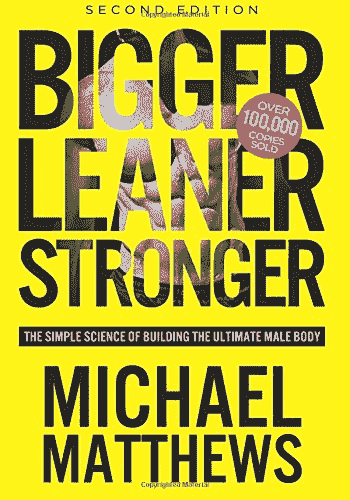

***[更大更瘦更强](http://www.amazon.com/exec/obidos/ASIN/1938895274/makithecompsi-20)***

作为一个几乎所有饮食和肌肉锻炼项目的学生，我发现这本书有点多余，但我仍然认为这是一个关于如何锻炼肌肉和减少脂肪的有价值的总结，没有废话。

我觉得这本书做了一件伟大的工作，把所有重要的，关于肌肉建设和减肥的最新信息放在一起，可以节省一些人多年的奋斗。

*更大更瘦更强*也很好地解释了健身行业的科学术语和基本词汇，并为书中推荐的一切提供了良好的证据。

我怎么没早点读到这封信呢？

我连续听了三遍这本书的音频版本，因为它很短却很有力量。

我想我不知道有哪本书如此简明扼要地总结了生活中所有最重要、最有价值的课程。

如果你想改变你的生活，拓展你的视野，这本书是一个很好的起点。

我在这本书里发现了这么多深刻的陈述，我很可能会买 Kindle 版本，只是为了突出几个段落，定期复习。

我终于开始阅读这本虚构的关于塞莫皮莱城门之战的书。

多好的故事。我不能放下这本书。史蒂文·普莱斯菲尔德是我最喜欢的作家之一，因为他的书《艺术的战争》《T2》《T3》，但现在我明白了他才华的真正深度。

这本书将向你展示作为一名以崇高荣誉为准则的战士是什么样的。它会让你知道作为一个男人和去打仗意味着什么。它会让你权衡一个人生命的代价，并真正感受到任何一个在生死之战中的战斗人员必须面对的思想和情感。

忘记电影 *300* 。这本书好 1000 倍。

***[大卫和歌利亚](http://www.amazon.com/exec/obidos/ASIN/0316204374/makithecompsi-20)**T5】*

好的，这本书从一个非常有趣的角度展示了在特定情况下处于劣势可能带来的好处，以及你如何利用这一地位作为战略优势，但是……我认为这有点过了。

不要误解我。这是一本很棒的书，它拓展了你的观点，让你认识到更大更强并不总是更好，我只是不 100%相信处于劣势实际上是一种优势，就像这本书可能让你相信的那样。

值得一读，但保留判断。

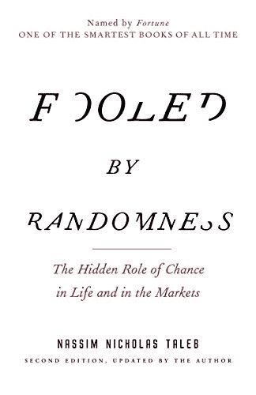

***[被随机性愚弄](http://www.amazon.com/exec/obidos/ASIN/0812975219/makithecompsi-20)*** 和 ***[黑天鹅](http://www.amazon.com/exec/obidos/ASIN/081297381X/makithecompsi-20)***

我把这两本书都包括在内，因为我读它们的时间非常接近，它们涉及的主题非常相似，老实说，我不记得哪本书谈了什么。

我记得的是，这两本书都很棒，就像塔勒布的《反脆弱》一样。

塔勒布确实击中了要害，我们没有很好地掌握统计学，即使是专业人士也大多无法直观地理解事件的真正随机性。

如果你认为你可以战胜股市，你绝对应该把这两本书都读完，再好好想想。

我特别喜欢这种哲学方法，它指出了一个事实，那就是我们能够真正了解的东西很少。

塔勒布是我最喜欢的作家之一，他有趣的书会拓展你的思维，让你重新思考你一生中普遍接受或假设的一些东西。

***[精神强大的人做的 13 件事](http://www.amazon.com/exec/obidos/ASIN/0062358294/makithecompsi-20)***

不错的书。很多很棒的建议。我只是发现这有点基础，因为我觉得我已经生活在这里提到的大部分事情中了。

尽管如此，如果你觉得你需要更加坚强，能够承受生活中的起起落落——好吧，主要是跌宕——这是一篇实用、务实的文章，可以帮助你获得更多的精神韧性，并理解它为什么如此重要。

虽然我几乎 100%同意这本书的内容，其中有一些优秀的智慧可以帮助很多人，但我发现自己在听这本书的音频版本时感到尴尬。

虽然我对布兰登·伯查德非常尊敬，但我觉得他在这本书里做得太过了。

他言过其实，确实使用了华丽的语言，而不是以更简单的方式陈述书中的智慧。

有时它是鼓舞人心的，但大多数时候它只是做得过头了。

对于这本书，我说不尽的好。非常有趣的故事，幽默，还有很棒的角色。

这真的是一本好书；我爱不释手。

从我开始阅读的第一刻起，我就被吸引住了，即使是在听到所有关于它的大肆宣传之后。

如果你看过这部电影并喜欢它，你就会爱上这本书。

如果你还没有看过这部电影，帮你自己一个大忙，一定要先读这本书。

我最喜欢的小说之一。

不太确定我对这本书的感觉。

它基本上是这样写的，上帝告诉你，你只是上帝身体中的一个细胞，你的存在只是一个你拒绝放下的幻觉，但是“嘿，一切都会好起来的，别担心。”

一方面，这听起来很棒；另一方面，这也太可怕了。

我不确定我是否 100%认同整个先验观点，但这本书绝对让我强烈地认为这是我从未有过的。

如果你勇敢，就读这本书；否则，跳过。

******

***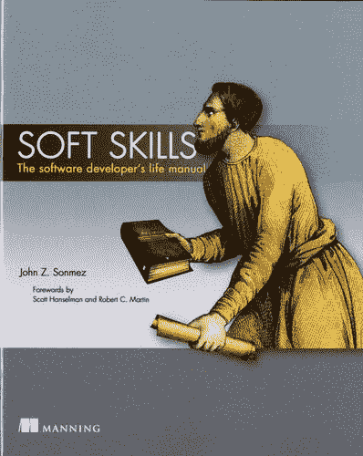***

***[软技能:软件开发人员生活手册](https://simpleprogrammer.com/softskills)***

是的，这是我的书，严格来说，我今年读了两遍。

有一次，因为我必须录制这本书的音频版本，我在一周内完成了，你可以在这里得到它。

还有第二次，因为我必须在这本书出版后听它的音频版本，以确保它听起来不错，没有任何重大错误。

听起来很奇怪，我实际上做了一些笔记，因为我忘记了我在书中写的一些事情，需要将它们重新应用到我今天的生活中。

我就不给你评我自己的书了，但是我明显喜欢，推荐。

***[店铺类](http://www.amazon.com/exec/obidos/ASIN/0143117467/makithecompsi-20)***

这本书比我想象的要好得多。

我读这本书是因为有几个人推荐了它，我认为如果书中的任何想法能给我自己的工作增添一些乐趣，这可能值得一看。

我不完全同意这本书，但它很有意义，是一本有趣的读物。它没有说服我支持作者的观点，但它确实改变了我的观点。

我可以肯定地看到，熟练的体力劳动是多么令人满意和有益的工作，我们今天做的工作有多少缺乏这些品质。

我真的不喜欢这本书。我在寻找更实际的建议，我觉得《魅力神话》又是一本使用了你今天在许多商业书籍中发现的同样古老、被过度使用的心理学研究的书。

当然也有一些有用的建议，但是我觉得这本书的价值可以用 50 页来描述。

我可能有点厌倦了，因为这本书的大部分内容对我来说并不新鲜，我正在寻找一些全新的、实用的建议，我今天就可以开始应用，所以你的收获可能会有所不同。

***[心态:新成功心理学](http://www.amazon.com/exec/obidos/ASIN/0345472322/makithecompsi-20)***

首先，我想说，我能理解为什么这么多人推荐这本书，我确实认为书中的建议和观点——在很大程度上——非常好，可以帮助很多人在生活中获得成功。

尽管如此，我自己并不真的喜欢这本书。

我倾向于已经有了作者鼓励的那种心态。我从来没有觉得有什么事情是我不能完成的。我倾向于将障碍和挫折视为挑战。

但是如果我没有或者我很悲观，我肯定会从这本书里得到价值。

它还包含了许多我已经非常熟悉的心理学研究。

值得一读，除非你已经有这种心态。

******

***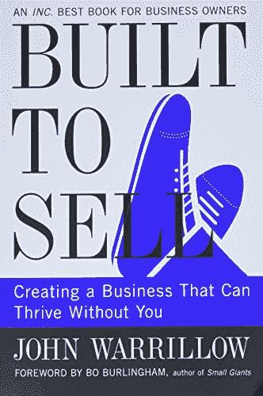***

***[建成出售](http://www.amazon.com/exec/obidos/ASIN/1591845823/makithecompsi-20)***

另一本伟大的书，几乎所有创业或经营企业的人都应该阅读。

这本书让我想起了*重温的电子神话*，并对我关于商业的想法产生了类似的影响。

*build to sale*让你对一个虚构的故事保持兴趣，这个故事讲述了一个企业主经营着一家广告公司，他只是想摆脱它，但发现他不能，因为它卖不出去。

他的一位聪明的亿万富翁朋友指导他完成专业化的痛苦过程，并从企业的关键业务中抽身而出。

我肯定从这本书中学到了很多，强烈推荐。

***[音高什么的](http://www.amazon.com/exec/obidos/ASIN/0071752854/makithecompsi-20)***

我很想说这本书其实不是关于投球的，因为它有更多的内容。

*Pitch everything*是一本处理任何人际交往的指南，在这种交往中，你试图推销想法、赢得信任或影响某人——尤其是当他们比你更有权势的时候。

这本书里有一些很棒的心理学和战术，是我在别的地方没见过的。

因此，这绝对是一本我会推荐给任何试图推销任何想法的人的书，无论是关于资金、最佳实践，甚至是去哪里吃饭。

***[斗不过魔鬼](http://www.amazon.com/exec/obidos/ASIN/1454900679/makithecompsi-20)**T5】*

这是一本非常奇怪的书。这句话出自《思考致富》的作者拿破仑·希尔。

它直到最近才发行，尽管它是在 20 世纪早期写的。原因是因为拿破仑的妻子不想在它被释放时活着，他的继承人也对它的释放有问题。

书中没有什么超级有争议的地方，但他确实攻击了有组织的宗教和教育。

我发现这本书包含了大量的智慧。并不是说我什么都同意，但与魔鬼的对话相当发人深省，其中有一些伟大的珍珠。

不过，一定要拿到这本书的音频版，因为《魔鬼的声音》太完美了。

我知道不是每个人都会喜欢这本书，但我觉得它以一种非常容易理解的形式包含了大量的智慧。

***[意志力](http://www.amazon.com/exec/obidos/ASIN/0143122231/makithecompsi-20)**T5】*

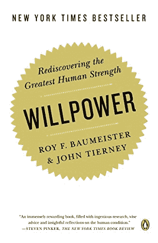

一个非常科学的关于意志力的话题。大量心理学研究作为证据。这些东西中的大部分我以前都以这样或那样的形式听说过，但是这本书把它们都集中在一个地方。

尽管如此，我真的不喜欢它。我不认为意志力可以归结为一系列外部条件，比如你的血液中有多少葡萄糖，或者你是否刚刚做了一些令人烦恼的数学题。

我也不欣赏对自我发展书籍的攻击。尽管我认为自己是一个高度怀疑和分析的人，但我在生活中学到和应用的一些最有价值的东西却离我很远，无法解释。

尽管如此，我不得不说《意志力》值得一读，你应该知道所有表明什么可能极大地影响你的意志力的研究。

***[泰坦:老约翰·洛克菲勒的一生](http://www.amazon.com/exec/obidos/ASIN/1400077303/makithecompsi-20)**T5】*

我不太读传记，但我决定读这本，因为它经常被推荐，我真的很喜欢实业家。

这是一篇关于历史上最富有的人之一——也是最慈善的人——的生活的精彩报道。

从约翰·D 的生活中可以学到很多东西，无论是在生意上还是在个人生活中。这本书也为围绕垄断和资本主义的政治提供了极好的教训。

我发现这本书在很多方面对我都有教育意义，并且填补了我在历史和经济知识方面的一些空白。

这也非常有趣。肯定推荐。

哇哦。我希望在我阅读其他 50 本书之前，我已经找到并阅读了这本书，这本书借鉴了其他 50 本书的内容并对其进行了很好的总结。

这里有一大堆有价值的建议，是作者从阅读这份清单上的许多书和其他书中得到的。

这本书是一种快速获取大量有用的商业和生活知识的浓缩方式。

即使你已经阅读了这里提到的大部分书籍，你可能仍然会发现这本书是一篇优秀的评论——我知道我是这样认为的。

我向初学者和高级读者强烈推荐这本书。这本书对任何人都有价值。

***[周二与相约](http://www.amazon.com/exec/obidos/ASIN/076790592X/makithecompsi-20)**T5】*

很多人推荐这本书，我喜欢它，但我不认为它很棒。

不要误解我。很好，只是不太好。

听莫里最后几天的故事很有趣，他是如何带着尊严和爱死去的，而不是沉湎于自怜。我只是觉得它不像有些人那样深刻和感人。

有一些很好的生活教训，但没有什么真正让我有“啊哈”的时刻。

不过，这只是我的看法。不是这个人或作者的反映。

***[无情:从优秀到伟大到不可阻挡](http://www.amazon.com/exec/obidos/ASIN/1476714207/makithecompsi-20)***

仍然在读这篇文章，但是我应该在这篇文章发表的时候读完。

到目前为止，一切顺利。非常像一本踢你屁股的书，让你问自己为什么你是这样一个娘娘腔。

******

******

***[小钱糖果到底怎么了？](http://www.amazon.com/exec/obidos/ASIN/0942617622/makithecompsi-20)***

非常好，简短，简洁，易懂的基础经济学书籍，特别是关于货币体系和通货膨胀。

我知道了为什么像 25 美分硬币这样的硬币边缘有凹槽，我对究竟是什么导致了通货膨胀有了更好的理解。

我肯定会向任何人推荐这本书，因为这方面的知识对任何一种金融繁荣都至关重要。

有一点政治倾向——好吧，也许不止如此——但作者坦率地承认了这一点。值得一读。

## 到明年

哇，没想到这个帖子这么长。

我想我明年可能会读差不多数量的书，所以我需要一个更好的策略。

我忘了很多我读过的书，所以有些书很难在这里总结，这也是一大堆工作。

我明年的计划是在完成一本书后立即做更好的笔记和简短的评论，而不是在年底全部写完。

不能保证，但这是我目前的计划。

祝你阅读愉快，如果你喜欢这种文章，让我知道什么会让它对你更有价值。