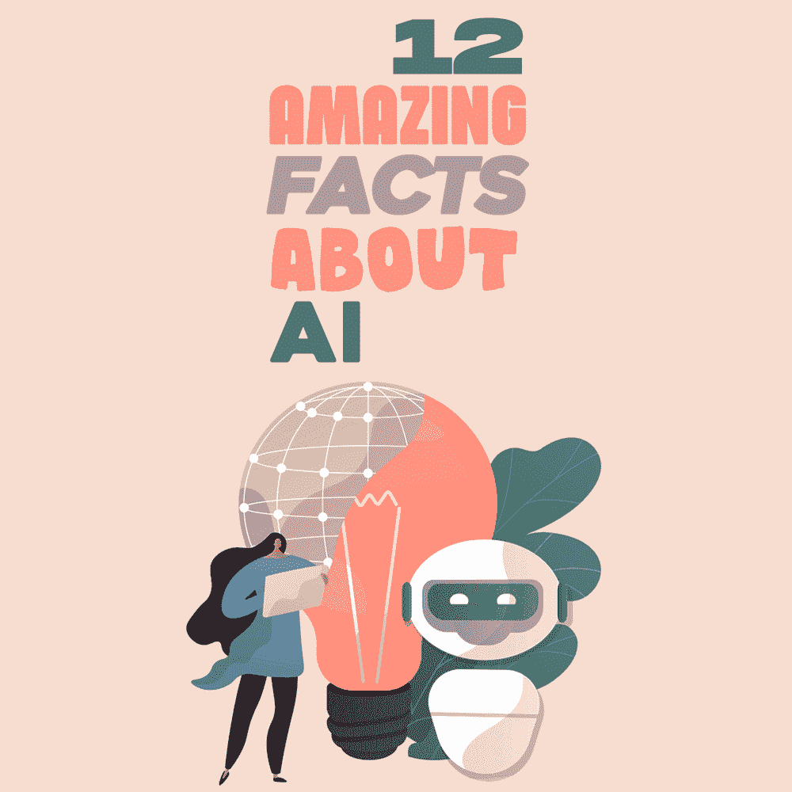
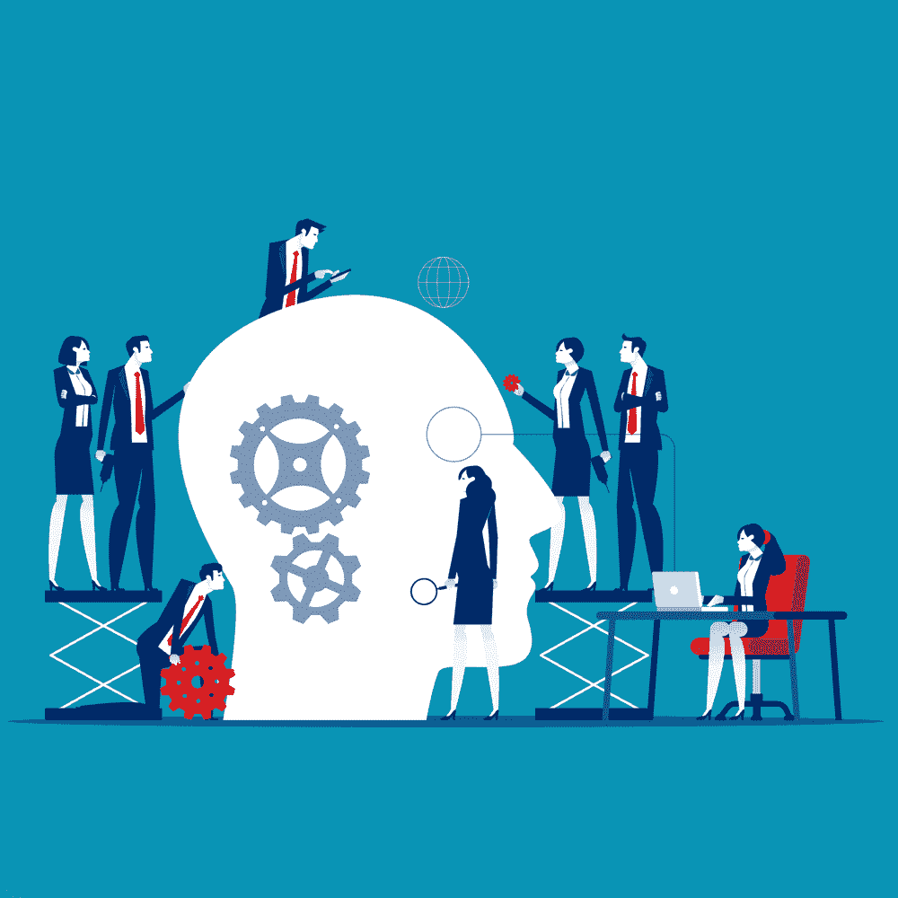

# 关于人工智能的 12 个惊人事实

> 原文：<https://simpleprogrammer.com/amazing-facts-about-ai/>

Artificial Intelligence (AI) is a branch of computer science that helps build smart machines. AI provides data that makes these machines capable enough to match human intelligence. As a result, many industries have taken advantage of AI technologies.

机器学习和深度学习是人工智能的两个子集。机器学习指的是计算机能够在更少的人工干预下思考和行动，而深度学习则涉及计算机能够使用模仿人脑的结构。

人工智能无处不在——使用 Siri 或 Alexa 等数字个人助理，用 Face ID 打开你的手机——从获取驾驶方向到获得电影或音乐的推荐，以及这之间的一切。

特别是对程序员来说，人工智能提供了新的工具来帮助他们编写代码或确定错误。在这篇文章中，我将与你分享每个程序员都必须知道的关于 AI 的十二个惊人事实。通过这种方式，你可以保持对人工智能即将提供的迷人机会的了解和更新。

## 程序员应该知道的 12 个人工智能事实

人工智能正进入一个无所不在的阶段。人工智能不再是复制或模拟人类智能的外来努力，而是我们在日常生活中为了方便和效率而使用的工具。事实上，人工智能的进步将继续给科技行业带来一场[革命。](https://simpleprogrammer.com/ai-and-ml-revolutionizing-developers/)

考虑到这一点，让我们看看你应该知道的关于人工智能的 12 个事实，以确保你不会错过这些惊人的发展。

### 人工智能正在进化

AI 从一开始就一直在统治，并且一直在慢慢扩散到各个发展领域。今天，谷歌拥有的人工智能 DeepMind 已经可以击败星际争霸 2 玩家。

另一个例子是，中国阿尔法狗是一只机器狗，它不仅充当宠物，还充当送货代理。这显示了人工智能给开发者带来的多重机会。

### 人工智能也能构成威胁

人工智能作为一个模拟器，也会造成威胁。像微软和谷歌这样的公司已经发出警告，糟糕的人工智能决策可能会损害潜在的业务，因为人工智能可以被编程来做一些毁灭性的事情。

此外，自主武器是人工智能系统，被编程为可以造成巨大伤亡的杀戮。

总的来说，这些例子显示了如何为一个人工智能编程——至少在这样的规模上——需要程序员的仔细考虑。

### 增加人工智能教育

人工智能的决策可以使生产率提高 40%，让程序员更有效地利用时间，更好地平衡工作和生活。这也能带来更多学习和拓展知识的机会。这意味着人工智能可能会让你有更多的可用时间来学习一些新的东西，这对你作为开发人员的职业生涯有帮助。

此外，学生们选择人工智能作为教育和职业转变。今天，世界顶级大学已经增加了他们的人工智能相关教育，以教育[开发人员](https://www.sifars.com/services/hire-ionic-developer)人工智能事宜。

### 人工智能机器人被设计成听起来像女性

一项独立调查显示，大多数人更喜欢和有女声的人工智能机器人交谈。像 Alexa 或 Siri 这样的各种语音助手都有女声，因为人们觉得这比男声更好听。

作为一名程序员，无论何时设计这样的系统，你都应该记住这一点——尽管当然总会有例外。

### 人工智能识别情感

人工智能正在成为我们生活中不可或缺的一部分。我们的行为、处境和关系都将与未来的人工智能相对应。作为一个社会，我们如此难以置信地受到技术的影响，以至于我们更喜欢与机器交谈，并将大部分时间花在机器上，如电话、电脑等。

人工智能和神经科学研究人员一致认为，程序员开发人工智能是为了让它表现出同理心。此外，机器已经开始识别人类的情感。在 20 世纪 90 年代，一个名叫 Kismet 的机器人仅仅通过听声音的语气来识别人体的情绪，然后与人类进行相应的互动。

### 人工智能将变得比人类更聪明

人工智能是人类作为一场技术革命发展起来的。随着[机器使用它们的人工智能](https://simpleprogrammer.com/ai-ml-transformation-technology-landscape/)并提供解决方案，事情在很大程度上发生了变化。随着我们在自动化世界的进步，人工智能将比人类更聪明，因为它将能够在没有人类干预的情况下做出决定。

### 人工智能将影响人类就业

AI 提供不间断的工作流程，无需休假、休息或期待奖金。对人工智能的投资可以为你带来丰厚的回报，并大幅降低商业成本。

另一方面，数百万人因 AI 而失业。随着人工智能被证明比人类更有效率，它可能会对程序员的就业构成威胁——也许具有讽刺意味的是，考虑到程序员自己也在不断寻找用人工智能更容易完成工作的方法。

### 人工智能正在被所有人使用

今天几乎所有的组织，无论大小，都在利用人工智能。企业正在寻找客户关系管理、承保、欺诈检测和社交媒体监控领域的人工智能程序员。

Covid 19 疫情进一步让 [Python 开发公司](https://www.sifars.com/services/python-development-company)计划在人工智能上投入更多。疫情一宣布，世卫组织就暗示人工智能(AI)可以成为管理病毒引起的危机的重要技术。

### 人工智能开发者为投资机会铺平道路

把 FDs、加密货币、比特币抛在脑后。投资 AI，得到的回报比什么都好。

[市场研究](https://www.natureindex.com/supplements/nature-index-2020-ai/tables/countries)表明，作为对 Covid 19 的回应，人工智能投资增加了近 10%。多达 80%的企业认为投资人工智能将比其他任何投资机会都更有竞争优势。根据[人工智能指数](https://aipo-api.buddyweb.fr/app/uploads/2021/03/2021-AI-Index-Report.pdf)，风险投资公司对美国人工智能系统初创公司的年度投资增加了八倍之多。

### 科技巨头之间的人工智能竞争

Tech giants are sourcing AI and using it as a base foundation to compete. Some of the most innovative AI companies in the world, like Alphabet’s Google and Nvidia.Microsoft, along with other collaborators, will host a [workshop on video analytics and intelligent edges](https://www.microsoft.com/en-us/research/event/the-3rd-workshop-on-hot-topics-in-video-analytics-and-intelligent-edges/) in March 2022.

根据 Bespoken 的一项研究，谷歌的人工智能已经远远超过了 Alexa 和 Siri。程序员可以充分利用这样的研讨会，了解有关人工智能的最新趋势，并获得竞争优势。

### 在人工智能领域领先的国家

新加坡已经成为人工智能的全球领跑者，因为它已经在各种已经证明卓有成效的行动中战略性地利用了人工智能。 

处于领先地位的是加拿大、新西兰、澳大利亚和中国。印度在亚太地区排名第三，总体自然指数排名第二十。因此，在人工智能领域投资你的职业肯定能让你在全球任何地方都赚得盆满钵满。

### 人工智能的未定义伦理

人工智能领域的伦理仍然没有定义。没有明确的协议、基准或界限。考虑到安全和隐私级别，这可能是危险的。

作为一个概念，人工智能伦理指的是旨在让程序员明智地开发和负责任地使用人工智能[技术的道德原则和技术。随着人工智能成为产品和服务不可或缺的一部分，组织开始更多地考虑人工智能道德规范。](https://www.sifars.com/services/react-js-developer)

## 人工智能是未来

人工智能为我们提供了一些改变生活的应用。从教育机会到就业变化，从投资机会到尚未定义的人工智能伦理，有一点是肯定的:人工智能是革命性的。

这也影响到你，作为一个程序员。[人工智能作为一项不断发展的技术](https://www.amazon.com/dp/0070087709/makithecompsi-20)，意味着人工智能职业将在几十年内受到需求，因此是一个极好的职业选择。