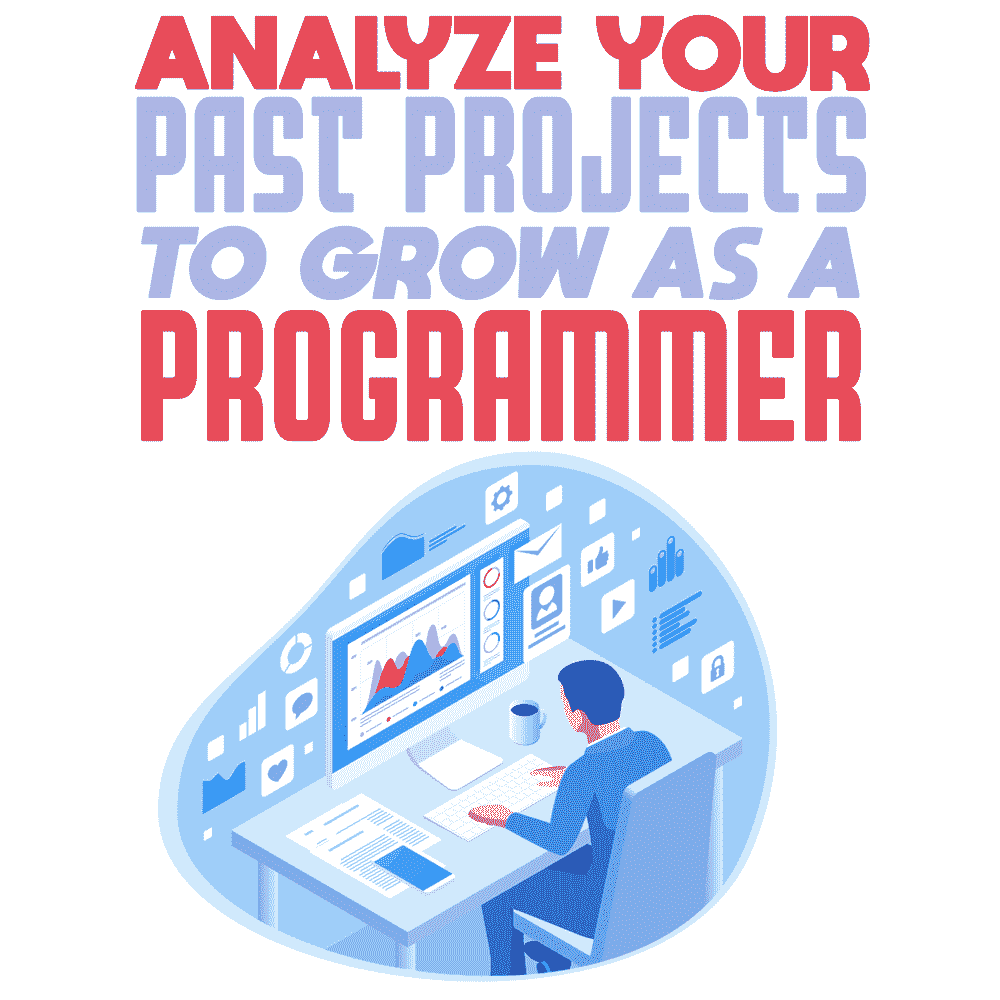

# 分析你过去的项目，成长为一名程序员

> 原文：<https://simpleprogrammer.com/analyze-programming-projects/>

If you have been working as a programmer for a few years, chances are you have a collection of projects under your belt. They may be personal projects you completed on the way to becoming a developer in the first place—part of the learning curve. As you know, the best way to become experienced is to create functional programs through code, starting small and working your way up to more complex problems

但是当你完成项目后，你会怎么做呢？你会把它们放在脑后的架子上，然后塞进旧电脑的硬盘里留作纪念吗？然后你会擦干净你的手，然后继续下一个吗？

以我在一家 Java 开发公司工作的经验来看，不断提高产品质量的方法是对你以前的工作进行彻底的分析。通过从过去的项目中提取每一盎司有用的信息，你从你的[错误](https://simpleprogrammer.com/first-year-programmer-mistakes/)中学习，并从一个不同的、更有用的角度着手未来的项目。

## 重访未完成的老项目

为成为一名成功的程序员打下知识基础需要大量的工作和经验。我们经常谈论年复一年的项目。有些已经完成，但有些可能因为你当时没有完成它们的经验而被落下。

那些比你以前需要更多知识的人呢？提升你的经验和能力的最大好处是，你可以回去完善你之前的想法。也许你可以建立在你已经创造的基础上，或者你可以废弃它，重新开始，把它带到一个不同的方向。

你可能会让自己大吃一惊，从而开发出一个有价值的产品。你以前的新手思维不受什么可以做什么不可以做的理解的阻碍，你新的高级编程知识可能是一个强大的组合。

## 项目文件组织

正如我提到的，如果你已经作为一名开发人员工作了一段时间，你可能已经参与了相当多的项目。当然，这包括所有的任务，从你作为学习编码的一部分所做的任务，到更大的激情项目以及其他你被雇佣去执行的任务。

那么，你认为在你积累了 10 或 15 个项目之后，你能记住多少呢？我的建议是保持你的项目文件有条理和可访问性。找新工作时，你可能会被要求展示其中的一些。或者你可能想重访几年前的一个项目。有一个合理的组织系统可以让你更容易快速找到你需要的东西。

## 创建已完成项目的摘要

拥有一个好的组织系统也意味着包括描述你对项目所采取的方法的文档，以及预期的目的和你执行它所采取的步骤。除了教你在任何职业生涯中都需要的正确的文档习惯之外，所有这些信息都会派上用场。

这不应该仅仅作为一个计划工具或你工作的持续视角来执行。同样重要的是，一旦你完成了工作，看一看你的工作，这样你就可以总结结果。包括产品结果如何不同于你最初的预期，以及你为什么选择朝那个方向发展的注释。你用来制作这个项目的工具是什么，它完成后是什么样的？

包括你认为对项目至关重要的任何东西。保持简洁，但包括相关的、具体的、可能有帮助的信息。这份文件的目的是在你决定几年后再看这个项目时，快速提醒你这个项目。

## 分析以前的工作，隔离错误

对你的项目吹毛求疵是从中提取每一滴有用信息的最好方法之一。但是要有效地做到这一点，你需要*真正*专注于你的错误。

回头想想你本可以用不同的方式来执行它。检查当前解决方案的优点和缺点，以及其他解决方案的优点和缺点。隔离出你认为不太好的部分，并准确地集中在你认为不符合标准的地方。

通过找出可以做得更好的地方，你可以确保在你的下一个项目中，你会避免第一次遇到的同样的陷阱。

## 分享你的外卖

就像记录你的项目表现对帮助你成长为一名开发人员很重要一样，你也应该考虑分享你的[经验](http://www.amazon.com/exec/obidos/ASIN/0596809484/makithecompsi-20)。知识共享是成为软件开发社区一员的好方法。

Considering that programmers tend to create solutions to problems that have rarely been tackled before when you’re struggling with something, you should look for what other people may have thought to do. And likewise, you should share your own experience. You could help someone else or stumble upon a different method that you hadn’t thought of or known about.

即使您选择将代码保密，通过解释概念和您提出的解决方案，以及如何在事后思考如何使结果更好，对您重新访问项目会有很大帮助。

当然，分享你的作品也适用于个人项目，因为大多数开发者的合同都包含保密条款，一旦违反就会受到惩罚。只分享你自己做的项目的细节，而且只分享你觉得舒服的部分。

对你可能收到的反馈保持开放的态度。有些可能很棒。有些可能是负面的，这通常是最有帮助的反馈——没有人因为被告知他们做得有多好而提升了他们的技能。

## 跟踪和了解你的进展

成为一名活跃的程序员并创建许多项目是很棒的。成为一名优秀程序员的最好方法是通过大量的编码经验。

但是编码本身并不足以帮助你成为一名程序员。分析和分解项目是如何完成的，这就是你[如何从](https://simpleprogrammer.com/growing-programmer-struggle/)工作中的所有困难中学习的。

你需要放大你的错误。理解你为什么采取这种方法，为什么你认为这不是一个好方法，你如何调整它以在未来获得更好的结果，以及新的解决方案的好处是什么。

什么是你会以不同方式处理的项目？用什么方式？加入讨论并分享您的经验！