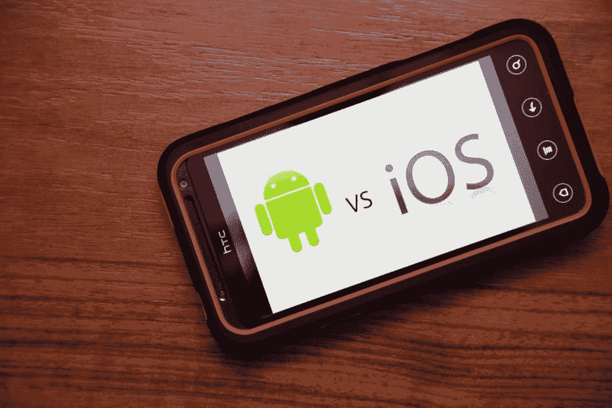
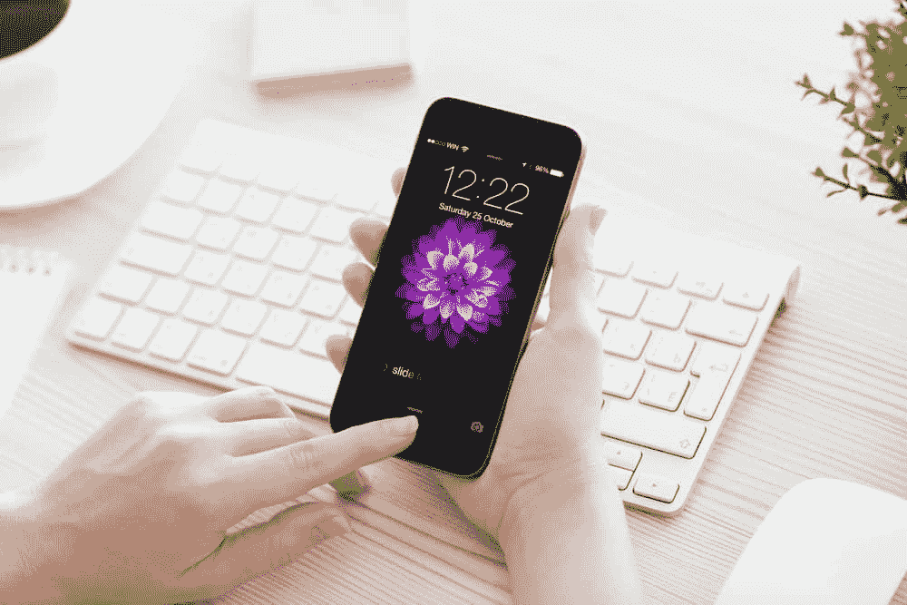
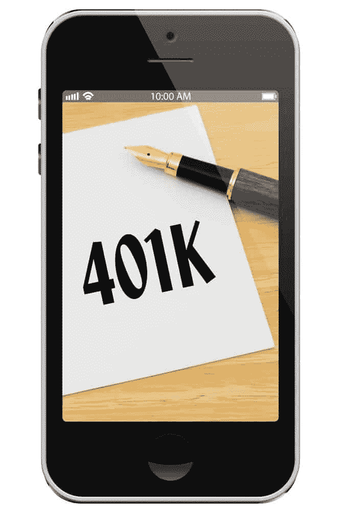

# 今日安卓 vs 苹果

> 原文：<https://simpleprogrammer.com/android-vs-apple-today/>

我们这个时代有过一些非常伟大的竞争:[苹果 vs 微软](https://en.wikipedia.org/wiki/Apple_Computer,_Inc._v._Microsoft_Corp.)，[苹果 vs 三星](http://www.vanityfair.com/news/business/2014/06/apple-samsung-smartphone-patent-war)，[苹果 vs 黑客](https://en.wikipedia.org/wiki/2014_celebrity_photo_hack)，[苹果 vs 一所大学](http://www.reuters.com/article/2015/10/13/us-apple-wisconsin-patent-idUSKCN0S72T320151013)，[苹果 vs 你的口袋](http://www.theverge.com/2015/3/9/8161553/apple-watch-edition-price-how-much)…今天我们来看看这些伟大的竞争中的另一个——苹果 vs 安卓。

## 历史

自 2007 年 6 月 iPhone 发布以来，安卓和苹果就一直在竞争。同年 11 月，[开放手机联盟](http://www.openhandsetalliance.com/oha_overview.html)成立，由谷歌领导，包括该领域的几个主要参与者，如英特尔、三星和 T-Mobile。最重要的是，它将许多制造商聚集在一起，如 HTC、索尼和 LG。

在联盟宣布的当天，Android 作为其第一款产品亮相，一年后，第一款商用 Android 设备 HTC dream 发布。

转眼到了 2015 年，苹果公司仍在与其他公司竞争中保持领先。

请注意，我主要指的是他们的移动产品——智能手机和平板电脑——因为它们是最流行的。

## 第一轮:硬件

Compared to Android, there are not a lot of options when buying Apple hardware. This is a good thing because [Apple devices](https://simpleprogrammer.com/2015/05/04/my-journey-to-finally-ditching-my-desktop-pc/) have remarkable build quality, with their hardware so closely married to their software that you’re guaranteed a great experience. The iPhone, regular and Plus size, iPad Air, iPad Mini, and iPad Pro constitute their lineup.

这些年来 Android 设备变得越来越好，仍然有足够多的选项让你头疼。我认为目前，三星的 Galaxy S6 是最佳选择，因为它令人难以置信的性能和优质的设计，谷歌的 Nexus 6P 紧随其后，原因相同。但是有很多很好的选择，这取决于你的预算和你想要什么样的手机。

就平板电脑而言，三星的系列平板电脑和 Nexus 系列几乎是最佳选择，成功地平衡了功率、设计和价格。再说一次，仍然有很多其他的选择。

在每一种情况下，Android 和苹果的最佳产品都异常出色，拥有顶级的处理器，高端的规格，可接受的电池寿命，最后在 2015 年(对 Android 来说)推出了伟大的相机(Android 设备制造商真的花了很长时间才推出最后一款)。

赢家:平手。

在这一点上，这是一个非常公平的竞争环境。

## 第二轮:首次使用

我最近有机会观察到有人第一次使用运行 Android 的智能手机。看着这个人努力寻找对我来说很容易的东西，让我意识到 Android 是多么复杂。的确，Android 用户似乎已经习惯了它的视觉提示，以至于谷歌一直在改进 Android，使其对现有用户而不是新用户更直观。

当你看到一个汉堡时(你在大多数 Android [应用](https://simpleprogrammer.com/2015/07/08/zephyr-mobile-app-press-release/)的角落发现的那组三条线),你本能地知道它应该做什么——打开菜单。然而，这个人认为汉堡包是一个纯粹的视觉元素。我必须向她解释汉堡的含义，并向她展示它的各种实现方式(有时不是三条线，而是三个点)，以及向她展示三角形、圆形和正方形在 Android 中的含义，分别是 back、home 和 multi-tasking。她已经对它的复杂程度感到惊讶了，甚至在我们进入手机设置之前，在安卓系统中，设置要比它需要的复杂得多；选项打开选项，打开更多选项。然而，当我离开她的时候，她可以打开应用程序，并识别菜单，我给她留下了重要的信息:当有疑问时，只需点击圆圈并重新开始。

苹果在这方面要好得多，有一个不那么繁琐的用户界面，和几乎完美组织的菜单。你仍然会发现一些有问题的图标，可能会让你猜测，但这远远少于你在 Android 中找到的图标。对于苹果公司来说，这几乎是一触即发。

Android 中也有很多第一次设置，但巧合的是，有人制作了一个苹果所有设置屏幕的[图像](https://twitter.com/lukew/status/658772038409056256/photo/1)，相当令人大开眼界。苹果在这一点上也不是没有错。

不过最后，第一次使用时，苹果感觉更可爱、更友好，并为此竖起了大拇指。

赢家:苹果。

## 第三轮:蜜月

The first few days after you’ve gotten your brand new device is the honeymoon period. You spend A LOT of time with it (mostly just locking and unlocking it for no reason) finding apps, investigating what exactly the phone can do, and generally messing around with it.

苹果，这一次，缺少了锋芒；你会发现，由于 iOS 精简、专注的特性，与苹果的蜜月期不会像与安卓设备的蜜月期那么长。苹果让他们的设备使用起来非常简单，大多数时候，你只需要打开、关闭和切换应用程序。

此外，对于苹果来说，你能做的最好的事情就是定制锁屏。没有小工具，应用程序快捷方式会阻碍你查看壁纸。

安卓就不是这样了。你可以问任何一个 Android 用户，他们会告诉你，使用设备的最初几天(在你掌握它之后)几乎是天堂。你可以花几个小时追求完美的壁纸(！).还有 widgets，锁屏，app 快捷排列，过渡，甚至安卓里的锁屏都有 widgets！

一个 Android 用户需要几天时间来寻找锁屏、壁纸和小工具的完美组合。这还不包括主题和启动器，它们可以改变你的设备的基本界面。

您可以拥有自己设备的外观。美好时光！

本质上，想要热爱手机的人使用 Android 是不会错的。另一方面，没有时间的人两者都不会错。Android 的优势在于拥有可能性。

赢家:安卓。

## 第四轮:把事情做完

所以现在你已经厌倦了摆弄这个设备，你开始用它来接电话、发短信、读邮件和做实际工作。

截至 2015 年，我不得不说苹果和安卓都非常高效。你也可以在安卓系统上找到几乎所有的 iOS 应用程序，而且这些应用程序大部分都很稳定，所以没有太多会降低你工作效率的小故障。

然而，苹果设备往往比安卓设备更稳定、更流畅。应用程序启动时几乎没有延迟，不会意外关闭，运行时相对没有问题。正是在这一点上，苹果用户得到了某种延迟的蜜月期。使用苹果设备是一种几乎没有痛苦和麻烦的体验。你只要把事情做好。打开应用程序，使用应用程序，多任务处理，这一切都是可行的。太棒了。

但是我们不要抹黑安卓。在 Lollipop，操作系统的第 5 版发布后(顺便说一下，他们刚刚发布了第 6 版)，Android 也稳定、流畅，并且是一种愉快的工作。谷歌已经修复了大部分关于延迟和稳定性的问题，所以现在已经好了很多。

这一切都是说，两个都不会错。

赢家:平手。

## 第五轮:接近退休

Generally speaking, Android devices don’t age well; software updates are inconsistent, and the device starts to feel incredibly slow.

这主要是一个软件问题，感谢无数的 rom(操作系统的第三方版本)和第三方工具，你通常可以修复它。但这需要时间，需要一些技术知识。

苹果的软件在这方面比较靠谱。更新是一致的，不会留下旧设备，也不会改变太多的体验。显然，只有三到四个主要设备有助于他们毫无困难地提供更新，而 Android 有来自许多不同制造商和运营商的无数设备。可以理解，更新成为一个主要问题。

但是，您可能会遇到不可拆卸的硬件问题，如屏幕破裂和电池故障。Android 和苹果设备都有这些问题，除了你可以找到可拆卸电池的 Android 手机，就在最近，摩托罗拉发布了一款防碎屏幕的手机。这是拥有所有那些安卓制造商的好处；竞争，以及脱颖而出的需要，会让他们发挥出最好的一面。

尽管这是 Android 的本性，但软件更新总有变通办法，硬件维护的选择也是苹果无法比拟的，苹果持续的软件更新是 Android 的一大优势，足以为他们赢得这一优势。

赢家:苹果。

## 第六轮:杂项

在可穿戴设备领域，人们普遍认为两者都有很长的路要走，但 Android Wear 手表的多样性给了它一个优势。他们有一系列的选择——从方脸和圆脸手表，到运动和豪华/高级手表，薄和厚的表圈，你能想到的，他们都有。

这并不是说苹果手表不好。正如约翰的评论会告诉你的，它非常棒。然而，目前的一个普遍问题是它们的电池寿命很差，不幸的是，无论你使用苹果还是安卓系统，你都无法逃避这个问题。

他们都有汽车软件:Android Auto 和 Carplay。该软件似乎与可穿戴设备处于同一阶段——显示出潜力，但还远未实现。它们都很慢，缺乏应用程序，也不像它们声称的那样有用。无论如何，它们还不容易找到(我个人从未见过)，但 Android 似乎是更好的选择，主要是因为谷歌地图。

当谈到电视时，再次出现了各种各样运行 Android 的电视。几乎所有的智能电视都是安卓系统，苹果只有他们的苹果电视。以我的经验来看，它们都没有什么太大的突破，尽管新的苹果电视显示出很大的潜力，这主要归功于它的应用商店。Android 版本的 Nexus Player 肯定更差。它没有太多的应用程序，总是很慢，而且感觉实现的很差。

你不能不佩服 Android，因为它在如此多的设备上。Android 不仅覆盖了智能手机和平板电脑，还覆盖了笔记本电脑、汽车、电视、手表，甚至投影仪、相机、游戏机、座机、眼镜、冰箱和洗衣机。可笑！

诚然，Android 有着非凡的存在，它是使用最广泛的操作系统也不足为奇，但苹果尚未很好地实现一款设备，这也是一件大事。

赢家:平手。

## 裁决

I feel confident saying that you can’t go wrong with the best Android and Apple have to offer. And they do have a lot to offer.

就手机和平板电脑而言，这确实是一个公平的竞争环境。所以，这完全取决于你想要什么。iPhone 更容易推荐，主要是因为它的可靠性和易用性，但如果你想要一些具体的东西，如可定制性或电池寿命，Android 通常会满足你。

在每一种情况下，你都会发现精心构造的设备，拥有流畅、稳定、功能强大的软件，当然还有庞大的应用程序集合。由你来决定。

哦，顺便说一下，我是个机器人。你呢？