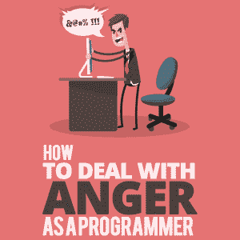

# 作为程序员如何应对愤怒

> 原文：<https://simpleprogrammer.com/anger-management-programmer/>

Anger. We all have faced it before. It is never a good feeling; nevertheless, it happens. Rather than letting anger control us, we must find a way to get control of it so we can move on with our lives and the code that we write.

看，你可能想坚持编程，但在现实中，克服我们每天面临的问题所需的软技能比编程技能重要 100 倍。

你可以教任何人做程序员，但是找到一个能控制自己情绪，克服生活中问题的程序员很难。愤怒并不是所有程序员都面临的问题，但是如果你不得不面对，那么让愤怒占据你的最佳状态会严重挫伤你的职业成功。

我这篇文章的目标是让你感觉到你已经掌握了愤怒是如何影响你的，以及你如何控制它。

举个例子，让我们看看查尔斯的故事。他是一家大型知名数据公司的初级 Python 工程师。他大约一年前从芝加哥大学毕业，获得了计算机科学学士学位和 4.0 分，他想成为纽约市地区最好的 Python 工程师。

只有一个问题:他有时会因为太生气而无法专注于工作，特别是编程的困难。当他在他的 Python 库中遇到 bug 时，他最终会愤怒地在桌子上尖叫。他的一位同事 Emily 注意到了这个问题，并向他提到了这个问题。查尔斯从未想过他的愤怒是一个问题，也没有意识到它如何影响他的工作和同事。所以他踏上了理解愤怒以及如何克服愤怒的旅程。

## 为什么愤怒对程序员不好

当查尔斯开始他的研究时，他看到了一些让他意识到他的愤怒有多严重的事情。

首先是健康问题。他从来没有注意到这一点，因为他从来没有注意过，但愤怒对他的压力水平有可怕的影响。正是这种情绪引发了体内的战斗或逃跑反应，导致皮质醇水平上升。

随之而来的是一大堆负面健康后果，如高血压、心脏病发作几率增加、焦虑和抑郁增加等等。看着这个，他说:“我绝对不想要这些。”

但是健康问题并不是愤怒的唯一影响，随着查尔斯继续做越来越多的研究，他意识到了这一点。

愤怒影响他的精神状态。当一件事引发了他的愤怒，他很可能会对紧接着的一件小事生气。这也将导致他的愤怒问题！

他意识到，当他生气时，他只能专注于让他生气的事情和生气的感觉本身。因此，他每花一秒钟对代码中“本应有效”的 bug 生气(我知道我们都有过这种情况)，就会导致他无法专注于实际消除 bug 的目标。愤怒会影响他的生活，但是他的同事、家人和朋友的生活呢？

查尔斯不知道他的愤怒已经开始影响到他的同事，直到艾米丽找到他。她告诉他，他的行为甚至让他的经理重新考虑续签合同。Charles 把他对一个 bug 的愤怒发泄在同事身上，责怪他们对代码的修改导致了他的 bug。这破坏了团队的士气。

当查尔斯回家时，他向妻子和孩子抱怨和发泄这个问题，将负能量和愤怒传播到他的家里。这使他与妻子和孩子的关系变得紧张。然后，当他和他的朋友玩*堡垒之夜*时，他所做的就是谈论他因为他的 bug 而感到的愤怒。他的朋友真的不喜欢他生气，尤其是关于工作话题的时候。

程序员时不时会这么做:把自己的错误归咎于他人，传播自己的挫败感。为了成为一个更好的程序员，从你的性格中去掉这个消极的习惯。

## 如何摆脱它

Charles 意识到他有一个大问题，并决心克服他的愤怒问题，成为一个更好的程序员和人。

查尔斯需要做的第一件事是改变他的心态。头脑通常在同一时间只能是积极的或消极的。它一次只能感受一种情绪。从理论上讲，如果他现在很生气，他不可能同时又高兴又生气。

有几件事可以改变他的精神状态。首先，他可以尝试通过冥想或按摩来放松。这些事情可以把他从消极和愤怒的状态带到一个放松的、更积极的状态。另一种方法是看他最喜欢的 [YouTubers](https://www.youtube.com/channel/UC8icMMql5SjCaXXMvILGIUA?sub_confirmation=1) 。他们搞笑的片段能让他在几分钟内从生气变成大笑。

Those might not be things that can be easily done while at work, so I have something more basic for you to do at your desk. Just take a few deep breaths. Breathing like that for a little while is a great way to relax and put anger aside.

现在他处于一种更加积极和放松的状态，查尔斯可以看待这个问题并接受它的本来面目。这是一个错误。他过去已经解决了数百个 bug。为什么他会让这个打败他？

所以他选择接受这个问题。意识到这是事实。它发生了。他现在要做的就是想办法修好它。

现在，他重温了他早上发现的那个 bug，那个引发他愤怒的 bug。它发生在 main.py 的第 134 行。他查看堆栈跟踪，意识到它来自他一年前编写的函数。他没有处理导致 bug 的边缘案例。

他添加了一个简单的 if-else 语句并修复了这个错误。然后，他提交并推动他的改变，这一次，他快乐地离开了工作。

## 再也不生气了！

查尔斯能够自己恢复理智，不再生气。他把自己的精神状态从消极变成了积极。然后他学会了接受问题的本来面目。最后，他冷静下来，合乎逻辑地看待这件事，并接受了它。这让他想出了一个解决办法！修复只花了几分钟，但他可能会浪费大量时间生气。

这就是情绪和内心挣扎的问题:你可以克服它们。在你的控制之下，总有一些你可以做的事情来帮助解决问题。这就是为什么我写了一本关于这个主题的书。

看看查尔斯从改变他生气的习惯中得到的好处。他现在是一个更有生产力的程序员，他以闪电般的速度挤压 bug，而不是发泄。他的同事们都更喜欢他了，因为他不再为自己的错误责怪他们。他的妻子和孩子与他更亲近，因为他并不总是生他们的气。

你还在等什么？