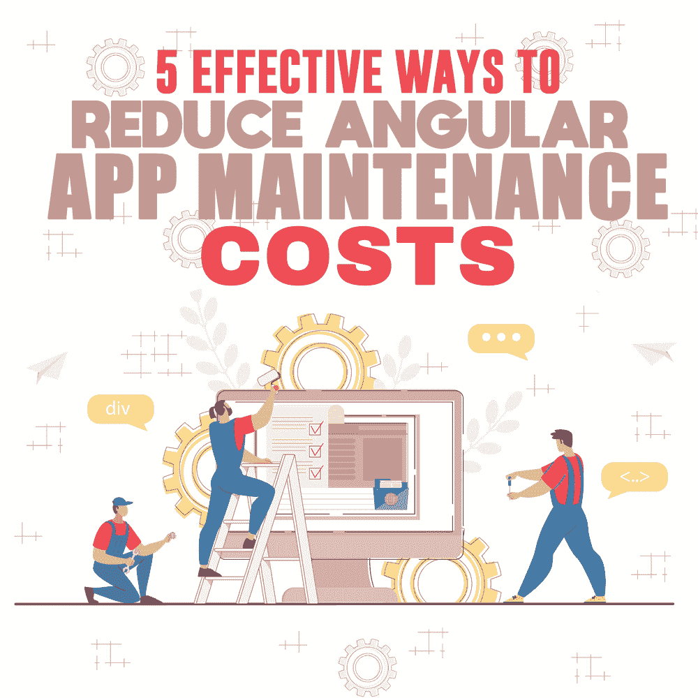

# 降低 Angular App 维护成本的 5 种有效方法

> 原文：<https://simpleprogrammer.com/angular-app-maintenance-costs/>

To ensure that your Angular app stays relevant and useful to the users, investing resources in making regular updates in the app is inevitable. The real challenge that Angular app developers and IT business owners face is how to reduce Angular app maintenance costs.

作为软件开发人员，我们知道一个成功的应用程序的旅程并不以在应用程序商店部署应用程序为终点。获得成千上万的下载量也不是故事的结尾。任何应用程序开发者的最终目标都是不断增加日活跃用户(DAU)，即从长远来看不断回到应用程序的用户。

每个 Angular 应用程序都需要持续维护，以留住用户并扩大业务规模。很多时候，您可能还需要在后期开发服务中产生额外的成本，如服务器费用、支付处理服务、推送通知机制等等。

虽然你不能完全忽视开发后的 Angular 应用程序维护，但你可以采取一些先发制人的措施来显著降低其成本。

当然，开发一个高性价比的 Angular 应用程序的最基本的技巧是从外包公司雇佣一名 Angular 开发人员。如果你知道如何为你的项目选择合适的离岸角度开发者，你已经成功了一半。此外，作为一家 IT 外包公司的老板，我可以告诉你，只要以正确的方式开发应用程序，就可以进一步降低维护成本。

以下是我为了降低 Angular 应用程序维护成本而遵循的一些内部技巧:

## 1.与最新的角度版本保持同步

由于 Angular 得到了谷歌的支持，它在不断改进的同时也非常注重稳定性。这便于您保持应用程序的最新状态。将你的 Angular 应用升级到最新版本是个好主意，因为这肯定有助于降低应用维护成本。你可能想知道这两者之间有什么联系。我简单解释一下。

为了让你的应用适应不断变化的时代，开发后应用维护的一个重要部分是添加新的和/或改进的功能，使应用对用户更有用。通过将你的应用程序框架升级到最新的 Angular 版本，你无需付出任何额外的努力就可以获得许多与你的应用程序集成的前沿功能。较新的版本也有助于您利用自动优化和错误修复。

此外，您可以在新版本中获得内置架构改进的好处，而无需自己花钱开发。

由于这些原因，用 Angular 发布的新更新来升级你的框架总是一个好主意。

## 2.花时间写干净的代码

任何写出计算机能理解的代码的人都是优秀的程序员。然而，一个伟大的程序员能够写出任何其他程序员都能理解的代码。

在开发 Angular 应用程序时，投入额外的时间以高效、可读的方式设计代码和架构，对降低应用程序的总体成本大有帮助。干净的代码是高度可维护的，因为它有助于容易地实现更改，特别是如果更新是由开发人员而不是代码的原始作者进行的。

为了消除对代码的任何怀疑或误解，确保代码在应用程序的流程方面是清晰的。当需要从 Angular 应用程序中添加或删除某些功能时，任何使用该应用程序的开发人员都必须能够轻松理解所有相关变量的细节，以及不同组件如何相互协作。干净的代码也让开发者更容易扩展和重构代码。

此外，当代码中的类和方法是可预测的，并且公共 API 清晰简洁时，代码测试变得非常快，并且代码很容易更改。

简而言之，[干净的编码](https://simpleprogrammer.com/clean-code-principles-better-programmer/)是降低维护成本的有效方法，因为它可以更快地调试、升级和测试所有 Angular 应用程序。作为一名开发人员，如果你用清晰明了的代码开始 Angular 应用程序的开发，你可以节省大量的时间和金钱来重做代码工作。

## 3.分析与第三方 API 的兼容性

It is very likely that there are at least a couple of third-party APIs integrated with your Angular app in order to provide versatile features to your users. While choosing the APIs for your app, you must keep in mind that they will be updated over time regardless of whether they will be helpful to your app. This, in turn, raises maintenance concerns for your app’s long-term performance.

未来避免应用程序和 API 之间任何集成问题的最可靠方法是选择一个即使将来更新也能与你的应用程序兼容的 API。这可能需要您进行一些尝试和错误，但是拥有一个兼容的 API 的长期好处是不可低估的。

即使你确定你已经选择了一个与你的 Angular 应用兼容的 API，你也不能在那之后高枕无忧。持续监控所有第三方 API 的最新变化和新特性至关重要。如果你错过了一次更新，没有对 API 的变化做出反应，你的应用可能会突然崩溃。这可能会大大增加应用程序的维护成本。

因此，在进行第三方 API 集成时要小心，并为将来的更新准备好您的解决方案。详细了解 API 模块，在 app 开发过程中选择合适的模块，可以免去以后更换的麻烦，帮你节省大量的维护成本。

## 4.避免不必要的功能

Angular 应用程序维护的主要部分包括向应用程序添加新功能时产生的成本。2020 年，应用程序开发趋势的变化比任何其他行业都要快。为了跟上时代的变化和客户的需求，你可能会不断地给你的应用程序添加新的功能。

然而，如果你不注意这些新功能的长期影响，定期添加新功能会让你付出很大代价。

那么，您如何确定应该将哪些解决方案添加到您现有的功能集中呢？

这两个考虑因素可以帮助您做出正确的决策，最大化投资回报，同时最小化额外的维护成本:

### 顾客价值

考虑到要求补充功能的用户请求的数量，您必须根据它向您的整个客户群提供的具体价值仔细分析每一个。用户并不总是技术专家。有时候，你可能不得不决定不添加一个受欢迎的功能，因为这可能会破坏 Angular 应用程序的真正价值和简单性。

### 该功能的缺点

有时，新功能可能会影响 Angular 应用程序现有功能的功能。这也可能会降低或扰乱应用程序的性能。在这种情况下，添加一个新功能将需要您对应用程序的许多其他组件进行更改。不用说，这增加了数倍的维护成本。

在决定是否在应用中引入新功能时，你应该对这些因素进行深入分析。确定新功能是否会改进或增加应用程序的功能。如果它是您的整体解决方案范围内的有益部分，那么只有在与整个开发团队讨论了它的利弊之后，您才能继续进行。

## 5.广泛的主动测试

无论你是一个多么熟练的程序员，也不可能推出不遇到一些错误的软件。应用程序维护就是让你的应用程序没有错误，并为你的用户提供流畅的体验。

如果你想避免修复系统故障的成本，你必须在应用程序开发过程中采取主动的方法。

An early app-testing system, carried out simultaneously with app development, can avoid a large chunk of performance glitches your Angular app might encounter later. With [comprehensive testing](http://www.amazon.com/exec/obidos/ASIN/0471358460/makithecompsi-20), you can adhere to quality coding standards that reduce repair tasks in the future.

降低 Angular app 维护成本最有效的方法之一就是让你的 QA 团队成为开发过程的一部分，而不是把完全开发好的 app 交给一个单独的 QA 团队。他们可以及时向你提供准确的反馈，这样你就不会在最后一刻遇到任何问题。

除了降低维护成本，[全方位测试系统](https://simpleprogrammer.com/advanced-software-testing/)还有助于您的业务转换和客户参与。

## 建立坚实的基础

本质上，降低 Angular app 维护成本最有效的方法就是建立一个强大的基础结构。仔细规划整个开发过程，并提前估计与每个应用程序组件相关的成本。积极主动的方法不仅会减轻你的返工负担，还会强化你的应用的品牌形象。你会惊讶地发现，随着时间的推移，你的应用程序会随着越来越多的满意客户而增长。