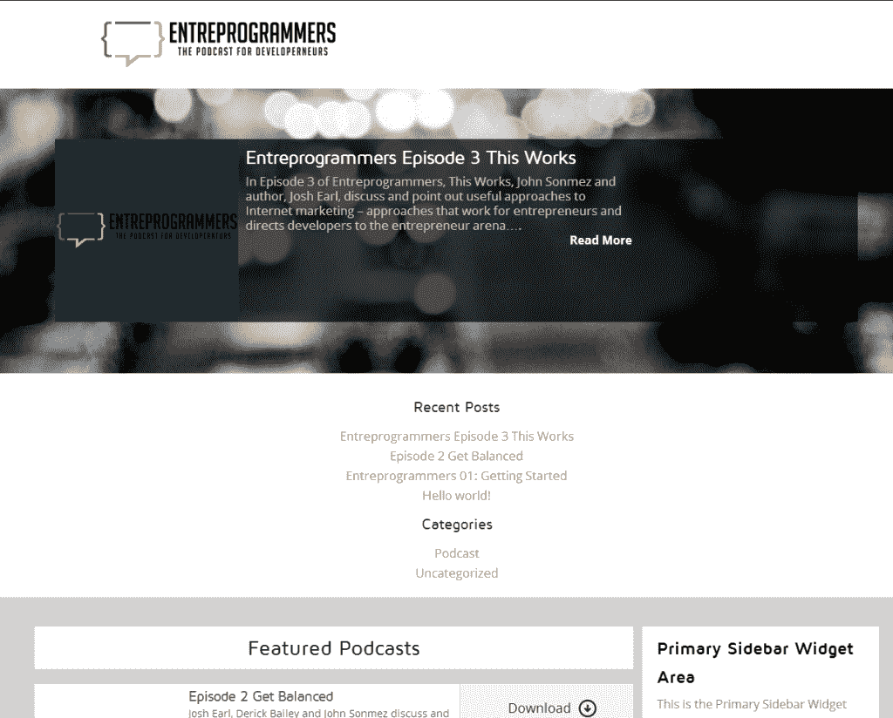

# 宣布 Entreprogrammers 播客

> 原文:[https://simple programmer . com/announcing-entre programmers-podcast/](https://simpleprogrammer.com/announcing-entreprogrammers-podcast/)

几个月来，我每周都和我的几个软件开发/企业家伙伴会面，他们是吴镇男·贝利和 T2·乔希·厄尔，他们被称为智囊团。

每周我们都会在 Google+上聊天，讨论我们在做什么，以及我们在创业过程中面临的挑战。我们还通过分享建议和我们一路上学到的东西来互相帮助。

对我个人来说，这个团队是一个很好的成长机会。通过与乔希和吴镇男分享想法以及寻求帮助来解决我的问题，我学到了很多。该小组也是一个巨大的支持来源。创业是一条令人兴奋的道路，但也是一场过山车。有几个理解我正在经历的事情的朋友是无价的。

(顺便说一句，智囊团的概念来自一本优秀的——尽管有点奇怪——拿破仑·希尔的书《思考致富》。)

每当我告诉别人这个团体时，我几乎总是会被问及他们是加入这个团体还是只是听听。我们真的不想让任何其他人加入这个小组，因为我们想保持它足够小，我们都可以讨论我们的商业风险，并在合理的时间内获得帮助。但是，我们可以让人们收听…

这就是我们如何想出 Entreprogrammers 播客这个主意的。

这个播客有点不同于其他播客，因为它实际上只是我们记录我们的私人策划小组会议。我们很少在播客中谈论“元”，也不会隐瞒任何事情。老实说，你会听到我们赚了多少钱，我们是如何赚的，我们什么时候搞砸了，以及我们业务中发生的其他事情。

我知道这并不适合所有人。有些人可能会认为这只是我们漫无边际地聊上一两个小时，但这在我刚刚起步时对我来说是非常有益的，所以我认为这对其他人也可能是有益的。

我们发布了这个播客的音频和视频流。

你可以去 http://entreprogrammers.com 看看。

现在我们实际上已经录制了大约 10 集，所以我们将每周发布几集，直到我们赶上为止。然后，我们将每周发布一集新的节目。

当剧集发布时，我会在这里发布，当然，最好的方法是订阅我的每周电子邮件。

你可以在这里做。

我很兴奋。我认为从别人诚实的错误中学习有一些真正的价值，我已经从这个智囊团中获益良多，所以我认为其他人也会如此。