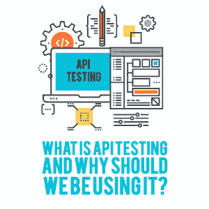

# 什么是 API 测试，为什么我们应该使用它？

> 原文：<https://simpleprogrammer.com/api-testing/>

Many companies are moving toward a *microservices* model for their software applications. This means that different sections of their application can have separate datastores and separate commands for interacting with that datastore.

微服务对软件提供商很有吸引力，因为它们允许软件的组件更快地部署；当应用程序的一个区域被更新时，应用程序的其他区域可以继续运行。

我们生活在这样一个时代，用户希望软件随时可用，而微服务模型可以确保应用程序在用户想要使用时不会停机维护。

大多数微服务都在使用*应用编程接口(API)*，这是一组关于如何使用服务的命令。而且大多数 API 都是通过*【超文本传输协议】*使用*表述性状态转移(REST)* 请求来请求和发送数据。

尽管如此，[许多软件测试人员](http://www.amazon.com/exec/obidos/ASIN/1787127745/makithecompsi-20)继续使用基于用户界面(UI)的测试来自动化他们的测试，这些测试直接与浏览器交互。这在很大程度上归功于 Selenium 自动化测试工具套件的成功，它运行在 web 浏览器中。

Selenium 已经推出好几年了，大多数软件测试人员都熟悉它的用法。但是最熟悉的工具并不总是测试自动化中最合适的工具。

虽然总是需要一些 UI 测试来验证元素是否出现在页面上并且可以交互，但是 API 测试比基于 UI 的测试要快得多，也更可靠。当测试像从数据库中添加和删除记录这样的事情时，自动化的 UI 测试可能是耗时且重复的。API 测试允许快速的记录操作。

此外，API 测试允许测试人员在开发过程的早期发现错误，通常是在 UI 创建之前。API 测试允许测试人员通过 UI 发出可能不被允许的请求，这对于暴露应用程序中的潜在安全缺陷是至关重要的。

因为今天软件的变化发生得如此之快，所以为开发人员和测试人员提供快速反馈的测试非常重要。API 测试可以满足这一需求。我们将描述 API 测试的基础，包括 REST 请求如何工作以及如何设置请求和断言。

## REST 请求是如何工作的？

在开始 API 测试之前，您需要学习一些基础知识。一个 API 由一组 REST 请求组成。这些是对应用程序服务器的请求，用于检索、删除或操作应用程序数据库中的数据。

REST 请求由以下部分组成:

*   一个描述应该采取什么动作的 HTTP 动词
*   定义请求位置的*统一资源定位符(URL)*
*   向服务器提供请求信息的 HTTP 头
*   一个*请求体*，为请求提供进一步的细节(有时可以是空的)

以下是最常见的 HTTP 动词:

*   一个 *GET* 请求从数据库中获取一条记录
*   一个 *POST* 请求向数据库添加一条新记录
*   一个 *PUT* 请求用一个新记录替换一个记录
*   一个*补丁*请求用新信息替换部分记录
*   一个*删除*请求从数据库中删除一条记录

请求中使用的 URL 阐明了请求将更改哪种类型的记录。例如，与 URL https://www.example.com/cars/1 结合使用的 GET 请求将返回汽车表中的记录号 1。

类似地，与 URL https://www.example.com/trees/2 结合使用的 GET 请求将返回树表中的第二条记录。URL 的结尾指定了一个*端点*——API 中使用的一个数据对象。在这些示例中，端点是/cars 和/trees。

HTTP 头可以向服务器提供信息，例如:

*   *主机*:发出请求的用户的域和端口号
*   *授权*:发出请求的用户的凭证
*   *内容类型*:请求主体中提供的信息的格式

请求体在发出 POST、PUT 或 PATCH 请求时使用。主体确切地指定了应该向数据库中添加什么信息。通常采用 *JavaScript 对象符号(JSON)* 或*可扩展标记语言(XML)* 格式。

下面是一个 JSON 请求体的示例，用于执行将客户添加到数据库的 POST 请求:

{

“名字”:“约翰”，

“姓氏”:“史密斯”，

" email address ":" jsmith @ example . com "

}

理解 REST 请求的各个部分将有助于软件测试人员为测试目的制定请求。仅仅知道单击表单中的“发送”按钮会发送帖子请求是不够的；要真正测试一个 API，测试人员应该知道如何在不依赖 UI 的情况下创建和发送请求。

当发送测试请求时，理解预期的响应也很重要；否则，测试人员将无法知道 API 是否正常工作。

## 对 REST 请求的响应包括什么？

The response to a REST request is the information that the server sends back after it has received and processed the request. It will include *HTTP headers* that describe the response, a *response code* that describes the success or failure of the response, and a *response body* that includes requested or relevant information (this can sometimes be empty).

响应中的 HTTP 头向请求方提供信息，例如:

*   *访问控制头*:告诉请求者什么类型的请求和头将被允许
*   *Content-Type* :响应中返回信息的格式
*   *服务器*:响应请求的服务器的名称

响应代码是三位数代码，用于描述 REST 请求的结果。最常见的响应代码属于以下三类之一:

*   200 级响应表示请求已被接收、理解和处理
*   400 级响应表示请求已收到，但客户端出错
*   500 级响应表明出现了某种服务器错误

响应主体将根据请求的类型以及请求中是否有错误而有所不同。

成功的 GET 请求将返回包含所请求信息的主体。一个成功的 POST 请求可能会返回一个与 POST 一起发送的正文相呼应的正文，也可能会返回一个带有 200 级响应代码的空正文。返回错误的请求可能在响应正文中包含错误消息。

## 我们如何测试 API？

既然您已经学习了 REST 请求和响应的工作机制，那么是时候学习如何测试它们了。测试 API 的第一步是确定 API 可以发出什么样的 REST 请求，以及每个请求的限制是什么。这可以通过查看文档来完成。

一些[开发者可能会选择通过使用 *Swagger* 来记录 API](http://www.amazon.com/exec/obidos/ASIN/1786462559/makithecompsi-20) ，这是一个清晰描述 API 行为的开源框架。还有其他可用的文档工具。

为了完整地测试一个 API，理解 API 中每个 REST 请求的限制是很重要的。找到、测试和验证这些限制对于确保 API 以用户期望的方式运行，以及 API 不会被恶意用户利用来获取他们不应该访问的信息是至关重要的。

以下是在收集 API 信息时要问 API 开发人员的一些问题:

*   有哪些端点可用？
*   我可以在这些端点上使用哪些 HTTP 动词？
*   这些动词中有受授权限制的吗？
*   请求中需要哪些字段？
*   字段的验证限制是什么？
*   对于成功的请求，我应该期待什么响应代码？
*   对于不成功的请求，我应该期待什么响应代码？
*   不成功的请求会返回什么样的错误消息？

下一步是在 API 测试工具中设置这些请求。

为此，可以使用多种工具。也可以将 API 测试直接写入代码，但是 API 测试工具的优点是易于使用，并提供了一种可视化响应的方式。

The easiest API testing tool to use is *Postman*. It has a 100 percent free version that can be downloaded quickly, and there are also paid versions for teams. *Runscope* and *SoapUI* are two other popular tools. For more suggestions on API testing tools, check out Simple Programmer’s [Ultimate Automation Testing Guide](https://simpleprogrammer.com/ultimate-automation-testing-guide).

一旦你选择了一个 API 测试工具，首先要设置的请求是“快乐路径”请求。这些是 API 开发者期望用户在使用应用程序的正常过程中会提出的请求。

当建立一个“快乐路径”风格的请求时，包含断言是很重要的。一个断言应该是返回正确的响应代码(通常是 200 响应)。

如果响应包括一个主体，那么也应该有一个断言。例如，如果正在测试一个 GET 请求，那么应该有一个断言，即响应的主体包含该记录所期望的数据。

一旦创建了所有的“快乐路径”测试，就可以添加阴性测试。消极测试是那些确保任何种类的错误都被正确处理的测试。当用户意外导入无效数据时，应用程序不会崩溃是很重要的，而且禁止恶意用户将有害脚本输入数据库也是很重要的。以下是一些阴性测试的例子:

*   使用错误的 HTTP 动词发送请求
*   使用错误的端点发送请求
*   发送带有错误标题的请求
*   发送缺少标头的请求
*   在没有适当授权的情况下发送请求
*   为不存在的记录请求数据
*   发送正文缺少必填字段的请求
*   发送正文包含无效字段值的请求

## 这听起来很棒，但你能给我举个例子吗？

是啊！Swagger UI 的开发人员已经创建了一个 API 进行实践，称为 Swagger Petstore。这是我所知道的唯一一个公共实践 API，它提供了每个 API 请求如何工作的清晰可视化，并且还提供了一种直接在文档中测试请求的方法。我们可以在 Postman 中创建一个指向这个 API 的请求，添加一些断言，然后用 Newman 从命令行运行它。Newman 是 Postman 创建的命令行运行工具，可以通过节点包管理器(npm)安装。

第一步:

*   导航到[http://pet store . swagger . io](http://petstore.swagger.io)并点击请求“GET /pet/{petId}”将其打开
*   点击“试用”按钮
*   在标有“要返回的宠物 ID”的字段中输入数字 1
*   点击“执行”按钮
*   向下滚动到响应正文，验证是否返回了宠物的记录(如果没有返回记录，请在“要返回的宠物的 ID”字段中使用不同的 ID 再次尝试请求)

第二步:

*   前往[https://www.getpostman.com](https://www.getpostman.com)点击“下载应用”按钮，下载邮差

第三步:

*   发射邮递员
*   在屏幕的顶部中间，确认您在 HTTP 动词下拉列表中看到单词“GET”
*   在“获取”旁边的空白处，输入这个 URL:[http://petstore.swagger.io/v2/pet/1](http://petstore.swagger.io/v2/pet/1)(如果你使用的 ID 不是 1，请用你选择的 ID 替换 1。)
*   单击“Send”按钮，确认您收到的响应代码为 200 OK，并且响应正文包含该宠物的记录

第四步:

*   点击邮差请求 URL 下的“测试”标签
*   在屏幕的右侧，滚动选择代码片段，直到找到标题为“状态代码:代码是 200”的代码片段，然后单击这个标题
*   注意，这个断言已经被添加到测试窗口中。代码断言 200 是您发送请求时得到的响应代码。

Step 5:

*   滚动选择的代码片段，直到找到标题为“Response Body: JSON value check”的代码片段，然后单击这个标题
*   注意，这个断言已经被添加到测试窗口中
*   将字符串“您的测试名称”更改为“返回正确的宠物 ID”；这将是测试的名称
*   将单词“expect”后括号中的值从“jsonData.value”更改为“JSON data . id”；该测试将检查宠物 ID 的值
*   将单词“eql”后面括号中的值从“100”更改为“1”(或者您在 GET 请求中选择使用的任何 ID)
*   再次点击“发送”按钮，并点击“测试结果”选项卡
*   确认您看到您创建的两个测试旁边有单词“Pass”

第六步:

*   在屏幕左侧，单击“收藏”选项卡
*   单击带有文件夹和加号按钮的图标以创建请求集合
*   在弹出窗口中，将集合命名为“Pet Store ”,然后单击“Create”按钮
*   在屏幕右侧，单击“保存”按钮
*   在弹出窗口中，将请求命名为“Get Pet”
*   选择宠物店收藏
*   点击“保存到宠物店”按钮

第七步:

*   将鼠标悬停在收藏名称“宠物店”上
*   点击出现在收藏名称旁边的三个点，然后选择“导出”
*   选择 v.2.1 集合选项，然后单击“导出”按钮
*   选择保存收藏的位置，如桌面
*   删除文件名中单词“Pet”和单词“Store”之间的空格
*   点击“保存”按钮
*   您的收藏将保存为名为 pet store . postman _ collection . JSON 的 JSON 文件

第八步:

*   如果您的机器上还没有安装 Node.js，请按照在[https://nodejs.org/en/download](https://nodejs.org/en/download)找到的说明安装它
*   打开命令窗口，键入“npm install -g newman ”,然后单击 Return 键。这将把 Newman 安装到您的机器上。如果您是使用命令行的新手，[参见本文](https://simpleprogrammer.com/bash-windows-improving-windows-command-line-experience)中的一些常用命令
*   使用命令窗口，导航到保存 JSON 文件的位置(例如，您可以键入“cd Desktop”以切换到桌面文件夹)
*   在命令窗口中键入以下命令:“Newman run pet store . postman _ collection . JSON”
*   您应该在命令窗口中看到您的测试运行并通过！

## 我们如何自动化 API 测试？

一旦创建了一套完整的肯定和否定测试，就可以设置自动化了。运行测试的 Newman 命令可以集成到一个持续集成(CI)项目中。类似地，Runscope 和 SoapUI 也提供了与 CI 工具集成的命令行功能。

## 后续步骤

上面的教程只是 API 测试的一个简单例子。为了更进一步，您可以在 Swagger Petstore 中尝试更多的请求，并在 Postman 中为它们创建测试。

如果你的公司正在开发 API，你可以看看这些 API，看看你能为你的软件设置什么样的自动化 API 测试。

检查您的自动化 UI 测试，看看 API 测试能更好地覆盖哪些测试。例如，如果您有一个填写客户表单并向数据库添加新记录的 UI 测试，您可以使用一个使用 POST 请求来添加记录的 API 测试。API 测试最适合测试数据的创建和操作，而 UI 测试最适合检查按钮和链接在屏幕上的可用性。

将大部分自动化测试转移到 API 测试将会让你的测试套件运行得更快更可靠。您将能够快速发现数据存储操作中的缺陷，并在任何潜在的安全漏洞被利用之前将其暴露出来。测试愉快！