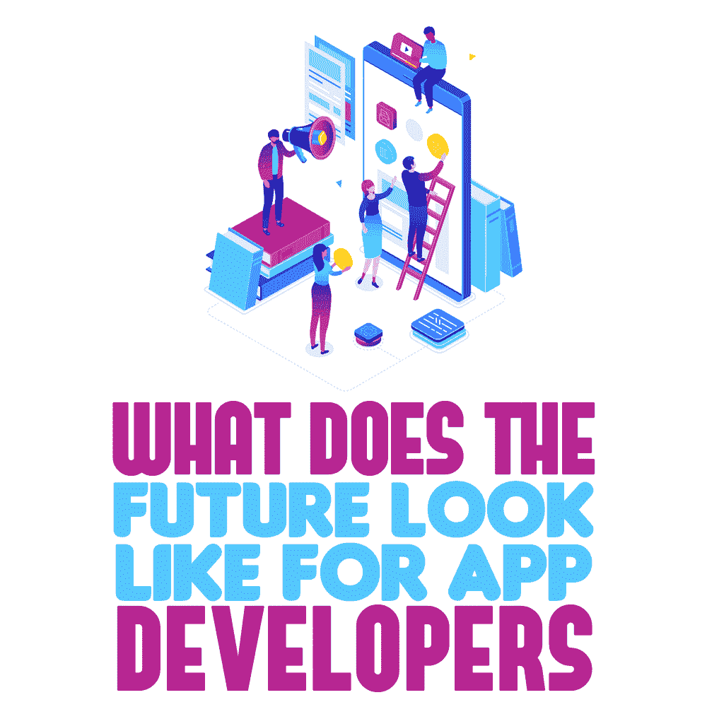
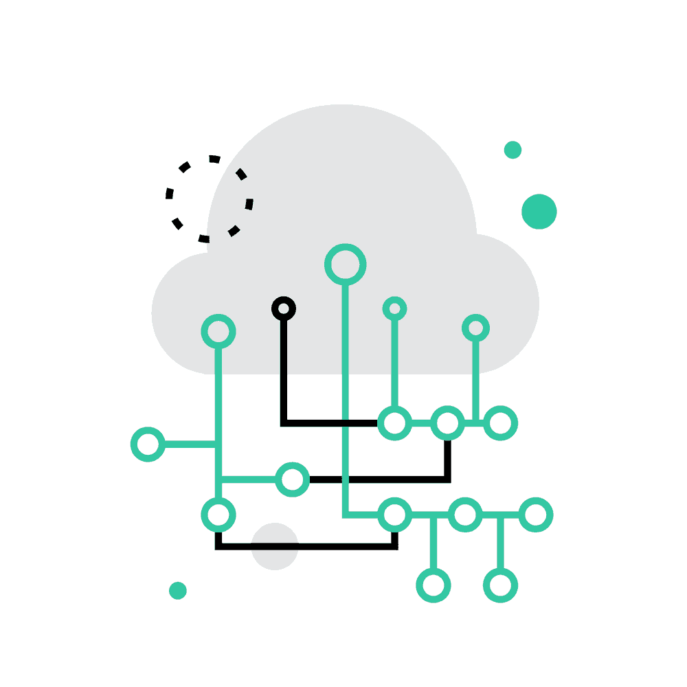

# 应用开发者的未来会是什么样子

> 原文：<https://simpleprogrammer.com/app-developer-future-2019/>

<figure class="alignright is-resized">

</figure>

每一年，都有新的技术趋势影响着被创造出来的[应用](https://simpleprogrammer.com/develop-app-like-pubg/)的类型，影响着消费者被介绍、开始使用、变得喜爱、然后深深扎根于他们日常行为中的技术。

自从 2008 年推出 iPhone 和 2009 年推出 App Store 以来，有许多趋势使我们的应用程序更加直观，支持我们的日常行为，并成为公司与用户直接沟通的强大工具。

作为应用程序开发人员，保持对这些趋势的了解，以便将它们集成到您的最新项目中，这是您的最佳利益所在。

由于应用程序开发中的竞争如此激烈，选择走代理路线并为客户开发应用程序可能是你正在考虑的一个收入来源。了解最新趋势可以让你在代理竞争中获得优势，或者让你的应用在应用商店的众多应用中脱颖而出。这取决于你想如何利用这些知识为你带来优势。

## 趋势引领特色:2019 App 趋势

我们看到的上升趋势导致了你的应用程序中的功能开发，这些功能可以作为附加服务或你公司的专业服务提供。

通过这篇文章，我讨论了我们在 2019 年迄今为止看到的应用程序开发趋势。我希望它能给你一个良好的基础，让你开始研究这些新趋势，并帮助你决定是否要在你的应用中使用一个或多个。

### 虚拟现实/增强现实

虚拟现实(VR)和增强现实(AR)技术已经存在多年了。对于移动应用程序，VR 在消费者领域仍然只抓住了一小部分用户，不像在企业领域，其采用似乎正在稳步增长。

虚拟现实的消费者空间仅由游戏行业主导，PlayStation VR (PSVR)是一个主要因素。企业客户主要利用虚拟现实技术进行培训和学习，因为这种选择有重要的[好处](https://simpleprogrammer.com/VR-developer)。

这些包括培训个人的成本大幅降低，以及在某些情况下不受位置限制。对于需要培训数百名员工的公司来说，这些好处可能是一个主要卖点。

自 2019 年 4 月发布 [Oculus Quest](https://www.oculus.com/quest/?locale=en_US) 以来，一直有传言称这款来自脸书的最新独立耳机将改变消费者领域的游戏，但尚未得到证实。

AR 已经被消费者更广泛地采用，因为它的准入门槛更低，并且易于理解该技术。可能最知名的 AR 游戏是 Pokemon Go。这款游戏吸引了大量的目标观众，因为它拥有口袋妖怪系列的粉丝基础。

与 VR 不同，这些较小的 AR 体验可以由不同领域的所有年龄的消费者享受，并正在用于教育和娱乐空间。

尽管虚拟现实和增强现实还没有被大众市场采用，但拥有这一工具并被视为这个非常小的领域的专家实际上可能会对你有利，以吸引更多的客户。

因此，我不会对你未来的开发工作打折扣。要开始制作 VR 或 AR 应用，你可以尝试一下 Unity 中的课程[VR 入门](https://unity3d.com/de/learn/tutorials/topics/xr/getting-started-vr-development)和[在 Unity 中创建 AR 应用](https://unity3d.com/how-to/create-AR-games-in-Unity-efficiently)。

### 人工智能和机器学习

<figure class="alignright is-resized">

</figure>

数据为王，数据科学等新领域以及这些领域中的角色正在呈指数级增长。机器学习(ML)和人工智能(AI)正在利用这些丰富的数据来做一些事情，如根据你以前的活动预测你下次的购买和假期计划，而且它没有放缓的迹象。

如果你正在考虑深入研究人工智能和人工智能，你可以通过 AWS 服务 Sagemaker 上的课程[AWS 上的机器学习](https://aws.amazon.com/machine-learning/)开始培训。然后你可以尝试将这项服务整合到你的下一个应用中。

对于大大小小的公司来说，公司获取数据以更有效地向客户营销或预测行为正成为一项大业务。能够将基本的分析工具集成到您的应用程序中是一个良好的开端。然而，知道如何建立自定义分析来给你的客户提供关于他们用户行为的详细信息，这将是一个很好的广告技巧。

### 可穿戴应用集成

可穿戴设备已经在医疗领域得到了广泛应用，用于提供患者的生命体征，以帮助早期诊断和检测或监控健康水平，例如心率和血糖水平。

健身和锻炼行业也从可穿戴技术进入消费市场的发展中受益匪浅。像 Fitbit 这样的步数追踪器的引入使得日常锻炼更容易追踪，更容易参与，也更有趣。

在其他行业，配套应用的开发也在增加。这些智能手表应用程序可以提供一种不同的方式来获得通知和使用主应用程序，或者只是为用户提供附加功能。无需拿出智能手机或平板电脑就能轻松与应用程序互动，这一点非常有吸引力。

### 物联网

主要行业已经在产品中采用物联网。许多房主正在购买已经被认为是家庭内标准配件的设备。例如，这种设备包括冰箱，它可以记录里面的物品数量，然后为你每周的购物填写购物清单。看来，教育可能是下一个涉足并投资物联网的行业之一。

能够将许多看似不相关的设备或组织的各个方面联系起来是关键驱动因素。从组织的角度来看，它提供了方便地监控和访问这些设备的数据的能力，比依赖简单的销售数字、调查和用户口碑更容易、更快。

### 聊天机器人将是不可或缺的

几年前，我被介绍给聊天机器人。它们是应用程序和服务中使用的人工智能，主要根据从客户数据或预先准备的问题中收集的信息，向客户提供支持和答案，以帮助缩小问题范围。

聊天机器人通过能够提供从数据中学习的完整的 24 小时客户服务体验来帮助公司，因此不需要培训或睡眠。沃森助手(由 IBM 制造)目前被认为是市场上最先进的人工智能聊天机器人之一。

由于客户服务是消费者的一个重要因素，公司正在利用聊天机器人来改善他们的客户服务，并确保这不是他们的应用程序被卸载的原因之一。

### 移动钱包和支付网关

使用智能设备让支付变得更加便捷的能力正在成为一种必然。为您的用户提供了一种额外的支付方式(并使体验无缝、便捷！)将使您的应用程序脱颖而出，领先于游戏。可以与 Apple Pay、Google Pay 或 PayPal 和 Stripe 等在线支付系统集成。

电子商务应用的增长将推动银行对更易于集成的支付方式的需求。因此，密切关注用户偏好的分析方法，这样你就可以快速利用这一点。

### 更多的企业将投资云集成

<figure class="alignright is-resized">

</figure>

今年,[云存储和服务](https://simpleprogrammer.com/cloud-computing-skills/)的使用也在持续增长。这些工具的明显优势是无需干预的解决方案的数量，这些解决方案可以自动扩展以适应您的应用程序的需求，只需在控制台中更改配置(这可能是最大的工作量！).

通过有效管理和存储后端服务，您可以完全专注于应用程序的开发和设计，以确保您可以为用户创造最佳产品。

不过，你应该知道的是，你需要将额外的成本计入你的开发预算/月费。您需要按服务和不同的存储类别付费，因此最好从小规模开始，并在流量需要时扩大规模，以实现利润最大化。

### 即时应用正在出现

即时应用程序允许用户享受应用程序，而不必真正下载到他们的手机上。

如果您的用户对其设备中的存储有限制，这可能是您考虑实现的一个好特性。没有存储空间的限制，用户可以享受比以前更多的应用程序。

这将有助于你向更广泛的受众开放你的应用。被应用商店发现是 B2C 应用开发者开发后遇到的最大障碍之一。你所能做的任何增加你的影响力和用户曝光率的事情对你来说都是积极的。

### 安全性

随着越来越多的人使用智能设备，黑客正在寻找新的方法来访问我们的个人系统。

最近，传统版本的 Android 上的某些应用程序容易受到平台安全问题的影响。这导致许多用户对这些平台更加谨慎。因此，你可能需要考虑你的应用程序的目标平台。

安全漏洞的故事可能会导致在这些设备上下载你的应用程序的用户减少。因此，你应该权衡在特定平台、API 或 SDK 上开发应用的投资回报是否值得。

### 信标技术

这不是新技术，但没有得到充分利用。它是苹果公司在 2013 年推出的，主要用于营销项目。

信标是小型无线发射器，使用低能耗蓝牙技术向附近的其他智能设备发送信号。

像梅西百货这样的商店使用信标来专门锁定店内的买家。这种直接营销使他们能够为这些顾客提供特别的优惠，或者吸引他们的注意力，使他们更有可能购买。

2019 年，全球市场洞察预测，到 2024 年，信标技术市场将超过 250 亿美元。

新的应用程序可能会更多地采用这项技术，集成可能会变得更容易。

零售商正在增加应用程序的使用，以加强他们的营销努力。信标将允许他们获得更多的销售和增加利润，所以如果你正在开发更多以零售商为中心的应用程序，你可能需要留意这项技术的更新。

### 影响移动用户界面/UX 的预测分析

从用户数据中收集的分析不仅用于预测用户行为，还用于为他们提供更具视觉吸引力和可用性的应用程序。

使用 A/B 测试可以让你测试不同的设计，从按钮的颜色到新功能的引入。A/B 测试现在越来越多地被应用于交付完美的 UX 和用户界面。像 [Apptimize](https://apptimize.com/) 这样的公司正在帮助公司测试他们的应用程序，为他们的用户找到合适的应用程序。

## 你对使用什么感到兴奋？

毫无疑问，有一系列趋势变得越来越流行，或者可以帮助你的应用程序增长。虽然有些已经非常成熟，但其他的仍处于起步阶段。因此，决定你是想一头扎进去成为市场领导者，还是仅仅擅长于实现一个吸引你的客户的经过尝试和测试的功能，这取决于你自己。

然而，永远记住你的客户。能够使用最新的闪亮特性进行开发是很棒的，但是如果你的客户不想要或不需要它，或者如果他们永远不会使用它，投资回报值得吗？