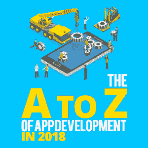
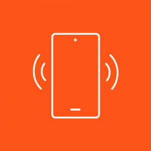

# 2018 年 App 开发的 A 到 Z

> 原文：<https://simpleprogrammer.com/app-development-in-2018/>

Apps (short for applications) were introduced to the world via the iPhone in 2007.

2008 年，苹果应用商店开放，任何人都可以创建应用程序。一个市场已经打开，可以为开发者带来足够的收入，让他们放弃日常工作。

现在，有两大应用商店， [Google Play(针对 Android 应用)和苹果应用商店](https://simpleprogrammer.com/develop-app-ios-android/)(针对 iOS 应用)。[他们总共拥有近 600 万个应用](https://www.statista.com/statistics/276623/number-of-apps-available-in-leading-app-stores/)。这是 10 年来巨大的增长率。随着下一个 10 亿用户的到来，这个数字还会继续增长。谁是下一个十亿用户？他们是互联网的下一波用户。他们可能居住在第三世界国家，这些国家以前没有很好的基础设施。然而，非洲国家的用户以前没有联网，现在随着 5G 网络的建设[开始联网。这意味着这些用户将需要迎合他们自身需求、欲望和娱乐价值的应用，就像更多发达国家在过去 10 年中所做的那样。](https://telecomworld.itu.int/blog/roadmap-to-5g-in-africa/)

自从应用程序诞生以来，这些应用程序的开发和分发变得越来越复杂。他们的素质提高了，竞争变得激烈了，培养他们的方式也变得更加多样了。

如果你是应用程序开发的新手，我希望通过我所谓的应用程序开发的 A 到 Z，给你一个关于应用程序和智能手机的有用信息的简要见解。

## 应用商店优化(ASO)

ASO 是在 2008 年通过苹果应用商店介绍给我们的，但直到最近它才像它的姐姐 SEO 一样被视为一种重要的商业实践。

ASO 意味着您正在优化您的应用程序，以便使用特定的关键字在应用程序商店中轻松搜索。像 Google Keywords 这样的工具可以帮助你找到某个类别中排名最高的关键词(搜索次数最多的)。通过将搜索次数最多的关键词与您的应用相关联，您的应用更有可能出现在用户的搜索结果中。

为了将关键字添加到您的应用程序，您需要在 app store 中您的应用程序的开发者控制台配置文件的相应字段中输入关键字。

## 蓝牙

蓝牙是一种无线通信技术，允许至少两台配对的设备在短距离内连接和共享数据。这种方法是将音频设备与便携式设备(如笔记本电脑、智能手机和平板电脑)连接的最常见方式。

它是由荷兰电气工程师 Jaap Haartsen 于 1994 年发明的，当时他正在为电信供应商爱立信工作。现在，所有公司和行业都普遍使用它来连接他们的产品。

## 跨平台

当应用程序首次推出时，你只能使用 Objective-C 开发一个 iOS 应用程序，或者使用 Java 开发一个 Android 应用程序。这导致许多开发人员专注于一个平台，虽然了解单个平台的来龙去脉对开发人员有好处，但这阻止了他们接触到对方操作系统的用户群。对于那些想为两家商店购买应用程序开发的人来说，这也将使应用程序的成本翻倍。

现在，有许多解决方案可以让开发人员编写一次代码，然后发布到所有商店。我们称这种能力为[跨平台](https://simpleprogrammer.com/app-cross-platform-development-part-2/)。有两种主要方法可以创建跨平台的应用程序:

1.  您可以创建一个 HTML5 应用程序，允许您使用 HTML5、CSS 和 JavaScript 等 web 技术编写应用程序。这是一个包装器，它被编译到两个平台的代码库中，以便在特定的设备上运行。
2.  您可以使用 Xamarin 或 Unity 等跨平台工具，根据您使用的工具，用 C#或 JavaScript 编写应用程序。

跨平台使开发人员能够成为两个平台的专家(高水平),接触更多的用户。当然，这也有可能带来更多的利润。

## 设备

In app development, there are currently three key devices to develop for:

*   智能手机
*   智能手表
*   药片

智能手机，正如我前面提到的，是在 2007 年 iPhone 发布的时候大规模推向世界的。接下来是平板电脑，苹果似乎再次在这波进步中取得了成功，尽管安卓平板电脑已经上市。

智能手机和平板电脑的应用程序可以共享，因此跨设备开发所需的工作量很小。然而，如果可以的话，开发智能手机应用程序和平板电脑应用程序之间的差异是一个好主意。(你可能会发现平板电脑应该有不同的布局，以充分利用它们的屏幕空间。)

2015 年，苹果发布了 Apple Watch。它有几个版本，包括耐克(Nike)和爱马仕(Hermès)等品牌版本。自苹果手表以来，三星等公司已经发布了安卓手表。与平板电脑不同，这些小型设备不能与智能手机共享相同的应用程序。因为它们的屏幕非常小，所以必须创建单独的应用程序(或者补充主应用程序的应用程序)。将执行不同的交互，并且需要考虑较小屏幕的视觉设计。

## 仿真器

模拟器是一种软件，允许应用程序开发人员测试他们的应用程序，而无需在物理设备上启动它。

在开发应用程序时，应该总是在物理设备上进行测试，但是由于移动设备之间存在的碎片化，访问应用程序可以工作的所有不同设备在财务上不是一个好的决定。

模拟器允许您为操作系统设置不同版本的 SDK 和设备类型来测试您的应用程序。在我看来，您应该在几个带有最新规范和操作系统版本的主要设备上进行物理测试，然后使用仿真器测试不同的变体。

## 片断的

每年都会出现新的移动操作系统(OS)，正因为如此，有各种各样的操作系统供应用程序运行。这种广泛的可用操作系统通常被描述为零散的。结合每个平台上可用的许多设备及其不同的屏幕尺寸，这意味着您的应用程序可能会有许多组合。

苹果设备在一开始并没有那么糟糕，尽管自从最初的尺寸推出以来，它们的种类已经扩大了。Android 开发人员需要确保他们执行广泛的测试，并锁定他们不想与他们的应用程序一起使用的设备和操作系统版本，以便将他们的测试保持在可管理的数量。

## 手势

随着触摸屏设备的引入，手势(例如，单击、双击、向左或向右滑动、向上或向下滑动)现在与数字键盘按钮一样常用。手势有助于用户与设备进行更有机的交互，而不是使用数字键盘或精确选择数字按钮。

Tinder 等一些应用因在应用内使用手势而出名。这两种向左滑动或向右滑动的手势已经成为 Tinder 拒绝或接受功能的同义词，以至于人们只需要在对话中引用向左滑动或向右滑动，每个人都可以理解引用。

小至 1 岁的儿童比他们的祖父母更好地使用平板电脑和智能手机，因为手势不需要语言知识，而且容易学习。

作为应用程序开发人员，我们需要记住，使用手势而不是按钮来访问功能为用户消除了很高的准入门槛。由于手势易于描述和学习，用户将能够更快、更有效地使用你的应用。这为用户提供了良好的用户体验，并有望提高你在下载应用程序后保留的用户数量。

## 主页按钮

home 键(这可能是物理的或数字的)通常是智能手机正面唯一的按钮。该按钮将用户带回手机显示屏的第一个屏幕。作为一名应用程序开发人员，你需要考虑如果这个按钮被按下，你的应用程序将如何运行。

## 图标

App icons are small unique images that are used to immediately identify your app within app stores and on devices.

它们可以是你想要的任何样子，但通常最好将这个图标保持在你的应用程序中使用的相同品牌指导方针内。描绘一些代表你的应用程序主要功能的东西也很好，这样用户就可以把它的用途和你的应用程序图标联系起来。

不同的商店对应用程序图标图形有不同的指导原则。确保你提交的每个商店都遵循正确的指南。这将确保你的发布过程不会因为不得不在最后一刻用不同的设置重新设计或重新创建你的应用而被延迟。

## Java Script 语言

JavaScript 是一种主要用于 web 开发的脚本语言。然而，随着 HTML5 的引入，JavaScript 可以通过基于 web 的包装器来创建复杂的应用程序，因此现在 web 开发人员可以使用创建网站的相同技能来创建移动设备的应用程序。

当你在考虑开发你的应用程序时，你应该考虑你想使用哪种技术，你想瞄准哪种平台。使用 HTML5 可以给你带来使用 Unity 等工具进行开发的好处，但没有同样的复杂性。

## 键盘

键盘是智能手机的通用功能。它可以根据用户的语言偏好进行更改，甚至可以处理同时输入的多种语言(无需在设置选项之间切换)。

布局也可以改变，以适应用户的国际键盘偏好。

幸运的是，用户的键盘设置通常是你作为应用开发者不需要考虑的。键盘将以您为应用程序设置的默认语言显示。

## 位置

应用程序使用定位功能来识别用户的位置。脸书广受欢迎的签到功能利用手机的定位功能，给用户的帖子加上位置标签。将位置与其他功能结合使用可以向其他用户提供更多信息，并向应用程序提供商提供数据。

## 磁力计

磁力计可以让您的设备与地球磁场保持一致。这意味着你的手机将始终知道哪边是北，所以应用程序可以在数字地图上旋转到正确的位置和方向。

允许您的应用程序使用磁力计需要您在开发应用程序时需要允许的权限。

但是，除非你正在制作一个需要这种磁力计功能的应用程序，比如依赖地理定位或指南针应用程序的应用程序，否则这可能不是你经常设置的权限。

## 通知

There are different types of notifications that devices use: local and push.

本地通知可以在应用程序的开发阶段设置，并根据通知的类型发送给用户，例如事件通知或提醒通知。发送这些消息的时间将与通知的类型相关。本地通知通常可以由用户自己在应用程序的设置区域进行管理。

推送通知在应用程序开发完成后发送；它们是应用程序提供商给用户的实时通知。这些通常会提供最新的简短信息来吸引用户回到应用程序中。例如，这些可以是来自应用程序背后的公司的新闻更新。

## 方向

设备有两种主要的方向:纵向和横向。

纵向是指设备垂直对齐，如在一张纸上；横向是指设备水平对齐。

作为应用程序开发人员，您可以选择将应用程序锁定为纵向或横向，或者允许应用程序组件根据用户的握持方式改变位置。

## 许可

当创建一个应用程序时，在添加一个伟大的新功能之前，你只能做这么多。为此，您需要在该设备上启用相关权限。这通常是您需要添加到配置文件中的复选框或行。

当用户下载应用程序时，这将提醒他们您的应用程序需要使用其他工具，如访问您的联系人或访问您的相机。

随着用户越来越熟练地使用应用程序，他们越来越意识到如何访问自己的隐私和个人数据。某些应用程序可能不会访问个人或私人数据，但每当有人尝试安装你的应用程序时，你的应用程序完全运行所需的权限将会列出。在安装应用程序之前向用户显示此消息给他们一个选择，并让他们知道应用程序如何使用他们设备的内容。

根据权限(以及它是否是应用程序主要功能的组成部分)，您可能会发现，除非您接受此消息，否则无法下载应用程序，或者在您接受这些权限之前，应用程序的功能会受到限制。全靠用户自己决定。

## QWERTY 键盘

QWERTY 是物理和数字设备中使用的原始键盘风格的名称。这个名字是由键盘左边的前五个字母组成的。

根据应用程序中的输入字段，您可能想要限制在特定时间向用户显示的键盘类型。例如，在电话号码字段中限制用户使用数字键盘可能有助于减少用户错误。

在设计表单时，您应该决定是切换这个键盘还是将某个字段锁定到某个特定的键盘。

## 循环

由于智能手机和平板电脑可以在纵向和横向模式下使用，因此在设计和开发项目时，您也应该考虑旋转应用程序的能力。

是的，让用户选择在不同的方向上与你的应用程序进行交互会让它更容易访问，但是这会增加设计和测试的时间。你需要确保你的应用程序在两个视图中都能正常运行，并且在用户旅程的不同点上能够在两者之间无缝切换。

为了使这更容易，您可以决定在某些屏幕上锁定旋转，但是如果用户可以在某些屏幕上旋转它，这种限制对他们来说似乎是不一致的，为什么他们不能在其他屏幕上旋转它也不是完全显而易见的。

在考虑轮换的时候，总是要记住用户、你的项目时间和测试。

## 解决

Resolution is the number of pixels that are able to fit on a device’s screen. As the years go on, we are introduced to mobile devices with even better screen resolutions, meaning that they can fit even more pixels in to give us a sharper, clearer and overall better picture from our screens.

由于移动设备的分散性，在设计应用程序时，了解目标设备和支持的屏幕分辨率非常重要。你还需要确保你的测试。分辨率的差异可能意味着在一台设备上完全位于屏幕右侧的对象可能会出现在其他设备的中间。测试这些差异，并开发解决方案。

## 状态栏

状态栏通过图标向用户提供信息。它可以位于或隐藏在设备屏幕的顶部。

这个栏向用户显示应用程序希望你知道的一些事情，显然，还有你设备的状态，例如，Wi-Fi 是否连接，你是否连接到蓝牙设备，或者你是否处于飞行模式，所有这些都通过图标显示。

如果你在应用程序中使用通知，考虑一个适合你的应用程序风格的合适的通知图标，这样你的用户可以很容易地识别它。

## 触摸屏

在 iPhone 推出之前，智能手机就已经存在了。2007 年之前，黑莓在这一领域占据主导地位。这些设备通常有一个完整但迷你的 QWERTY 键盘，屏幕会占据前面的其余部分。但是 iPhone 改变了这一点。他们表明，全触摸屏不仅对用户有用，而且比小按键更容易操作。

黑莓试图推出他们自己的全长触摸屏手机系列，但对他们来说不幸的是，苹果已经有了他们的观众。

触摸屏获得了成功，并很快被接受，因为手势的进入门槛低，设计好，苹果的入职流程。

由于我们与设备交互方式的巨大成功，越来越多的产品，如银行自动取款机，商店的 POS 系统等。正在利用触摸屏而不是物理按钮。

虽然语音现在更广泛地用于设备应用程序内的交流，但使用触摸屏仍然是主要的输入来源。这是因为所有年龄段的用户都很容易与之互动。但这确实取决于你的受众对应用程序的体验水平。因此，作为一名应用程序开发人员，你需要记住，利用触摸屏是很好的，但它需要确保你如何使用它不会被误解。例如，按住一个对象进行交互不是你自然会想到的事情，而点击更直观。

## 通用串行总线接口

USB 端口总是出现在设备上。这是给手机充电的主要方式，所以在无线充电普及之前，它将一直是一个必要的功能。

Micro USB 是 Android 设备的主要选择(苹果总是做他们自己的事情)，但现在随着 USB C 的引入，似乎世界正在觉醒，我们不想有五根不同的电缆来为五个不同的设备充电。

苹果和一些安卓手机制造商的 MacBooks 和手机都加入了 USB C。所以希望未来充电会容易得多。

那么，为什么这与应用程序有关呢？一些应用程序可以直接在 USB 设备上运行，而不需要在设备上运行。由于 USB 设备的便携性，应用程序可以不受设备限制，可以在几乎所有设备上运行。何时需要 USB 应用程序的一个很好的例子可能是一个公司系统管理员的支持应用程序，该管理员正在升级所有的计算机，但由于任何原因无法远程升级。

一些 Android 应用程序可以从 USB 运行，但我非常怀疑 iOS 应用程序是否有这种灵活性。

## 震动

Vibration (also known as haptic feedback) was introduced to mobile phones very early. In phones as old as the Nokia 3210 and in games like Snake, vibration occurred when the phone rang, or you’d get haptic feedback when you caught your object in a game.

触觉反馈是向用户提供非文本或视觉反馈的好方法，以提醒他们注意某些事情或状态变化。不应该无处不在或者过度使用。测试你的应用时，也应该考虑确保你的应用没有过度使用触觉反馈。

## Wi-Fi

Wi-Fi 是一项技术，许多设备，如笔记本电脑、电脑、智能手机、平板电脑等。用于连接到互联网。

作为一名应用程序开发人员，你需要决定你的应用程序是否需要互联网才能运行。您可能希望通过云计算解决方案从内容交付网络提供您的应用程序内容，因此您的应用程序可能始终需要连接。或者，您可能希望使用云数据库来存储您的应用程序的分数。

这些都是可以接受的理由，但内置一些功能，让你的用户在互联网不可用时继续使用你的应用程序，总是一个好主意。因此，当它返回时，您可以再次无缝地发送或检索数据，而不会中断用户的会话。

## Xamarin

Xamarin 是一个跨平台的工具，它允许开发人员用 C#编写应用程序，并在多个平台之间共享主要的代码库。

使用 Xamarin 工具，您可以创建具有原生用户界面的原生 Android、iOS 和 Windows 应用。这使得开发者能够创建用户会很快上手的应用程序，因为他们习惯于使用用户界面。

但是，如果您希望您的应用程序跨平台保持一致，您可以覆盖本机呈现，并为单个组件实现自定义呈现器。

## 年度发行

每年，苹果和谷歌都会更新他们的 iOS 和 Android 操作系统，因此，了解这些更新将带来的变化以及它们将如何影响你在商店中的当前应用和未来应用非常重要。

例如，随着 iOS 12 的发布，从 2019 年 3 月开始，苹果公司强制要求 iPhone 的所有新应用程序和应用程序更新，包括通用应用程序，都需要用 iOS 12 SDK 构建，以便能够支持他们的新 iPhone XS 和 iPhone XR，特别是他们的 iPhone XS Max。

请确保您收到通知或了解这些变化，这样您的应用程序项目时间表就不会受到负面影响。

## 区域(时区)

(好吧，这个我出轨了，但是真的很难找到和“Z”有关的东西)。

如果您的应用程序中有触发通知的特定定时事件，时区可能会很重要。

Depending on where the user is, you may want this to trigger locally to them. Or, you may want this to trigger at the same time everywhere. You may want to consider where the majority of your audience resides so if you do choose the latter option, the majority of your users can enter your event at the same time.

这需要在设计和开发过程中加以考虑。请确保您还考虑了一种测试这种方法是否有效的好方法！

## 现在你知道你的 ABCs

应用程序已经存在 10 年了，但它们将会存在更长时间。了解你工作的基础和背景很重要，这样你才能知道你要去哪里。

如果你是应用程序开发的新手，或者如果你正在继续增加你的应用程序组合，我希望这已经为你提供了一些有用的信息，以便你可以建立伟大的应用程序体验。